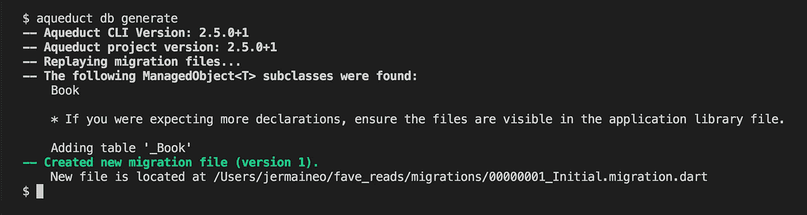
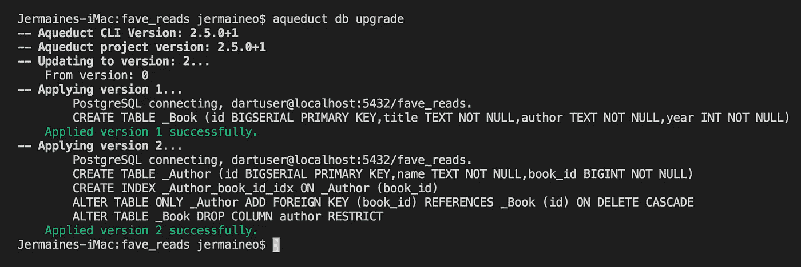

# 使用 Dart、Aqueduct 和 PostgreSQL 构建 RESTful Web APIS 额外内容

> 原文：<https://itnext.io/building-restful-web-apis-with-dart-aqueduct-and-postgresql-bonus-content-2fc086b7259a?source=collection_archive---------4----------------------->


***请注意:从 Dart 2 开始，导水管的 API 发生了变化，导致了突破性的变化。本文基于 Dart v1 的 Aqueduct 2.5.0。***

***我把这个更新为新的视频系列:***[***http://bit.ly/aqueduct-tutorial***](http://bit.ly/aqueduct-tutorial)

从我们离开的地方继续，我们现在已经为我们的工作 API 编写了一些测试，搭建了我们的项目，设置了一些路线并集成了一个关系数据库。

本文是系列文章的一部分，涵盖:

*   [**第 1 部分:设置并运行示例**](/building-restful-web-apis-with-dart-aqueduct-and-postgresql-3cc9b931f777)
*   [**第二部分:用 CRUD 操作实现路由**](/building-restful-web-apis-with-dart-aqueduct-and-postgresql-part-2-routing-with-crud-operations-629fe58114fa)
*   [**第 3 部分:将 Web APIs 连接到 PostgreSQL 数据库**](/building-restful-web-apis-with-dart-aqueduct-and-postgresql-part-3-postgres-90ff70742675)
*   [**第 4 部分:编写自动化测试**](/building-restful-web-apis-with-dart-aqueduct-and-postgresql-part-4-testing-de3618515639)
*   ***奖励内容*** DB 迁移和模型关系*(我们在这里*😄 *)*

在这个额外的部分中，我们将介绍 Aqueduct 的数据库迁移工具，以及在对我们当前的应用程序模型进行修改时，它是如何提供帮助的。到目前为止，我们只使用了`Book`模型，这是为了简化事情。

# 1.创建迁移文件

Aqueduct 的迁移工具对于创建和执行迁移文件非常有用。这些文件包含基于当前应用程序模型创建和修改数据库表的 SQL 命令。

在我们项目的根目录中，让我们通过运行下面的命令来生成我们的迁移文件:

```
aqueduct db generate
```

这将在`migrations/00000001_Initial.migration.dart`创建一个迁移文件。



打开该文件详细描述了基于`lib/model`中的模型定义构建数据库表的步骤，在本例中是`book.dart`。

# 2.创建作者模型

我们当前的`Book`模型的作者被设置为类型为`String`的实例属性，它转化为数据库中的 **_book** 表中的一列。

在这种简单的情况下是可行的，但是如果我们需要指定多个作者呢？当然，我们可以使用逗号作为分隔符，在处理每个作者时将它们分开，但是如果我们希望每个作者都有一个简短的描述呢？将所有信息存储在一个数据库列中当然不是什么好事！

理想情况下，我们希望捕获这个`author`属性作为它自己的实体，这样我们就可以随着应用程序的增长来分离这个问题。

让我们用我们的`Author`模型创建`lib/model/author.dart`:

这类似于`lib/model/book.dart`，除了我们现在已经建立了一个一对多的关系，一本书有许多作者。我们有一个`book`属性，并使用`@ManagedRelationship()`注释来设置这种关系。

第一个参数(#authors)是一个符号，表示我们的`Book`模型上的属性，它标记了这种关系。让我们修改我们的`Book`模型，使其具有这个属性:

我们的`authors`属性是一个`ManagedSet<T>`类型，意味着包含一组作者的书。这意味着当我们运行我们的应用程序时，将创建一个名为 **author** 的新表，其中包含列`id`、`name`和`book_id`。后者是一个外键，指向 **_book** 表上的相关行 id。

让我们通过运行`aqueduct db generate`来更新我们的迁移目录。这将在先前的文件旁边生成另一个`migration/*.migration.dart`文件。它在初始迁移文件的基础上添加了 SQL 命令，用于:

1.  建天华**_ 作者**表
2.  删除我们的**book**表中的`_author`列
3.  在作者表中添加一个`book_id`列

为了应用这些更改，在项目根中创建一个`database.yaml`文件，详细信息如下:

```
**username**: "dartuser"
**password**: "dbpass123"
**host**: "localhost"
**port**: 5432
**databaseName**: "fave_reads"
```

然后运行下面的命令将数据库升级到更新的模式:

```
aqueduct db upgrade
```



数据库升级示例

*这假设您要迁移到的数据库中没有任何预先存在的表，即* ***_book*** *和****_ author****表不存在，否则将抛出异常。*

# 3.修改测试

我们的测试设置需要修改，以包含我们管理的作者集:

在随后的循环中，我们创建两个查询来插入书籍和作者，两个查询是因为模型数据放在不同的表中:

这允许我们修改我们的第一个单元测试的断言:

测试的全部变化是[这里是](https://github.com/graphicbeacon/favereads/blob/master/test/books_controller_test.dart)。

# 4.让测试通过

在`lib/controller/books_controller.dart`中，将`getAllBooks()`方法修改如下:

这里，我们使用`join`方法从与每本书相关的 _ **作者**表中提取行数据。

向`http://localhost:8000/books`发送 GET 请求将返回下面的 JSON 响应:

```
{
  "**id**": 1,
  "**title**": "Dart: Scalable Application Development",
  "**year**": 2016,
  "**authors**": [{
    "id": 1,
    "**name**": "Dave Mitchells"
    "book": {
      "id": 1
    }
  }]
}
```

我们的`addBook()`抢答器方法现修改如下:

这需要以下格式的有效负载:

```
{
  "**title**": "Dart: Scalable Application Development",
  "**year**": 2016,
  "**authors**": [{
    "name": "Dave Mitchells"
  }]
}
```

这里的可以看到全部的变化[。](https://github.com/graphicbeacon/favereads/blob/master/lib/controller/books_controller.dart)

# 结论

查看下面的进一步阅读材料，更详细地了解数据库迁移和模型关系。一如既往，欢迎反馈。让我知道你喜欢什么，不喜欢什么，接下来你想看什么。

这个系列到此结束。源代码是 github 上的[。](https://github.com/graphicbeacon/favereads)

感谢您坚持阅读本系列，并关注我的更多 Dart 和 Aqueduct 教程。

# 进一步阅读

1.  [数据库迁移和工具](http://aqueduct.io/docs/db/db_tools)
2.  [建模数据](http://aqueduct.io/docs/db/modeling_data)
3.  [高级数据库查询](http://aqueduct.io/docs/tut/model-relationships-and-joins/#more-on-joins-and-relationships)