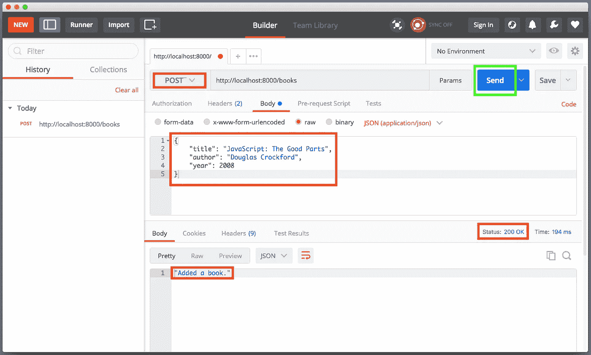

# 用 Dart、Aqueduct 和 PostgreSQL 构建 RESTful Web APIs 第 2 部分:路由

> 原文：<https://itnext.io/building-restful-web-apis-with-dart-aqueduct-and-postgresql-part-2-routing-with-crud-operations-629fe58114fa?source=collection_archive---------5----------------------->


***请注意:从 Dart 2 开始，导水管的 API 发生了变化，导致了突破性的变化。本文基于 Dart v1 的 Aqueduct 2.5.0。***

***我把这个更新为新的视频系列:***[***http://bit.ly/aqueduct-tutorial***](http://bit.ly/aqueduct-tutorial)

在第 1 部分中，我们简要概述了 Aqueduct 及其特性，并学习了如何使用其 CLI 工具设置示例项目。

本文是系列文章的一部分，涵盖以下主题:

*   [**第 1 部分:设置并运行示例**](/building-restful-web-apis-with-dart-aqueduct-and-postgresql-3cc9b931f777)
*   **第 2 部分:用 CRUD 操作实现路由** ( *我们到了*)
*   [**第 3 部分:将 Web APIs 连接到 PostgreSQL 数据库**](https://medium.com/@98d967ac6f3a/90ff70742675)
*   [**第 4 部分:编写自动化测试**](/building-restful-web-apis-with-dart-aqueduct-and-postgresql-part-4-testing-de3618515639)
*   [***奖金内容*** DB 迁移和模型关系](/building-restful-web-apis-with-dart-aqueduct-and-postgresql-bonus-content-2fc086b7259a)

在这一部分中，我们将实现一个具有 CRUD( *创建、读取、更新、删除)*功能的定制路由。

在开始之前，我们需要理解路由器和 HTTPControllers 的概念。这将有助于我们了解前进的方向。在这一部分的最后，我们将有我们的端点，能够通过我们定义的 CRUD 操作来操作我们的数据源。

# 什么是路由器？

路由器负责捕获请求路径，并确定基于该路径运行的逻辑。当在提供给我们的`Router`对象上调用`route`方法时，通过注册一个路由来定义请求路径。注册发生在我们的***favereadsink***子类中的`setupRouter`方法被调用时:

```
// lib/fave_reads_sink.dart@override
void setupRouter(Router router) {...}
```

`setupRouter`方法提供了一个路由器对象作为参数，然后我们用它来定义我们的每条路由:

```
@override
void setupRouter(**Router router**) {
  **router.route(’/path-1’)**.listen(...);
  **router.route(’/path-2’)**.listen(...);
  **router.route(’/path-3’)**.listen(...); // and so on
}
```

调用 route 方法接受一个包含路径名的字符串，后跟一个`listen`方法，该方法允许我们定义向该路径发出请求时运行的逻辑。路由可以包含*路径变量*，这些变量是占位符标记，代表路径段中的任何值:

```
router.route('/items/**:itemID**');
```

上面的例子声明了一个路径变量`itemID`，匹配“ **/items/0”、“/items/1** ”、“ **/items/foo** ”等等。`itemID`的值将分别为“0”、“1”和“foo”。

路径变量也可以是可选的，因此我们可以这样设置它们:

```
router.route('/items/**[**:itemID**]**);
```

这意味着路线匹配也将包括“ **/items** ”作为路径名。

*关于路由器的文档非常全面，我推荐* [*查看*](https://aqueduct.io/docs/http/routing) *。*

# 那么，我该如何应用呢？

有了这些知识，让我们从项目中打开`lib/fave_reads_sink.dart`,修改`setupRouter`实现如下:

根路径(/)现在返回 HTML 内容。我们还定义了一个“ **/books** ”路由，它接受一个名为`index`的可选路径变量。这将是我们 CRUD 操作的终点。

调用 route 方法会返回一个`RouteController`，它公开了`listen`方法，让我们定义要运行的逻辑。还有两种方法我们可以用，分别是`pipe`和`generate`。后者允许我们创建一个新的 HTTPController 对象，该对象可以更好地处理我们的请求(稍后的*将详细介绍*)。

`listen`方法接受一个闭包，该闭包包含一个代表传入请求的`Request`对象。然后，我们可以从中提取我们需要的信息，执行转换，并返回响应。

不管请求动作如何，“ **/books** ”的当前逻辑返回相同的响应。让我们修改它，为我们的每个操作返回不同的响应:

代码质量很快变得相当糟糕。这是重复的，容易把事情弄得一团糟:


通过 [Giphy](https://giphy.com/gifs/spaghetti-IVoBdwlksSq7m)

这可以用`HTTPController`清理！

# 什么是 HTTPController？

HTTPControllers 通过将 HTTP 请求映射到特定的“处理程序方法”来生成响应，从而对 HTTP 请求做出响应。只要路径匹配，路由器就会向 HTTPController 发送请求。

为了创建一个，我们将创建一个扩展`HTTPController`的`BooksController`，以便添加我们想要的行为。我们现在就开始吧。在`lib`目录下创建`controller/books_controller.dart`，内容如下:

这是正在发生的事情的总结:

1.  `BooksController`子类包含 5 个 handler 方法，称为 *responder 方法* ***。***
2.  每个 responder 方法都用一个常量来注释，该常量反映了适当的请求方法:`@httpGet`、`@httpPost`、`@httpPut`、`@httpDelete`。其他方法会用`HTTPMethod`，像`@HTTPMethod('PATCH')`。
3.  每个 responder 方法返回一个类型为`Response`的`Future`。未来之于飞镖，犹如承诺之于 JavaScript。
4.  responder 方法可以将请求中的值绑定到它的参数。我们在`getBook()` responder 方法参数中看到了这一点:`@HTTPPath("index") int idx`。它的 path 变量被转换成一个整数，并赋给一个名为`idx`的变量。

如果没有响应方法与请求方法匹配(*，例如补丁*，则返回`405 Method Not Allowed`响应。

让我们转到`lib/fave_reads_sink.dart`并使用该控制器:

```
import 'fave_reads.dart';
**import 'controller/books_controller.dart';** ...
...
@override
void setupRouter((Router router) async {
  router
    .route(‘/books/[:index]’)
    .**generate(() => new BooksController())**; // replaces `listen` method
...
```

并通过在终端中执行`aqueduct serve`或`dart bin/main.dart`来运行我们的项目。

我们可以使用 [*Postman*](https://www.getpostman.com/apps) *来测试我们的响应。*



用邮递员测试 POST 请求

# 嘲笑我们的数据源

对于我们的数据源，让我们在`controller/books_controller.dart`中创建一个数组:

然后，我们将在`BooksController`中更新我们的 responder 方法来操作这个数据集:

[*了解 Dart 的各种数组/列表方法*](https://api.dartlang.org/stable/1.24.3/dart-core/List-class.html) 。

再次重启服务器并用 [Postman](https://www.getpostman.com/apps) 进行测试。

**请注意:这是在隔离中运行的，这意味着任何副作用只能在 Postman 的(*或任何工具)*会话中看到。打开一个单独的会话(*像浏览器*)不会显示这些变化。这是因为设计的隔离不共享状态。不过不要担心——这将在我们实现真正的数据库时得到解决。**

# 重构解决方案

我应该已经完成了，但是这将在第 3 部分给我们带来更多的工作。我不希望这种情况发生，所以请在这最后一段时间里容忍我😊

还记得我说过可以将请求中的值绑定到 responder 方法的参数吗？嗯，我们可以重构 POST 操作，通过`@HTTPBody()`元数据将其有效负载转换为地图:

```
@httpPost
Future<Response> addSingle(**@HTTPBody() Map book**) async {
  books.add(book);
  return new Response.ok('Added new book.');
}
```

这里，尝试将请求有效负载解析为一个`Map`类型。我们也可以指定一个自定义类型，而不仅仅是使用内置类型，只要自定义类型扩展了一个`HTTPSerializable`类型。让我们通过在`lib/model/book.dart`内部引入一个`Book`模型来做到这一点:

下面是正在发生的事情的总结:

1.  我们的`Book`模型实现了`HTTPSerializable`，这是一个用于从 HTTP 请求中解析信息的实用程序
2.  定义`asMap`和`readFromMap(Map requestBody)`方法。第一个将在 JSON 响应被发送回客户机时使用，而后者检索请求体并提取数据以填充模型的属性。

现在我们只需要使用这个模型:

重启服务器，用 Postman 测试结果。

# 结论

通过充实 web APIs 的框架，我们已经取得了一些重大进展。我希望这次旅程到目前为止是一次有趣的挑战。我鼓励你浏览下面的进一步阅读材料，以掌握我们已经讨论过的概念。

一如既往**我乐于接受反馈**。让我知道你喜欢这个教程的什么，你不喜欢什么，你希望在未来看到什么。我真的很感激。

本系列的第 2 部分到此结束。源代码[在 github](https://github.com/graphicbeacon/favereads) 上可用，而[第 3 部分](https://medium.com/@98d967ac6f3a/90ff70742675)现在也可用。**如果您喜欢这篇文章，请喜欢并关注我**了解更多关于 Dart 的内容。

# 进一步阅读

1.  [路由和路径变量](https://aqueduct.io/docs/http/routing/)
2.  [处理请求:HTTPController](https://aqueduct.io/docs/http/http_controller/)