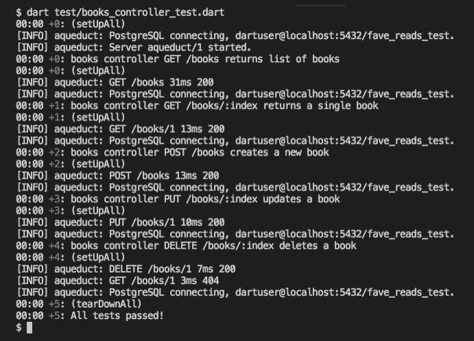

# 用 Dart、Aqueduct 和 PostgreSQL 构建 RESTful Web APIs 第 4 部分:测试

> 原文：<https://itnext.io/building-restful-web-apis-with-dart-aqueduct-and-postgresql-part-4-testing-de3618515639?source=collection_archive---------7----------------------->


***请注意:从 Dart 2 开始，导水管的 API 发生了变化，导致了突破性的变化。本文基于 Dart v1 的 Aqueduct 2.5.0。***

***我把这个更新为新的视频系列:***[***http://bit.ly/aqueduct-tutorial***](http://bit.ly/aqueduct-tutorial)

在第 3 部分中，我们将 API 与 PostgreSQL 数据库集成，利用 Aqueduct 的 ORM 作为管理数据事务的手段。了解了托管对象和托管上下文之后，我们得到了一个解决方案，它提供了数据持久性，而不需要编写复杂的 SQL 查询。

本文是系列文章的一部分，涵盖:

*   [**第 1 部分:设置并运行示例**](/building-restful-web-apis-with-dart-aqueduct-and-postgresql-3cc9b931f777)
*   [**第二部分:用 CRUD 操作实现路由**](/building-restful-web-apis-with-dart-aqueduct-and-postgresql-part-2-routing-with-crud-operations-629fe58114fa)
*   [**第 3 部分:将 Web APIs 连接到 PostgreSQL 数据库**](/building-restful-web-apis-with-dart-aqueduct-and-postgresql-part-3-postgres-90ff70742675)
*   **第 4 部分:编写自动化测试** ( *我们到了)*
*   [***奖金内容*** DB 迁移和模型关系](/building-restful-web-apis-with-dart-aqueduct-and-postgresql-bonus-content-2fc086b7259a)

在这一部分中，我们将编写测试，同时重构我们的逻辑以适应这些测试。我们将使用建立在 Dart 团队 [**测试**](https://pub.dartlang.org/packages/test) 包之上的 Aqueduct 内置测试库，这样我们就不用自己设置了。

# 测试装具

使用第 1 部分中的搭建工具在项目根目录下创建了一个`test/`文件夹，文件结构如下:

```
test/
|--harness
   |--**app.dart**
   **example_test.dart**
```

测试工具`harness/app.dart`负责启动和停止我们的应用程序。当我们看着`test/example_test.dart`中的这个片段时，我们看到了这一点:

应用程序在运行所有测试之前启动，之后立即停止。我们的测试工具复制了`bin/main.dart`，但有以下例外:

1.  指定了一个端口`0`,这样我们的测试可以在任何可用的端口上运行
2.  给出了一个单独的配置文件(config.src.yaml ),其中包含特定于测试的数据
3.  当调用`application.start`时，在主线程上运行我们的测试，选项`runOnMainIsolate`被设置为真。这将禁用多线程，以便我们可以访问应用程序的状态和服务来执行我们的断言。
4.  一个`TestClient`被实例化以提供一个 HTTP 客户端来执行对我们的 API 的请求。使用它将为我们的断言提供测试响应。
5.  提供了一种停止应用程序的方法，以便在所有测试运行后调用

为了运行我们的测试，让我们在第 3 部分中重构我们的解决方案，从我们的数据库配置开始。这是为了支持测试和生产环境的灵活性。

# 1.配置数据库

再看一下`lib/fave_reads_sink.dart`中的`FaveReadsSink`，同样的 Postgres 细节将被用在我们的测试和生产环境中。*)

通过分离测试和生产信息，配置文件的使用有助于缓解这一问题。在我们的项目中，我们将在根级别使用`config.src.yaml`和`config.yaml`文件。

让我们首先用我们的数据库连接信息修改这些文件:

```
# config.src.yaml - for test environment
database:
  username: dartuser
  password: dbpass123
  host: localhost
  port: 5432
  databaseName: fave_reads_test
  isTemporary: true
```

在我们的 config.yaml 文件中:

```
# for production environment
database:
  username: dartuser
  password: dbpass123
  host: localhost
  port: 5432
  databaseName: fave_reads
  isTemporary: false
```

这允许我们对`FaveReadsSink`进行以下修改:

我们的配置文件路径由`bin/main.dart`和`test/harness/app.dart`中的`Application`构造函数的`configurationFilePath`属性指定。我们的`FaveReadsSink`类在一个应用程序对象中被实例化，通过它接收请求接收器构造函数的`appConfig`参数中的配置路径。

然后我们通过扩展`ConfigurationItem`助手类的子类`FaveReadsConfiguration`来提取我们的配置信息。这会将配置文件解析为一个映射。

在请求接收器之后，让我们定义我们的配置项:

属性映射到我们配置文件中的同一个键。这就是暴露我们的数据库信息被这样访问的原因:`config.database.username`

# 2.将 SchemaBuilder 提取到实用程序文件中

让我们将`createDatabaseSchema`方法移动到一个单独的文件中，也供我们的测试工具使用:

我们现在有第二个参数`isTemporary`要由我们的配置文件来设置。这个选项决定了我们的数据是否被持久化。对于我们的测试，我们将其设置为`true`。

现在让我们将这个实用程序重新导入到`lib/fave_reads_sink.dart`中:

# 3.建立测试数据库

打开`psql`工具，运行下面的 SQL 查询:

```
CREATE DATABASE **fave_reads_test**;
CREATE USER **dartuser**;
ALTER USER dartuser WITH password '**dbpass123**';
GRANT ALL ON database fave_reads_test TO dartuser;
```

如果您已经在第 3 部分中这样做了，那么您可以跳过第 2 行和第 3 行。

# 4.写一些测试

将`example_test.dart`重命名为`books_controller_test.dart`，并将其内容替换为以下内容:

在第 39 行，我们调用了`discardPersistentData`方法来断开和重新连接数据库，为我们运行的每个测试使用相同的设置数据。因为我们的测试数据是临时的，它只在连接期间有效。

我们仍然需要在我们的测试工具中创建这个方法:

```
// test/harness/app.dartclass TestApplication {
  ...
  Future **discardPersistentData**() async {
    **await** ManagedContext.defaultContext
      .persistentStore.close();
    **await** createDatabaseSchema(
      ManagedContext.defaultContext, true);
  }
  ...
}
```

按照 Dart 的要求，我们的测试包含在一个`main()`顶级函数中，以便运行我们的测试。`setUp`函数创建一个`Book`类型的列表，并使用`Query<T>`对象为每个测试填充数据库。调用查询对象会在测试过程中重新打开数据库。

让我们通过用下面的代码片段替换`//...tests to go here`注释来创建一个测试:

`group`函数用于对相关测试进行分类，类似于使用 Jasmine BDD 框架的`describe`块，而`test`类似于`it`块。

需要注意的其他事项:

1.  我们的第一个测试从我们的`TestClient`对象创建一个请求，执行 GET 操作，并使用`expectResponse` *匹配器方法*在响应上运行我们的断言。它接受响应、状态代码和`body`命名参数下的断言。
2.  `everyElement`是另一个匹配器方法，它允许我们对响应体中的每一项进行检查，假设它是一个列表。
3.  `partial`针对特定的键做出断言，前提是列表项是一个映射。我们用这个来避免检查每一个键。
4.  `isString`和`isInteger`是其他内置的获取器，用于确保类型是我们期望的类型

下面是下一个 POST 请求:

post 请求对象通过`json`属性接受一个主体。这假设有效负载是一个 JSON 字符串。

以下是我们的全自动测试:

我们可以通过以下方式运行我们的测试:

```
dart **test/books_controller_test.dart**
```



所有测试通过！🎉

# 结论

我们的 API 现在被测试覆盖了。我希望你能学到一些有用的东西，并发现它值得你在下一个项目中考虑。

查看下面的阅读材料，进一步了解导水管测试的细节。一如既往，**欢迎反馈**。让我知道你喜欢什么，不喜欢什么，以及你接下来想看什么。我真的很感激。

本系列的第 4 部分到此结束。源代码在 github 上有[。**如果您喜欢这篇文章，请喜欢并关注我**了解更多关于 Dart 的内容。查看](https://github.com/graphicbeacon/favereads) [**奖励内容**](/building-restful-web-apis-with-dart-aqueduct-and-postgresql-bonus-content-2fc086b7259a) 现已推出。

# 进一步阅读

1.  [在渡槽中编写测试](https://aqueduct.io/docs/testing/tests/)
2.  [渡槽测试库文件](https://www.dartdocs.org/documentation/aqueduct/latest/aqueduct.test/aqueduct.test-library.html)
3.  [飞镖“测试”包](https://pub.dartlang.org/packages/test)