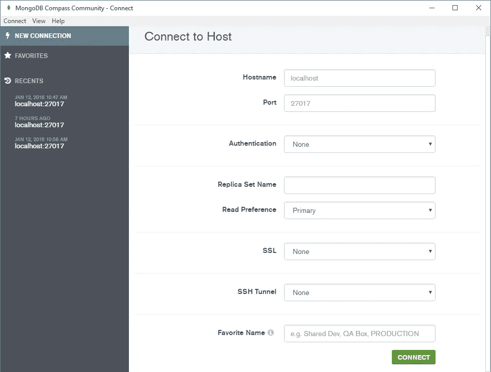
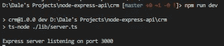

# 用 Node.js、Express、MongoDB 和 TypeScript 构建 RESTful Web APIs 第 1 部分

> 原文：<https://itnext.io/building-restful-web-apis-with-node-js-express-mongodb-and-typescript-part-1-2-195bdaf129cf?source=collection_archive---------0----------------------->


*(图片来自 OctoPerf)*

有一门关于[如何在 Lynda](https://www.lynda.com/Node-js-tutorials/Next-steps/633869/671263-4.html) 上构建 Web APIs 的课程，但是他们没有使用 TypeScript。所以我决定用 TypeScript 做一个。这个项目中有许多需要改进的地方。如果你找到了，请留下评论。我很感激。)

[**第一部分:设置项目**](https://medium.com/@dalenguyen/building-restful-web-apis-with-node-js-express-mongodb-and-typescript-part-1-2-195bdaf129cf)

[**第二部分:实现路由和 CRUD**](https://medium.com/@dalenguyen/building-restful-web-apis-with-node-js-express-mongodb-and-typescript-part-2-98c34e3513a2)

[**第 3 部分:为 Web APIs 使用控制器和模型**](https://medium.com/@dalenguyen/building-restful-web-apis-with-node-js-express-mongodb-and-typescript-part-3-d545b243541e)

[**第 4 部分:将 Web APIs 连接到 MongoDB 或其他**](https://medium.com/@dalenguyen/building-restful-web-apis-with-node-js-express-mongodb-and-typescript-part-4-954c8c059cd4)

[**第 5 部分:我们的 Web APIs 的安全性**](https://medium.com/@dalenguyen/building-restful-web-apis-with-node-js-express-mongodb-and-typescript-part-5-a80e5a7f03db)

[**奖励:用云函数、Firestore 和 Express 构建一个“无服务器”RESTful API**](/building-a-serverless-restful-api-with-cloud-functions-firestore-and-express-f917a305d4e6)

[**奖励:在 Nodejs**](/handling-long-running-api-requests-in-nodejs-403bd566d47) 中处理长时间运行的 API 请求

**在我们开始之前**

确保您的机器上安装了[节点](https://nodejs.org/en/)。之后还要安装 TypeScript 和 TypeScript 节点。

```
npm install -g typescript ts-node
```

为了测试 HTTP 请求，我们可以使用 [Postman](https://www.getpostman.com/apps) 发送示例请求。

**MongoDB 准备**

你应该在你的本地机器上安装 [MongoDB](https://docs.mongodb.com/manual/administration/install-community/) ，或者使用其他服务，比如 [mLab](https://mlab.com/) 或者 [Compose](https://www.compose.com/compare/mongodb)

如果你在本地安装了 MongoDB，你应该为 GUI 界面安装 [Robo Mongo](https://robomongo.org/) 或者 [Mongo Compass](https://docs.mongodb.com/compass/master/install/) 。



MongoDB Compass GUI 界面

在我们深入到编码部分之前，如果你想提前阅读配置，你可以检查一下我的 github 库。否则，您只需要按照步骤来运行您的项目。

**第一步:启动一个节点项目**

创建项目文件夹并启动 npm 项目。记得回答所有问题，之后你可以随时修改

```
mkdir node-apis-project
cd node-apis-project
npm init 
```

**第二步:安装所有依赖项**

```
npm install --save @types/express express body-parser mongoose   nodemon
```

**第三步:配置类型脚本配置文件**

这样做的目的是将所有的 TypeScript 文件放在 ***lib 文件夹*** 中进行开发，然后为了制作，我们将所有的 Javascript 文件保存在 ***dist 文件夹*** 中。当然，我们将在项目中利用 ES2015。

```
// tsconfig.json
{
    "compilerOptions": {
        "module": "commonjs",
        "moduleResolution": "node",
        "pretty": true,
        "sourceMap": true,
        "target": "es6",
        "outDir": "./dist",
        "baseUrl": "./lib"
    },
    "include": [
        "lib/**/*.ts"
    ],
    "exclude": [
        "node_modules"
    ]
}
```

所以每当我们运行 tsc 命令时，lib 文件夹中的所有 ts 文件都会被编译成 dist 文件夹中的 js 文件

```
tsc
```

**第四步:编辑 package.json 中的运行脚本**

```
"scripts": {
    "build": "tsc",
    "dev": "ts-node ./lib/server.ts",        
    "start": "nodemon ./dist/server.js",
    "prod": "npm run build && npm run start"
}
```

因此，对于开发，我们可以通过运行以下命令来运行测试服务器

```
npm run dev
```

用于生产

```
npm run prod
```

**第 5 步:基本配置入门**

你迟早会需要包[主体解析](https://github.com/expressjs/body-parser)来解析传入的请求数据。

```
// lib/app.tsimport * as express from "express";
import * as bodyParser from "body-parser";

class App {

    public app: express.Application;

    constructor() {
        this.app = express();
        this.config();        
    }

    private config(): void{
        // support application/json type post data
        this.app.use(bodyParser.json()); //support application/x-www-form-urlencoded post data
        this.app.use(bodyParser.urlencoded({ extended: false }));
    }

}

export default new App().app;
```

创建 lib/server.ts 文件

```
// lib/server.tsimport app from "./app";
const PORT = 3000;

app.listen(PORT, () => {
    console.log('Express server listening on port ' + PORT);
})
```

从现在开始，虽然您还不能发送 HTTP 请求，但是您仍然可以通过运行 ***npm run dev*** 来测试项目。



这是 [**的结尾部分 1**](https://medium.com/@dalenguyen/building-restful-web-apis-with-node-js-express-mongodb-and-typescript-part-1-2-195bdaf129cf) 。我将更新 [**第二部**](https://medium.com/@dalenguyen/building-restful-web-apis-with-node-js-express-mongodb-and-typescript-part-2-98c34e3513a2)**[**第三部**](https://medium.com/@dalenguyen/building-restful-web-apis-with-node-js-express-mongodb-and-typescript-part-3-d545b243541e)**[**第四部**](https://medium.com/@dalenguyen/building-restful-web-apis-with-node-js-express-mongodb-and-typescript-part-4-954c8c059cd4)**[**第五部**](https://medium.com/@dalenguyen/building-restful-web-apis-with-node-js-express-mongodb-and-typescript-part-5-a80e5a7f03db) 不久。以防你需要跳过一个头。请访问我的 [github 库](https://github.com/dalenguyen/rest-api-node-typescript)获取完整代码。******

****[](https://github.com/dalenguyen/rest-api-node-typescript) [## GitHub-dalen guyen/rest-API-node-typescript:用 Node.js 构建 RESTful Web APIs，Express…

### 这是一个简单的 API，保存人们的联系信息。这个项目有两个版本。1.0.0 版:您可以…

github.com](https://github.com/dalenguyen/rest-api-node-typescript) 

[**在 Twitter 上关注我**](https://twitter.com/dale_nguyen) 了解 Angular、JavaScript & WebDevelopment 的最新内容👐****