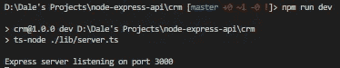
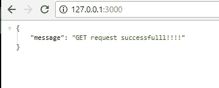
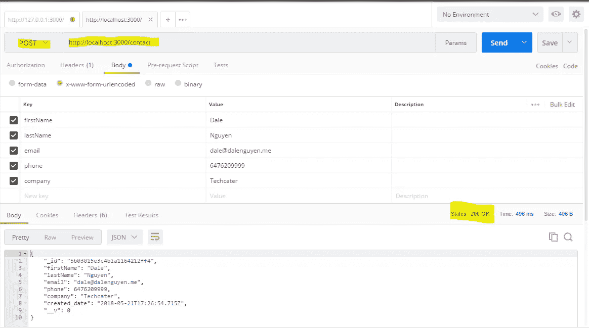
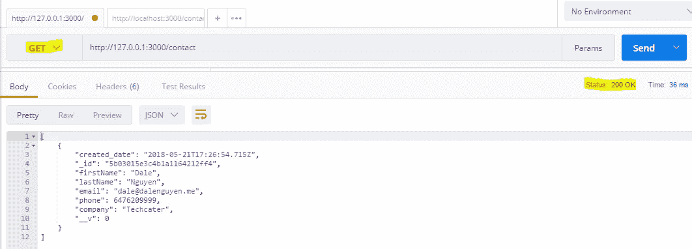
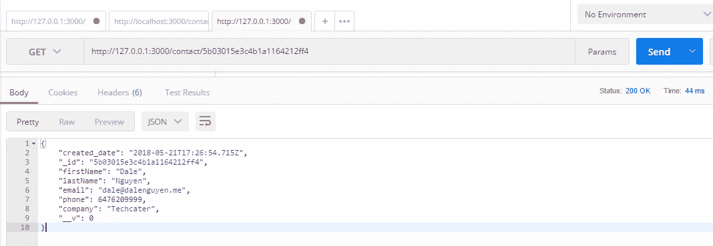
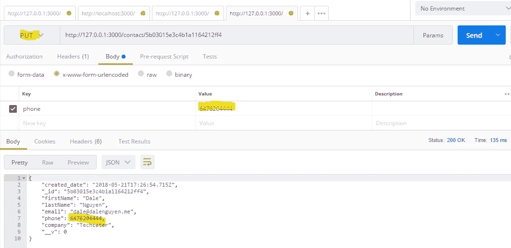
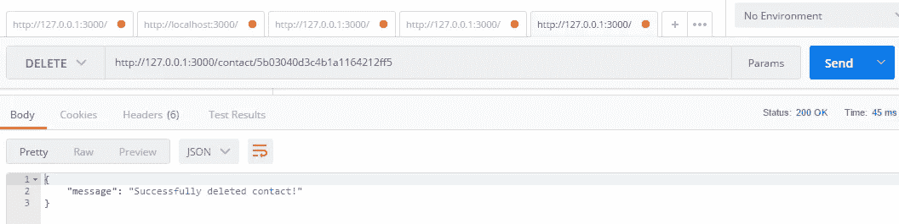

# 用 Node.js、Express、MongoDB 和 TypeScript 构建 RESTful Web APIs 第 4 部分

> 原文：<https://itnext.io/building-restful-web-apis-with-node-js-express-mongodb-and-typescript-part-4-954c8c059cd4?source=collection_archive---------2----------------------->


(图片来自 OctoPerf)

有一个关于[如何在 Lynda](https://www.lynda.com/Node-js-tutorials/Next-steps/633869/671263-4.html) 上构建 Web APIs 的课程，但是他们没有使用 TypeScript。所以我决定用 TypeScript 做一个。这个项目中有许多需要改进的地方。如果你找到了，请留下评论。我很感激。)

[**第一部分:设置项目**](https://medium.com/@dalenguyen/building-restful-web-apis-with-node-js-express-mongodb-and-typescript-part-1-2-195bdaf129cf)

[**第二部分:实现路由和 CRUD**](https://medium.com/@dalenguyen/building-restful-web-apis-with-node-js-express-mongodb-and-typescript-part-2-98c34e3513a2)

[**第 3 部分:为 Web APIs 使用控制器和模型**](https://medium.com/@dalenguyen/building-restful-web-apis-with-node-js-express-mongodb-and-typescript-part-3-d545b243541e)

[**第 4 部分:将 Web APIs 连接到 MongoDB 或其他**](https://medium.com/@dalenguyen/building-restful-web-apis-with-node-js-express-mongodb-and-typescript-part-4-954c8c059cd4)

[**第 5 部分:我们的 Web APIs 的安全性**](https://medium.com/@dalenguyen/building-restful-web-apis-with-node-js-express-mongodb-and-typescript-part-5-a80e5a7f03db)

[**奖励:用云函数、Firestore 和 Express**](/building-a-serverless-restful-api-with-cloud-functions-firestore-and-express-f917a305d4e6) 构建“无服务器”RESTful API

[**奖励:在 Nodejs**](/handling-long-running-api-requests-in-nodejs-403bd566d47) 中处理长时间运行的 API 请求

在这一部分中，我们将把 RESTful API 应用程序连接到本地 MongoDB，但是您可以连接到任何其他数据库服务。请阅读[第 1 部分](/building-restful-web-apis-with-node-js-express-mongodb-and-typescript-part-1-2-195bdaf129cf)将 MongoDB 安装到您的机器上。

你需要做的就是导入**mongose 包**，并在 **app.ts** 文件中为你的 MongoDB 声明 **URL** 。之后，你将通过**mongose**连接你的应用和数据库。

```
// lib/app.ts...
**import * as mongoose from "mongoose";**

class App {

    ...
 **public mongoUrl: string = 'mongodb://localhost/CRMdb';** 

    constructor() {
        ...
 **this.mongoSetup();**
    }

 **private mongoSetup(): void{
        mongoose.Promise = global.Promise;
        mongoose.connect(this.mongoUrl);    
    }**

}

export default new App().app;
```

之后，您的应用程序就可以启动了( *npm run dev* )



您可以通过网络浏览器( *http://127.0.0.1:3000* )测试您的第一条路线(GET /)



记住，我们设置的所有路由都在 **lib/routes/crmRoutes.ts** 文件中。

现在，我们将通过 [Postman](https://www.getpostman.com/apps) 测试**C**reate-**R**EAD-**U**pdate-**D**elete 特性。

1.  **创建您的第一个联系人**

我会发送一个 **POST** 请求到[*http://127 . 0 . 0 . 1:3000/contact*](http://127.0.0.1:3000/contact)*正文中有联系人的信息。*

*记得在头中设置内容类型*

```
*Content-Type: application/x-www-form-urlencoded*
```

**

*发送之后，服务器返回状态 200 以及数据库中的联系信息。*

***2。获取所有联系人***

*要获取所有联系人，我们只需要向 [*发送一个 **GET** 请求 http://127 . 0 . 0 . 1:3000/contact*](http://127.0.0.1:3000/contact)。您将获得数据库中所有联系人的数组。现在只有一个我刚刚创建的联系人。*

**

***3。通过 Id** 获取联系人*

*如果我们想通过 Id 获取单个联系人，我们会向 [*发送一个 **GET** 请求 http://127 . 0 . 0 . 1:3000/contact/:contact Id*](http://127.0.0.1:3000/contact/:contactId)*。它将返回一个你联系的对象。记住，我们传递给 URL 的 ID 是联系人的 **_id** 。**

**

***4。更新现有联系人***

*如果我们想要更新一个现有的联系人，我们将发送一个 **PUT** 请求到[*http://127 . 0 . 0 . 1:3000/contact/:contact id*](http://127.0.0.1:3000/contact/:contactId)*以及详细信息。例如，我将使用**_ id:5b 03015 E3 C4 B1 a 1164212 ff 4**更新联系人的电话号码**

****

****5。删除联系人****

**要删除一个联系人，我们会向 [*发送一个**删除**请求 http://127 . 0 . 0 . 1:3000/contact/:contact id*](http://127.0.0.1:3000/contact/:contactId)*。*会返回“成功删除联系人！”**

****

**在这之后，现在我们有了一个完全工作的 RESTful Web APIs 应用程序，带有 TypeScript 和 Nodejs。在 [**第五部分**](https://medium.com/@dalenguyen/building-restful-web-apis-with-node-js-express-mongodb-and-typescript-part-5-a80e5a7f03db) 中，我会为这个项目增加一些额外的安全措施。以防你需要跳过一个头。请访问我的 [github 库](https://github.com/dalenguyen/rest-api-node-typescript)获取完整代码。**

**[https://github.com/dalenguyen/rest-api-node-typescript](https://github.com/dalenguyen/rest-api-node-typescript)**