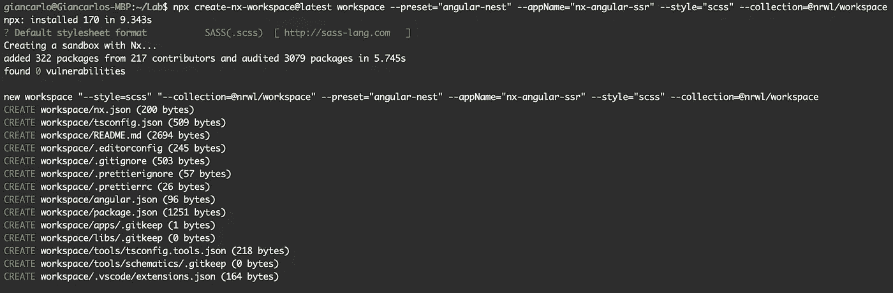
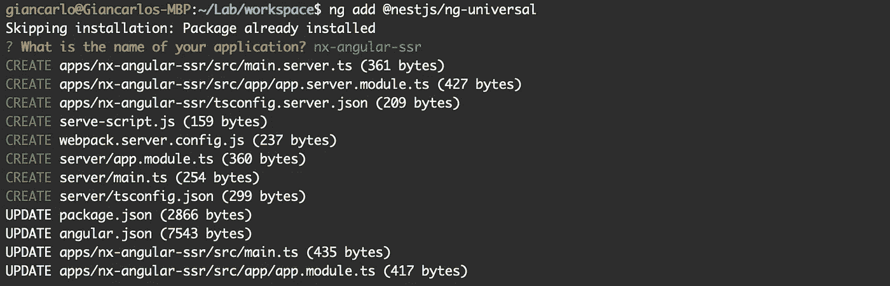
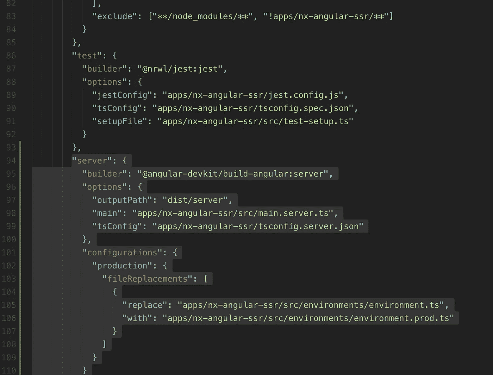
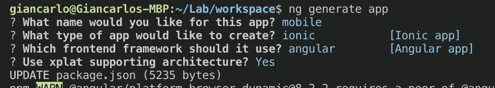
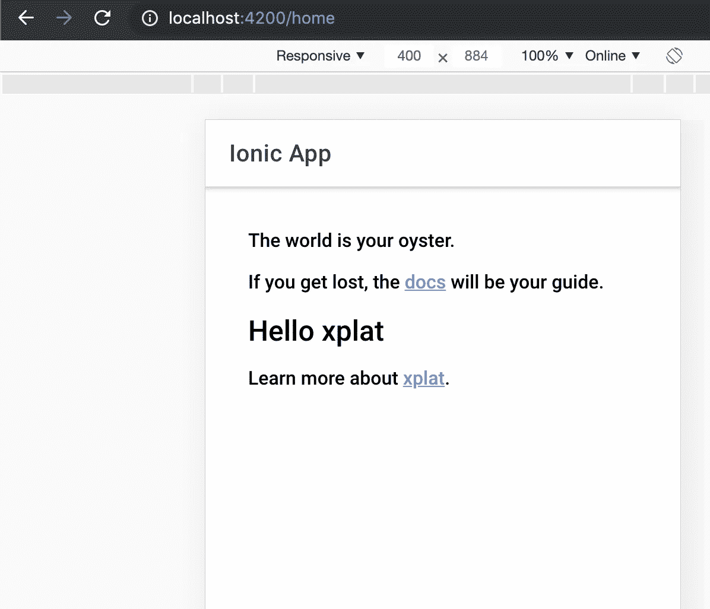

# 使用 Angular 和 Nx 构建可扩展的多平台项目

> 原文：<https://itnext.io/building-scalable-multi-platform-projects-with-angular-and-nx-a13b40885e54?source=collection_archive---------2----------------------->

## 构建可扩展的项目很难。本文将展示 Nx 如何帮助我们在一个代码库中创建多个角度项目


戴维·拉古萨在 [Unsplash](https://unsplash.com?utm_source=medium&utm_medium=referral) 上的照片

这篇文章是我之前写的关于在 Angular 中[构建企业级项目的想法的后续。](/building-an-enterprise-grade-angular-project-structure-f5be32533ba3?source=---------19------------------)

在前一篇文章中，提到了 monorepos 和 Nx，但我还没有有幸试用它们。很明显，尽管所提到的结构对于针对单一平台的单一项目来说已经足够好了，但是对于与其他项目共享代码来说，它还不够好。

## Monorepos 来拯救

在过去的几个月里，我一直在从事多个项目——有些项目非常复杂；我的一个项目要求我**编写一个需要能够在多个平台上运行的应用程序**，这也是为什么我觉得上一篇文章需要更新的原因之一:

*   我想为多个设备(移动设备、桌面设备)发布一个项目，尽可能多地共享代码
*   我希望我的项目的 *API* 在同一个工作空间中与客户端应用程序共享模型
*   我想要 *SSR* (服务器端渲染)因为，嗯，现在是 2019 年

## 这篇文章是关于什么的

让我们面对现实吧——构建可扩展的项目很难。我相信你在职业生涯中至少有过一次类似的对话:

*   **你**:哎，这些功能要放在哪里？越来越乱了🤔
*   同事:哦，创建(另一个)文件夹“utils”并放在那里😐
*   你:好的……🙄

在本文的第一部分，**我们将讨论 Nx 如何帮助构建您的应用**，以及我们如何利用它来构建可伸缩性极高的项目。

在第二部分中，我们采取了一种更实际的方法:**一个关于设置 Angular 应用程序的分步指南**，它是使用 NestJS 在服务器端呈现的，与移动 Ionic 应用程序共享代码。我花了一些时间才把它弄好，所以我想帮助你(和未来的我)毫不费力地做到这一点。

# 技术堆栈

为此，我将使用以下技术:

*   [**Nx Workspaces**](https://nx.dev/angular) :毫无疑问是管理 monorepos 与 *Angular* 项目的最佳工具。Nx 增强了 CLI，使我们能够在同一个存储库中轻松构建多个应用
*   **Ionic/xplat:** Ionic 是一个非常棒的移动框架，用于构建跨平台应用。感谢 [xPlat](https://nstudio.io/xplat) ，我们将能够轻松创建一个与 *Nx* 集成的 Ionic 应用
*   [**NestJS**](https://nestjs.com/) :受 *Angular* 启发的渐进式 *NodeJS* 框架

# Nx 工作区简介

你可能想要使用 *Nx* 有两个原因:

*   您与可以共享代码的多个团队和多个项目一起工作
*   或者说，你和我一样痴迷于代码组织！

玩笑归玩笑， *Nx* 是一个很棒的工具，它帮助**以可伸缩的方式组织代码**；即使你不打算写下一个脸书，Nrwl 团队提供的好东西也足以让我用 Nx 启动我的项目。

## 应用程序

Nx 是一个创建可扩展单库项目的工具。如果你使用过 Angular CLI， *Nx* 看起来会很熟悉，但是有一些不同。

每个应用程序都将在一个名为`/apps`的文件夹中创建，包括您的 e2e 测试项目。例如，你可以创建用 *Angular* 、 *React* 、 *Ionic* 、 *Nativescript* 、 *Express* 、 *NestJS* 等编写的应用程序。

或者，**一次全部**，共享代码！

## 图书馆

相反，您的库将被放置在文件夹`/libs`中。

但是，它们到底是什么？当然，比我们工作区内的任何应用程序都能使用的更小的可重用代码片段；但是正如 *Nx* 也说的那样，**库是具有良好定义的 API** 的更小的代码单元。

库是共享**角度实体**和**打字实体的理想选择。**例如:

*   您可能希望在前端和后端之间共享相同的接口。创建一个名为`models`的库将允许所有的应用程序访问相同的模型，而不必重写两次
*   您的应用程序可能会使用许多组件、管道、指令和服务，它们在您的所有应用程序之间是通用的:测试、移动、前台、后台等。

## Nx 工作空间的剖析

下面的项目结构是任何 Nx 项目的起点:

```
<workspace name>/
├── apps/
│   ├── myapp/
│   │   ├── src/
│   │   │   ├── app/
│   │   │   ├── assets/
│   │   │   ├── environments/
│   │   │   ├── favicon.ico
│   │   │   ├── index.html
│   │   │   ├── main.ts
│   │   │   ├── polyfills.ts
│   │   │   ├── styles.scss
│   │   │   └── test.ts
│   │   ├── browserslist
│   │   ├── jest.config.js
│   │   ├── tsconfig.app.json
│   │   ├── tsconfig.json
│   │   ├── tsconfig.spec.json
│   │   └── tslint.json
│   └── myapp-e2e/
│       ├── src/
│       │   ├── fixtures/
│       │   │   └── example.json
│       │   ├── integration/
│       │   │   └── app.spec.ts
│       │   ├── plugins/
│       │   │   └── index.ts
│       │   └── support/
│       │       ├── app.po.ts
│       │       ├── commands.ts
│       │       └── index.ts
│       ├── cypress.json
│       ├── tsconfig.e2e.json
│       ├── tsconfig.json
│       └── tslint.json
├── libs/
├── tools/
├── README.md
├── angular.json
├── nx.json
├── package.json
├── tsconfig.json
└── tslint.json
```

# 使用 Nx:创建应用程序

现在我(可能已经)说服你使用 *Nx* 和 *Angular* ，我将一步一步地向你展示如何建立我上面描述的梦想技术栈。

## 使用角度和嵌套创建新的 Nx 工作空间

我们将从几个命令开始，由于有了 *Nx* ，这些命令将启动我们的项目结构，直到我们有一个具有最新 Angular 版本和*NestJS*as*NodeJs*框架的 monorepo 项目。

以下命令将使用最新的 Angular 版本和 NestJS 作为服务器端节点框架生成一个工作 monorepo 项目:



用 Nx 创建一个新的工作空间

```
$ new workspace --preset="angular-nest" --appName="nx-angular-ssr" --style="scss" --collection=[@nrwl/workspace](http://twitter.com/nrwl/workspace)
```

命令行会提示你喜欢什么风格的预处理器，我推荐选择 *SCSS* 。静观其变，这需要一段时间。Nx 将在名为`workspace`的文件夹中创建一个工作区。

# API 和服务器端渲染

NestJS 提供了一个很棒的 CLI 插件，以便自动为服务器端呈现准备应用程序。



在 Nx 工作区中运行以下命令:

```
$ ng add @nestjs/ng-universal
```

当命令行提示输入应用程序名称时，输入`nx-angular-ssr`。该插件将创建一个名为`server`的文件夹，但我们已经有一个服务器应用程序，所以我们将忽略它(这意味着，你可以删除它)。正如所料，我们需要做一些改变。

## 导入 Angular 的通用模块

首先要做的是在我们的 Nest 应用程序中导入 Angular Universal:为此，我们打开文件`apps/api/app/app.module.ts`，并将以下代码粘贴到`AppModule`类的 imports 数组中:

```
AngularUniversalModule.forRoot({
  viewsPath: join(process.cwd(), 'dist/browser'),
  bundle: require('../server/main'),
  liveReload: true
})
```

当然，别忘了导入`AngularUniversalModule`和`join`。

## 修复环境的道路

我们需要对`angular.json`配置做一点小小的改动。不幸的是，环境文件的路径是不正确的，所以我们根据真实路径打补丁，真实路径是`apps/nx-angular-ssr/src/environments`，如下图所示:



## 调整 Webpack 的配置

我们需要调整的最后一件事是服务器的 Webpack 配置。打开文件`webpack.server.config`并用以下代码片段替换内容:

至此，一切都结束了！我们只需要构建并运行我们的应用程序。

## 使用 Nest JS 运行服务器渲染的 Angular 应用程序

NestJS 插件添加了一些有用的命令来构建和运行应用程序。我们首先需要运行以下命令来构建 SSR 应用程序:

```
$ npm run build:ssr
```

然后，我们就可以端上来了:

```
$ npm run serve:ssr
```

在`http://localhost:3333`打开你的浏览器，这是你的服务器渲染的 *Angular* 应用，由 *NestJS* 提供支持！

# 使用 xPlat 添加离子应用程序

[xPlat](https://nstudio.io/xplat/getting-started/getting-started) 是一个扩展 Nx 工作空间的工具，它带有一组生成器，可以帮助用*electronic*、 *NativeScript* 和 *Ionic* 编写的 kickstart 项目。在我们的例子中，我们想用它来生成一个用 Ionic 编写的移动应用程序。

## 生成离子应用程序

为了使用 xPlat 生成应用程序，我们需要首先安装它。在您的工作区根目录中运行以下 CLI 命令:

```
ng add @nstudio/xplat
```

系统会提示您要使用哪种应用程序:

```
[] Electron
[] NativeScript
[-] Ionic
```

在我们的例子中，我们将为角度项目选择 Ionic(这将在下一步中被询问)。

然后，我们将使用以下命令生成我们的应用程序:

```
$ ng generate app
```

CLI 将提示我们进行一些配置。以下是我的选择:



当 CLI 询问应用程序所在的文件夹时，输入一个空格，它将自动放置在`apps`内。

## 添加电容器

*电容器*是 *Ionic 的*框架，用于构建跨平台应用。由于某种原因，它没有自动添加，所以我们手动安装它:

```
$ npm i --save-dev @capacitor/core
```

## 运行应用程序

我们将以运行任何其他 CLI 应用程序的相同方式运行该应用程序。唯一需要注意的是 *xPlat* 在我们的应用程序名称前面加上了前缀`ionic-`。

运行以下命令，以便在浏览器中运行 Ionic 应用程序:

```
$ ng serve ionic-mobile
```



浏览器上运行的 Ionic 应用程序

## 共享代码

既然应用程序已经安装并运行，我们希望开始在我们的应用程序之间共享代码。理想代码共享的一个例子是我们的状态管理模块或 UI 组件库。

如前所述，我们计划在应用程序间共享的所有代码都将作为库添加到文件夹`libs`下。xPlat 生成的应用程序已经为我们设置了使用虚拟路径导入库的路径，但是我对此不太满意。

tsconfig.json 中的默认虚拟路径设置如下:

```
"@workspace/*": ["../../libs/*"]
```

不幸的是，这使得我们不得不把整个路径写到`src/lib/index.ts`桶文件中，这很不方便。因此，我决定添加以下路径，以便更快地访问 UI 库:

```
"paths": {
    ...other paths,
    "@workspace/ui": ["../../libs/ui/src/index.ts"],
    "@workspace/ui/*": ["../../libs/ui/src/*"]
}
```

完成后，我在我们的移动应用程序中打开文件`home.module.ts`，并导入 UI 库的模块:

```
*// other imports...
import* { **UiModule** } *from* **'@workspace/ui'**;@NgModule({
  imports: [SharedModule, HomeRoutingModule, **UiModule**],
  declarations: [HomeComponent], 
  schemas: [CUSTOM_ELEMENTS_SCHEMA]
})
*export* class HomeModule {}
```

我们在 ion 应用程序中的主路径现在可以访问与其他平台并行开发的组件！

## 不仅仅是离子型

正如我们所说的， *xPlat* 还允许您为其他平台构建，比如 *NativeScript* 和*electronic*(谁知道将来还会发生什么呢！).

因此，代码可以在更多的应用程序之间共享。

## 最后一句话

构建一个大型项目，能够在多个团队之间共享代码和扩展，肯定不是一件容易的事。

Monorepo 体系结构允许我们并行工作并轻松共享代码，Nx 使得管理 monorepo 比其他方式更容易。

本文向您展示了一个例子，说明我们如何利用令人敬畏的技术(如 *NestJS* 和*ion*)实现梦想中的技术堆栈，加速流程，最大限度地提高代码的可重用性，并借助 *Nx 组织可扩展的项目结构。*

## 参考文献及相关阅读

*   [Nx](https://nx.dev/angular)
*   [XPlat](https://nstudio.io/xplat)
*   [对 Monorepo 的误解:mono repo！=整体](https://blog.nrwl.io/misconceptions-about-monorepos-monorepo-monolith-df1250d4b03c)维克多·萨维金

如果您需要任何澄清，或者您认为有些事情不清楚或错误，请留下评论！

*希望您喜欢这篇文章！如果是，请在* [*中*](https://medium.com/@.gc?source=post_page---------------------------)[*推特*](https://twitter.com/home?source=post_page---------------------------) *或我的* [*网站*](https://frontend.consulting) *上关注我，获取更多关于软件开发的文章，首页，RxJS，Typescript 等等！*

*原为发表于*[*https://front . consulting*](https://frontend.consulting/building-scalable-multi-platform-projects-with-angular-and-nx)*。*