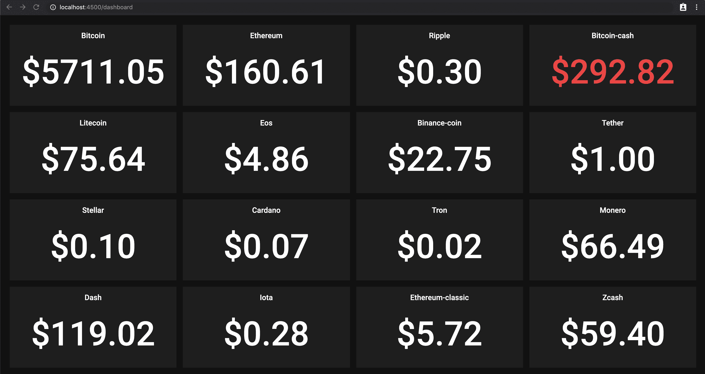

# 在 NGRX 中构建副作用

> 原文：<https://itnext.io/building-side-effects-in-ngrx-deb0d856096d?source=collection_archive---------3----------------------->

## 效果是 NGRX 中最强大的特性之一。让我们来看一些实际的例子，比如调用 API 或实时数据流

这是一个系列的第三篇文章，旨在详细解释用 NGRX 构建 Angular 应用程序的一步一步的方法。

*   在本系列的第一篇文章中，我写了一篇关于 NGRX 平台所有概念的概述。
*   在本系列的第二篇文章中，我开始编写应用程序的存储和状态的实体。

如果您从未使用过 NGRX，或者从未深入研究过，我真的建议您阅读它。

## 摘要

总结一下我在以前的文章中介绍的内容，我们有一个应用程序，旨在显示一个带有加密货币价格的仪表板。

该应用程序的逻辑是使用三个服务模块构建的，每个模块管理我们商店的不同功能。

这些是:

*   **dashboard** ，管理仪表板及其平铺的逻辑
*   **资产，**从 [Coincap 的](https://coincap.io) API 获取的资产列表
*   **价格，**来自 Coincap 的 WebSocket API 的价格流

**应用程序的外观:**



## 在本文中，我们将学习:

*   如何在 NGRX 8 中构建效果
*   如何构建一个从 API 获取资产列表的效果
*   如何构建一个连接到 WebSocket 并监听存储在应用程序状态中的消息的效果

# Coincap 的 API 服务

为了从 Coincap 获取数据，我们创建了一个服务，将在我们的效果类中使用:

目前，我们只有一种方法:

*   **获取资产**，默认情况下将获取前 5 个资产

这个方法将返回`GetAssetsResponseDto`,简单来说就是:

```
interface GetAssetsResponseDto {
    data: Asset[];
    timestamp: number;
}
```

# 资产影响

现在让我们为*资产*商店创建效果。正如我们在上一篇文章中看到的，我们已经创建了三个操作:

*   getAssetsRequestStarted
*   getAssetsRequestSuccess
*   添加资产

## 私有 API

让我们总结一下我们的行动将会做些什么:

*   我们想要对一个*getAssetsRequestStarted*动作做出反应，并分派一个*getAssetsRequestSuccess*动作
*   一旦*getAssetsRequestSuccess*动作被接收，我们将分派 *addAssets* 由 reducer 函数获取，并将资产添加到存储中

让我们首先创建负责获取资产的效果:

让我们来分解一下这种影响

*   我们不使用装饰器`@Effect`，而是简单地从`@ngrx/effects`导入函数`createEffect`
*   我们收到一个动作`getAssetsRequestStarted`
*   我们调用之前在 Coincap 服务中定义的`getAssets`方法，并将流映射到该请求的结果
*   如果有错误，我们简单地返回`undefined`，由于`filter(Boolean)`，它将在流中被过滤
*   然后，我们将流映射到动作`getAssetsRequestSuccess`

第二个效果将负责截取`getAssetsRequestSuccess`并简单映射到`addAssets`

## 公共 API

最后，我们公开公共 API:

```
public getAllAssets$ = this.getAllAssets();    
public addAssets$ = this.addAssets();
```

这是完整的片段:

# 价格效应

为了从 Coincap 的 WebSocket API 获取价格，我们扩展了之前创建的 Coincap 服务，并添加了一个新方法，负责连接到价格流并返回一个发出价格点的可观察对象。

## WebSocket 连接

为此，我们:

*   通过调用`WebSocket(url)`创建一个连接
*   我们创建了一个新的可观察对象，在这个对象中，每当 WebSocket 连接使用`onmessage`钩子接收到一条消息时，我们都会发出一个事件
*   我们定义了`unsubscribe`方法，它将简单地关闭 WebSocket 连接
*   如果连接已经打开，我们在打开新的连接之前关闭它，因为我们只需要一个 WebSocket 订阅来传输所有资产的价格

## 应用程序接口

我们创建了三个操作:

*   createPriceSubscription
*   close price 订阅
*   添加价格

这是效果的样子:

让我们来分解一下`createPriceSubscription$`效果:

*   我们收到一个动作`createPriceSubscription`,其中一个资产作为有效负载
*   我们将有效负载与订阅的资产合并，因此我们可以关闭当前订阅并重新订阅所有资产
*   我们通过 Coincap 服务连接到流，该服务将返回一个可观察的来显示价格
*   每一个价格都会产生一个动作`priceReceived`
*   我们向价格流可观察对象添加了一个`takeUntil`操作符，这样每次收到动作`closePriceSubscription`时，可观察对象就会自动退订

`prices$`效果相当简单:

*   我们接收到一个动作`priceReceived`,并将它映射到一个动作`addPrice`,该动作将由 reducer 处理，并将价格添加到商店中

## 更新商店模块

最后，我们需要通过使用`EffectsModule.forFeature([EffectsClass])`方法添加效果来更新两个商店服务模块。

价格商店模块如下所示:

```
@NgModule({
    imports: [
        StoreModule.forFeature('prices', pricesReducer),
        EffectsModule.forFeature([PricesEffects])
    ],
    providers: [
        // still empty!
    ]
})
*export class* PricesStoreModule {}
```

# 最后的话

在本演练中，我们创建了几个非常简单的效果来完成一些非常常见的任务，如与 API 端点对话、从实时消息系统创建可观察流，以及作为调度操作的结果更新 reducer。

在下一篇文章中，我们将最终构建一些组件，并使用 Facade 服务将商店连接到 UI。

希望你喜欢这篇文章，如果你同意，不同意，或者如果你想做任何不同的事情，请留言！

*如果你喜欢这篇文章，请关注我的* [*Medium*](https://medium.com/@.gc) *或*[*Twitter*](https://twitter.com/home)*以获取更多关于 Angular、RxJS、Typescript 等的文章！*

*最初发布于*[*https://frontend . consulting*](https://frontend.consulting/building-side-effects-in-ngrx)*。*