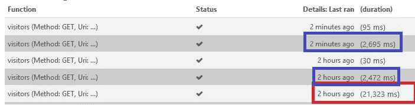

# 使用 Azure 功能构建单页面应用程序并改善冷启动时间

> 原文：<https://itnext.io/building-single-page-app-with-azure-functions-and-improving-cold-start-time-79a0faec9913?source=collection_archive---------2----------------------->


卡斯帕·鲁宾在 [Unsplash](https://unsplash.com?utm_source=medium&utm_medium=referral) 上的“MacBook 屏幕上的彩色代码行”

最近，我们使用 React、Node、Express 和 MongoDB 构建了一个单页面应用程序(实际上是一组多个 SPA)。最初的计划是将其部署在公司的数据中心内，但是典型的公司流程导致获得所需硬件方面的延迟。此外，还要求提供电子邮件功能，而对于私有数据中心来说，这种事情很麻烦。

考虑到成本因素和应用程序的低流量要求，我们决定使用 Azure 功能实现无服务器。它基于消费的定价模式非常适合我们的情况。

[*点击这里在 LinkedIn 上分享这篇文章*](https://www.linkedin.com/cws/share?url=https%3A%2F%2Fitnext.io%2Fbuilding-single-page-app-with-azure-functions-and-improving-cold-start-time-79a0faec9913)

# 第 1 部分:迁移到 Azure 函数

由于 SPA 使用基于 REST 的 API 与服务器进行交互，所以迁移很简单。唯一的困惑是如何托管静态文件。有两种选择，第一种是使用 Azure Blob 存储创建静态网站，第二种是使用 Azure 函数提供静态文件。我们选择了 azure function，因为它可以为静态内容提供一致的安全机制，减少部署步骤，并且无需启用 *CORS* 。

文件夹结构看起来像这样

```
**App**
- **staticserver**/
   index.js
   function.json
   wwwroot ==> contained all the static files generated by Webpack    
               for SPA
- **abc**/
   index.js
   function.json
**- xyz/
**   index.js
   function.json
- **packages.json**
- **proxies.json**
```

staticserver 是 Azure Functions 代理，它处理对 https://ourpwa.azurewebsites.net/ui/*,的所有请求，并提供 wwwroot 文件夹中的文件。例如，如果用户请求/ui/home.html，它将简单地在 wwwroot 文件夹下查找“home.html”并返回它。

API 映射如下

```
https://ourpwa.azurewebsites.net/api/v1/abc
https://ourpwa.azurewebsites.net/api/v1/xyz
```

用于存储数据的 Azure 表存储和 Blob 存储。azure-storage 和 uuid 只是用来实现各种 API 的两个 npm 包。

一切都运行良好，本地开发和调试非常容易。参考[代码并在本地测试 azure 函数](https://goo.gl/39PE64)以获取说明。请注意，2.x 版还不支持代理，所以您必须使用运行时 1.x 版。

# 第 2 部分:部署到 Azure 并使用冷启动

用“ [local git](https://goo.gl/RxdneN) ”部署也很简单，只需一个“git commit”就足以让一切在 Azure 上运行起来。

试运行也非常令人印象深刻，但很快我们就遇到了障碍，即“冷启动”的痛苦。在基于消费的模式下，Azure 不会让你的功能全天候部署。对于任何新的请求，Azure 将首先将功能部署到某个 VM，然后让它们为请求服务。这种冷启动大约需要 20 秒，有时需要 80-90 秒。后续请求在大约 50 毫秒到 500 毫秒内得到处理。根据我们的观察，函数在大约 10 分钟的不活动状态下保持部署，然后被刷新。


Azure 函数响应时间—红色表示冷启动

这是一个大问题。一位用户与 PWA 交互了一段时间后，遇到了严重的性能问题。

这是一个众所周知的问题，在这里[和这里](https://goo.gl/BiJA1L)和[这里](https://goo.gl/ar3u8N)进行了详细的讨论。常见的解决方案是定期 ping azure 功能，或者转到“永远在线”选项。这两者都违背了只有在你的功能运行时才付费的消费模式的目的。

# 第 3 部分:临时解决方案始终可用

团队需要一些解决方案，将它转换回基于 Node.js 的 Azure web app 是选项之一。Azure 功能可以通过应用服务计划下的“永远在线”选项托管。在 app 服务计划中，你的功能 App 运行在类似 web app 的专用虚拟机上，解决了冷启动的问题，但也带来了成本。更多细节请参考 [Azure functions 缩放和托管](https://goo.gl/TKJnux)。

我们写了一些 powershell 脚本，在繁忙时段升级到“永远在线”，然后降级为“消费计划”。

为功能应用程序打开“始终打开”的脚本

```
$ResourceGroupName = "YOUR_RSGRP"
$FunctionAppName = "YOUR_FUNCAPP"
$WebAppResourceType = "microsoft.web/sites"
$TempPlanName = "ALWAYS_ON_PLAN"
$PlanLocation = "PLAN_LOCATION"
$WebAppPropertiesObject = @{"siteConfig" = @{"AlwaysOn" = $true}}*#Create new plan*
New-AzureRmAppServicePlan -ResourceGroupName $ResourceGroupName    
                          -Name $TempPlanName 
                          -Location $PlanLocation
                          -Tier "Basic"
                          -NumberofWorkers 1
                          -WorkerSize "Small"*#Set the web app to the new plan* Set-AzureRmWebApp -ResourceGroupName $ResourceGroupName
                  -Name $FunctionAppName
                  -AppServicePlan $TempPlanName*#Set the alwayson to true*
$webAppResource = Get-AzureRmResource
                         -ResourceType $WebAppResourceType 
                         -ResourceGroupName $ResourceGroupName 
                         -ResourceName $FunctionAppName$webAppResource | Set-AzureRmResource
                         -PropertyObject $WebAppPropertiesObject
```

恢复到消耗计划的脚本

```
$ResourceGroupName = "YOUR_RSGRP"
$FunctionAppName = "YOUR_FUNCAPP"
$WebAppResourceType = "microsoft.web/sites"
$TempPlanName = "ALWAYS_ON_PLAN"
$PayAsYouGoPlanName = "CONSUMPTION_PLAN"
$PlanLocation = "PLAN_LOCATION"
$WebAppPropertiesObject = @{"siteConfig" = @{"AlwaysOn" = $false}}

*#Set the always on to false
#without that you wont be able to change the plan*
$webAppResource = Get-AzureRmResource
                         -ResourceType $WebAppResourceType   
                         -ResourceGroupName $ResourceGroupName 
                         -ResourceName $FunctionAppName$webAppResource | Set-AzureRmResource
                         -PropertyObject $WebAppPropertiesObject *#Update the plan for Azure function app*
Set-AzureRmWebApp -ResourceGroupName $ResourceGroupName
                  -Name $FunctionAppName
                  -AppServicePlan $PayAsYouGoPlanName#Delete the plan
Remove-AzureRmAppServicePlan -ResourceGroupName $ResourceGroupName 
                             -Name $TempPlanName 
```

> 重要:空的 azure 服务计划与托管应用程序的 azure 服务计划的成本相同，因此请确保删除未附加到任何应用程序的 azure 服务计划。

这暂时缓解了冷启动问题，但以基本应用服务计划为代价。

# 第 4 部分:摆脱 npm 包，拯救 Webpack。

经过调查，我们发现在冷启动期间，大部分时间都用于恢复虚拟机上的 npm 程序包。为了摆脱 npm 包，我们决定使用 webpack 来打包功能。通常，在使用 webpack 构建节点应用程序时，“ [webpack-node-externals](https://goo.gl/nKoeoj) ”有助于避免捆绑其节点模块依赖关系。但是这里需要将所有的依赖项捆绑在一起并创建一个文件。在 UglifyJSPlugin 的帮助下使用树摇动技术，可以进一步优化这个包。

同时，我们将函数转换为 TypeScript。这是更新后的结构

```
**App**
- **staticserver**/
   index.js
   function.json
   wwwroot ==> contained all the static files generated by Webpack    
               for SPA
- **abc**/
   index.js
   function.json
**- xyz/
**   index.js
   function.json
- **proxies.json**
```

*注意:现在每个 index.js 都是某种编译过的 JavaScript，包含了它需要运行的所有代码，没有任何依赖 node_modules。没有 package.json，Azure 会在部署前查找 package.json 并还原包，影响冷启动时间。确保即使在子文件夹下也没有 package.json。*

该出结果了



红框表示删除 npm 依赖关系之前的冷启动，蓝框表示删除 npm 依赖关系之后的冷启动时间。

因此，消除 npm 依赖性有助于我们将冷启动时间从 21 秒减少到 3 秒。对于我们的应用程序来说，3 秒已经足够了。

# 离别的思绪

*   移除 npm 依赖性使得 Azure Function 成为托管低流量 PWA 的有吸引力的模型。
*   如果你有一个流量很大的网站，Azure Functions 不是选择，最好选择 Azure web app 或其他基于 PaaS 的选项。
*   Azure 团队也发布了一个工具 [Funpack](https://goo.gl/ND5Bvc) 来解决这个问题，[查看这篇 msdn 文章](https://goo.gl/7p9jrc)了解更多细节。

希望这篇文章对你有用，欢迎留下评论。