# 以最小的成本构建启动应用程序

> 原文：<https://itnext.io/building-startup-application-with-minimal-costs-b205347e726c?source=collection_archive---------5----------------------->

克拉克·蒂布斯在 [Unsplash](https://unsplash.com/s/photos/startup?utm_source=unsplash&utm_medium=referral&utm_content=creditCopyText) 上拍摄的照片

你们中的一些人可能对 web 应用程序有所了解，甚至对业务也有所了解，但是各种不同的工具和服务器成本可能会让你在开始时感到沮丧。

在一篇文章中，我将尝试引导您完成我使用不同工具和框架的旅程，这些工具和框架有助于以非常小的成本构建一个应用程序，该应用程序每月有高达 10，000 的用户流量。

一般来说，我们每月花 50-60 欧元购买云服务，以及我们免费使用的所有其他工具，它们为团队协作带来了很多价值。

我将给出一个关于所做决定的提示和一些注意事项。

# 介绍

这篇文章反映了我在创建我们的创业平台 [https://clusterjobs.de](https://clusterjobs.de) 时的经历和对挑战的解决方案

它可能不是市场上最好的应用程序，但如果你想向世界发布你的第一个应用程序，它可能会给你一些提示或帮助。

# 应用程序列表

## 合作

*   Trello — canban，任务规划
*   Wrike —任务规划，维基
*   **白板(Figma)** —协作、构思
*   **Evernote** —合作
*   **松弛** —沟通
*   **Yandex。邮件** —公司邮件

## 发展

*   **Gitlab** —回购/CI/CD
*   图玛 —设计
*   **森林管理员** —数据库的网络用户界面

## 域名托管

*   **Cloudflare** —域名托管、DNS、SSL

## 云服务

*   **Heroku**
*   **谷歌云平台**
*   **数字海洋**

## 韵律学

*   **可断言** —端点健康
*   **云服务指标** —资源指标

## 分析学

*   **谷歌分析+谷歌标签管理器** —用户分析
*   **Hotjar** —用户记录
*   **Semrush** — SEO 分析

# **协作**

好吧，你有主意了。

这可能是烹饪食谱应用程序，又一个 COVID 跟踪器，硬件工具租赁元搜索网站。

在谈论协作工具之前，我只想指出两个不同的案例，为什么它们可能是有益的:

*   你在一个团队中工作，你正在交换想法，需要一些任务跟踪工具，以便能够一起工作并有一些文档
*   您正在独自工作，但是您仍然希望保留一些想法，并且还拥有一个任务跟踪工具，以便更方便地计划迭代

## 对于我们用于协作的所有工具，我们每月支付 0 欧元。

# **特雷罗**

特雷罗板

每个人都知道 trello，伟大的和免费的工具，创造一些残板，并保持对任务和想法的进展。

细节就不多说了。

它是免费的，易于使用，而且它能做它应该做的事情。

免费计划的限制是 10 个团队板和最大 10mb 的文件附件。

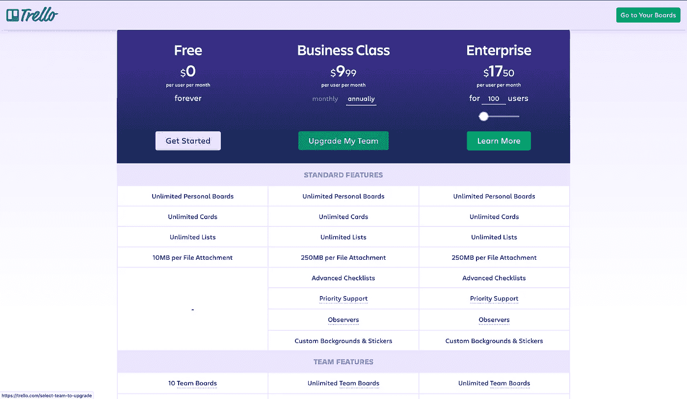

[特雷罗定价](https://trello.com/en/pricing)

## 但我们没有用特雷罗。

# 里克

我们使用了名为 Wrike 的应用程序，它允许你在列表视图中显示看板。

它还允许你通过文件夹来组织任务，这实际上有助于建立某种知识库。

只需将所有信息放在一个任务中，并放在相关的文件夹中。

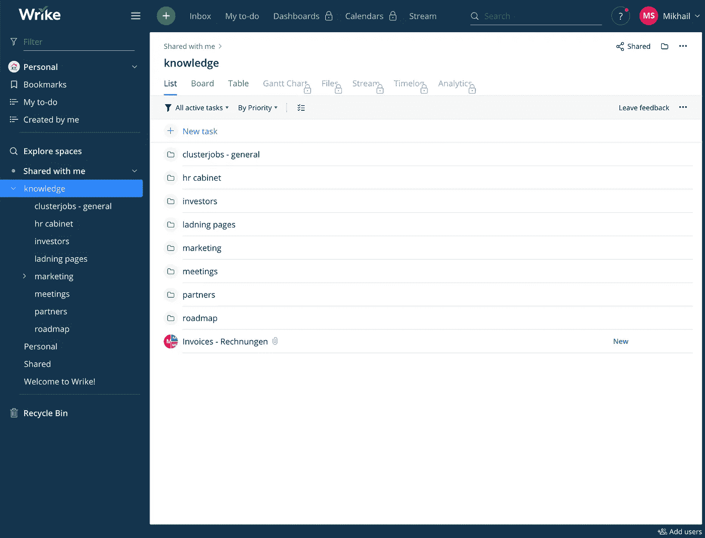

Wrike 知识库

我们有合作伙伴的法律信息、合同、不同工具和云服务的凭证。

免费的话，你可以有多达 5 个用户和 2 GB 的存储空间，这对我们来说再好不过了。

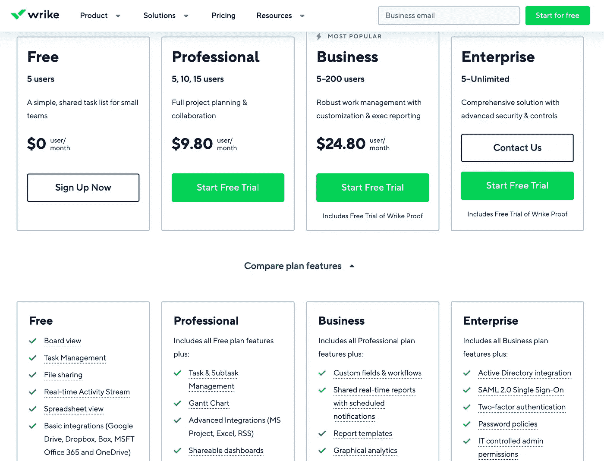

[Wrike 定价](https://www.wrike.com/price/)

我们主要使用 canban 来跟踪线下任务——接触新的合作伙伴、签订新的合同等等。

绝对可以推荐。

# **白板**

我真的很喜欢白板。你可以把一些参考资料和数据报告以图片的形式放在那里，使构思过程更加顺畅和方便

糟糕的是，几乎所有这些都是有用的，只有付费计划。
而且免费计划允许一些低分辨率图像的导入和很多限制。

这就是我使用 Figma 作为白板的原因。

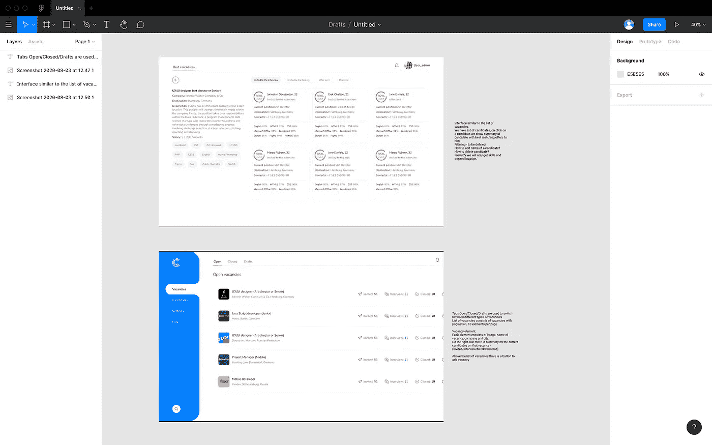

使用 Figma 作为设计构思的白板

我们稍后将回到 figma，但是作为一个协作白板，它已经很棒了！它给你高质量的图像导入，留下文本，绘画，放一些箭头**免费。**

试试吧！

# **Evernote**

我知道为什么是另一个应用，当你提到 Wrike 的时候。

对我来说，在桌面应用程序中写东西更方便。见鬼，我甚至在 Evernote 上写了这篇文章😄。

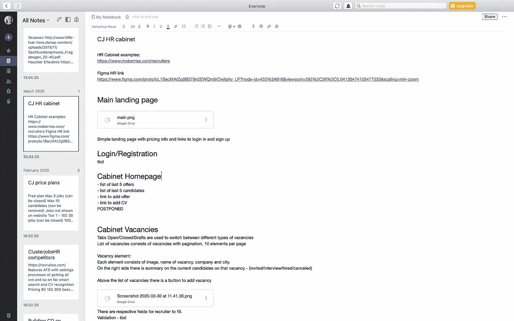

Evernote 界面

可以通过 Zapier 与 Wrike 整合——免费计划每月最多允许 100 项任务。我根本没有尝试过这种集成，[但是如果你感兴趣的话，可以试试](https://zapier.com/apps/evernote/integrations/wrike)。

新界面的想法和结构被放在 Evernote 中，并与外包设计师分享，而 Wrike 仍然是纯粹的内部工具。

# 松弛的

差不多 4 年前，我很快就习惯了懈怠。
基本上我们甚至没有就使用什么通讯工具进行任何讨论，就决定创建免费的 slack workspace。

唯一真正的问题是，正如你现在可能知道的，slack 只允许你在存档中搜索最多 10，000 封邮件。

我们习惯了，把所有重要的信息都保存在 Wrike 里。Slack 对于与启动相关的通信非常有用，当然，与记录器和警报的集成也非常有用。

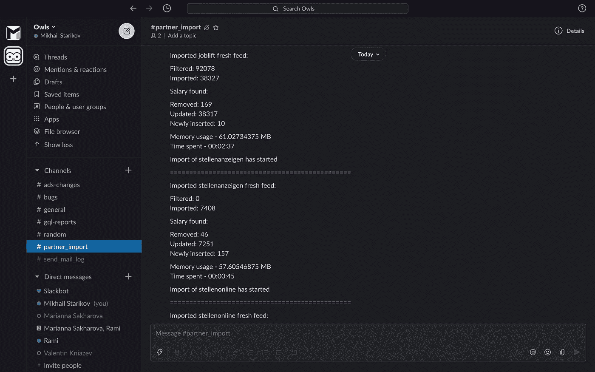

在专用空闲通道中导入工作机会日志

# Yandex。邮件

Yandex 是一家大型俄罗斯 IT 公司，他们提供邮件服务器，你可以在那里免费设置公司邮件。

因为我以前在俄罗斯用过它，所以我在德国为我们的项目重新设置了它，一切都很顺利。

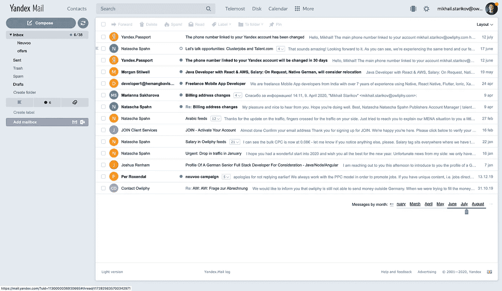

Yandex 邮件界面

我知道你也可以在谷歌上设置公司邮箱，但是每个用户每月要花 6 美元。我不确定还有其他免费的电子邮件服务，所以请随意使用。

我能说的是，我们对 Yandex.Mail 非常满意。

# **发展**

## 对于我们用于开发的所有工具，我们每月支付 0 欧元。

# **Gitlab**

当我们开始编写代码时，Github 还没有提供免费的私有库，所以选择是显而易见的。

CI 渠道+私人回购——这是一个优势。

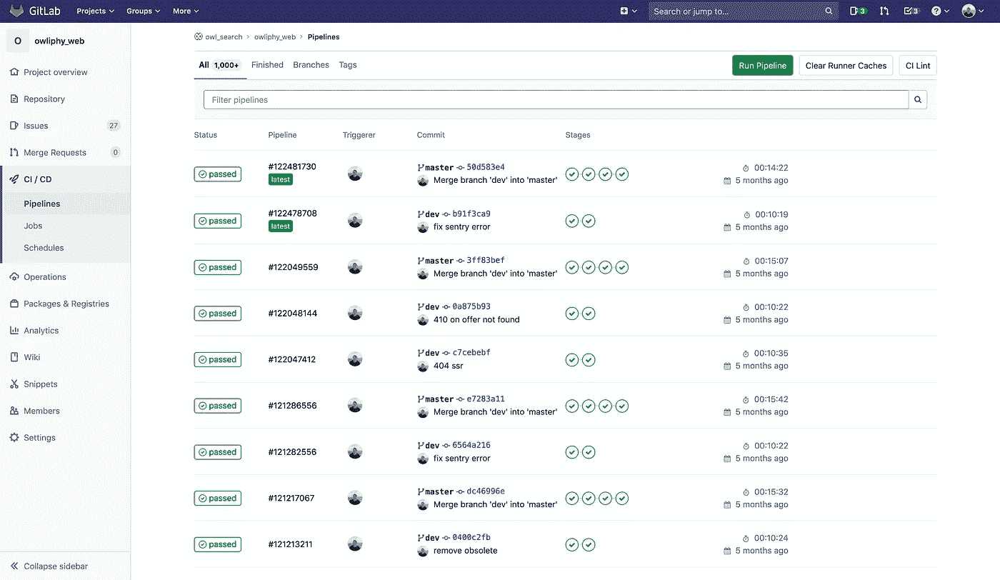

Gitlab CI 管道

现在 Github 有了行动和私有回购，所以这取决于你。

您可以使用 wiki，创建项目板，还可以通过问题跟踪新功能/缺陷。

因此，从我的角度来看，这或多或少是品味的问题。

抱歉，如果我在这里没有提到任何关于圣战主题的详细比较，我只想提到一些必要的有用的东西，而且这两个平台都是免费的。

此外，在 Gitlab CI 中，您可以免费编译您的应用程序、运行测试、e2e 测试、部署等。

免费计划对可用跑者有限制，但如果你缺钱，足够日常工作。

在这里，您可以先睹为快，看看我们是如何为我们的应用程序创建 CI 管道的

 [## 为 Node.js 应用程序设置连续交付

### 自动部署 Node.js 应用程序的初学者指南

medium.com](https://medium.com/better-programming/continuous-delivery-for-node-js-application-72dec43bf6bd) 

# **图玛**

又来了。

这个主要看你的设计师。我认为 Figma 非常适合设计和协作。了解它并及时使用它是很容易的。

你可以看到一些简单的界面，它们将如何通过点击这里和那里，导出图像，检查大小和元素的一些 css 属性来工作。

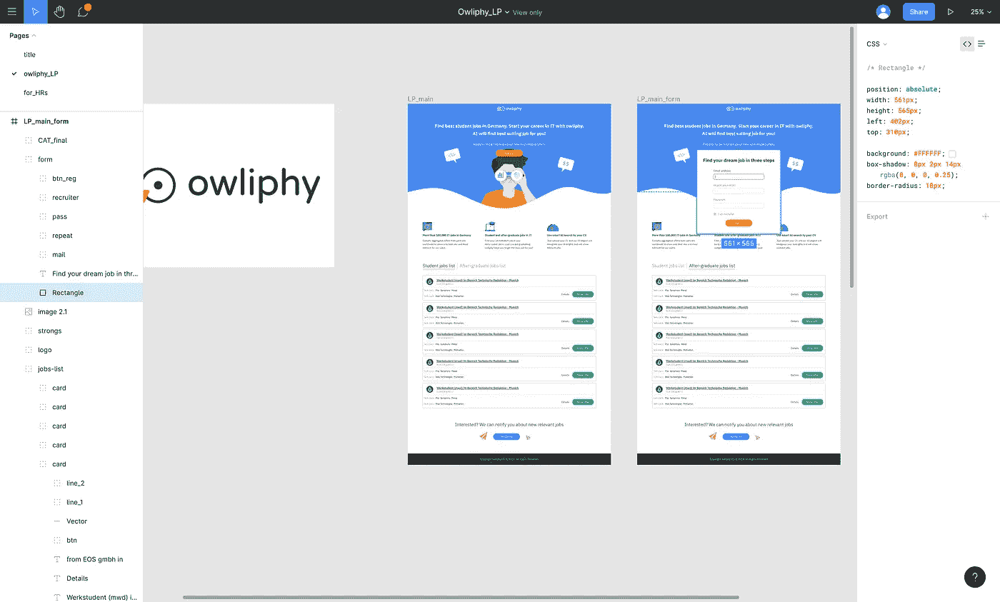

Figma 接口

你也可以直接对设计发表评论。你也可以免费使用它👍。

# **森林管理员**

这个问题很具体，但可能会有帮助。

该应用程序的想法是，你可以连接到它的数据库，并有一个简单的 CMS。

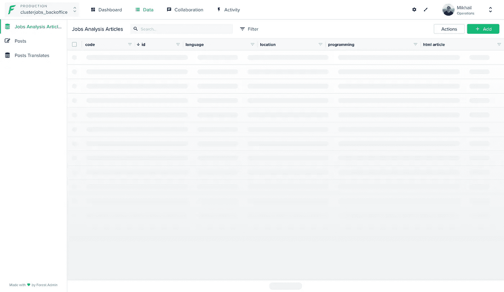

森林管理 CMS

您可以将该 CMS 的访问权限授予您的团队成员，这样他们就可以创建帖子并向网站添加内容。

CMS 也有 WYSIWIG 编辑器，所以它更容易与内容。

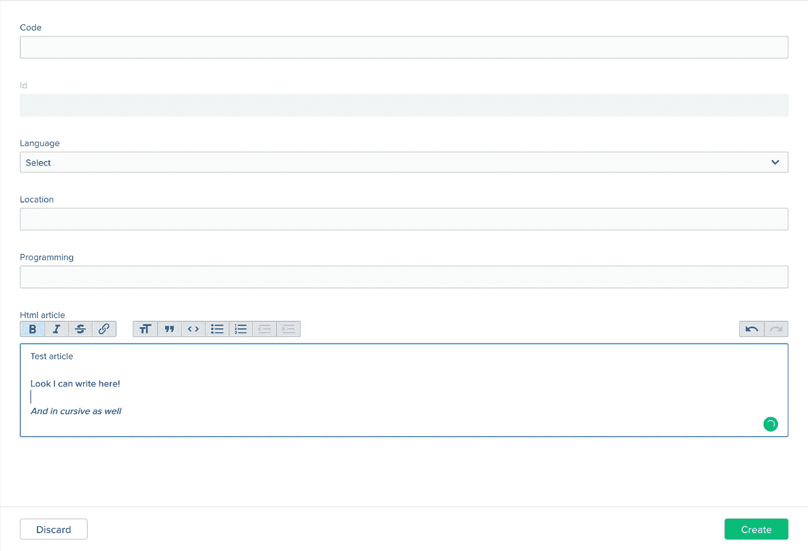

林管理 WYSIWIG 编辑器

你需要把它放在某个地方，然后把你的服务器 ip 放在[https://app.forestadmin.com/](https://app.forestadmin.com/)的账户上。

实际上，对于主机来说，Heroku 上的免费爱好实例就足够了。空闲 30 分钟后停止。因此，当您第一次从林管理员那里请求它时，可能需要一两分钟才能启动，但之后就可以正常工作了。

免费。

# 域名托管

## 你猜对了，0 欧元！

# 云耀斑

这是我非常满意的服务。Cloudflare 允许您:

*   要设置 DNS
*   启用 SSL 并获取免费证书
*   提高你网站的速度
*   缓存 js 和 css 资源
*   注册 web 工作者
*   在页面和域之间添加一些重定向
*   分析交通
*   …它还可以防止 DDoS 攻击并阻止可疑的 IP

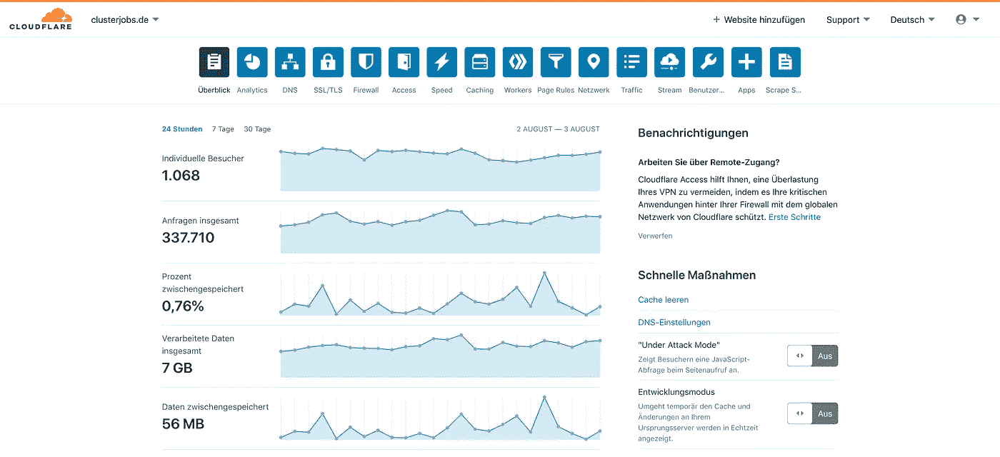

Cloudflare 仪表板

它只是超级有用的免费计划，你可以让它托管你的域名，你从任何地方购买，我向你保证，你不会感到不安！

我们开始用它来处理 DNS 规则，但是我立刻看到了速度的提高，缓存工作正常。

最后，它帮助了我们很多域名重定向，因为我们改变了我们的名字，也需要切换网站域名。

# **云服务**

## 对于云服务，我们每月支付大约 50 欧元。

# **Heroku**

令人惊讶的是，您不需要设置接收 get repo 来自动部署主提交，它为您做了一切。

你可以从 Gitlab Github，Bitbucket，任何东西上集成它。

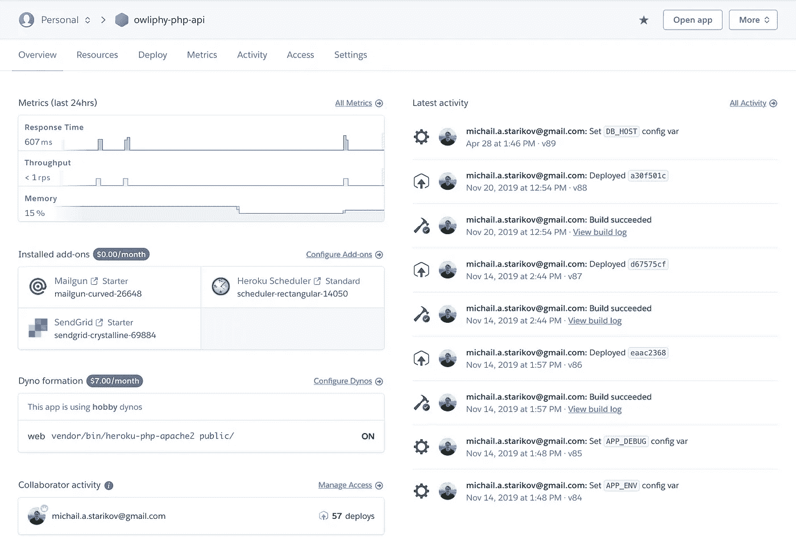

Heroku 接口

另一件很棒的事情是，你可以在那里免费托管应用程序，但有一个细微差别。

首先，在自由计划中，一旦空闲超过 30 分钟，你的实例将被关闭。

一旦你想让它一直运行，并能够处理一些流量，那么你开始添加更多的实例，更大的实例，它变得相当昂贵。

对我们来说，512mb 的实例是 25 美元😬

# **谷歌云服务**

我们将 GCP 用于以下应用:

*   运行在 Java 上的独立搜索应用程序
*   Mysql 数据库
*   用于从合作伙伴 XML 导入数据的 python 应用程序

你可以得到 300 美元来运行实例，所以我们实际上一个接一个地创建了几个帐户，并且在免费信用用完之后重新部署😛

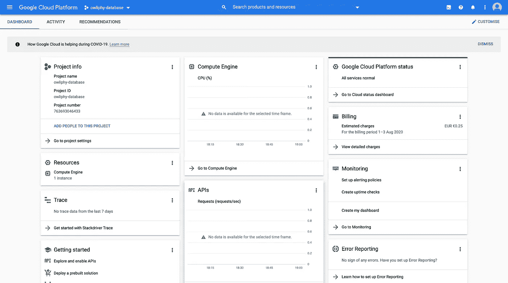

GCP 接口

GCP 在做 Kubernetes 和托管复杂和真正大型的企业解决方案方面绝对是得心应手的，但是到目前为止，如果你有 3-5 个服务，每个服务一个实例，从工具的多样性和价格来看，这有时是多余的。

在那里进行连续部署也不容易。

# **数字海洋**

最终我们会把所有的事情都做好。

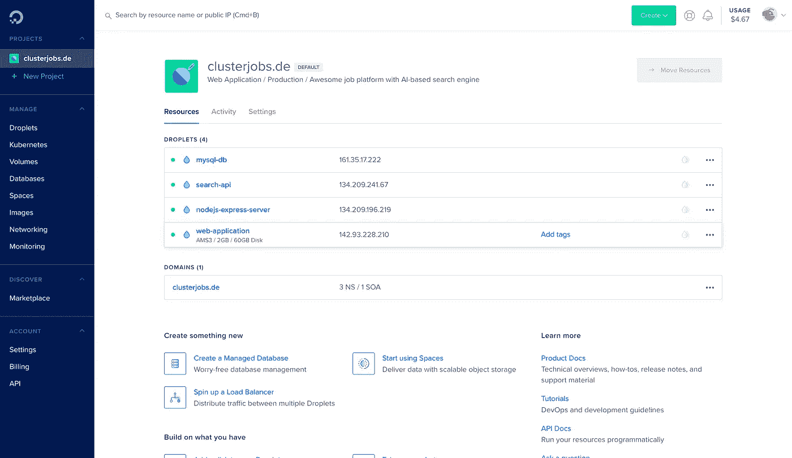

数字海洋接口

我从 Hacktoberfest 获得了 50 美元的奖金，而且一般来说，在这里运行实例的成本更低。

缺点是，对于所有的 web 应用程序，我必须实现自己的方式，从最新的主提交自动部署，没有停机时间。

这是通过 pm2 和接收后 git 挂钩实现的。我写的那篇文章描述了一切:

 [## 为 Node.js 应用程序设置连续交付

### 自动部署 Node.js 应用程序的初学者指南

medium.com](https://medium.com/better-programming/continuous-delivery-for-node-js-application-72dec43bf6bd) 

总的来说:web 应用程序、GraphQL 服务器、mysql 实例和 python 应用程序以及搜索应用程序现在花费了我们大约 60 美元，而在 heroku 上托管 web + GraphQL 以及在 GCP 上托管 search + mysql + python 之前，花费是现在的两倍。

# 韵律学

## 每月增加 0 欧元

# 可断言的

非常简单也非常有用:

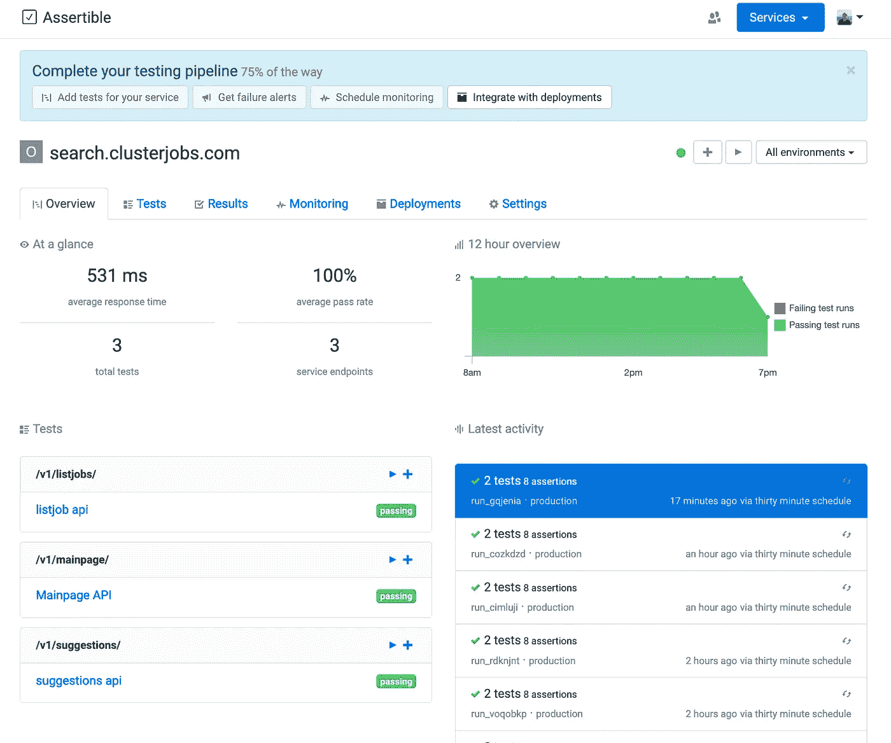

可断言仪表板

在那里放一些端点，你要时常留意。

服务将请求这些端点，如果出现问题，它将向您发送电子邮件或 slack 警报。

在免费计划中，你可以每 30 分钟提醒一次空闲频道。另外，在 free plan 上，您可以将它集成到您的部署脚本中，这样每次部署时，您都可以检查端点的健康状况。

# 数字海洋/ GCP/ Heroku 指标

这与您的云服务一起提供，所以只要利用它！

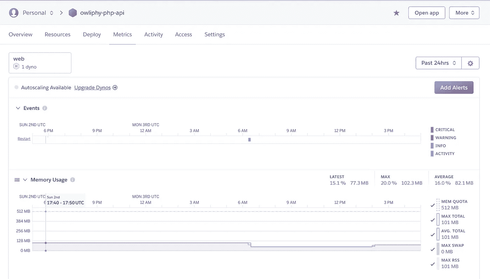

Heroku 度量

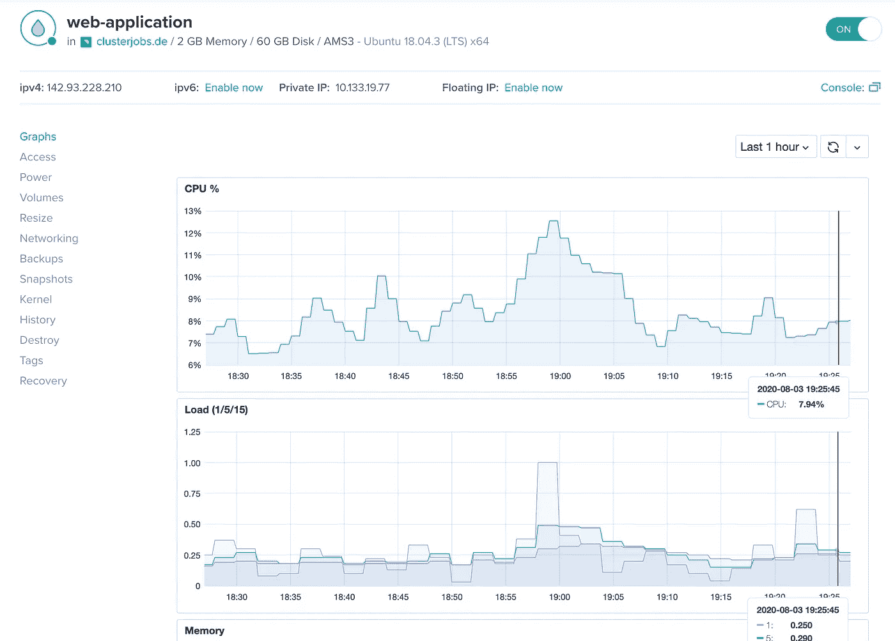

数字海洋度量

检查峰值，创建警报，如果资源使用了 80%,这可能是过度解析甚至 DDOS 攻击的良好指示。

# **分析**

## 也没花什么钱

# **谷歌分析+谷歌标签管理器**

对于所有第三方集成，如 Pixel、GA 和 Hotjar，我们使用 GTM。

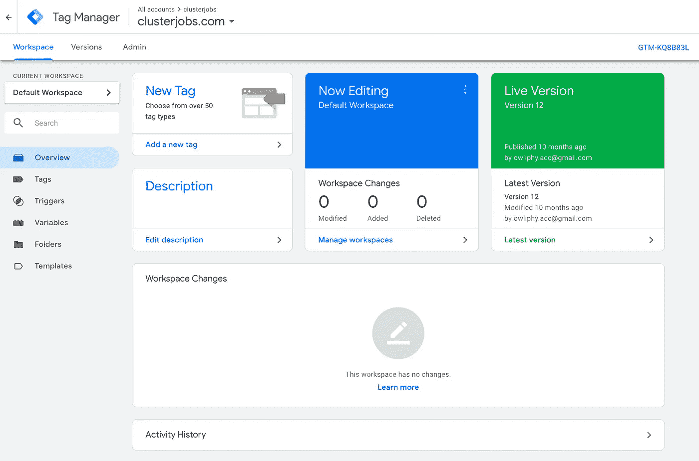

GTM 接口，如果你不知道的话🤷‍♂

只需添加代码片段并在容器中操作所有集成，非常方便。

分析将帮助你了解每天的流量。
您可以通过分析运行 A/B 测试，添加一些事件来分析用户行为。

此外，通过分析，你可以在谷歌广告中重新定位人们，所以这可能是必须的。

然而在低流量时，它不会帮助你。要了解哪些场景对用户不方便，我建议使用 Hotjar，看看一些真实的用户交互。

# **热罐**

正如我上面写的，它很棒，因为你可以记录用户的动作并观看它们。

这有助于了解哪些界面对用户来说很奇怪，哪些场景应该改进或简化。

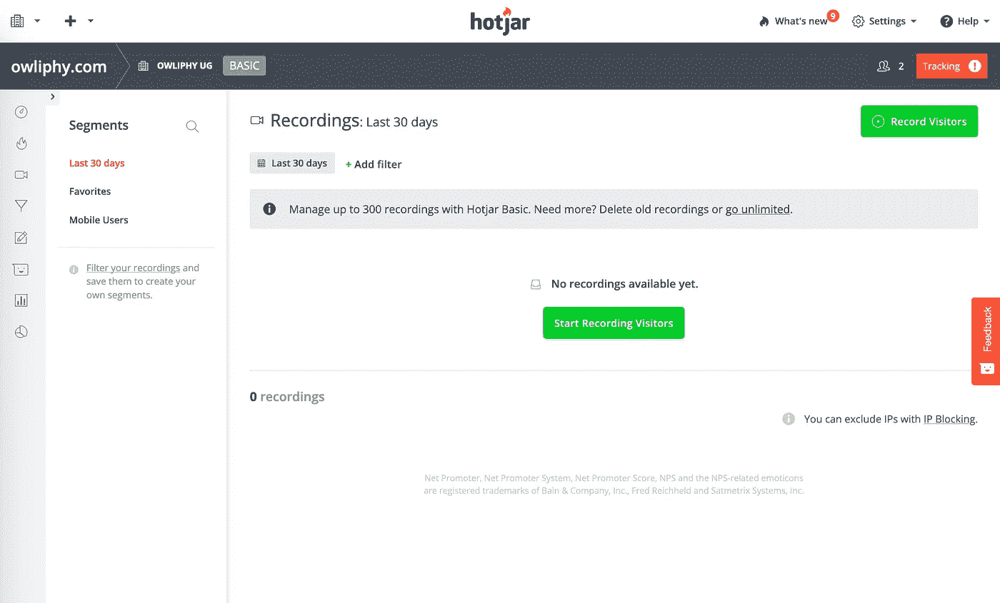

Hotjar 界面，抱歉一次没有任何记录

您还应该隐藏所有敏感的用户信息，以免被记录。

为此，将属性“data-hj-suppress”应用于所有包含敏感信息的容器或节点。

默认情况下，Hotjar 超过了所有的输入信息。如果您想检查用户填写的搜索输入字段，您可以通过添加属性“data-hj-allow”来记录它。

在免费计划中，它允许多达 100 个记录。一旦它被填满，它将停止记录，但你可以删除他们，一旦你完成了他们，热将继续记录在这种情况下。

# **塞姆拉什**

Semrush 是一个非常复杂的工具，但对 SEO 优化非常有用。

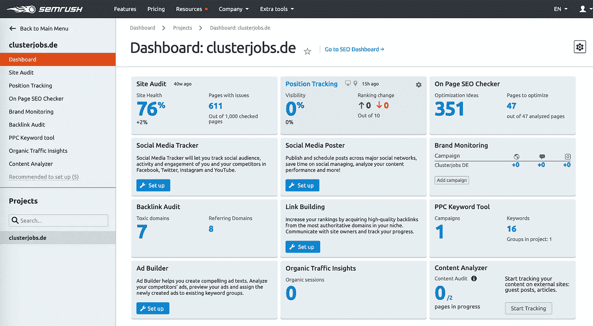

SEMrush 仪表板

它可以连接到你的谷歌搜索面板，显示反向链接，并帮助你搜索关键词。

你可以搜索你的竞争对手，分析他们的关键词，检查你想添加到网站的关键词，了解这些关键词的流量，并从中建立你的关键词核心。

这绝对是昂贵的——最便宜的方案几乎是每月 100 英镑，但如果你计划撰写你的关键字核心并在此基础上工作，可能有必要获得一个月，然后取消。

此外，它是免费的试用期，所以实际上我们用它来初步了解我们在 SEO 中的表现，这足以规划第一步。

# 摘要

构建一个创业 web 应用程序是一个地狱般的旅程，我对我们使用的工具非常满意，事实上，这让我们真正冒险并尝试一些东西，因为最终应用程序不需要太多的钱——我们只为云支付了费用，并通过 CPC 模式成功收回了这些钱。

我想分享一下我的经历，先睹为快，希望能对你有所帮助，或者给你一些启发，干杯！