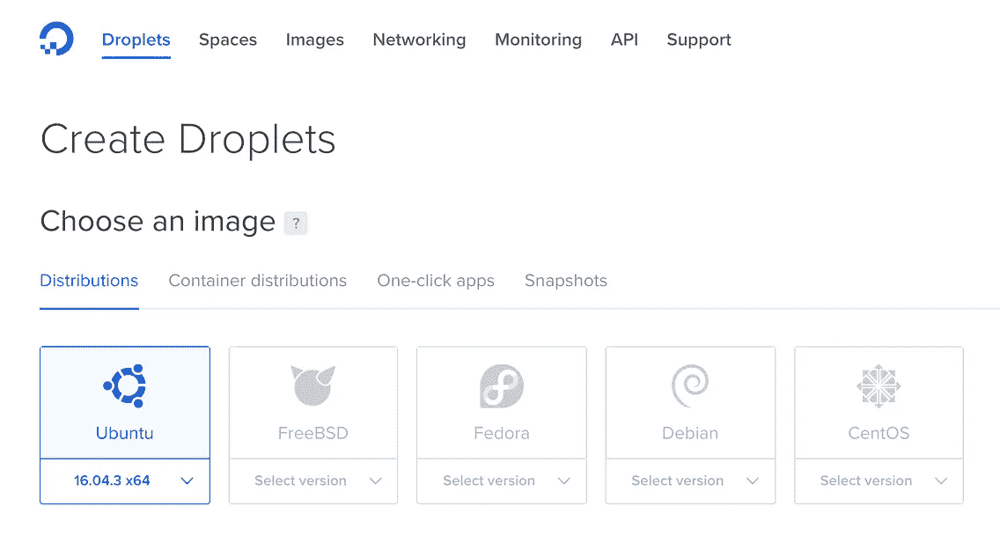
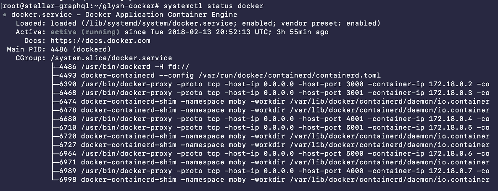
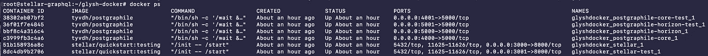

# 构建一流的应用

> 原文：<https://itnext.io/building-stellar-apps-36303d0e6f45?source=collection_archive---------3----------------------->

## PostgreSQL 和 GraphQL 的冒险


在过去的一年里，我已经成功构建了三个不同复杂程度的一流应用程序。

[](https://colorglyph.io/) [## 彩色字形

### 创建像素字形并与你的朋友交换

colorglyph.io](https://colorglyph.io/)  [## Popcoin -让我们给你报酬

### pop coin——完全管理的计量计费是支付任何费用的最佳方式。

popcoin.ws](https://popcoin.ws/) [](https://stellarpool.net/) [## 恒星池-每周收集免费 XLM

### 一个低收费的恒星社区膨胀池。领取您的每周 XLM 奖励。

stellarpool.net](https://stellarpool.net/) 

[Stellar SDK](https://github.com/stellar)写得非常好，而[文档](https://www.stellar.org/developers/reference/)每天都在变得更好。 [Slack](https://slack.stellar.org/) 、 [Reddit](https://www.reddit.com/r/Stellar/) 和 [StackExchange](https://stellar.stackexchange.com/) 上的社区充满活力，乐于助人，令人兴奋。然而，与任何事情一样，尤其是相对复杂的技术，上升可能会很慢，并且不需要很长时间就可以达到知识和功能的双重极限。

在我开发的所有应用程序中，这一点变得越来越真实。随着你对事物如何工作有了更深的理解，你开始收集一个相当坚实的愿望清单，包括你希望存在的特性或你还没有想出如何解决的问题。

我自己和社区中遇到的最大、最常见和最突出的问题是获得关于恒星数据集本身的越来越复杂和具体的问题的答案。

比如:

*   列出所有信任发行人 X 的美元的账户
*   显示发行者 X 的所有信用额度
*   哪些账户尚未设定通胀目标？
*   按 XLM 量列出所有客户
*   根据帐户在整个网络中的“信任”级别对其进行排名

这个清单还在继续，当你开始构建的时候，这些无法回答的问题将会困扰你。我说不可回答，但是当然他们实际上*是*可回答的，只是不是由当前的 SDK。目前，为了更深入地挖掘 Stellar 生态系统，你必须以某种方式访问分布式 Stellar PostgreSQL 数据库本身。这需要至少启动一个核心服务器(如果没有 horizon 实例的话),如果您有历史问题需要解答的话。

有了 Stellar 的 Docker 存储库，这实际上并不像听起来那么痛苦，但是真正的麻烦出现在将 psql 查询移植到前端的时候。这需要你构建一个 API 层。

这是几周前我在的地方。慢慢建立起独立的端点。每个设计用来回答一组特定的问题。这很快变成了一个极其痛苦的过程。尤其是对于那些最终不是我真正想要构建的应用程序。

在字里行间，在与 Slack 上的一些人的交谈中，我有了一个想法。我想知道是否有开源工具可以将 PostgreSQL 数据库移植到 GraphQL 上。我的意思是他们有很多相似的模式，就像 GraphQL 之于前端 PostgreSQL 之于后端一样。肯定可能有这样的工具。

💥输入[postgrapile](https://www.graphile.org/postgraphile/)💥

经过几个小时的学习和摸索，我可以通过 GraphQL 直接访问整个核心和 horizon 数据库。不用说，我被难倒了。我仍然是。

这篇文章的其余部分将致力于让这个系统在你自己的服务器上运行。然而，如果你只是想回去编码，我有一些公开可用的端点，所以你可以马上开始。

## 测试网

*   核心数据库—【core-test.gly.sh/graphiql 
*   地平线数据库—【horizon-test.gly.sh/graphiql 
*   horizon REST API—[API-test . Gly . sh](https://api-test.gly.sh)(horizon-testnet.stellar.org[的镜像](https://horizon-testnet.stellar.org)

## 公共网络

*   核心数据库—[core.gly.sh/graphiql](https://core.gly.sh/graphiql)
*   地平线数据库—[horizon.gly.sh/graphiql](https://horizon.gly.sh/graphiql)
*   horizon REST API—[API . Gly . sh](https://api.gly.sh)(horizon.stellar.org[的镜像](https://horizon.stellar.org)

# 步骤 1:创建服务器

让所有这些黄金在您自己的服务器上运行实际上是小菜一碟🍰所以不要害怕。我已经做好了准备 Docker 合成系统的所有工作。您只需根据需要进行安装、配置和调整。

我将通过 [Digital Ocean](https://m.do.co/c/789f5f91013c) 在 Ubuntu 上进行设置，但是如果它可以运行 Docker，你也可以以类似的方式运行。



确保添加对监控的支持，并且不要忘记添加您的 SSH 访问密钥。*点击*创建！

> 随着时间的推移，你可能会发现你的 Droplet 可能需要比我目前运行的 2 : 2 更多的能量，但是到目前为止，这个设置已经足够满足我的需要了。我确实知道低得多，你*会*很快遇到麻烦。

酷毙了。水滴已创建。

# 步骤 2:访问和配置

现在我们已经有了一个 droplet，让我们通过 SSH 访问它。

```
ssh root@{droplet.ip.address} -i ~/.ssh/{ssh_code_rsa}
```

> 如果您要访问这个 droplet，请经常将这个 ssh 命令粘贴到一个可执行文件中，并将其放入您的`~/bin/`

访问！剩下的就简单了。

确保您已经安装了`git`

```
git --version
```

如果你得到了一个与`git version 2.7.4`一样的输出，你应该是黄金，否则就谷歌如何为你的操作系统安装 git。

现在我们需要添加 Docker 和 Docker compose。这些说明可能会因您的操作系统而有所不同，所以我建议您依靠官方的最新文档来完成这一步。我会分享我在 Ubuntu 上运行的东西，但很可能会有所不同。

```
curl -fsSL https://download.docker.com/linux/ubuntu/gpg | sudo apt-key add -add-apt-repository "deb [arch=amd64] https://download.docker.com/linux/ubuntu $(lsb_release -cs) stable"apt-get updateapt-cache policy docker-ceapt-get install -y docker-cesystemctl status docker
```

老实说，我不知道其中一半的命令实际上是做什么的，也不知道哪些命令实际上需要运行。基本上只是抄袭[这篇 DO 文章](https://www.digitalocean.com/community/tutorials/how-to-install-and-use-docker-on-ubuntu-16-04)。我只知道如果最后一个命令输出类似这样的内容:



接下来是码头工人作曲。

```
curl -L https://github.com/docker/compose/releases/download/1.19.0/docker-compose-`uname -s`-`uname -m` -o /usr/local/bin/docker-composechmod +x /usr/local/bin/docker-composedocker-compose --version
```

得到这样的东西:`docker-compose version 1.19.0, build 9e633ef`？没有吗？退出并重新进入 shell，再试一次。😬

假设一切顺利💯，这可能是 Ubuntu 独有的，但我想所有的操作系统都有类似的东西，我们需要进入根目录。在 Ubuntu 上，这很简单:

```
cd ~
```

当你进入的时候，它会自动把你带到这里，但是我想确认一下。

接下来你需要克隆我的 Docker compose repo。

```
git clone [https://github.com/TinyAnvil/glysh-docker.git](https://github.com/TinyAnvil/glysh-docker.git)
```

太好了，现在让我们进入新目录。

```
cd glysh-docker
```

太棒了。现在让我们稍微配置一下。

```
nano example.env
```

这将打开一个 nano 编辑器(如果你是个书呆子，请随意使用 vim🤓).从这里只需编辑`TESTNET_PASS`和`PUBNET_PASS`环境变量。这些将是一流 PostgreSQL `stellar`用户的密码。保存此文件。

现在只需将这个文件从 example.env 重命名为 good ole。包封/包围（动词 envelop 的简写）

```
mv example.env .env
```

耶！您终于只需一个命令就可以访问您想要的所有内容了！

```
docker-compose up -d
```

这将完成一些事情，如果运气好的话，大约一分钟后，您应该已经设置好查看所有测试和公共 GraphQL 端点以访问 Stellar PostgreSQL 数据库。

您可以运行来检查已经启动的容器的状态。

```
docker ps -a
```



如果状态不全是某种“启动”，您可能需要尝试关机并重新启动。

```
docker-compose down
docker-compose up -d
```

您还会注意到所有用于访问端点的开放端口。3001、4001 和 5001 用于测试网络，3000、4000 和 5000 用于公共网络。去看看这些，看看你都做了些什么。

*   [http://{ your-droplet-IP }:3001](/{your-droplet-ip}:3001)(地平线休息 api)
*   [http://{ your-droplet-IP }:4001](/{your-droplet-ip}:3001)/graphiql(核心 db)
*   [http://{ your-droplet-IP }:5001](/{your-droplet-ip}:3001)/graphiql(地平线 db)

> 注意:与所有其他恒星节点同步可能需要几分钟到几个小时，所以在一切都跟上的时候要有耐心。请务必浏览这个恒星报告以获取关于监控实例的信息。

# 结论

希望此刻你和我一样欣喜若狂。如此近距离直接访问恒星数据库是不可思议的。尤其是你的前端开发将永远不会相同。💥 🎉 🎈

如果你喜欢这篇文章，一定要给我一两下掌声。另外，一定要主动寻求反馈或建议。我为此写的所有代码都是开源的，我很乐意帮助它变得更好。

*   [https://github.com/TinyAnvil/glysh-docker](https://github.com/TinyAnvil/glysh-docker/blob/master/example.env)
*   [https://github.com/TinyAnvil/postgraphile-docker](https://github.com/TinyAnvil/postgraphile-docker)

最后，一定要帮助传播这个词，这确实是恒星应用程序开发的游戏改变者，每个人都需要听到它。

*   slack—[@泰勒](https://tyvdh.com/)
*   推特— [@tyvdh](https://twitter.com/tyvdh)
*   电子邮件— [嗨@tyler.chat](mailto:hi@tyler.chat)