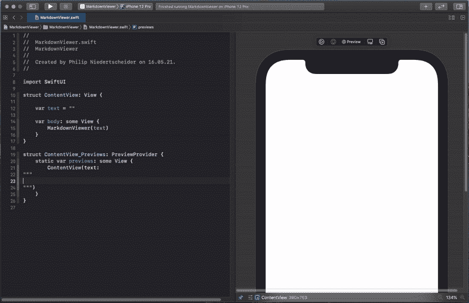
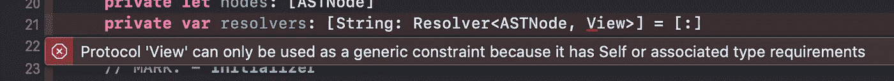
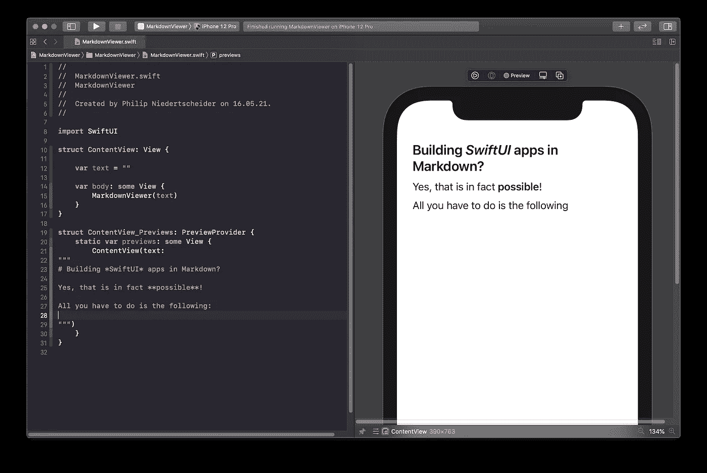

# 在 Markdown 中构建 SwiftUI 应用程序

> 原文：<https://itnext.io/building-swiftui-apps-in-markdown-1602fcadfd0b?source=collection_archive---------9----------------------->

当你的 iOS 应用程序使用 Markdown 文档时，为什么我们不能将它们转换为 natives view？如果我们不编写 Swift UI 代码，而是构建一个自定义查看器应用程序，甚至可以从 Xcode Live Preview Canvas 运行，会怎么样？

看看你能用它做什么:

展示 SwiftUI 实况降价的演示，调侃这篇文章

在这个故事中，我们将涉及以下主题:

1.  将 Markdown 解析为 AST
2.  解析器/策略模式
3.  从解析的节点构建 UI
4.  结论

如果你想看到完整的库，请查看 GitHub 库[冷却](https://github.com/techprimate/CoolDown)，我们自己的 Markdown 解析器@ techprimate.com，它也包括一个正在进行中的库 *CDSwiftUIMapper。*

# 将降价解析到 AST 节点树中

强烈建议您阅读我以前的文章“*在 Swift 中从头创建您自己的 Markdown 解析器*”，因为我们将重用其中的概念。

 [## 在 Swift 中从头开始创建您自己的 Markdown 解析器

### 许多平台每天都在使用 Markdown。在本教程中，您将学习如何实现自己的自定义…

link.medium.com](https://link.medium.com/p4VuywNzagb) 

无论如何，以下是对已解释概念的简短回顾:

1.  Markdown 文档由块(由空行分隔)组成，块又由片段(由换行符分隔)组成，片段由行内元素(如文本或粗体字)组成。
2.  解析后，文档可以表示为抽象语法树(AST)。树元素从现在开始被认为是*节点*。
3.  将文档从 Markdown 转换到 SwiftUI 时，会经历四个阶段:样式化 Markdown(仅用于可视化帮助)→原始 Markdown→AST/节点树→ SwiftUI 视图

通常一个例子更容易理解，所以请看看下面这个:

造型由 GitHub Gists 完成。实际的原始文档如下所示:

现在，当使用 markdown 解析器解析文档时(在我的例子中是冷却)，AST 表示如下:

完美！我们四个步骤中的三个非常容易理解，现在让我们进入最后一步:将 ast 节点转换成 SwiftUI 视图。

# 解析器/策略模式

当解析我们的树时，我们必须考虑一个映射函数:

> 每一种节点都有自己的视图表示。
> `mapping: node → view`

例如，前面代码片段中的列表节点可能映射到以下 SwiftUI 视图代码:

如您所见，每个节点都映射到一个视图结构:

*   `.list`变成了`VStack`的观点
*   `.bullet`变成了`HStack`视图，第一个元素是`Text("-")`
*   `.text`变成了`Text`视图

有必要为每个节点类型添加一个映射函数，并以有效的方式管理它。最简单的方法是创建一个映射器类，它将一个节点的*数组作为输入*，管理一组映射函数和*输出一个 SwiftUI 视图*结构。

对于所有你(有抱负的)计算机科学家来说，应用软件模式也被称为[策略模式](https://en.wikipedia.org/wiki/Strategy_pattern)，因为函数总是有相同的签名，但在实现上有所不同。

 [## 策略模式-维基百科

### 在计算机编程中，策略模式(也称为策略模式)是一种行为软件设计…

en.wikipedia.org](https://en.wikipedia.org/wiki/Strategy_pattern#/media/File:Strategy_Pattern_in_UML.png) 

在本文中，我将称它们为`Resolver`，它们的定义如下:

你可能想知道，这是怎么回事，所以这里有一个快速概述:

*   映射函数将一个泛型`Node`作为输入。因为我们需要节点继承`ASTNode`的子类，可以作为通用约束添加。
*   我们不知道它将返回什么样的视图，因此输出是一个通用类型`Result`。
*   使用`typealias`我们可以知道在我们的库中使用关键字`Resolver`

不同的解析器在一个映射器类中管理:

解析器字典是不同节点类型标识符到其对应映射函数的一对一映射。

对于这个初始实现，我们决定简单地使用一个`String(describing: nodeType)`作为标识符，它将 Swift 类型转换成一个字符串，例如`String(describing: SwiftUI.Text.self)`变成了`"Text"`。
一个更干净的方法是给`ASTNode`添加一个静态`identifier`，它需要在每个子类中被覆盖。(“嘿 Siri，提醒我静态标识符”)。

在实现这个类的过程中，我们还遇到了第一个限制:

我应该为解析器返回值使用哪种`Result`类型？一个解析器可能返回`SwiftUI.Text`，而其他解析器甚至可能返回自定义视图。也不可能使用超类型`View`，因为它是一个协议，编译器会开始抱怨:

不幸的是，除了打字擦除，我找不到更好的解决方案。因此，它使用了`AnyView`，它将任何 SwiftUI 视图包装到一个非类型化的视图结构中。

`addResolver`函数的一个很大的特性是库外的强泛型类型，比如这个例子映射器:

# 从解析的节点构建 UI

至此，我们已经成功地将我们的文档解析为一个节点结构，并准备好了一个映射实用程序来填充解析器。

我们的第一个解析器是用于包含节点列表的`list`的解析器。获得期望的`VStack`结构的简单解析器如下:

这是所谓的`ContainerNode`的一个很好的例子，一个包含更多嵌套节点的节点。我们迭代每个嵌套节点`mapper.resolve(node: node)`，它负责查找必要的解析器。在上面提到的`CDSwiftUIMapper`类中，你可能已经注意到了`fatalError("not implemented")`。这是实施它们的大好时机:

函数`resolve`在创建过程中获取映射器中设置的节点，并将每个节点解析成一个`AnyView`，然后将它们组合成一个`ForEach`。
如果它错过了一个节点解析器，它会返回一个警告文本，因为应该避免崩溃，而且在 Xcode 预览中调试起来非常困难。

作为最后一步(为了在开始时得到原始的 GIF ),我们添加了一个新的视图`MarkdownViewer`,它将输入参数`text`转换成节点，并在映射后将它们包装在一个`ScrollView`中:

把所有的东西结合在一起，你就在 SwiftUI 中创建了一个 markdown viewer！🚀

markdown 实时编辑演示的预览

# 结论

这不是很酷吗？使用 Markdown 可以构建 SwiftUI 应用程序🤯这种方法有多实用，你可以自己决定。

以下是对未来的一些想法:

*   框架冷却和它的 SwiftUI 映射库仍然很不完整，因此还有一些工作要做。
*   擦除所有输入似乎仍然是一个坏主意，尤其是当 SwiftUI 使用区分机制来仅重新呈现 UI 的相关部分时。我们将进一步研究，以找到更好的解决方案。
*   我的目标是为每个可用的节点类型添加一个默认的解析器，这样这个库最终就可以即插即用，在 UI 中预览 Markdown。
*   当使用交互式元素时，例如网络链接(例如`[follow @philprimes](https://twitter.com/philprimes)`)，我们将尝试将其映射到例如`Button`中，然后点击它打开相关的 Safari 视图，加载 URL。
*   目前，`MarkdownViewer`在每次视图更新时解析文档，这对性能来说是非常糟糕的**。一种解决方案是在缓存中缓存解析后的节点(甚至可能在`@Environment`中)。**
*   **我仍在尝试不同的解决方案。一个主要的方法是将多个`TextNode`节点合并成一个节点，这样它们就像单行文本一样工作。留下一颗星和/或观看 [GitHub 知识库](https://github.com/techprimate/CoolDown)以了解最新的⭐️**

**如果你想了解更多，请查看我的其他文章，在 [Twitter](https://twitter.com/philprimes) 上关注我，并随时给我发短信。你有具体的话题想让我介绍吗？让我知道！😃**