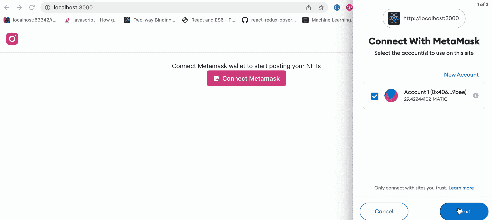
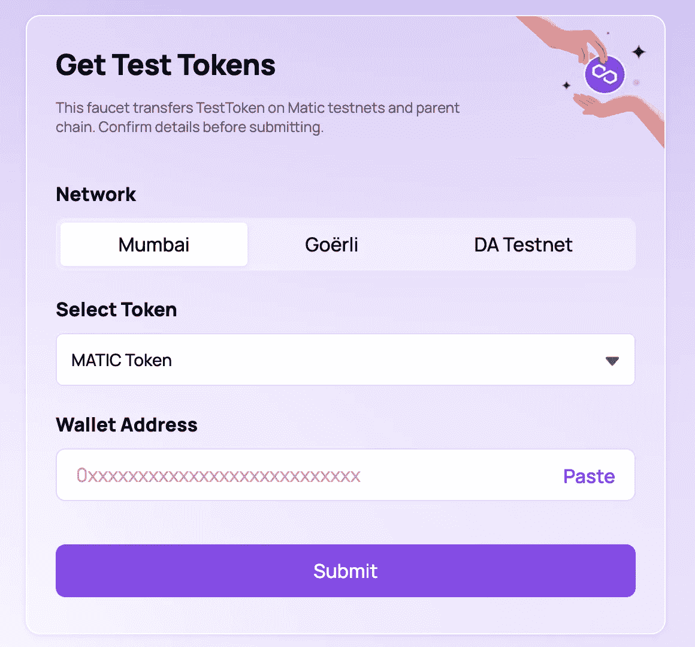
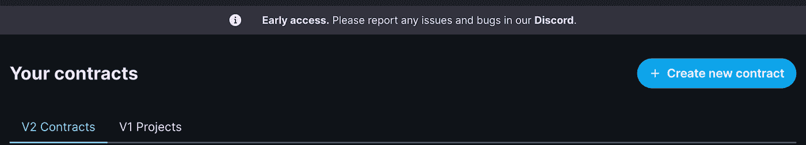
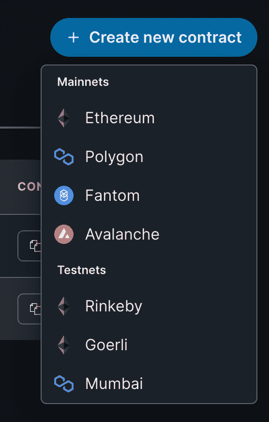
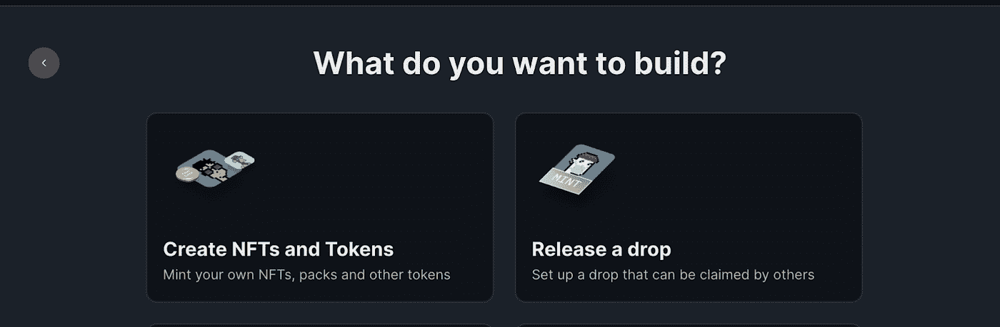
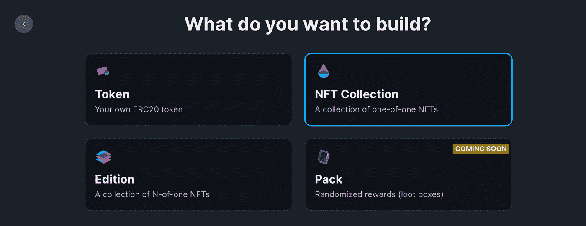
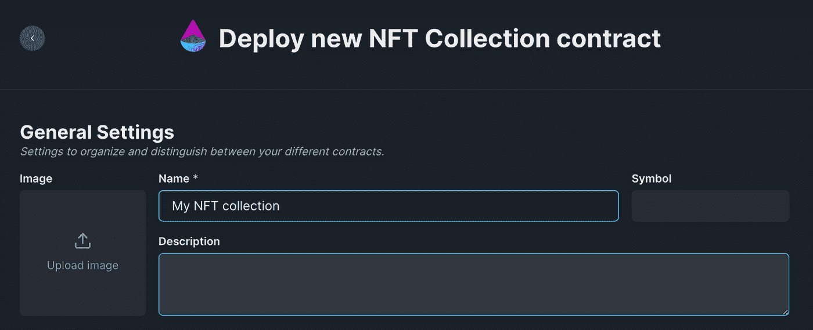
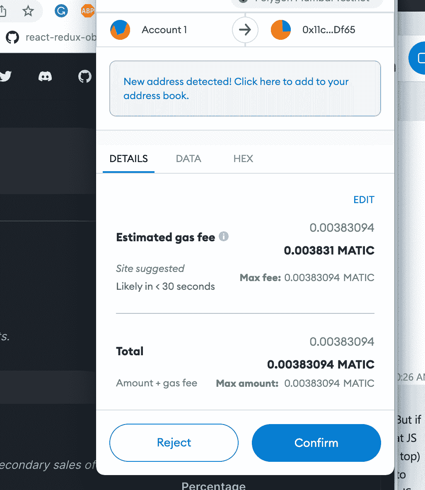
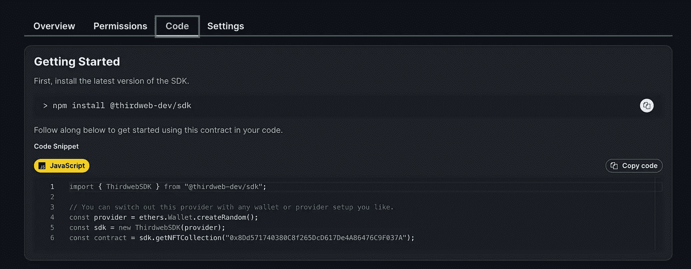

# 🥺用 React 和 Thirdweb 构建 NFT Instagram 应用

> 原文：<https://itnext.io/building-the-nft-instagram-app-with-react-and-thirdweb-d6266c925b32?source=collection_archive---------2----------------------->

为网络的未来做好准备，或者从 NFT 的炒作中分得一杯羹😜


# 介绍

承诺将世界引向元宇宙的大型社交网络已经开始在 Instagram 上支持 NFTs。但是我们不用等待 NFT 的整合，我们可以用 21 点和 hoo……当然还有 NFT 建立我们自己的 Instagram。听起来有些困难:我们需要加密钱包集成，将图像文件上传到分散的网络，用我们的 NFT 和元数据构建并部署智能合同到一些区块链中。有很多事情，但在本教程中，我们将一起经历它们，以建立一个功能齐全的 NFT Instagram 副本。

[](https://easy-web.medium.com/membership) [## 通过我的推荐链接加入 Medium 维塔利·舍甫琴科

### 作为一个媒体会员，你的会员费的一部分会给你阅读的作家，你可以完全接触到每一个故事…

easy-web.medium.com](https://easy-web.medium.com/membership) 

# 概念证明

为了避免构建所有必要的 web3 基础设施，我们将使用 [**Thirdweb SDK**](https://thirdweb.com/) ，它为快速构建和部署智能合约提供了 API。我们将使用 [**React**](https://reactjs.org/) 作为框架，使用 [**Chakra UI**](https://chakra-ui.com/) 构建布局和 UI 组件。NFT Instagram 将具有以下功能:

*   连接元掩码加密钱包；
*   将 NFT 图像上传到 [**IPFS**](https://ipfs.io/)
*   造币厂测试多边形孟买区块链
*   从区块链网络获取 NFT 数据
*   显示 NFT 图像馈送

最终的产品会是这样的



您可以在 Github 中找到的最终实现

[](https://github.com/Vitashev/react-nft-insta) [## GitHub-vitas HEV/react-NFT-insta

### 这个项目是用 Create React App 引导的。在项目目录中，您可以运行:在…中运行应用程序

github.com](https://github.com/Vitashev/react-nft-insta) 

# 部署 NFT 收款合同

如果您还没有设置 [**元掩码**](https://metamask.io/) ，现在就设置，然后再回到文章。我们提到过要用 [**Thirdweb SDK**](https://thirdweb.com/) ，所以先去那里连接**测试多边形孟买。**

前往 [**多边形龙头**](https://faucet.polygon.technology/) 获取一些免费测试 MATIC:



连接到网络后，转到您的控制面板，开始部署您的第一份合同。



选择孟买:



在下一步中，选择我们将实施一个将创建 NFT 的合同:



NFT 系列的类型:



给你的合同起个好听的名字:



最后，支付一些汽油费来部署:



在“代码”选项卡中，找到您的合同 id 并将其保存在某个地方，我们将需要在稍后的代码中使用它:



# 构建 Web3 NFT Instagram

准备工作已经完成，我们有一切可以开始，让我们继续建立我们的 NFT Instagram 应用程序；

```
yarn create react-app react-nft-insta --template typescript
```

接下来是安装所有必要的依赖项

第三个 web 依赖项:

```
yarn add @thirdweb-dev/react @thirdweb-dev/sdk ethers
```

然后是查克拉 UI 依赖和`react-icons`

```
yarn add @chakra-ui/react @emotion/react@^11 @emotion/styled@^11 framer-motion@^6 react-icons
```

用我们的合同 id 创建一个配置文件(我们从上一步复制的那个)`react-nft-insta/src/config/contracts.tsx`

然后让我们创建`react-nft-insta/src/components`文件夹并构建一堆组件

`react-nft-insta/src/components/ConnectMetamaskButton.tsx`

`react-nft-insta/src/components/UploadNFTButton.tsx`

`react-nft-insta/src/components/NFTSlideshow.tsx`

`react-nft-insta/src/components/Home.tsx`

`react-nft-insta/src/components/MainLayout.tsx`

最后，更新我们的`App.tsx`

`react-nft-insta/src/App.tsx`

> 💡注意:如果您在 NFT 上传期间遇到错误“**找不到缓冲区**”，您需要额外添加缓冲区`yarn add buffer`，然后在全局范围内添加缓冲区`window.Buffer = Buffer`将继续跟踪，直到此依赖性问题得到解决

这就是全部享受你的应用:

[](https://github.com/Vitashev/react-nft-insta) [## GitHub-vitas HEV/react-NFT-insta

### 这个项目是用 Create React App 引导的。在项目目录中，您可以运行:在…中运行应用程序

github.com](https://github.com/Vitashev/react-nft-insta) 

# **结论**

你真的可以用 Thirdweb SDK 变魔术，变创意。在这里 **找到大量的指南 [**。** Web3 开发从未如此轻松。有了这样一个强大的工具，你可以轻松地创建自己的 NFT 市场，拍卖，等等。我希望你喜欢这个教程，并且学到了一些新的东西。如果你想看到更多 web 3 想法的实现，我们收集 1000 个吧👏别忘了关注并订阅:](https://portal.thirdweb.com/guides)**

[](https://easy-web.medium.com/subscribe) [## 每当维塔利·舍甫琴科发表文章时，就收到一封电子邮件。

### 每当维塔利·舍甫琴科发表文章时，就收到一封电子邮件。通过注册，您将创建一个中型帐户，如果您还没有…

easy-web.medium.com](https://easy-web.medium.com/subscribe) [](https://easy-web.medium.com/membership) [## 通过我的推荐链接加入 Medium 维塔利·舍甫琴科

### 作为一个媒体会员，你的会员费的一部分会给你阅读的作家，你可以完全接触到每一个故事…

easy-web.medium.com](https://easy-web.medium.com/membership) 

# 了解更多信息

[](/top-3-web-3-0-architecture-layers-explained-frontend-backend-and-data-e10200f7fc76) [## 解释了 Web3 架构的顶层:前端、后端和数据

### Web 3.0 架构可能会令人困惑，但我们会让理解变得清晰

itnext.io](/top-3-web-3-0-architecture-layers-explained-frontend-backend-and-data-e10200f7fc76) [](/web-3-0-frontend-stack-of-2022-building-authentication-with-metamask-reactjs-nextjs-and-5af2bf8c9de4) [## 🔥2022 年的 Web 3.0 前端栈:用 MetaMask 构建认证，React，Next.js，

### 在本教程的几分钟后，你将与区块链世界建立联系🌐

itnext.io](/web-3-0-frontend-stack-of-2022-building-authentication-with-metamask-reactjs-nextjs-and-5af2bf8c9de4) [](https://levelup.gitconnected.com/building-%EF%B8%8F-react-micro-frontends-monorepo-with-nx-10bf564f03fe) [## 用 NX 构建⚛️反应微前端 Monorepo

### 在本教程中，你将建立反应微前端没有拥挤

levelup.gitconnected.com](https://levelup.gitconnected.com/building-%EF%B8%8F-react-micro-frontends-monorepo-with-nx-10bf564f03fe)