# 用 Nuxt.js 和 Netlify 构建终极投资组合网站:漂亮，速度极快，100% SEO 优化

> 原文：<https://itnext.io/building-the-ultimate-portfolio-site-with-nuxt-js-and-netlify-beautiful-blazing-fast-100-seod-102913a60cfd?source=collection_archive---------1----------------------->

# 我们正在建造的东西

在本教程中，我将通过创建一个自定义组合网站来展示您的艺术和工程努力:

*   速度极快(第一次喷漆仅需 0.3 秒)
*   是静态的，所以它是简单的，没有什么可以打破
*   是完美的 SEO 优化，解决了在 Vue.js 中发布网站的核心问题之一
*   既漂亮又有反应
*   由于 Netlify 的服务，可以免费托管
*   可 100%缓存，以进一步提升性能
*   非常易于维护(就像在中一样，只需推送至 origin master 即可立即部署您的更改)
*   很容易为撰写文章，因为它提供了与 frontmatter markdown 的定制集成，允许您在 markdown 中快速撰写文章(如果您愿意，甚至可以从 GitHub 文件编辑器中撰写！)

当我们完成后，你就可以在你的网站上运行 Chrome 的 Lighthouse auditor 来查看类似的结果:

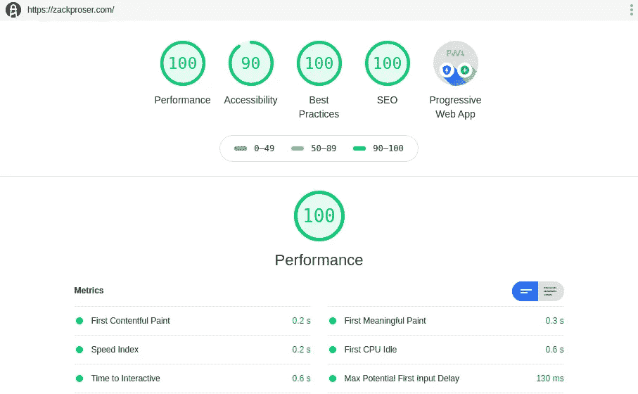

本指南假设了很多你想要的网站风格，但这是我的设计，它展示了我的软件、博客帖子和评价，目前看起来是这样的:

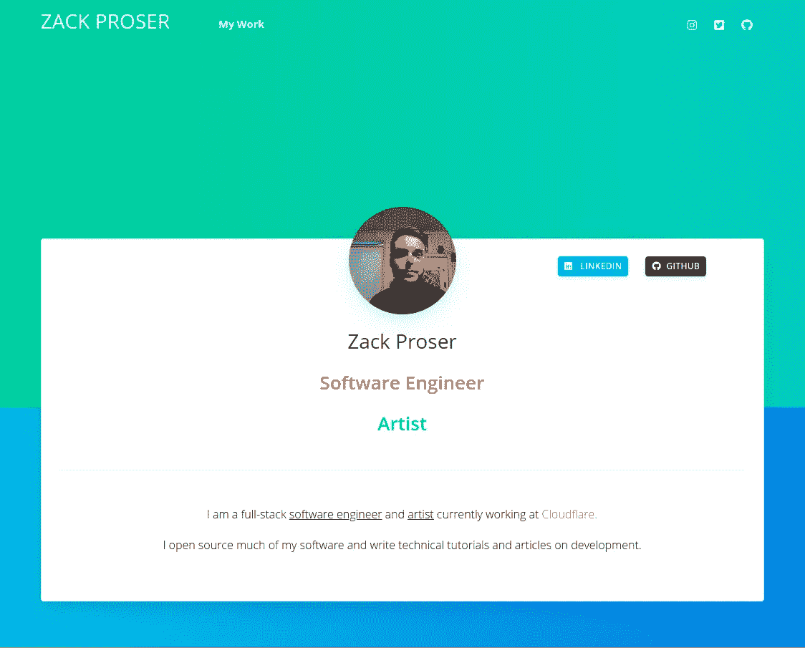

这篇文章深入解释了如何建立这个或类似的投资组合网站，以及为什么我选择了我所做的基础设施和工具来获得一个好看的、性能卓越的、SEO 优化的和免费托管的网站。

# 为什么要这么做？

在过去的几年里，我每年都会重写 0 到 7 次我的投资组合网站 zackproser.com。[如果你好奇的话，这里有源代码库](https://github.com/zackproser/argon-portfolio)。我这样做有几个原因:其中最主要的是，这是一个很好的借口，让我的前端技能保持最新，尽管最近大部分时间都在后端工作。

在几年的过程中不断重复一个概念也很有趣，因为你对问题空间非常熟悉，以至于你不断找到更好的方法来处理常见的问题，例如管理你的源内容，使编辑变得便宜和快速。

最终，不断重写你的作品集也能确保你展示的作品是最新的，是你的技能和能力的最好体现。当被要求提供更多关于你做什么的信息时，不管是潜在的就业和面试，还是仅仅作为介绍，能够提供一个简单的 URL 真的很好。这也是与潜在客户或雇主谈话的一个很好的起点，它表明你认真对待你的工作，并且你在不断改进。

也就是说，这种选择的设置还有几个关键的好处，所以在运行了从高度定制的 WordPress 安装到 Dockerized node.js 应用程序到 vanilla vue.js 应用程序的一切之后，我相信我已经找到了功能和实用主义的正确组合。

# 此设置的优势

*   **静网站不破。**这有点夸张，但是在运行时没有 PHP 错误。没有 node.js 进程可能会死亡并需要复苏。简单是核心特征。一旦你弄清楚了你的部署管道，你只是简单地发送更新的静态资产和破坏缓存
*   **静态网站速度快。**出于类似的原因——客户端只需要获取框架 html 文件和捆绑的 app.js 和 css 文件，就可以让基于 vue.js 的应用程序工作。
*   **Nuxt.js 走完修复 Vue SEO 的最后一英里。Vue.js 是构建网站的一个很好的框架，但是一个令人失望的地方是搜索引擎爬虫很难解析 Vue 项目，因为几乎没有或者根本没有本地标记——只有脚本标签异步加载你的应用程序并在浏览器中呈现它。Nuxt.js 允许您 **a.** 静态生成和 **b.** 服务器端呈现您的应用程序——这意味着您推送到客户端的最终分发文件具有所有相关的标记和结构，以便于解析。**
*   **Netlify 让托管变得简单又免费。**通过使用 Netlify，我们获得了极其有用的 GitHub 集成。当你 **git push origin master** 时，你的更改会被 Netlify 获取，它会构建你的最新站点并自动推出这些更改。
*   **主动缓存完善了性能故事。**由于我们的终端工件只是少数静态资产，我们可以发出信号，它们应该由我们的 CDN 服务积极缓存(我们将使用它来确保世界各地的访问者尽快获得我们的内容，并从世界上尽可能靠近他们的位置提供服务)。幸运的是，Netlify 在其服务中内置了自己的 CDN 层，所以我们现在可以使用他们的 CDN 层。
*   **Git 推送部署正在改变生活。**特别是像静态投资组合网站这样简单的东西。当你有空的时候，你注意到一个打字错误，或者一个小的填充问题，几分钟后你就可以修复这个问题并部署你的修改了。同样地，在添加新内容时，正如本教程将演示的，一旦你配置了 markdown post 系统，你就可以写新文章，并让它们很快以干净统一的方式出现在你的网站上。

# 设置 Nuxt.js

js 是我们在这个项目中使用的框架。它在引擎盖下使用了 Vue.js 和 Vue 路由器，同时提供了 app 脚手架等一些有用的便利。我们将会谈到一些怪癖和潜在的问题，但是总的来说，Nuxt 在使 Vue 开发更快更简化方面做得非常出色。

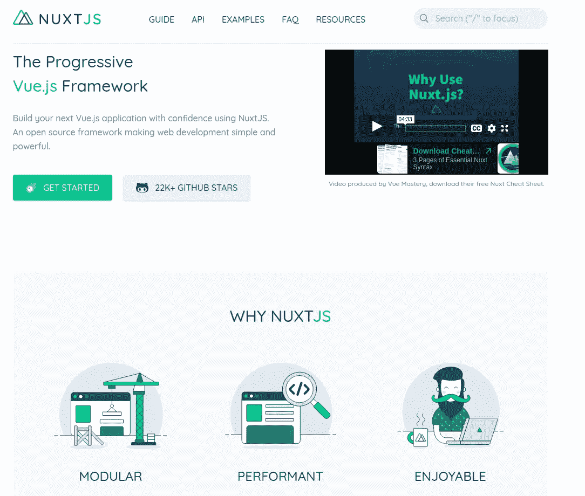

从[这里的官方 Nuxt.js 安装指南](https://nuxtjs.org/guide/installation/)开始。有一些观点上的问题，比如当你开发的时候，你是否想要 eslint 和 prettier 自动运行来对抗你所有的局部变化。由于这种行为的可取性在不同的开发人员中有很大的不同，所以我让您自己决定。如果你不熟悉这些工具，要知道当你试图让你的项目起步时，它们可能会给你带来很多麻烦，所以我的建议是，如果你不熟悉它们，并且可能是该项目的唯一开发人员，就禁用它们。

也就是说，有一个构建选项对这个项目至关重要。你想在**通用**模式下运行 nuxt.js。在 SPA 模式下，最终输出是一个链接到最终应用程序 js 和 css 包的 html 文件。如上所述，这种模式对于某些应用程序和用例来说是理想的，但 SEO 较差(因为客户端或 web crawler bot 首先接收到一个非常空的 html 文件，并且必须等待整个应用程序以 Javascript 异步呈现)，这使得它对于我们希望在相关查询中排名良好的投资组合来说不是理想的选择。

Nuxt.js 安装需要一些时间，因为它会解析并删除该过程中的所有 npm 依赖项。当您的安装完成后，您可以通过从您的工作目录中运行 **npm run dev** 来进行冒烟测试，让您的应用程序默认运行在端口 3000 的 localhost 上。在您的浏览器中访问它，以确认一切工作正常。

# 设置 Github 和 Netlify

[在 GitHub 上创建一个 repo](https://help.github.com/en/github/getting-started-with-github/create-a-repo)来存储你的站点，按照说明推送你现有的本地 repo，设置上游跟踪。

如果你还没有注册 Netlify，请注册。[按照本指南](https://www.netlify.com/blog/2016/09/29/a-step-by-step-guide-deploying-on-netlify/)配置您的新回购。一旦完成，Netlify 将在您 git push 到 GitHub 源的主分支时接收事件，并使用该信号触发包含您最新更改的构建。Netlify 免费向开发者**、**提供这项服务，使用起来很流畅。我强烈推荐它用于静态网站。

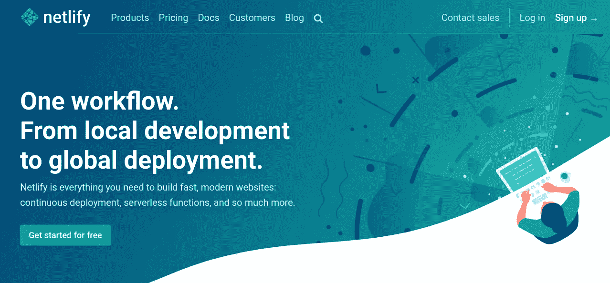

配置您的网络构建设置。当运行一个 nuxt.js 项目时，为生成项目的静态准备好宿主版本而配置的 package.json 脚本是 **npm run generate** ，输出目录是 **dist** 。因此，您在 Netlify 中的构建设置应该如下所示(更新后指向您的实际 GitHub repo):

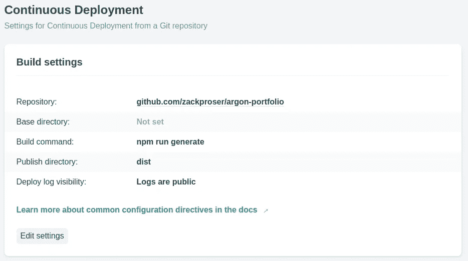

现在，您已经在 GitHub 和 Netlify 之间建立了管道。如果你在本地克隆了你的库，添加了一个文件或者做了一个小的修改，然后提交你的修改，然后 **git push origin master** 你应该可以在你的 Netlify 仪表盘中看到你的修改被选中并触发了一个构建。

# Nuxt.js 简介

如果你之前用过 Vue.js，Nuxt 会感觉很熟悉。需要注意一些概念上的转变:

**配置**发生在中央 [nuxt.config.js](https://github.com/zackproser/argon-portfolio/blob/master/nuxt.config.js) 中。这意味着从加载插件或特殊扩展到显式配置定制路由(而不是通过 Nuxt 框架隐式配置)的一切都在这里完成。随着我们项目的扩展，我们将不止一次地回到这个文件。

**路由**是隐式的，基于你的“页面”的目录结构。如果你习惯于 Vue 路由器并明确定义自己的路由，这将是你在使用 Nuxt 时最大的视角转变。

查看[关于路由的官方文件](https://nuxtjs.org/guide/routing/)以了解这一点。在 Nuxt.js 中，页面是一等公民，它们在项目中的排列决定了网站在导航和 URL 结构方面的功能。

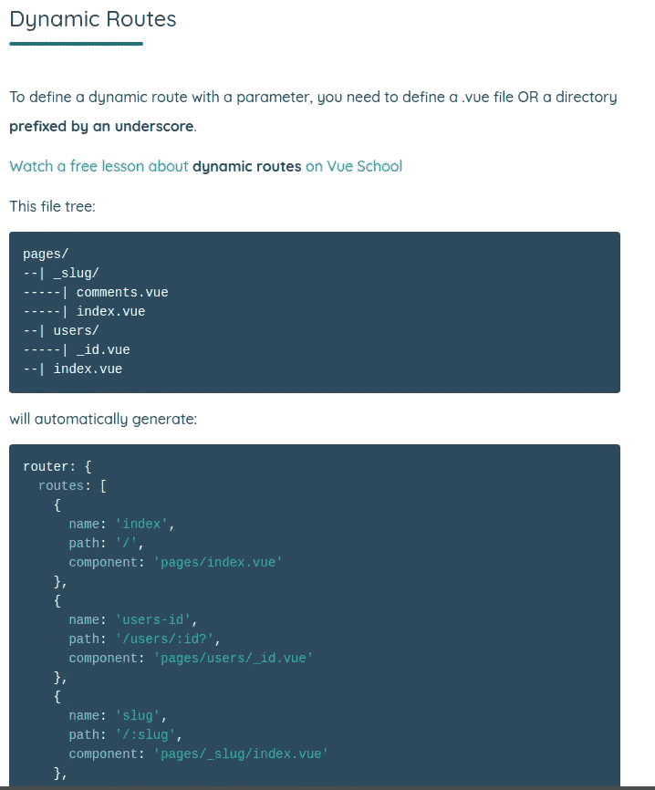

这值得考虑，因为我们的主要目标之一是优秀的搜索引擎优化。对于我的网站来说，我希望链接到索引页面，如 https://zackproser.com/software，也希望链接到个人帖子页面，如 https://zackproser.com/software/article-optimizer。我将在关于创建一个 posts 系统的小节中更详细地讨论这个问题。你也可以[查看我的站点](https://github.com/zackproser/argon-portfolio)的源代码，看看完成后它们是如何组合在一起的。

**官方文档**仍然[非常有助于你初步了解 nuxt](https://nuxtjs.org/guide#how-it-works) ，GitHub 周围也有一个用户社区，他们可能已经发布了同样的问题，如果你试图沿着快乐的道路前进，并发现一些令人困惑的事情。谷歌是你的朋友。

# 选择 CSS 框架和主题化

至少，强烈建议您选择 bootstrap 或类似的响应 css 框架，以便更容易地管理您的网站，跨越我们的访问者用来消费网络的许多形式因素。

[Vue-bootstrap](https://bootstrap-vue.js.org/) 是一个很好的选择，也是你搭建一个新的 Nuxt.js 应用时可以选择的选项之一。它将您期望从 Bootstrap 获得的类(容器、行、列等)包装到 Vue-native 指令中，如< b-col >。这使得在 Vue 中使用 bootstrap 变得非常简单。

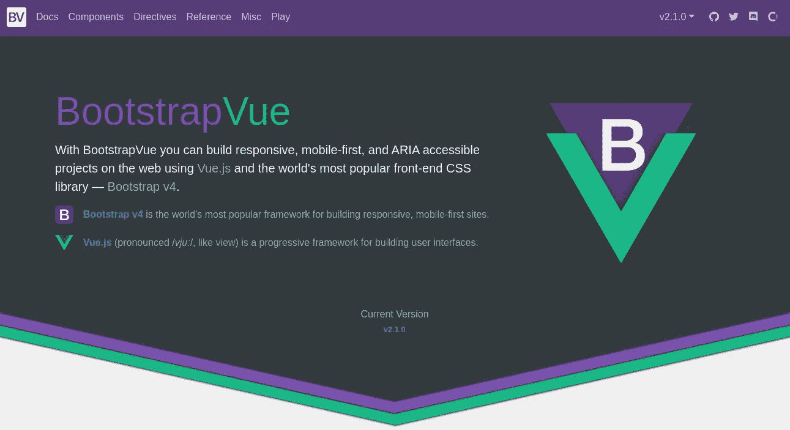

对于我最近的迭代，我选择了[创意蒂姆的氩设计系统](https://www.creative-tim.com/product/argon-design-system)，因为我喜欢它的外观，它仍然非常干净和简单，所以允许我使用最少的摔跤美丽的组件。

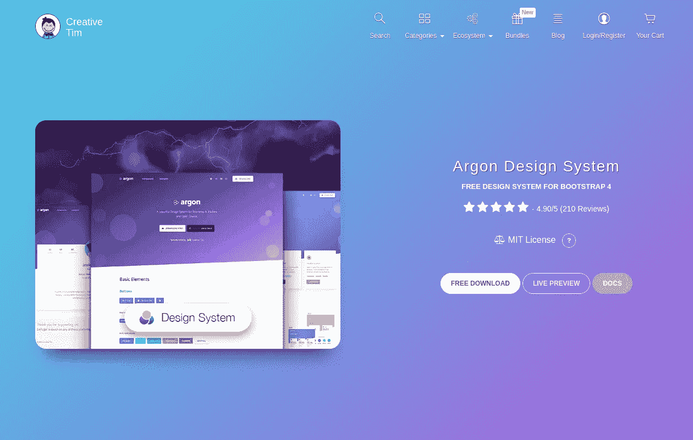

请记住，你的大多数访问者，潜在的雇主和客户，将首先在手机上访问你的网站，所以它应该在手机或平板电脑上看起来很好，也可以正常工作。

# 创建由降价文件驱动的 post 系统

我希望我的作品集不仅能展示我的作品，还能展示任何有趣的开发模式和发现，我可能会去消化和撰写这些东西。为此，我希望能够以一种易于编写的格式(markdown)快速发布一篇帖子，并让我的网站足够智能，能够知道在哪里以及如何显示它，而不需要除了源 markdown 文件之外的任何东西。

这在最初启动和运行时可能很难，因为它需要理解 nuxt.config.js 格式以及一些 Webpack 定制加载器。再说一次，如果有帮助的话，你可以随意作弊，通读我的链接站点的源代码。

现在，让我们为我们的产品组合构建/软件路线。这个页面将是一个类似于索引的展示，展示了我们的访问者可以阅读更多的单个软件帖子。

首先，我们需要在项目的根目录下有一个目录来存放我们的降价帖子。姑且称之为**帖吧。**

```
mkdir posts
```

接下来，我们将创建新的 Nuxt.js 页面文件。我希望这个页面位于[https://zackproser.com/software,](https://zackproser.com/software,)，所以按照 Nuxt 的页面约定，我将这个文件放在<working-dir>/pages/software/index . vue

```
mkdir -p pages/software/ && touch pages/software/index.vue
```

来源如下:

我们稍后将进入子组件，但首先要理解的是，我们使用一个名为 asyncData 的 Nuxt.js only 方法来填充来自 markdown 文件的信息。**注意，asyncData 是一个页面专用的方法，不能在普通的 Vue.js 组件中使用。**

在本例中，我们使用这个特殊的钩子来读取我们所有的 post markdown 文件。我们通过所需上下文的 Webpack 概念做到这一点，你可以[在这里](https://stackoverflow.com/questions/54059179/what-is-require-context)了解更多。

一旦 Webpack 加载了 markdown 文件，我们会做一些处理，将 markdown 文件的文件名转换为 **slug** ，它将在加载帖子时显示在 URL 中。因此，举例来说，如果我们的降价文件被命名为 catfacts-golang.md，我们的 URL 将是[https://zackproser.com/software/catfacts-golang](https://zackproser.com/software/catfacts-golang)

请注意，我们在 Javascript 中有一个最后的 filter 调用，以指定我们只需要 post.attributes.category 为“software”的 posts 返回。这个概念来自于一种叫做 [Frontmatter](https://jekyllrb.com/docs/front-matter/) 的特殊扩展减价格式。

# 前沿问题降价整合

Frontmatter 是一个 markdown 扩展，允许你为你的 markdown 文件定义任意的“属性”。这就是实际情况。请注意包含任意键值属性的最顶端部分:

```
---
title: A powerful and open source content optimizer
category: software
description: Learn how I leveraged natural language processing technology to build a full-stack app that suggests improvements to your writing
image: optimizer-blog.png
tags: PHP, NLP, API, Web App
---


## Intro

The Article Optimizer was my first full-scale web app. I built it several years ago to familiarize myself with form-processing in PHP, and within a few months it had grown into a full-scale public web app which now enjoys usage by hundreds of unique visitors per month.
```

当我们的 Frontmatter markdown 集成解析这个 markdown 文件时，除了通常的文章正文之外，我们还可以用 Javascript 访问这些属性，允许我们实现任何我们想要的逻辑来过滤或显示文章及其描述、标签等。

我们如何向 Webpack 发出信号，表明我们所有的*。md 文件应该用这种方式解析？通过向我们的 nuxt.config.json 添加一个自定义构建指令，如下所示:

这表示“如果文件名匹配正则表达式(有**)。md** 作为它的最后 3 个字符)，并且该文件位于这个项目的根工作目录中的 posts 或 blog 目录中，那么使用 frontmatter-markdown-loader，这是所需加载程序的 npm 包名称。

不要忘记

```
npm i frontmatter-markdown-loader --save
```

以确保您拥有所需的加载器。此时，我们已经配置了项目的 Webpack 实例，使其能够识别我们的帖子或博客目录中的 markdown 文件，并通过 frontmatter loader 运行它们，使它们的属性在 Javascript 中可用，这样像上面我们对 category === software 的 filter 调用这样的语句就可以工作了。

既然我们可以从受祝福的目录中加载我们的帖子，我们需要以不破坏我们的响应设计的方式干净地显示它们。

# 创建展览组件

我称之为展示，因为它在我看来是有意义的——因为它是可重复使用的:例如，你可以将一个展示用于软件索引页面，将一个展示用于你的博客页面。一个展览只是呈现一些卡片，让你可以浏览帖子，并链接到完整的帖子本身。

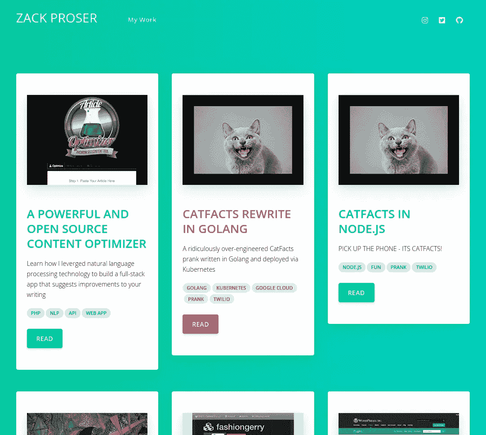

我们在上面看到了软件索引页面如何包含将<exhibit>元素插入页面的自定义指令。这是展览本身的样子:</exhibit>

首先，我们遍历已经加载的文章列表。这里有一个技巧，任何一个与响应式网格系统和循环中的渲染元素搏斗过的人都很熟悉:我们只希望给定行中最多有 3 张卡片，所以我们使用一些内联逻辑将我们的帖子列表分成每行 3 张卡片的行。这是我们组件中最复杂的部分。

这里增加的一个有趣的部分是调用

```
${this.getClassType()}
```

指定该部分的类名时，在插值的 ES6 模板字符串中。这是我做的，这样每次页面加载都会在我的 Argon 主题中定义的主要类型之间旋转背景颜色。我喜欢鲜艳的颜色和它们之间的循环以及少量的随机性，所以我编写了这个便利函数，并通过将它包含在 common.js 中并将其加载到我的 nuxt.config.js 中的任何地方来使它全球化。

这是函数本身:

下面是如何扩展你的 nuxt.config.js，以确保它在你的组件中是全局可用的(所以你可以自然地随机化所有东西的颜色):

```
/*** Plugins to load before mounting the App*/plugins: ['~/plugins/argon/argon-kit','~/plugins/common.js'],
```

我们渲染的其余部分是通过为每个给定的帖子渲染一个明信片组件来处理的。该组件看起来像这样:

明信片呈现文章的预览，包括图像、描述和一些标签。请注意，所有这些 post.attributes 都来自 Frontmatter markdown 加载程序，它解析我们的特殊 markdown 文件，如上所述。

现在，我们有了一个/software 索引页面，它呈现了在 posts 目录中找到的所有降价帖子。如果我们想要添加一个新的帖子，我们现在需要做的就是编写 markdown 文件，并将其放在该目录中，剩下的工作由我们的网站来处理。

我们的最后一步是，当用户从他们想要阅读的展示中单击一个帖子时，呈现单个帖子的视图。这就是 Nuxt.js 页面约定及其隐式路由规则发挥作用的地方。

除了我们的/software 索引页面，我们现在希望/software/ <slug-goes-here>能够工作，并允许您访问特定的帖子。这意味着我们需要一个 _slug.vue 文件存在于我们的页面/软件目录下，如下:[https://github . com/zackproser/argon-portfolio/tree/master/pages/software](https://github.com/zackproser/argon-portfolio/tree/master/pages/software)</slug-goes-here>

_slug.vue 文件代表我们的 URL 变量，因此它将负责查找和呈现给定帖子的内容。看起来是这样的:

我们在索引视图中使用相同的 asyncData 技巧，但是这次我们只获取由 slug 表示的单个帖子。一旦帖子本身被加载并返回，我们就可以像以前一样通过常用的 Vue 模板语法呈现它的属性和正文。

这可能看起来很费力，但我喜欢这个解决方案的原因是它具有极强的可扩展性。如果我在某个地方有 5 分钟的额外时间，并且我甚至不在我的开发机器旁边，我仍然可以访问 GitHub repo 接口，并将一个新的 markdown 文件提交到我各自的 post 目录，并让我的 Netlify 集成获取它，并将其实时部署到我的站点。

# 使用 Netlify 让您的动态 slugs 在生产中工作

当 Netlify 在生产中请求我们的动态页面时，还有最后一个障碍需要跨越。我们需要某种方式向 Netlify 发出信号，表明我们将构建几个静态页面，并且它们都是有效的路由。

我们需要为/software 和/blog 中的每个帖子(以及您可能自己扩展和构建的任何其他类别)提供一个路径。幸运的是，我的 nuxt.config.js 文件已经演示了实现这一点的方法。重要的部分来了:

这可能看起来有点奇怪，但是在构建期间读取这个函数的输出会对它的工作有一些初步的了解:

```
1:26:38 AM:  + 31 hidden assets11:26:38 AM: Entrypoint app = server.js server.js.map11:26:39 AM: ℹ Generating pages11:26:49 AM: ✔ Generated /blog11:26:49 AM: ✔ Generated /software11:26:49 AM: ✔ Generated /software/article-optimizer11:26:49 AM: ✔ Generated /software/catfacts-golang11:26:49 AM: ✔ Generated /software/catfacts11:26:49 AM: ✔ Generated /software/cf-terraforming11:26:49 AM: ✔ Generated /software/hashtag-blaster11:26:49 AM: ✔ Generated /software/html5-canyonrunner11:26:49 AM: ✔ Generated /software/pagegobbler-mac-app11:26:49 AM: ✔ Generated /software/goodneighbor11:26:49 AM: ✔ Generated /software/padscoper11:26:49 AM: ✔ Generated /software/pageripper11:26:49 AM: ✔ Generated /software/realtime-hunger-map11:26:49 AM: ✔ Generated /software/speakeasy11:26:49 AM: ✔ Generated /software/pagegobbler-site11:26:49 AM: ✔ Generated /software/username-extractor11:26:49 AM: ✔ Generated /software/vue-portfolio11:26:49 AM: ✔ Generated /testimonials11:26:49 AM: ✔ Generated /11:26:49 AM: ✔ Generated /software/we-node-sdk11:26:49 AM: ✔ Generated /software/we-php-sdk11:26:49 AM: ✔ Generated /software/we-python-sdk11:26:49 AM: ✔ Generated /blog/docker-tips-and-tricks11:26:49 AM: ✔ Generated /software/wisdomseeker11:26:49 AM: ✔ Generated /blog/dockerized-express-js11:26:49 AM: ✔ Generated /blog/modern-deployment11:26:49 AM: ✔ Generated /blog/open-source-canyonrunner11:26:49 AM: ✔ Generated /blog/open-sourced-article-optimizer
```

在我们对 array concat 的调用中，我们有两个函数做同样的事情，但是在两个不同的目录中。首先，使用 glob 包，并使用**帖子**作为目标目录，我们解析以 **.md.** 结尾的每个文件的完整路径。第二个函数在**博客**目录上做同样的事情，array concat 返回包含所有这些 URL 路径的单个数组。最后，我们使用这个返回的主数组作为 nuxt.config.js 参数 **dynamicRoutes** 的值。

通过这种方式，**我们以编程方式告诉 Netlify 它需要为我们的站点处理的动态路由**，因为我们的最终站点实际上只是 nginx 和 CDN 后面的一堆静态文件。

如果你不这样做，当你的站点在你的系统上本地运行时，它将会完美地工作。但是，一旦您发布到 Netlify，您将获得每个动态生成的路由的 404。

# 创建由 JSON 驱动的推荐部分

为了保持小编辑的主题，将新数据输入到一个完善的管道中，我们可以从一个 JSON 文件中分离出我们的客户评价部分，该文件包含呈现每个报价所需的所有内容。

对于我的定制渠道，我通过 LinkedIn 向一些同事寻求建议。这很有效，因为 LinkedIn 方便了提醒，并给人一个界面来写他们的推荐(这不是一个电子邮件线程)。它还允许你利用标准化的 LinkedIn 头像格式——这样你就可以获得推荐你的每个人的统一尺寸头像。

我的网站上有两个地方有推荐。第一个是在主页上的一个部分，有一个旋转木马，可以自动在屏幕上显示它们。


因为一口气读完有点长，所以每张卡片都有一个到评价页面的链接，我只是在一个回应栏中呈现每一个评价。

让我们来看看轮播版是如何工作的。父组件是一个引导转盘，推荐卡是在其中旋转的单个项目:

我们可以看到，在 carousel 包装器中， **v-for** 语句为我们在 JSON 文件中找到的每个证明创建了一个新的证明卡。让我们的 JSON 进入这个组件再容易不过了——正如您所看到的，我们需要做的就是导入它。

我们的 references . JSON 文件包含一个结构相同的对象数组，每个对象代表一个证明。例如:

```
[{*"name"*: "John Funge",*"title"*: "Chief Product Officer at DataTribe",*"quote"*: "Zack is very resourceful, entrepreneurial and scrappy. He’ll figure out a way of getting whatever it is done. As well as technical skills, Zack is rounded. He can write and he has broad interests - such as visual arts. Zack has a lot of initiative and will proactively take action when he sees something that needs to be done. I’d be remiss if I didn’t mention Zack’s work ethic. He never shied away from our demanding hours and would regularly spend the little after-work time he had deepening his technical skills. Lastly, Zack has a great sense of humor and is one of those folks that just makes work more fun. He’s someone you want on your team.",*"imgSrc"*: "/testimonials/john-funge.jpg"},
```

# 对你的网站运行谷歌灯塔审计

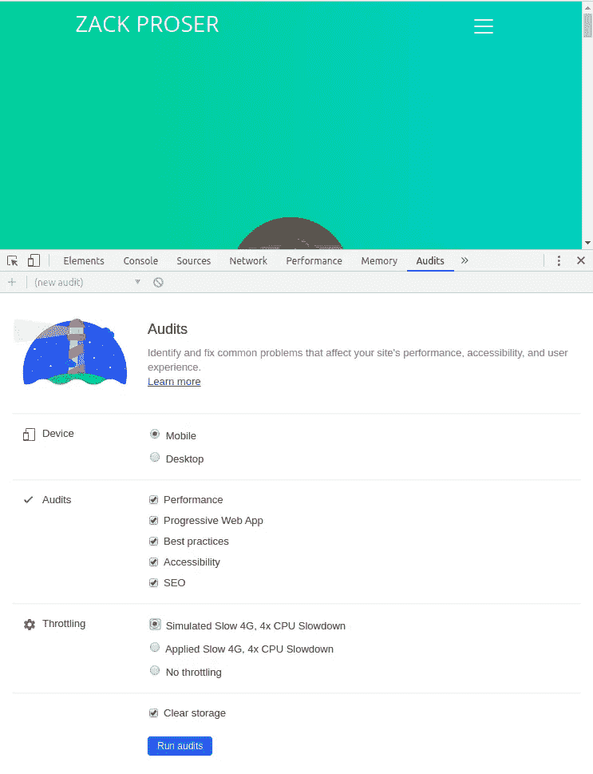

谷歌 Chrome 搭载了 [Lighthouse](https://developers.google.com/web/tools/lighthouse) ，这是一个网站审计工具，可以有效地让你在网站的所有方面感到羞愧，从加载行为到图像大小到可访问性细节和 SEO 禁忌

您可以通过打开开发工具面板并导航到**审计**面板来找到它。你可以让 lighthouse 模拟一个糟糕的连接(比如有人拿着智能手机试图从地铁里查看你的网站可能会遇到的情况)，或者根本不应用任何限制。

**你应该连续运行这两个**，这样你就能了解在理想情况下，你的用户在电话上和在高速连接台式机的办公室里可能会体验到什么。

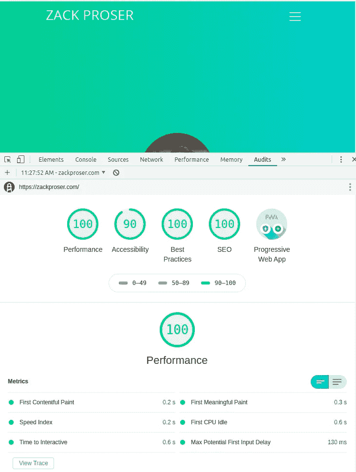

随着你的开发，定期在你的站点上运行它会让你在容易忘记的事情上保持诚实，比如添加描述性的图片 alt 标签等等。

**好消息**是在 Nuxt 上工作的好人们已经完成了大部分的大脑损伤，满足所有这些通常模糊的最佳实践，并将其烘焙到你的搭建的 Nuxt.js 应用中。

所以，除非你利用这个原始的起点，用它来进行可怕的 web 开发，否则你将会处于一个非常好的状态，仅仅是因为你把 Nuxt 和服务器端渲染应用站点作为一个静态站点。