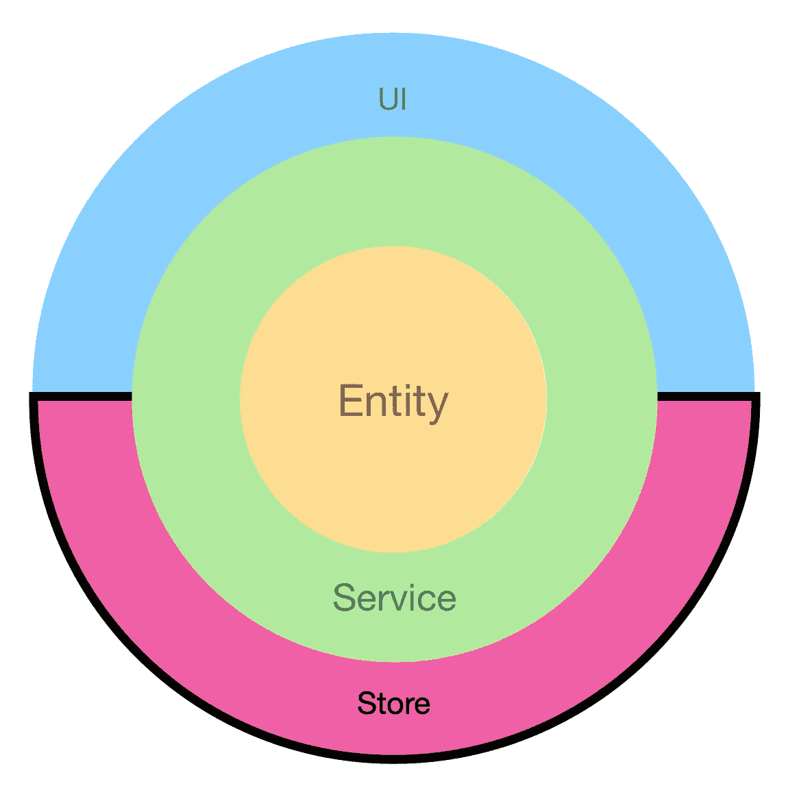
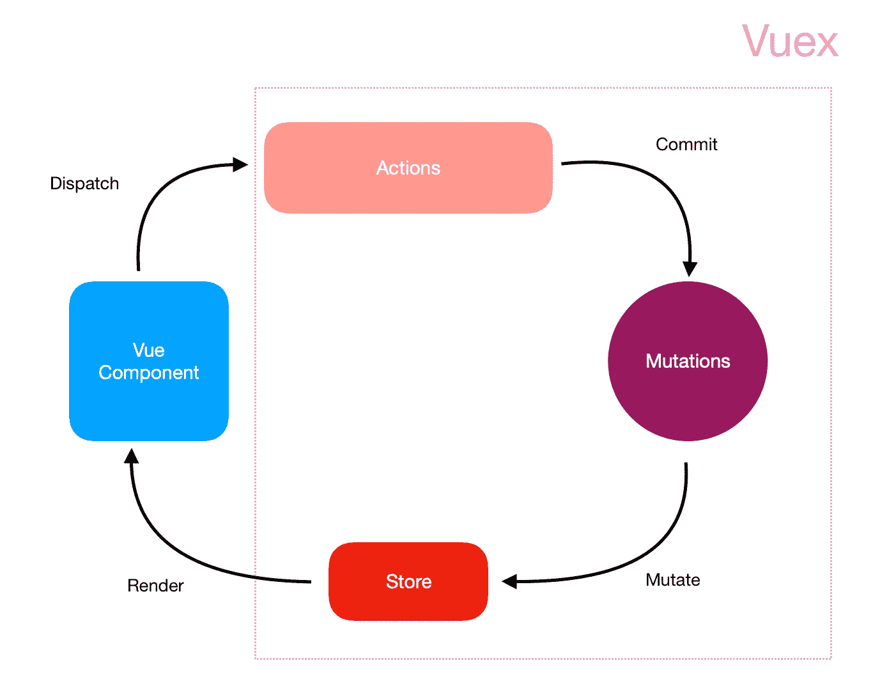
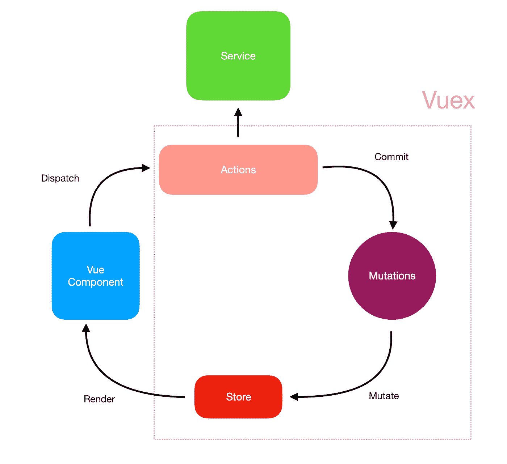
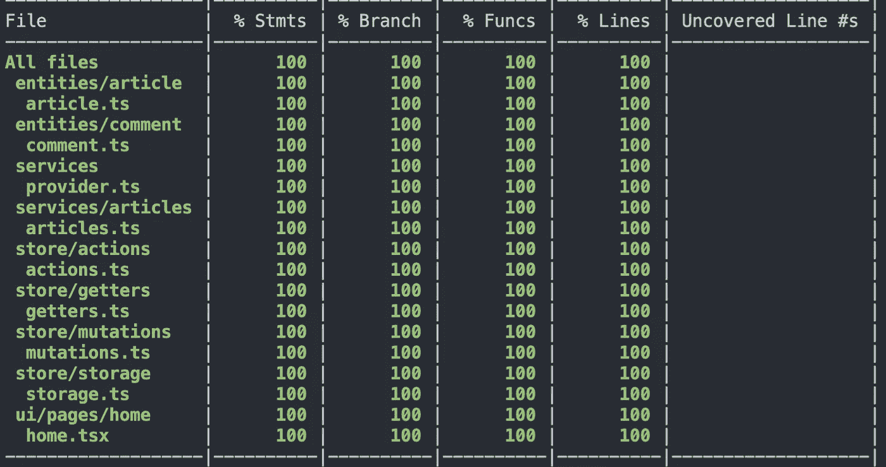

# 构建 Vue 企业应用程序:第 3 部分。商店

> 原文：<https://itnext.io/building-vue-enterprise-application-part-3-the-store-dbda0e4bb117?source=collection_archive---------0----------------------->

将清洁架构的原则应用于企业前端应用



# 目录

*   介绍
*   需求分析
*   设置
*   吸气剂
*   突变
*   行动
*   引入存储
*   连接点
*   结论

# 到…里面

是时候发布这个系列的第三篇帖子了。在第一篇文章《T1》中，我们谈到了实体和博客的基本商业规则。我们奉献了[第二教程](https://medium.com/@gregsolo/building-vue-enterprise-application-part-2-services-f7ec400190e7)来揭示这些规则是如何被执行和启动的。在这篇文章中，我将重点介绍应用程序的全球商店:Vuex。

有成千上万的帖子/视频/关于 Vuex 及其工作原理的讨论。我不会花时间介绍基础知识，而只是简单地提醒一下概念概念。Vuex 遵循通量模式，由 3 种主要药剂组成:

*   行动
*   突变
*   商店



Vuex

最后一个是在应用程序中存储数据，为每个 UI 组件提供对数据的访问。突变仅仅是功能，其责任是使商店发生突变。最后，动作是执行侧面影响的操作并基于此提交突变的功能。还有一个“getters”的概念:可选的助手函数，提供对商店中最常用部分的访问。

通常将业务逻辑放在动作/突变中。毕竟，他们有责任改变国家。但是正如我们[讨论的](https://medium.com/javascript-in-plain-english/react-vue-and-business-logic-19df105698a2)，业务逻辑不能与用户界面相结合。而 **Vuex 是 UI** 、**的一部分，不管它假装不是**有多难。Vuex 的唯一职责是:

> 应用程序中所有[UI]组件的集中存储，规则确保[UI]状态只能以可预测的方式发生变化
> 
> [https://vuex.vuejs.org](https://vuex.vuejs.org)

**之所以会发生**状态变化的原因以及这些变化的**规则背后的深层商业推理与 Vuex 无关。**

以前，我们定义了拥有业务规则知识并操作它们的实体和服务。但是，我们如何在 Vuex 商店和服务/实体之间搭建桥梁呢？

从 Vuex 的角度来看，服务是“副作用”。它们存在于 Vue-Vuex 生态系统之外，并有权影响国家。在 Vuex 中有一个专门的角色，负责处理副作用:行动



Vuex +服务

副作用的一个典型例子是 HTTP 请求。就 Vuex 而言，服务与发出 HTTP 请求、与套接字通信或处理任何其他类型的副作用没有什么不同。

然而，建筑上的差异是显著的。如果我们允许动作直接发出 HTTP 请求，它们就必须知道如何从 API 操作数据。更糟糕的是，在将数据发送到后端之前，他们必须知道如何验证和准备数据。这是 UI (Store)与业务逻辑的耦合。我们应该尽可能地避免它。为了防止这种耦合，动作将只调用服务，而不提供关于服务如何操作的任何信息。

# 需求分析


由[在](https://unsplash.com/@helloquence?utm_source=medium&utm_medium=referral) [Unsplash](https://unsplash.com?utm_source=medium&utm_medium=referral) 上拍摄的

自从我们上次讨论业务需求以来，它们并没有改变。让我们提醒自己它们是什么:

*   作为用户，我应该能够在主页上看到所有的文章
*   作为一个用户，我应该能够从那里导航到一个页面，代表一个特定的文章，并看到完整的文章
*   作为一个用户，我应该能够在这个页面上留下评论

我们完成了为我们准备服务的技术任务。是时候为商店定义任务了:

*   UI 组件应该有机会轻松访问全球商店中的所有文章。
*   每次用户创建新评论时，商店都应该更新。

# 设置


照片由 [Alexandru Acea](https://unsplash.com/@alexacea?utm_source=medium&utm_medium=referral) 在 [Unsplash](https://unsplash.com?utm_source=medium&utm_medium=referral) 上拍摄

回购可在 [Github](https://github.com/soloschenko-grigoriy/vue-vuex-ts/) 上获得

演示可在[此处](https://vue-vuex-ts-services.herokuapp.com)获得

*如果您完成了之前的教程，您可以继续在当前分支工作。但是可以随意切换到“服务”分支，它包含了以前完成的教程。*

在最简单的场景中，所有的动作、突变和 getters 都位于一个文件中。但是我将为它们定义单独的文件夹。理由是它将允许我更容易地扩展和测试。每个文件夹都有一个熟悉的结构:类型、规范、模拟、桶文件，以及实际的动作/变异/getter 和存储本身:

商店:

```
/src/store/store.mock.ts
/src/store/store.ts
/src/store/store.types.ts
```

动作:

```
/src/store/actions/actions.mock.ts
/src/store/actions/actions.spec.ts
/src/store/actions/actions.types.ts
/src/store/actions/actions.ts
/src/store/actions/index.ts
```

吸气剂:

```
/src/store/getters/getters.mock.ts
/src/store/getters/getters.spec.ts
/src/store/getters/getters.types.ts
/src/store/getters/getters.ts
/src/store/getters/index.ts
```

突变:

```
/src/store/mutations/mutations.mock.ts
/src/store/mutations/mutations.spec.ts
/src/store/mutations/mutations.types.ts
/src/store/mutations/mutations.ts
/src/store/mutations/index.ts
```

让我们首先更新所有的桶文件，并暂时忘记它们:

桶形锉

*注意:在实际应用中，将 Vuex 存储分离到名称空间并为每个域的每个动作/变异/getter 创建文件夹和文件也是明智的。但是由于我们的 App 只有一个域(文章)，感觉没必要复杂。*

*还要注意:我没有为商店创建一个规范，因为它所做的只是将动作、变异和获取器组合在一起。我测试这个案例没有发现太大的价值，但是你的应用可能不一样。*

我将从商店的类型开始。我们必须提供的最关键的类型是用于**状态的接口。** Vuex 操作两个术语:根状态和实际状态。此外，我们可以为商店本身创建一个方便的别名(这只是从 State 派生的一个通用别名):

商店类型

如您所见，该存储将包含一个 IArticlesData 数组，为 UI 组件提供对数据的访问。我们不打算在存储中存储类实例(通常不推荐)，而是存储原始数据，并在需要数据时实例化文章。

# 吸气剂


照片由 [Franck V.](https://unsplash.com/@franckinjapan?utm_source=medium&utm_medium=referral) 在 [Unsplash](https://unsplash.com?utm_source=medium&utm_medium=referral) 上拍摄

先从最简单的说起:getters。它是一个普通的对象，具有从存储中获取数据、基于该数据实例化一个类并返回它的函数:

Getters 类型

*注意“这个”的明确定义 Vuex 将在商店的上下文中调用这些函数，并且知道这将允许我们在未来利用一些优势。*

测试非常简单:“getAllArticles”必须返回所有文章，而 getOneArticlesById 必须按 Id 返回一篇文章，如果没有数据，则返回 undefined:

吸气剂规格

*注意，为了正确测试，我们必须在存储的上下文中调用 getters。Vuex 就是这么称呼他们的。*

这个测试(和许多其他测试一样)需要“mockState”和“mockStore”。在我们继续之前，让我们定义这些模拟:

商店类型

商店模拟

*您可能想知道"* dispatch "、" commit "、" subscribe" *等附加功能来自于"* mockStore。"它们是 Vuex 商店界面的一部分。因为 IStoreMock 扩展了 IStore，所以我们必须实现和模拟 Store 的所有公共方法。另外，我发现在测试中嘲笑和窥探他们是很有用的。

最后，我们现在可以实现 Getters 本身了:

吸气剂

和他们的嘲笑:

吸气者嘲笑

# 突变


克里斯·劳顿在 [Unsplash](https://unsplash.com?utm_source=medium&utm_medium=referral) 拍摄的照片

下一步是突变，Vuex 商店的核心。我们只有两种类型的变化:第一种允许我们存储商店中的所有文章，第二种为现有文章添加新的评论。

第一个变体期望文章数组作为有效载荷，而第二个变体需要引用文章和评论数据。

让我们来定义接口:

突变类型

Spec 应测试“fetchArticles”是否将数据放入存储中，如果不存在，则“createComment”会创建文章并为文章添加注释:

突变规格

如果有一个有效负载的模拟就好了，所以让我们来定义它:

变异嘲笑

并实现突变:

肉体的变异

# 行动


马修·布罗德在 [Unsplash](https://unsplash.com?utm_source=medium&utm_medium=referral) 上的照片

现在，行动有点棘手。他们与外界交流；他们处理副作用。对于我们的应用程序，我们将实现两个动作:一个负责获取文章，另一个处理评论创建过程。

他们到底是怎么做到的？首先，动作调用服务并获取所有需要的数据。然后，他们使用这些数据来提交突变，并将其保存到存储中。

服务的“getAll”方法不需要任何参数。抓取动作也不需要任何东西。另一方面，服务的“createComment”方法需要文章的 id 和评论的数据。所以，我们必须为这个动作提供类似的有效载荷。

动作类型

*注意:Context 只是 Vuex 应用于我们州的 ActionContext 的别名。*

同样，让我们定义一下模拟:

行动模拟

*注意:不要忘记 Vuex 调用带有特殊 ActionContext 参数的动作。我们也必须嘲笑它。*

测试必须非常简单。“fetchArticles”操作应调用服务，然后提交变异。

但是怎么做呢？

在这一点上，我们没有联系，没有服务和商店之间的“桥梁”。如果您还记得，我们创建了一个专用的提供者来提供对服务实例的访问。现在我们要*把*注入店里。

Vuex 是 Vue 基础设施的一部分，按照它的规则运行。具体来说，这意味着我们可以使用一个叫做*插件*的简洁特性来按照我们想要的方式调整商店上下文。

导航到/src/ui/plugins。您可以看到这里有一个 Vuetify 插件，我们将创建另一个插件。称之为“services.ts ”,并添加以下内容:

服务插件

不要忘记更新桶文件:

插件桶文件

在这个插件中，我们定义了一个注入服务实例的函数(由*提供者提供，*原谅我的赘述)并将它注入到商店和每个 Vue 组件中。

然而，这些代码并不是现成的。你看，Vue 和 Vuex 都不知道在*编译时*是否存在服务。从技术上讲，它们的类型不包含“$service”属性。这就是为什么我们会收到类似“*属性“$services”在类型“Vue”上不存在的错误*

我们必须调整 Vue 和 Vuex 类型，以尊重我们刚刚注入到它们中的这个属性。我们将采用与 Vuetify 相同的方式解决这个问题:通过提供一个定制的 shim 文件。

在/src/ui 文件夹中，您可能会看到一些 shim 文件。让我们定义另一个“shims-provider.d.ts”，其内容如下:

提供商 shim

现在 Vue 和 Vuex 类型在编译时都知道服务。

*为什么财产名称前有美元符号？这是 Vue 生态系统中的常见约定。你可以找到$vuetify，$props，$store properties 等。*

最后，让我们将插件投入使用。在/src/main.ts 中实例化 Store 并调用“prepareServices”:

在启动时应用提供者插件

我们必须更新 Store mock，因为它现在保存了对服务的引用:

更新存储模拟和类型

回到动作，我们可以验证服务现在在执行上下文中是可访问的:

操作现在可以访问服务

下一步是实施变异。由于 Vuex 执行动作时将上下文作为第一个参数，我们可以很容易地调用突变:

行动

尽管从技术上讲这可能行得通，但这不是一种可扩展的安全方法。首先要注意的是，我使用了一个**字符串**作为变异名称。

从长远来看，这可能是一个问题:有人可以更改突变的名称，突然，这些代码不再工作了。更糟糕的是，它可能会在没有任何显式错误的情况下停止工作:突变根本不会被提交。

为了避免这个问题，通常的做法是使用常量作为变异/动作/getter 的名称:

伪代码

虽然这种方法是完全合法的，但它没有解决这个难题的一个关键部分:**有效载荷的签名**。动作/变异/获取器的常量名称没有给出关于它们期望的有效载荷类型的提示或约束。

仔细看看这些动作。“commit”方法接受任何内容作为第二个参数。作为突变消费者，我们对我们必须提供的数据一无所知。唯一知道的方法是通过查找突变的源代码。我写了一整篇文章，讨论为什么应用程序的不同部分应该是未知的、黑盒的。最后，提供不正确的数据可能会导致运行时错误，为了捕捉这些错误，我们必须经历一个非常长的反馈循环。

我们可以用 TypeScript 做得更好。

# 储物简介


弗兰克·麦肯纳在 [Unsplash](https://unsplash.com?utm_source=medium&utm_medium=referral) 上拍摄的照片

想法很简单:我们创建一个具有清晰接口的对象，该对象将在幕后调用 Vuex 方法。这个“代理”是依赖循环中存储的一部分。商店的消费者(首先是 UI 组件)将有一个健壮的 API 可以使用:他们肯定知道支持什么动作/变化/获取器，以及他们期望什么有效负载。我将把这个模块称为存储。

*为什么，“储存？”没有特别的原因。这听起来很主观，因为它与“商店”这个词产生了共鸣但是如果你不喜欢，你可以用任何其他的名字。*

我首先在商店中创建一个“存储”文件夹，并按照熟悉的结构用空文件填充它:

```
/src/store/storage/storage.ts
/src/store/storage/storage.types.ts
/src/store/storage/storage.mock.ts
/src/store/storage/storage.spec.ts
/src/store/storage/index.ts
```

并重新导出桶文件中的所有内容:

桶形锉

存储本身只是一个对象，它为每个 getter/variation/action 保存方法，并具有适当的有效负载:

存储类型

每个方法的职责是调用相应的存储 API。我们可以通过确保调用 API 方法来快速测试这一点:

存储规格

实际代码相对简单。同样，存储在运行时所做的只是代理存储:

储存；储备

我使用一个工厂函数将对存储的引用注入存储对象并返回它。

让我们不要忘记嘲弄:

存储模拟

我们将在许多 UI 组件中使用存储，甚至是存储本身，这意味着我们应该像对待服务一样注入它。

首先，让我们为它定义一个 Vue 插件:

存储 Vue 插件

然后在引导时初始化存储:

在启动时应用存储插件

最后，让我们扩展 Vue 和 Vuex 的类型:

存储垫片

并更新商店模拟:

更新存储模拟以使用存储模拟

*注意:有一些库为 Vuex 提供了强大的类型解决方案。是否使用它们而不是这种存储由您决定。我个人不赞成在代码中添加另一个依赖项，尤其是因为我们只需要几行代码就可以完成我们的目标。*

# 将这些点连接起来


照片由 [israel palacio](https://unsplash.com/@othentikisra?utm_source=medium&utm_medium=referral) 在 [Unsplash](https://unsplash.com?utm_source=medium&utm_medium=referral) 上拍摄

没有什么能阻止我们从便利的存储 API 中获益。让我们在行动中尝试一下。我将使用存储，而不是直接提交“fetchArticles”突变:

获取文章操作

简单而强大。消费者现在不必猜测什么动作或突变或 getters 是可用的，以及它们的签名是什么。我们将在下一篇文章中充分利用存储。现在，让我们结束商店。

我们还必须提供一个动作，“createComment”，它调用服务，然后提交突变:

创建评论操作

让我们测试一下动作。此时，只需确保使用正确的数据调用服务和存储即可:

动作规格

最后(终于！)，我们可以构造商店本身:

商店

此时，代码应该没有任何错误地编译，并且测试应该以 100%的覆盖率通过:



所有代码都符合，并且测试通过

# 结论

这的确是一次漫长的旅行。让我们花一点时间来奖励我们自己已经完成的伟大工作。

我们从开发 Getters 开始:商店的访问点。然后我们实现了负责 Vuex 基本部分的突变:改变状态。然后，我们走了一个快速的弯路来构建 Storage:Store 的灵活而强大的 API。然后，我们在动作中使用存储，并通过将 Getters、Mutations 和 action 组合在一个屋檐下来分解存储本身。

我们的下一步是 UI 组件。我们将看到存储如何简化对商店的访问，以及所有这些如何最终整合成我们可以在屏幕上看到的东西。

这是“构建 Vue 企业应用”系列文章的第三章。其他剧集请点击此处:

*   第 0 部分。序曲
*   [第一部分。实体](https://medium.com/@gregsolo/building-vue-enterprise-application-part-1-entities-808077f3d2e7)
*   [第二部分。服务](https://medium.com/@gregsolo/building-vue-enterprise-application-part-2-services-f7ec400190e7)
*   第三部分。Vuex
*   [第四部分。UI:页面和组件](https://medium.com/@gregsolo/building-vue-enterprise-application-part-4-ui-components-21a45b3067a4)