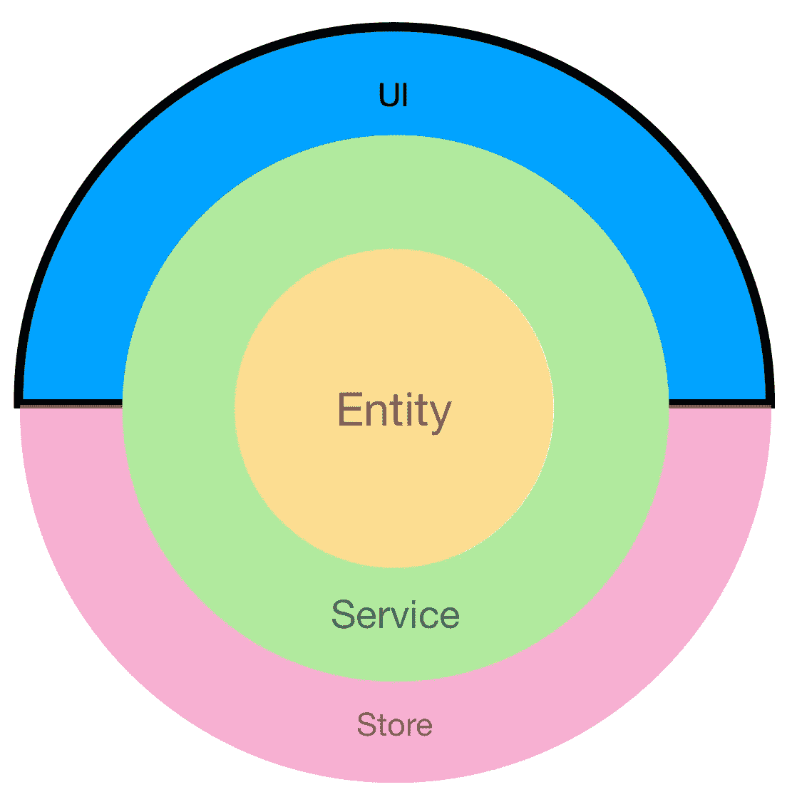
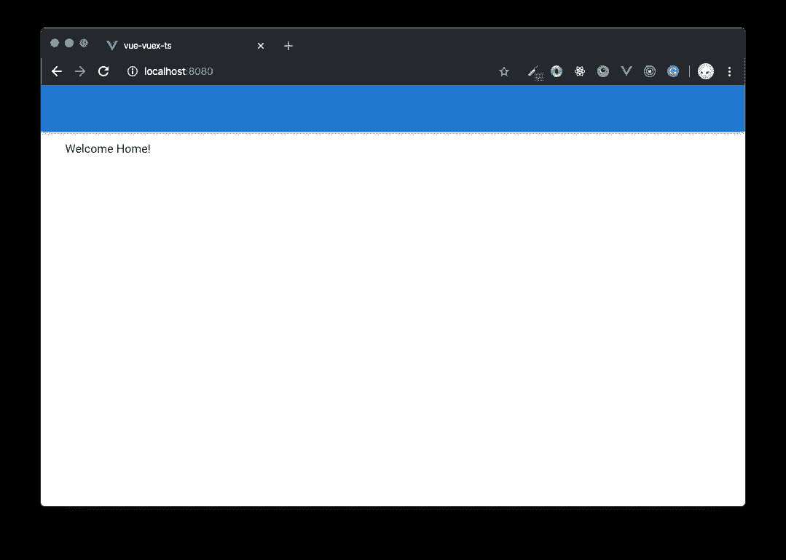
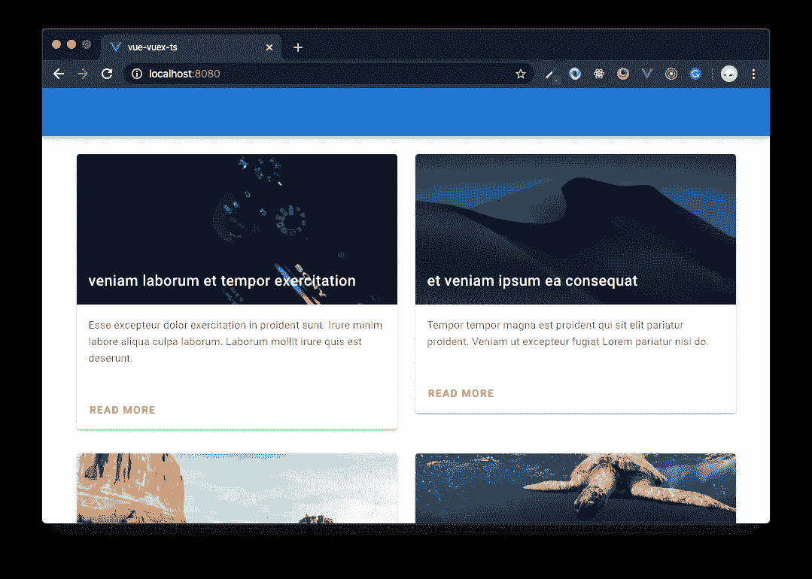
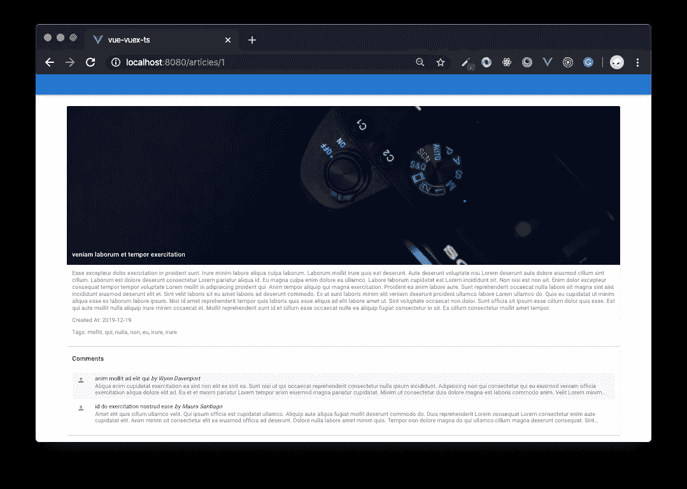
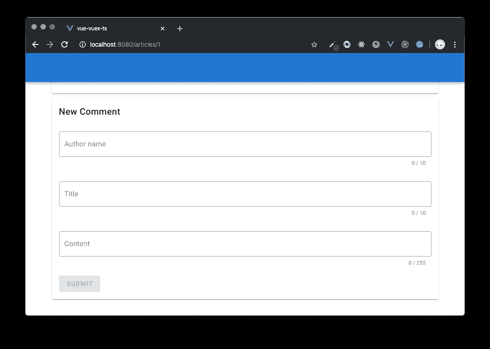

# 构建 Vue 企业应用程序:第 4 部分。UI 组件

> 原文：<https://itnext.io/building-vue-enterprise-application-part-4-ui-components-21a45b3067a4?source=collection_archive---------1----------------------->

清洁架构原则在企业前端应用中的应用



# 目录

*   介绍
*   需求分析
*   设置
*   物品组件
*   主页
*   完整物品组件
*   整篇文章页面
*   评论表格
*   结论
*   下一步是什么？

# 介绍

这是该系列的第四部分。在[第一章](https://medium.com/@gregsolo/building-vue-enterprise-application-part-1-entities-808077f3d2e7)中，我们用实体实现了核心业务逻辑和规则。[第二个岗位](https://medium.com/@gregsolo/building-vue-enterprise-application-part-2-services-f7ec400190e7)致力于通过服务让他们行动起来。[在上一期](https://medium.com/@gregsolo/building-vue-enterprise-application-part-3-the-store-dbda0e4bb117)中，我们通过设置存储:动作和突变，在 Vue/Vuex 基础设施和核心逻辑之间架起了一座桥梁，以与服务协同工作。

在这篇文章中，我们将总结一切。我们将创建 Vue 组件，并教会它们从商店获取数据或将数据保存到商店。

# 需求分析


照片由[艾萨克·史密斯](https://unsplash.com/@isaacmsmith?utm_source=medium&utm_medium=referral)在 [Unsplash](https://unsplash.com?utm_source=medium&utm_medium=referral) 上拍摄

即使我们做了很多工作，我们还没有完成这些故事。让我们提醒自己，用户对应用的期望是什么:

*   作为用户，我应该能够在主页上看到所有的文章
*   作为一个用户，我应该能够从那里导航到一个页面，代表一个特定的文章，并看到完整的文章
*   作为一个用户，我应该能够在这个页面上留下评论

让我将这些故事转化为技术任务:

*   创建和设置主页的用户界面
*   为主页上的文章列表创建和设置用户界面
*   创建和设置完整文章页面的用户界面
*   在完整文章页面上创建和设置评论表单的用户界面

# 设置


照片由[Louis Hansel @ shotsoflouis](https://unsplash.com/@louishansel?utm_source=medium&utm_medium=referral)在 [Unsplash](https://unsplash.com?utm_source=medium&utm_medium=referral) 上拍摄

[回购](https://github.com/soloschenko-grigoriy/vue-vuex-ts)和[演示](https://vue-vuex-ts-services.herokuapp.com)为您服务。请随意切换到“store”分支，它包含以前完成的教程。

在本教程中，我们将主要关注/src/ui 文件夹。

您可以通过运行以下命令来启动该应用程序:

```
npm run serve
```

并在浏览器中打开(默认链接为 [http://localhost:8080，](http://localhost:8080,)详见您的终端)。您应该会看到一个欢迎主页:



您可以通过运行以下命令来验证测试设置是否正确

```
npm t
```

主页已经部分建立。您可以在中找到路由器的视图

```
/src/ui/pages
```

# 物品组件

首先，我们应该创建一个组件来呈现列表中文章的简短信息。按照我们在前面章节中使用的旧结构创建这些文件:

```
/src/ui/components/article/article.tsx
/src/ui/components/article/article.spec.ts
/src/ui/components/article/article.types.ts
/src/ui/components/article/index.ts
```

并重新导出桶文件中的所有内容:

桶形锉

## 先测试！

和其他章节一样，我们将遵循 TDD 方法。我将从定义测试的样板设置开始:

商品规格

并设置一个空组件:

空商品组件

现在是时候让测试变得更有意义了。我将使用 [Vuetify 的卡片组件](https://vuetifyjs.com/en/components/cards/)来渲染一篇文章。我还希望文章数据作为一个道具传递给组件。最后，我希望确保组件至少呈现标题、一小段文本和一个指向整篇文章的链接:

物品规格检查呈现

*注意，我们是如何有效地使用实体模拟的！我们不必知道它的所有结构。我们只关心标题、id 和简短的内容:确切地说，我们将在组件中使用什么。换句话说，我们将组件测试从实体结构中分离出来。*

## 成分

测试现在正在下降，这正是我们所追求的。让我们用必要的逻辑填充它。我们确定文章组件需要文章实体才能正常工作。因此，让我们为 props 定义一个接口来设置编译时检查:

文章类型

并在组件本身中利用它，加上保护运行时检查:

物品组件道具设置

*注:详细请参考* [*我的帖子*](https://levelup.gitconnected.com/why-i-advocate-using-jsx-and-typescript-in-vue-components-e378bf9ee6e7) *关于结合 JSX 和接口。*

现在没有什么能阻止我们渲染这篇文章:

渲染文章

*注意呈现参数列表中的“this: ArticleComponent”。TS 在编译时可能不知道函数执行的上下文。这个上下文是在实际调用函数时定义的。但是如果我们确实知道上下文，我们可以提供“this”参数来帮助 TypeScript 分析代码。在这种情况下，我们确信 render 是在组件*的上下文中调用的。

缺少的一小部分是完整文章页面的 URL。我将为它定义一个计算属性，主要是为了举例说明如何使用这个设置:

getUrl 计算属性

此时，测试应该通过了。干得好！

# 主页

我们已经工作了一段时间，但在屏幕上没有看到任何结果。现在是改变它的时候了。

```
Navigate to /src/ui/pages/home/home.tsx
```

我们需要数据:所有可用的文章。如果您记得，这些数据应该存放在商店中。在我们将存储注入 Vue 后，只需调用“this ”,就可以轻松访问它。$存储。此外，由于我们用存储构建的 TypeScript 和 clear API，我们不必猜测存储支持什么操作/getter/mutation 以及有效负载期望什么。我们可以像这样简单地获取数据:

获取这些文章！

现在，我们可以为商店中的每件商品呈现商品组件:

呈现文章列表

最后，加载数据:

组件安装时加载文章

如果您运行应用程序并打开浏览器，您应该会看到主页上充满了文章:



主页呈现文章

但是测试正在下降。原因是安装的组件没有关于$storage 的线索。解决这个问题相当简单:

嘲笑存储

测试还在下降，只是原因不一样了。现在，“getAllArticles”只是模拟存储的模拟函数，返回“undefined”。它应该返回一组文章:

嘲笑吸气剂

此时，您的应用程序应该编译无误，并且所有测试都应该通过。胜利！

# 完整物品组件

好了，我们已经完成了一半。下一站是全文组件。这个 Vue 元素必须处理三件主要的事情:

*   渲染文章(至少包括标题和完整描述)
*   呈现这篇文章的评论列表
*   提交意见表并处理其提交

我将从定义常规占位符文件开始:

```
/src/ui/components/full/full.spec.ts
/src/ui/components/full/full.tsx
/src/ui/components/full/full.types.ts
/src/ui/components/full/index.ts
```

和设置桶文件:

桶形锉

## 先测试！

一如既往！规格占位符应该很熟悉:

测试占位符

通常，UI 组件的主要目的是显示一些东西。完整的文章组件应该期望文章实体作为道具，并使用 Vuetify 的卡呈现标题和完整内容:

测试渲染

然后，该组件应该呈现一个注释列表:

测试呈现的注释列表

*注意:我通过手动推送他们的模仿来确保被模仿的文章至少有两条评论*

最后是表单。根据[评论实体](https://github.com/soloschenko-grigoriy/vue-vuex-ts/blob/master/src/entities/comment/comment.ts)，有三个必填字段:标题、作者和内容。这意味着表单必须有这三个输入。

当然，当用户提交表单时，组件应该发送“createComment”动作，发送表单数据和文章 id:

测试表格

## 成分

感觉测试涵盖了我们需要的一切。我们现在可以专注于实际组件。正如我们先前所建立的，它期望文章作为道具:

完整组件和类型

*代码现在可以编译，但测试不出所料会失败。别担心，我们正在让他们通过的路上！*

先来渲染一下文章和评论列表:

呈现评论列表

考试越来越好了！但是在我们实现表单和包装这个组件之前，让我们稍微绕一下路，在屏幕上显示我们已经完成的内容。为此，我们需要一条新的路线和新的视野。

# 整篇文章页面

导航到/src/ui/pages 目录，从定义熟悉的占位符开始:

```
/src/ui/pages/article/article.tsx
/src/ui/pages/article/article.spec.ts
/src/ui/pages/article/index.ts
```

使用更新的桶文件:

桶形锉

现在，该页面所要做的就是使用路由器参数通过 id 获取文章，然后呈现完整的文章组件。测试很简单:

全文页面测试

这是组件本身:

完整的文章页面

现在让我们将此页面附加到路由器上:

设置路由器

代码编译时应该没有错误，如果您打开浏览器并单击主页上的文章预览，应该会导航到完整的文章页面:



干得好！

# 评论表格

拼图的最后一块是评论表格。该表单必须通过执行验证来确保用户提供正确的数据。然而，正如我们多次讨论的，UI 组件不能控制这些规则，只能利用它们。这些规则来自实体。你可以回忆一下评论最大作者长度，评论最大标题长度等等。，这是我们在这个系列的第一篇文章中创建的。现在是使用它们的时候了:

表单:验证规则

*注意，我们以适合 Vuetify 的方式定义属性“titleRules”、“contentRules”、“authorRules”。如果您使用另一个 UI 库，您使用验证规则的方式可能会有所不同。但核心思想依然是:* ***UI 不拥有规则，只使用它*** *。*

保存用户提供的数据会很有用，这样我们可以在以后提交表单时应用这些数据:

形式:保留价值观

提交本身仅仅是获取数据并分派动作:

表单:提交处理程序

现在我们准备为表单提供标记:

呈现形式

现在，所有的测试都应该通过了，代码编译应该没有错误。如果你打开任何一篇文章，你都会看到一个功能齐全的表单:



最后一部分:意见表

# 结论

我们完成了我们的旅程。让我们停下来，欣赏一下我们走过的路。

我们的应用程序的[依赖圈](https://blog.cleancoder.com/uncle-bob/2012/08/13/the-clean-architecture.html)中的每个元素都有其职责。[实体](https://medium.com/@gregsolo/building-vue-enterprise-application-part-1-entities-808077f3d2e7)包含核心业务逻辑，[服务](https://medium.com/@gregsolo/building-vue-enterprise-application-part-2-services-f7ec400190e7)利用并执行它们。[存储库](https://medium.com/@gregsolo/building-vue-enterprise-application-part-3-the-store-dbda0e4bb117)只保存数据，并支持对其进行全局访问的 UI 组件。最后，Vue 组件处理数据的表示和与用户的交互。业务规则不依赖于 Vue 基础设施。代码具有良好的测试覆盖率。最后但同样重要的是，将系统不同部分的实现委托给不同的人/团队是很容易的:一个团队可以处理 UI 组件，而其他团队则专注于核心逻辑。

# 下一步是什么？

我建议你尝试一下回购，以便更好地理解这种方法。尝试改变一些事情，看看架构的哪一部分受到了改变的影响。尝试添加新功能(例如，创建帖子或删除评论？).当然，如果你有任何反馈，我会非常感激。

干杯！

这是“构建 Vue 企业应用”系列文章的第四章。其他剧集请点击此处:

*   [第 0 部分。序曲](https://medium.com/@gregsolo/building-vue-enterprise-application-part-0-overture-6d41bea14236)
*   [第一部分。实体](https://medium.com/@gregsolo/building-vue-enterprise-application-part-1-entities-808077f3d2e7)
*   [第二部分。服务](https://medium.com/@gregsolo/building-vue-enterprise-application-part-2-services-f7ec400190e7)
*   [第三部分。Vuex](https://medium.com/@gregsolo/building-vue-enterprise-application-part-3-the-store-dbda0e4bb117)
*   [第四部分。UI:页面和组件](https://medium.com/@gregsolo/building-vue-enterprise-application-part-4-ui-components-21a45b3067a4)

```
**Images Credits:**- TheRegisti [https://unsplash.com/photos/VEbUF1BnGkA](https://unsplash.com/photos/VEbUF1BnGkA)
- Daniel Olah [https://unsplash.com/photos/6KQETG8J-zI](https://unsplash.com/photos/6KQETG8J-zI)
- Spencer Davis [https://unsplash.com/photos/ipG88UDIQdg](https://unsplash.com/photos/ipG88UDIQdg)
- Victor Ene [https://unsplash.com/photos/siOiG_2KBpA](https://unsplash.com/photos/siOiG_2KBpA)
- Alec Krum [https://unsplash.com/photos/PkXNYci4p4Y](https://unsplash.com/photos/PkXNYci4p4Y)
- Cole Wyland [https://unsplash.com/photos/7Dn0hmvnCh8](https://unsplash.com/photos/7Dn0hmvnCh8)
```