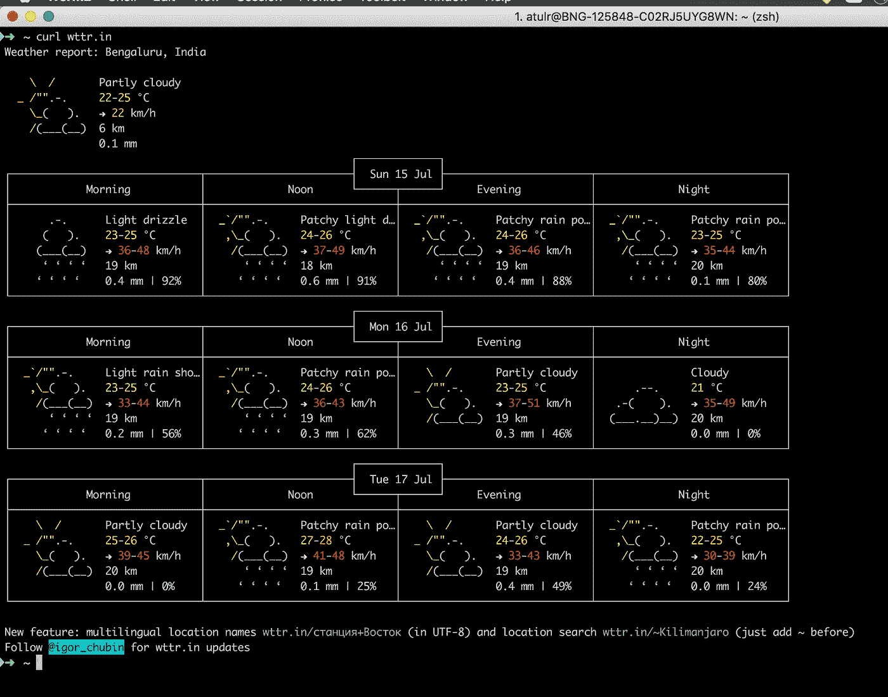
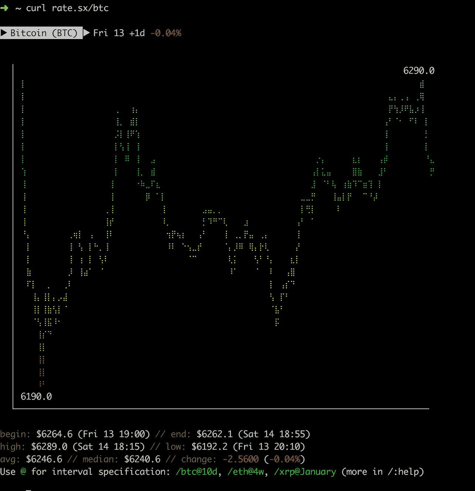
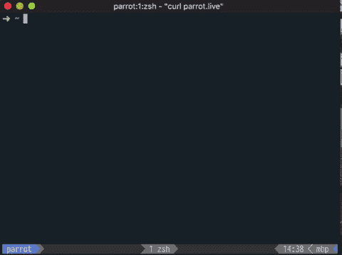
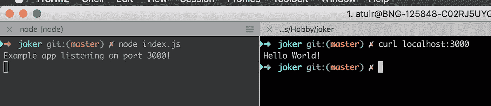
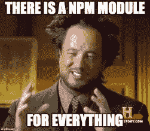
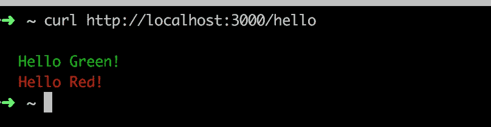
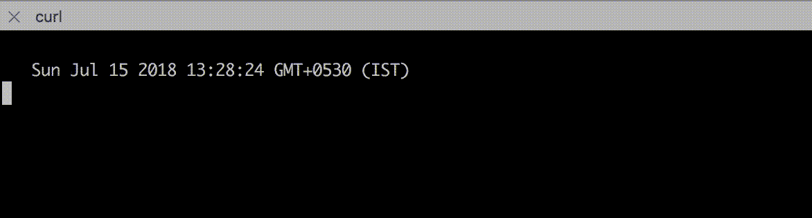
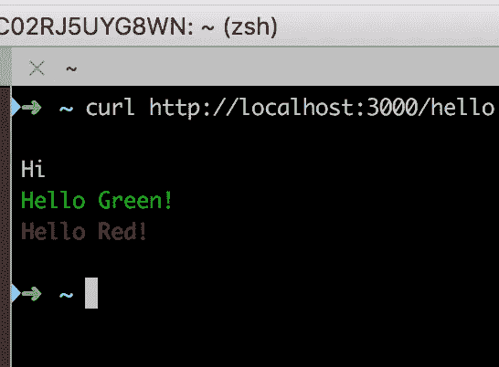
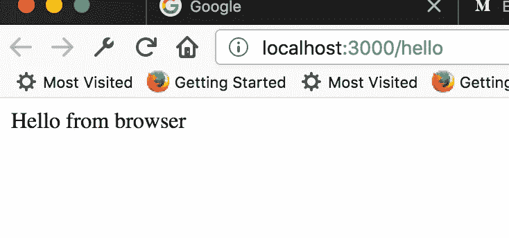

# 📟使用 JavaScript 构建基于 Web 的终端用户界面

> 原文：<https://itnext.io/building-web-based-uis-for-terminals-using-javascript-60b5eee31213?source=collection_archive---------1----------------------->

对于开发人员来说，他/她的大部分时间都花在代码编辑器或终端上。作为 web 开发人员，我们主要针对浏览器，现在甚至是本地移动平台(感谢 React Native)。但是我最近发现，你也可以把终端作为你基于网络的用户界面的目标。

**我这么说是什么意思？**

*类型:* `**curl wttr.in**` 在你的终端。这个来自 [Igor Chubin](https://medium.com/u/bae0a1a900e?source=post_page-----60b5eee31213--------------------------------) 用 python 写的控制台应用程序启发了我写这篇博客。



伊戈尔·楚宾

太神奇了！没错。所以，我决定深入研究一下，看看它是如何做到的。

# ANSI 转义码

> **ANSI 转义序列**是[带内信令](https://en.wikipedia.org/wiki/In-band_signaling)的标准，用于控制视频[文本终端](https://en.wikipedia.org/wiki/Text_terminal)上的光标位置、颜色和其他选项。某些[字节](https://en.wikipedia.org/wiki/Byte)的序列，大部分以 [Esc](https://en.wikipedia.org/wiki/Escape_character) 和“ [[](https://en.wikipedia.org/wiki/Bracket) ”开始，被嵌入到文本中，终端寻找并解释为命令，而不是[字符代码](https://en.wikipedia.org/wiki/Character_encoding)。

本质上，ANSI 转义码是终端以特殊方式解释的字符。这些代码可用于给文本添加颜色、控制光标位置等。所有主要终端都支持这些代码，包括 Windows😉。

> 2016 年随着[Windows 10](https://en.wikipedia.org/wiki/Windows_10)“Threshold 2”[【1】](https://en.wikipedia.org/wiki/ANSI_escape_code#cite_note-win10th2-1)微软出人意料地开始支持 ANSI 转义序列

ANSI 转义码如何工作的具体细节将不在这里讨论。维基百科上有一篇关于这个的优秀文章:[https://en.wikipedia.org/wiki/ANSI_escape_code](https://en.wikipedia.org/wiki/ANSI_escape_code)

# **在我们编码之前，更多的灵感例子**

在我们着手解决这个问题之前，我想分享一些更棒的例子:



rate.sx 作者[伊戈尔·楚宾](https://medium.com/u/bae0a1a900e?source=post_page-----60b5eee31213--------------------------------)

`**curl rate.sx**`

另一个来自[伊戈尔·楚宾](https://medium.com/u/bae0a1a900e?source=post_page-----60b5eee31213--------------------------------)。这个甚至有图表😲。这太疯狂了。！



parrot.live by [雨果](https://medium.com/u/62e3de0825f2?source=post_page-----60b5eee31213--------------------------------)

`**curl parrot.live**`

这是雨果的作品。这有一只动画派对鹦鹉！！

多酷啊！！！

byemck.atulr.com 由[阿图](https://medium.com/u/4bfc4b7040a8?source=post_page-----60b5eee31213--------------------------------)

> `**curl byemck.atulr.com**` 或`**curl byeiz.atulr.com**`

这是我前一份工作的最后一天做的。想体面地告别😉

[https://github.com/master-atul/byemck](https://github.com/master-atul/byemck)

*还有更多例子列在:*[*https://github.com/chubin/awesome-console-services*](https://github.com/chubin/awesome-console-services)

# 为什么会有人建这些？

*   所以你会注意到一件有趣的事情，当你用浏览器点击`**wttr.in**`，你会得到一个简单的基于 HTML & CSS 的网页。但是当你使用`curl` 或`wget` 点击它时，你会得到一个 ANSI 编码的文本作为响应。所以，现在可以直接针对终端用户(dev)了。例如，开发人员现在可以在他们的终端上直接查看带有颜色编码和语法突出显示的在线文档，而无需在单独的浏览器上打开网页。
*   好奇心😬；我不知道你怎么想，但是这些演示足以让我尝试使用 NodeJS 来构建它。


# 让我们使用 JavaScript (NodeJS)来构建这些

> 完整的源代码可以在这里找到:[https://github.com/a7ul/console-web-ui](https://github.com/master-atul/console-web-ui)

## **第一步:简单的 hello world**

由于这是一个 web API，我将使用 express.js 来构建一个使用 nodejs 的简单 API 服务器。遵循这里的指南:[https://expressjs.com/en/starter/hello-world.html](https://expressjs.com/en/starter/hello-world.html)制作一个简单的 express js API 服务器。

现在输入:`node app.js`来启动服务器。
在另一个端子类型:`curl localhost:3000`。您应该看到:



你好，世界准备好了😆

## **下一步:给文本添加颜色**

如前所述，我们需要 ANSI 代码来将彩色输出到屏幕上。幸运的是，有一个非常好的`npm`模块可以解决这个问题。[https://github.com/chalk/ansi-styles](https://github.com/chalk/ansi-styles)



让我们看看彩色的 hello world 是什么样子的。

```
const style = require('ansi-styles');const express = require('express'); const hello = () =>`                          ${style.green.open}Hello Green!${style.green.close}                         ${style.red.open}Hello Red!${style.red.close}                       `; const app = express(); app.get('/hello', (req, res) => {                          
   res.send(hello());                       
}); const PORT = process.env.PORT || 3000; 

app.listen(PORT, () => console.log(`Example app listening on port ${PORT}!`));
```

***app.js***

您应该在`curl [http://localhost:3000/hello](http://localhost:3000/hello)`上得到以下输出



## 动画呢？

动画是一系列连续的帧，给人一种某物在移动的印象。为此，我们需要向客户端发送多个帧，并在显示下一帧之前清除旧帧。

*   为了向客户端发送多帧数据，我们将使用`node streams`。
*   为了在显示下一帧之前清空屏幕，我们可以使用一个特殊的 ANSI 代码`\033[2J\033[H`

假设我们想在控制台上显示每秒都在变化的当前服务器时间。因此，我们的输出将如下所示:



使用 curl 动画显示当前时间—注意秒(它会改变😆)

代码如下所示:

```
const express = require("express");
const { Readable } = require("stream");// This is the special ANSI code to tell terminals to clear the screenconst PAGE_BREAK = "\033[2J\033[H";// This function gets the current date in string format along
// with a page break on top.
// Note that you would need to add a new line for the terminal to
// interpret it. That is `hello` will not work while `hello\n` will.const getDate = () => `
  ${PAGE_BREAK}
  ${new Date()}
`;// This function initialises the stream for nodeconst getStream = (req, res) => {
   const stream = new Readable();
   stream.pipe(res);
   stream._read = () => {};
   req.on("close", () => {
     stream.destroy();
   });
   return stream;
};// This is used to add delay between frames.
// Its just waits for a said millisec before resolving the promiseconst delay = async (milliseconds = 0) =>
   new Promise((resolve) => {
      setTimeout(() => resolve(), milliseconds);
   }
);// animateHello is the main function which pushes each frame
// of animation in a delay of 1sec (max 30 times)const animateHello = async (stream) => {
  for (let i = 0; i < 30; i += 1) {
     stream.push(getDate());
     await delay(1000);
  }
  stream.push(null); //This ends the stream.
};// App initialisationconst app = express();// routeapp.get("/anime-hello", async (req, res) => {
   const stream = getStream(req, res);
   await animateHello(stream);
});const PORT = process.env.PORT || 3000;app.listen(PORT, () => 
   console.log(`Example app listening on port ${PORT}!`)
);
```

## 如果浏览器和终端可以使用相同的路由会怎样？

理想情况下，如果我们在浏览器上点击一个 URL，我们应该得到 HTML 和 CSS 响应，而如果我们从 curl 或终端上点击它，我们应该得到终端理解的文本格式的响应。

***我是什么意思？好的，试着在浏览器上打开`wttr.in`——你应该会看到基于 HTML、CSS 的网站正在加载。现在试试`curl wttr.in`，同一个 URL 现在返回终端可以理解的基于文本的输出。***

在 expressjs 中实现这一点。我们将使用`next`的概念。

```
const express = require('express');  

const hello = require('./src/ansi/animations/hello');                                               const PORT = process.env.PORT || 3000;                                               const app = express();

// simple hello route                       
app.get('/hello', async (req, res, next) => {const userAgent = req.headers['user-agent']; 
    // checking the useragent                         
    const isCommandline = (userAgent.search(/curl|wget/i) !== -1); 

    if (isCommandline) {      
       await res.send(hello.hello()); 
     // This handles the route if the request came from curl or wget                          
      return null;
    }
    return next(); 
    // This passes the control to the next matching route handler
});app.use('/hello', express.static('static/hello/index.html'));app.listen(PORT, () => {
  console.log(`Example app listening on port ${PORT}!`);
});
```

## **输出:**



现在当你运行
`curl [http://localhost:3000/hello](http://localhost:3000/hello)`

⬅，你听到了吗



如果你在浏览器中打开链接，你会看到你制作的 HTML 页面。

这个例子是在 https://console-web-ui.herokuapp.com/[的 heroku 上](https://console-web-ui.herokuapp.com/)

> **这个博客的所有代码都在:**
> 
> [**https://github.com/a7ul/console-web-ui/**](https://github.com/master-atul/console-web-ui/)

我希望这很有趣😬🎉请在 twitter 上关注我@a7ulr/