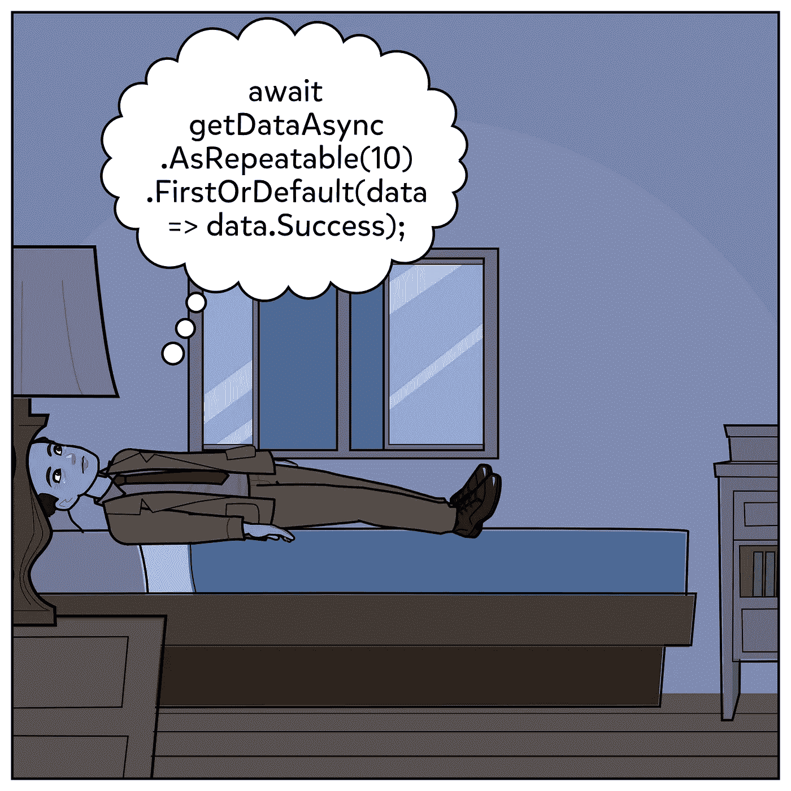

# 使用接口扩展方法模式构建您的第一个异步 fluent API

> 原文：<https://itnext.io/building-your-first-async-fluent-api-using-interface-extension-methods-pattern-4baaf8a55c5a?source=collection_archive---------3----------------------->



Fluent 接口是一个高级的 API 设计，真正实现了对方法和方法链的扩展。fluent API 最著名的例子是 IEnumerable 的 linq 扩展方法。

```
var passed=Students.Where(s=>s.Passed).Select(s=>s.Name).ToList();
```

在异步编程中，async/await、fluent APIs 由于其热构建默认任务对象的性质而受到限制，在本文中，我们将克服这个问题，并构建一个允许 fluent 扩展方法的小型库。

举个例子，

```
var data=await GetDataAsync()
         .AsRepeatable(TimeSpan.FromSeconds(10))
         .FirstOrDefaultAsync(data=>data.Any());
```

另一个例子可能是

```
var data=await GetNewsAsync()
         .Where(newsList=>newsList.Date>=DateTime.Today)
         .SelectMany(newsList=>newsList.NewsItems)
         .ToList();
```

只是给你一个如何使用命令式方法编写这段代码的概念

```
 var newsList=await GetNewsAsync();
 if(newsList.Date>=DateTime.Today)
    {
       return newsList.Select(news=>news.NewsItems).ToList();
    }
else
       return new List<NewsItem>();
```

你可以选择你喜欢的代码风格，如果你喜欢第二种，你可以停止阅读这篇文章，因为在文章的其余部分，我们将扩展 c sharp 语言，使第一种适用。

很好，你决定继续显示你是一个非常优雅的软件工程师，所以请葡萄你的咖啡，你也可以邀请我

[](https://ko-fi.com/ahmedfouad) [## 给艾哈迈德·福阿德买杯咖啡。ko-fi.com/ahmedfouad

### 我是 PlanRadar 的一名软件工程师，目前居住在奥地利的维也纳。我的兴趣…

ko-fi.com](https://ko-fi.com/ahmedfouad) 

# 步骤 1:将你的异步任务<t>转换成任务</t>

这将帮助我们摆脱 NullReferenceExceptions，只关注扩展方法。

```
public static  Func<Task<Option<T>>> ToOption<T>(this Func<Task<T>> context)
{
     return new Func<Task<Option<T>>>(async () =>{
     try
       {
          var result = await context.Invoke();
          return result.SomeNotNull();
       }
     catch (Exception e)
       {
          return Option.None<T>();
       }});}
```

这个方法只是调用异步方法和返回选项。当值为 null 或发生异常时为 None，当有值时为 some。

我们将需要安装选项类型掘金包

[](https://www.nuget.org/packages/Optional/) [## 可选 4.0.0

### Optional 是一个健壮的选项/可能是 C#的类型。

www.nuget.org](https://www.nuget.org/packages/Optional/) 

# 步骤 2:构建一个包装类，我们将在其中实现我们的扩展方法

```
public class ExtendedTask<T>
    {
        private readonly Func<Task<Option<T>>> _taskOption;
        public ExtendedTask(Func<Task<T>> task)
        {
            _taskOption = task.ToOption();
        }
        public ExtendedTask(Func<Task<Option<T>>> task)
        {
            _taskOption = task;
        }
    }
```

从这里可以很容易地实现我们的扩展方法，我们只是将实现委托给选项类型。

```
public ExtendedTask<T> Where(Func<T,bool> condition)
        {
            var conditionedTask = _taskOption.Select(func => new Func<Task<Option<T>>>(async () =>
            {
                var result = await func.Invoke();
                return result.Where(condition);
            }));

            return new ExtendedTask<T>(conditionedTask);
        }
```

当条件满足时，它将返回新的扩展任务<t>的值，否则返回 None 的扩展任务<t>。</t></t>

现在我们将使用相同的策略实现 select 方法和 select async 方法。

```
public ExtendedTask<TP> Select<TP>(Func<T,TP> selector)
        {
            var conditionedTask = _taskOption.Select(func => new 
            Func<Task<Option<TP>>>(async () =>
            {
                var result = await func.Invoke();

                return result.Select(selector);
            })); return new ExtendedTask<TP>(conditionedTask);
        }public ExtendedTask<TP> SelectAsync<TP>(Func<T, Task<TP>> selector)
        {
            var conditionedTask = _taskOption.Select(func => new  
            Func<Task<Option<TP>>>(async () =>
            {
                var result = await func.Invoke(); var [@select](http://twitter.com/select) = await result.Select(selector.Invoke)
                 .ValueOr(()=>Task.FromResult(default(TP))); return [@select](http://twitter.com/select).SomeWhen(p =>
                {
                    var b = p.Equals(default(TP));
                    return !b;
                });
            }));
```

# 步骤 3:实现 AsTask()方法

```
public async Task<T> AsTask()
        {
            return (await _taskOption.Select(async task => await 
                    task())).ValueOrDefault();
        }
```

这个方法简单地返回一个执行修饰任务的新任务，并且当值为 None 时简单地返回 T 的默认值。

# 步骤 4:实现 AsRepeatable()方法

因为可重复方法是将标量任务<t>转换为矢量 IAsyncEnumerable <t>的转换方法</t></t>

```
public  IAsyncEnumerable<T> AsRepeatable()
        {
            return new TaskAsyncEnumerable<T>( _taskOption);
        }
        public IAsyncEnumerable<T> AsRepeatable(TimeSpan timeSpan)
        {
            return new TaskAsyncEnumerable<T>(_taskOption ,timeSpan);
        }
```

下面是 taskasyncenumable<t>的实现</t>

非常简单，枚举器将在迭代时继续执行任务，只有当迭代停止或值变为 null 时才会停止。

# 第五步:让我们试试

```
var getDataAsync = new ExtendedTask<News>(GetDataAsync);
var data = await getDataAsync
                .AsRepeatable(TimeSpan.FromSeconds(1))
                .FirstOrDefaultAsync(data => data.Items.Any());
```

# 第六步

如果你喜欢这篇文章，请分享它，在媒体和 twitter 上关注我，以获得我即将发布的

[](https://twitter.com/MCC_Ahmed) [## 艾哈迈德·福阿德

### 艾哈迈德·福阿德的最新推文(@MCC_Ahmed)。我是 PlanRadar 的一名软件工程师，目前住在维也纳…

twitter.com](https://twitter.com/MCC_Ahmed) 

给我咖啡钱

[](https://ko-fi.com/ahmedfouad) [## 给艾哈迈德·福阿德买杯咖啡。ko-fi.com/ahmedfouad

### 我是 PlanRadar 的一名软件工程师，目前居住在奥地利的维也纳。我的兴趣…

ko-fi.com](https://ko-fi.com/ahmedfouad)