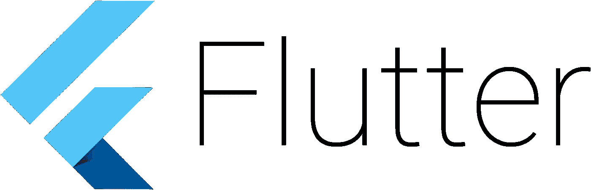
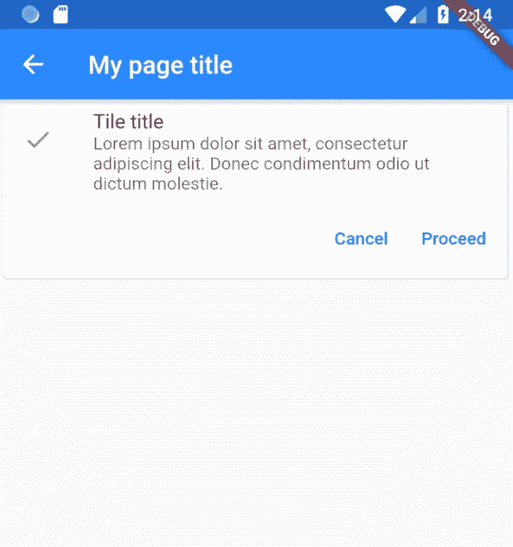
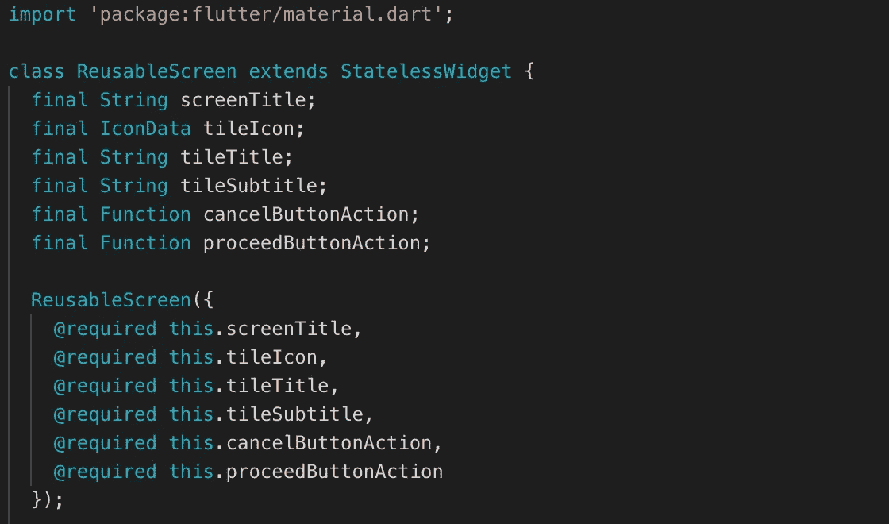
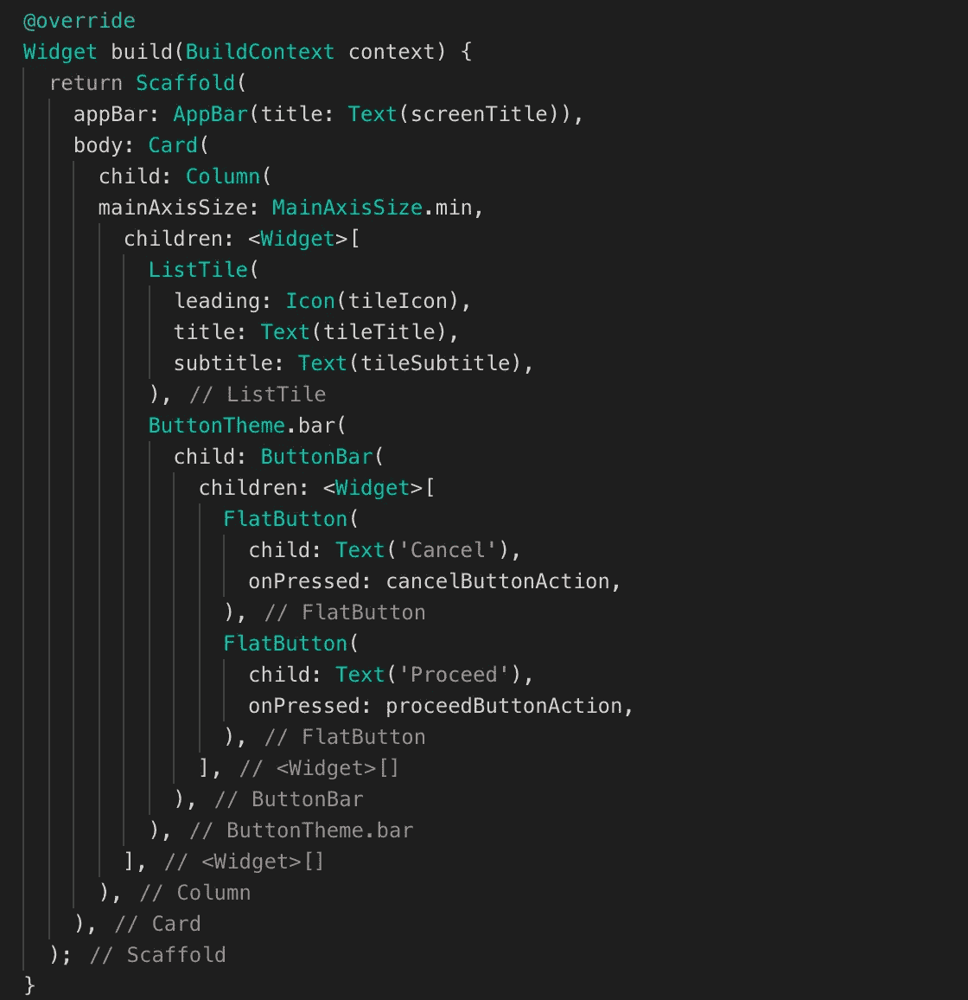
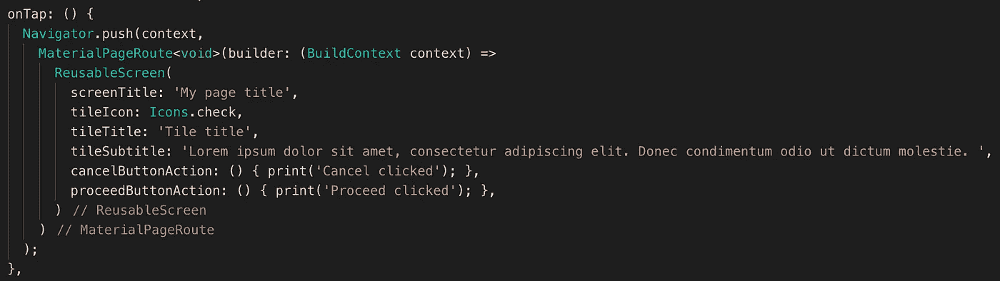

# 用 Flutter 构建第一个可重用的小部件

> 原文：<https://itnext.io/building-your-first-reusable-widget-with-flutter-cadb54c3c253?source=collection_archive---------1----------------------->

# 介绍

在本指南中，我将向您展示如何使用 **Flutter** 和 **Dart** 构建一个可重用的小部件。

Dart 语言是由 Google 创建的强类型语言。它与 JavaScript、Java 和 c 有相似之处。因此，如果您正在使用其中一种语言，那么您应该会很快熟悉 Dart。

Flutter 是一个用 Dart 编写的框架，可以轻松快速地编写跨平台的原生应用。你编写一个应用程序，可以构建到 Android (Java 或 Kotlin)或 iOS (Objective-C 或 Swift)移动应用程序中。

为了继续这篇文章并实现我们的可重用小部件，建议使用；

*   基本编程技能
*   Flutter SDK 1.7+版
*   Android/iOS 模拟器或真实设备

# 小部件

在 Flutter 中，一切都是一个小部件。它是一个 Dart 类，其行为基本上与组件相同。您有两种小部件:

*   无状态小部件—它没有状态
*   有状态小部件—它有一个状态

对于可重用的小部件示例，我将只展示无状态小部件:

## 可重用的无状态小部件

我们不是每次都制作一个全新的屏幕，而是制作一个可重复使用的屏幕(见下图)，我们可以在其中更改以下内容:

*   首页标题
*   卡片标题
*   卡片字幕
*   卡片图标
*   “取消”按钮的操作
*   “继续”按钮的操作

在这个新屏幕上，我们可以导航并传递所有自定义数据。

## 编码可重复使用的屏幕

对于我们的例子，我们使用了`material`样式的小部件。先做一个新的屏幕，是一个叫`ReusableScreen`的类。我们扩展了`StatelessWidget`,因为我们的屏幕中没有任何状态。

下图显示了我们添加的六个属性，它们都有自己的类型。

*   `screenTitle`、`tileTitle`和`tileSubtitle`三种`String`类型
*   一个`IconData`型号为我们的`titleIcon`
*   `cancelButtonAction`和`proceedButtonAction`两种`Function`类型

我们所有的属性都是`final`，因为我们只想在屏幕上传递一次数据。

在`ReusableScreen`构造函数中，我们引用我们的本地属性，并通过在它前面添加`@required`使它们成为必需的。

接下来我们覆盖`StatelessWidget` `build`方法。我们返回一个脚手架，在那里我们把我们的`screenTitle`传递到`AppBar`。

在主体中，我们有一个`Card`，它有一个子节点`Column`。我们将`mainAxisSize`设置为最小值，并传递多个子部件。

在卡片的顶部，我们想要一个`ListTile`小部件，在那里我们可以传递我们的`tileIcon`、`tileTitle`和`tileSubtitle`。

在卡片的底部，我们想要包含一个动作的按钮。当某个按钮被按下时，`cancelButtonAction`和`proceedButtonAction`都打开。

## 实现可重复使用的屏幕

在我们应用程序的某个地方，我们想要导航到我们的`ReusableScreen`。在这种情况下，我们有一个`onTap`方法(可以在一个按钮中找到)。在这个方法中，我们使用 Flutter 的`Navigator`小部件，并希望`push`我们的屏幕，这样我们就可以访问它。导航可以按照你想要的方式进行。

接下来，我们将我们的`ReusableScreen`小部件放在`push`方法中。现在我们可以传递我们的自定义参数，见下图。

我们现在可以通过应用程序重用这个小部件了！

## 感谢您的阅读！`ReusableScreen`的最终代码可以在这里找到[。如果你觉得这篇文章有用，请点击👏关注 button，并考虑阅读我的其他文章:](https://gist.github.com/jeroenouw/a35e208c3d6e4977f6b12ce02964f7c3)

 [## 如何在 Flutter 中使用推送通知

### 开始以最简单的方式在本地向您的用户推送通知

levelup.gitconnected.com](https://levelup.gitconnected.com/how-to-use-push-notifications-with-flutter-23bed9e47e52)  [## 通过与 TypeScript 进行比较来学习 Dart(用于颤振)

### Dart 代码与 TypeScript 代码比较的基本示例

levelup.gitconnected.com](https://levelup.gitconnected.com/learn-dart-for-flutter-by-comparing-it-to-typescript-3078ca18fe8f)  [## 面试中的 10 个高级打字问题及答案

### 检查你的候选人是否有能力回答这些更高级的打字问题

medium.com](https://medium.com/mr-frontend-community/10-advanced-typescript-questions-for-an-interview-with-answers-6f0513b1688e)