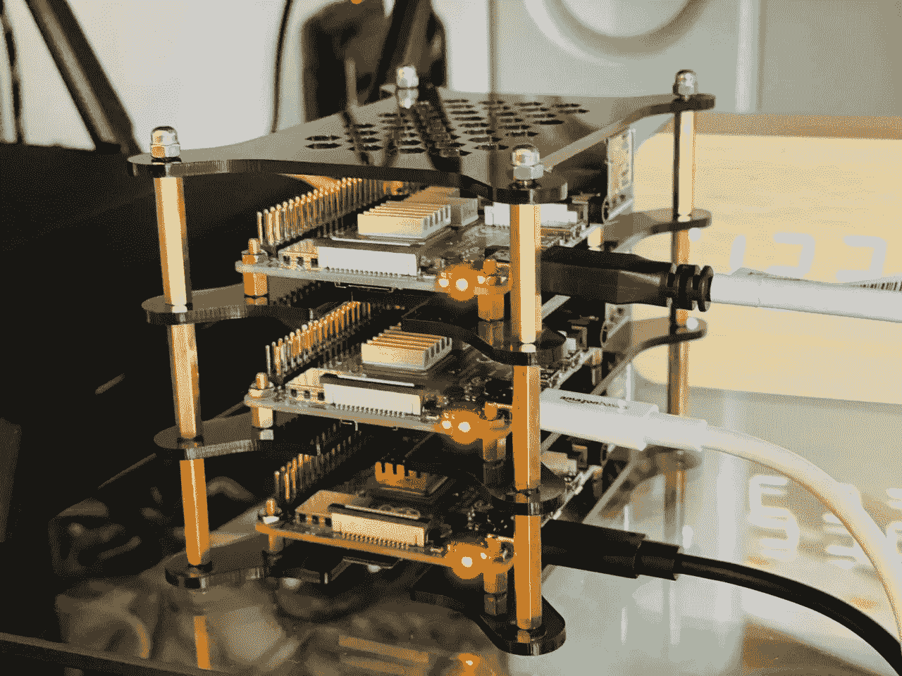
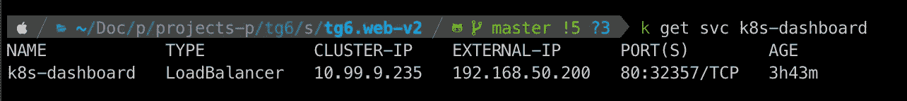
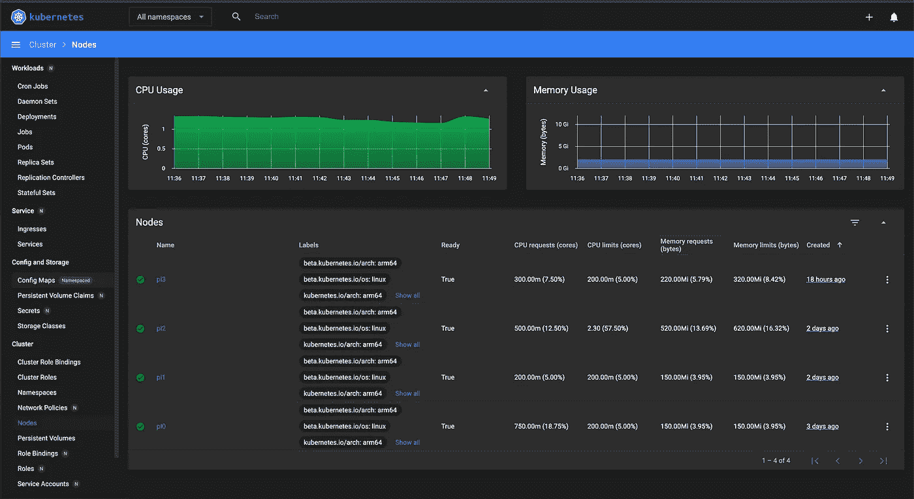

# 构建您的家庭树莓 PI Kubernetes 集群

> 原文：<https://itnext.io/building-your-home-raspberry-pi-kubernetes-cluster-14eeeb3c521e?source=collection_archive---------0----------------------->

这里有 Kubernetes 的粉丝吗？我在工作和私人项目中运行它已经有一段时间了，但有时我需要一个地方来快速开发和测试新功能，而不会产生额外的成本，或者只是运行我的家庭娱乐、备份、文件共享和 kettle。



还有几个节点在路上，集群几乎准备好了。

# **使用的硬件(黑色星期五价格** 🥳 **)**

*   [四个覆盆子酱 4B 4GB(每个 50 个)](https://www.amazon.co.uk/gp/product/B07TC2BK1X)
*   [四张 128 GB U3 存储卡(每张 15 张)](https://www.amazon.co.uk/gp/product/B07FCMKK5X)
*   [一个多 USB 电源(20 )](https://www.amazon.co.uk/gp/product/B07MJ9ZMDM/)
*   [一个机架箱用于多个 Pi(15)](https://www.amazon.co.uk/gp/product/B085ZJQMXF/)
*   值得一提的是:散热器、4 根 USB-B 转 USB-C 电缆

# 为什么是树莓派？

TL；DR:成本与处理能力。

4 节点群集提供 4 个(1.5Ghz、4 核 ARM cpu 和 4 GB RAM)，即 16 个 1.5 Ghz 内核和 16 GB RAM。我算过了，集群的总体成本仍然比类似的处理能力/节点云产品便宜。不多说…

# **存储卡准备**

从下载操作系统开始，它将完成繁重的工作。我每天大部分时间都在与 docker 和 Kubernetes 一起工作，我的任何一个爱好都是将 docker 图像精简到绝对最小——这大部分是由于 Alpine Linux 实现的——因此我将我的集群基于这种精确的分布。

前往 [Alpine Linux 下载](https://alpinelinux.org/downloads/)部分，为您的 Raspberry Pi 4 Model B 选择 AARCH64 版本。

同时，让我们准备存储卡，首先用 FAT32 文件系统格式化它。我是 OSX 人，所以使用下面的命令来获取你的存储卡的磁盘标识符

```
diskutil list
```

按照它来格式化整个内存卡——我把我的内存卡叫做 **RPI**

```
sudo diskutil eraseDisk FAT32 RPI MBRFormat /dev/diskX
```

将下载的 Alpine linux 软件包解压到存储卡上

```
sudo tar xf alpine-rpi-3.12.1-aarch64.tar.gz -C /Volumes/RPI
```

# **基础系统配置**

恭喜你，你离自己客厅里的 kubernetes 世界又近了一步。将存储卡滑动到您的 Raspberry Pi、显示器(或电视)以及键盘中，然后打开电源。系统启动并要求您登录后，使用 **root** 作为用户名和密码。

执行以下命令启动设置过程。

```
setup-alpine
```

我在家里运行我的集群，由于可用的路由器端口越来越少，我决定使用 WiFi 网络。你将选择的选项没有太大的区别——但是要明智地选择。

完成设置后，您还需要做一些事情。默认情况下，Alpine 从 RAM 运行，但是我们希望我们的更改在磁盘上以及潜在的重新启动之间保持不变。

```
apk update
apk add cfdisk e2fsprogs # Install disk tools
cfdisk /dev/mmcblk0      # Run cfdisk on your memory card
```

在此步骤中，您需要:

*   将 FAT32 分区的大小调整到合理的最小值——在我的例子中，我给了它 1GB。
*   使用所有剩余的可用空间创建新的可引导分区。
*   别忘了写下你刚刚做的修改。

有用教程:[如何使用 cfdisk？](https://www.thegeekdiary.com/understanding-linux-cfdisk-utility/)

现在只需要执行几个命令就可以完成整个过程。

```
mkfs.ext4 /dev/mmcblk0p2  # Format newly created partition as EXT4
mount /dev/mmcblk0p2 /mnt # Mount it
setup-disk -m sys /mnt    # Install system files
mount -o remount,rw /media/mmcblk0p1 # Remount old partition in RW# Let's do some housekeeping 
rm -f /media/mmcblk0p1/boot/*  
cd /mnt
rm boot/boot
mv boot/* /media/mmcblk0p1/boot/  
rm -Rf boot
mkdir media/mmcblk0p1
ln -s media/mmcblk0p1/boot boot
```

更新`/etc/fstab`记录

```
echo "/dev/mmcblk0p1 /media/mmcblk0p1 vfat defaults 0 0" >> etc/fstab
sed -i '/cdrom/d' etc/fstab
sed -i '/floppy/d' etc/fstab
cd /media/mmcblk0p1
```

系统重启后的最后接触—请记住，如果没有启用适当的 cgroups，kubeadm 步骤将会失败。

```
# Enable edge repository for Alpine 
sed -i '/edge/s/^#//' /mnt/etc/apk/repositories
# Force use of new partition as the root one
sed -i 's/^/root=\/dev\/mmcblk0p2 /' /media/mmcblk0p1/cmdline.txt
# Make sure that appropriate cgroups are enabled
echo "cgroup_enable=cpuset cgroup_enable=memory cgroup_memory=1" >> /media/mmcblk0p1/cmdline.txt
sed -i ':a;N;$!ba;s/\n/ /g' /media/mmcblk0p1/cmdline.txtrc-update add wpa_supplicant boot # Make sure your wifi will come back up after restart
```

最后，在完成上述所有步骤后，真正重要的事情是备份您刚才所做的更改并重启系统

```
lbu_commit -d
reboot
```

# 系统配置的其余部分

我提到过，我打算在家庭环境中使用这个 kubernetes 集群——在你问之前——它也可以在办公室网络中工作，尽管——我们应该添加一些额外的东西

**在本地网络中宣布主机名— avahi 守护进程**

为什么是这一步？与试图找到正确的 IP 地址相比，`ssh pi0.local`要容易得多。它还将使您的连接和集群配置更加容易，尤其是当您不能依赖静态 IP 时。

```
apk add dbus avahi
rc-update add dbus boot   # avahi won't start without dbus
rc-update add avahi-daemon boot
```

**允许 ssh 作为根用户访问**

编辑`/etc/ssh/sshd_config`文件——向其中添加下面一行，以便能够以 root 用户身份访问 ssh。

```
PermitRootLogin yes
```

安装 docker、kubernetes 和您稍后需要的其余软件包

```
apk update
apk add kubernetes docker cni-plugins kubelet kubeadm
rc-update add docker default
rc-update add kubelet default
```

# 小帮手说:你可以省力气了

在这个阶段，你应该为你的旅行做好一切准备。我利用这个机会关掉了我的 Raspberry Pi，把存储卡带回我的笔记本电脑，并创建了一个卡的图像，这样我就可以在剩余的三张卡上恢复它，从而节省时间。
记住为每个新重新创建的机器更改`/etc/hostname`内容，以避免冲突。我选择了`pi0, pi1, pi2`,以便更容易记忆(并在我的本地 ssh 配置中使用),尽管没有限制。

# 创建您的 kubernetes 大师

```
service docker start
kubeadm config images pull   # Get the necessary images
kubeadm init --pod-network-cidr=10.244.0.0/16
```

如果您看到任何停止初始化过程的与 cgroups 相关的错误——您之前错过了其中一个步骤，否则您应该会看到以“您的 Kubernetes 控制平面已成功初始化”开始的消息！`.

**将来自输出**(以`kubeadm join`开头的那个)的命令保存在安全的地方。您将需要它来允许剩余的节点加入您的集群。

运行以下命令将凭据存储在您的主目录中

```
mkdir -p $HOME/.kube
sudo cp -i /etc/kubernetes/admin.conf $HOME/.kube/config
sudo chown $(id -u):$(id -g) $HOME/.kube/config
```

# 如何访问节点？

我已经将`$HOME/.kube/config`的内容从节点复制到我的本地机器上，更改了一些默认值以避免潜在的冲突。多亏了这个，我可以在我的笔记本电脑上使用像`kubectl`或`k9s`这样的工具，并确保我总能找到正确的服务器。

# 主人跑了，还能做什么？

豆荚之间的网络——没有它，你的节点将永远保持感染和未就绪状态。

```
kubectl apply -f [https://raw.githubusercontent.com/coreos/flannel/master/Documentation/kube-flannel.yml](https://raw.githubusercontent.com/coreos/flannel/master/Documentation/kube-flannel.yml)
```

**默认情况下，您不能在主节点上部署任何东西**，节点显示为已感染，但是不要担心——我们可以用这个命令来改变它

```
kubectl taint nodes --all node-role.kubernetes.io/master-
```

仪表板。你遇到过说“我不喜欢仪表盘”的人吗？Kubernetes 有自己的、相当通用的仪表板，可以让您很好地了解您的集群(以及其中的任何内容)。

```
*# Add kubernetes-dashboard repository*
helm repo add kubernetes-dashboard https://kubernetes.github.io/dashboard/
*# Deploy a Helm Release named "kubernetes-dashboard" using the kubernetes-dashboard chart*
helm install kubernetes-dashboard kubernetes-dashboard/kubernetes-dashboard --set protocolHttp=true,ingress.enabled=true,rbac.create=true,serviceAccount.create=true,service.externalPort=9090,networkPolicy.enabled=true,podLabels.app=dashboard
```

正如你所注意到的，我在舵图设置中增加了一些额外的东西，但这是有原因的。

您的仪表板将会启动并运行，但是..它不会显示任何东西。缺少权限。

```
kubectl create clusterrolebinding kubernetes-dashboard --clusterrole=cluster-admin --serviceaccount=default:kubernetes-dashboard
```

好吧。我们快到了。我们有主节点，我们有仪表板，但我们目前无法访问它。我们可能会使用节点端口来公开 dashboard，但这不是我们的方式——要像 kubernetes 那样做，我们需要一个负载平衡器。Node 在我们的本地网络中运行，所以我们不能指望 AWS 或 GoogleCloud 提供任何好处，但恐怕不行——有办法对付它。

# 家庭网络中的负载平衡

根据清单遵循[金属 LB](https://metallb.universe.tf/installation/) 上的安装步骤，直到**安装结束。**

```
ifconfig wlan0 promisc    # Set PROMISC mode for WiFi - for ARP
```

只要您保持 Pi 运行，上面的命令就会生效。为了避免创建启动脚本，我决定编辑`/etc/network/if-up.d/dad`来设置界面出现时的 promisc 模式。

将以下清单创建为 my-dashboard.yaml

```
apiVersion: v1
kind: ConfigMap
metadata:
  namespace: metallb-system
  name: config
data:
  config: |
    address-pools:
    - name: default
      protocol: layer2
      addresses:
      - 192.168.50.200-192.168.50.250
---
apiVersion: v1
kind: Service
metadata:
  name: k8s-dashboard
  annotations:
    metallb.universe.tf/address-pool: default
spec:
  ports:
  - port: 80
    targetPort: 9090
  selector:
    app: dashboard
  type: LoadBalancer
```

不要忘记更改地址部分，以符合您的本地网络设置。

```
kubectl apply -f my-dashboard.yaml
kubectl get svc k8s-dashboard 
```



从现在起，您可以通过(对我而言) [http://192.168.50.200/](http://192.168.50.200/) 访问您的仪表板



树莓 Pi 供电的 k8s 集群。

文章由《周六奋斗》、《红牛》和《实验之爱》提供动力。


K9S 提供的集群单元概述

# 添加其他节点

当我们干(不要重复自己)吻(保持愚蠢的简单)-滚动到文章的开头，并遵循所有步骤，直到“*在新创建的节点上创建您的 kubernetes 主节点*，然后执行以下操作(记住用您的主节点 ip 替换 IP 地址-或者它的主机名(pi0.local，感谢 avahi 守护进程)

```
service docker start
kubeadm config images pull
kubeadm join 192.168.50.132:6443 --token dugwjt.0k3n \--discovery-token-ca-cert-hash sha256:55cfadHelloSuperSecretHashbf4970f49dcadf533f86e3dba
```

提示:如果您在创建主节点的过程中忘记了复制 kubeadm 命令，我会帮助您——在主节点上执行下面的命令会再次为您打印出来

```
kubeadm token create --print-join-command
```

**既然你设法读完了所有内容，你应该知道……**

**截至 Pi 日(3 月 14 日)的更新:**我刚刚发表了另一篇文章，带有自动化集群设置— [“我在 Raspberry Pi 上中断了我的 Kubernetes 集群运行”](https://blog.raczylo.com/i-broke-my-kubernetes-cluster-running-on-raspberry-pi-355234a24d)，包含了整个代码库。


圆周率日快乐！