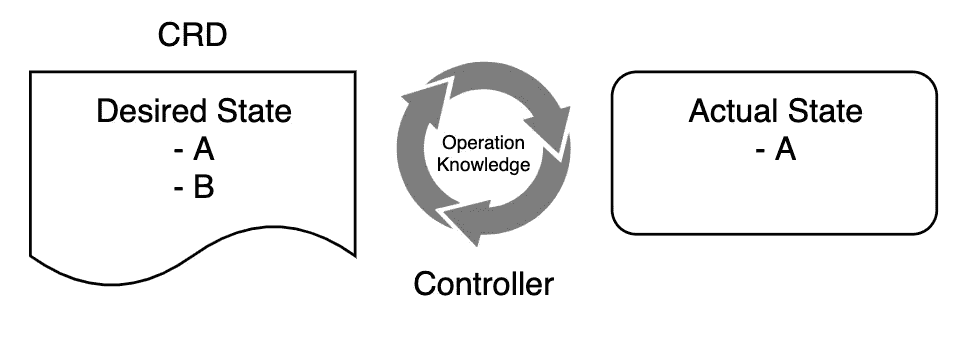
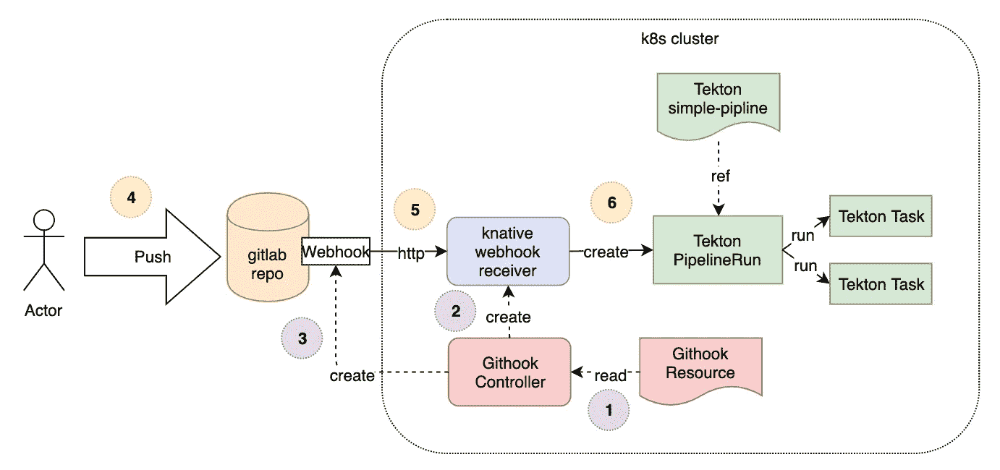
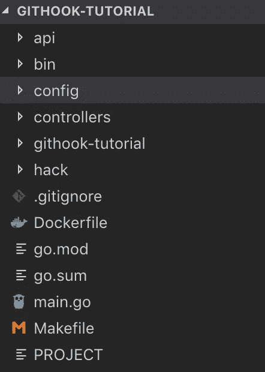

# 构建您自己的 kubernetes CRDs

> 原文：<https://itnext.io/building-your-own-kubernetes-crds-701de1c9a161?source=collection_archive---------0----------------------->

分享关于构建我自己的 kubernetes CRDs 的知识。我将使用我的 [Githook](https://gitlab.com/pongsatt/githook) 例子来解释我用来开发 CRDs 的步骤。我在来自 GIT webhook 的[Build cloud native CI/CD Build pipeline 中解释了我创建这个 CRDs 的原因。](https://medium.com/@pongsatt/build-cloud-native-ci-cd-build-pipeline-from-git-webhook-9cd9a57a32e1)

## 注意:

> 这篇文章是为初学者写的，他需要学习如何建立 CRD 库本内特公司
> 
> 目标是了解制作 CRD 的步骤。您可能无法一步一步地遵循它，因为它有一些依赖项，如安装了 knative

# 您将学到的内容:

*   Kubernetes CRDs 概念
*   如何使用 kubebuilder 和 golang 构建 kubernetes CRD

# 为什么我需要 CRD？

CRD 代表自定义资源定义。这是一种创建自己的 kubernetes 资源的方法，其工作方式与 Kubernetes 资源(如 Pod 或 Deployment)相同。通过自定义资源，您可以将如何管理资源的知识放入 kubernetes 集群，这是非常强大的。

例如， [Strimzi](https://strimzi.io/) 是一个 kubernetes CRD 来管理和运行 kubernetes 上的 kafka 集群。它通过将管理 kafka 集群的知识放入 CRD 控制器本身，消除了运行您自己的 kafka 集群的许多问题。



CRDs 控制器调节回路

您需要一个控制器(在集群上运行的容器中)来管理您的 CRD 资源。控制器将在循环中运行，以检查 CRD 中描述的(期望的)状态是否与现实世界中的实际状态相匹配。例如，您希望容器 A 和 B 在集群上运行。如果 A 或 B 不运行，控制器将为您创建它。

这是一种健壮的方式来管理你想要的东西，在一个有弹性的、灵活的分布式环境中。

# Githook 示例

这个 CRD 叫做“GitHook”。它定义了 git webhook 事件和一个构建管道。GitHook 控制器将 webhook 事件订阅到 git repo，当事件发生时，它将运行 CRD 中定义的构建管道。



“git hook”CRD 如何工作

GitHook CRD 管制员的工作是:

1.  请确保使用不正确的信息将 webhook 注册到 git repo。
2.  确保有服务正在运行，并等待 webhook 事件。我们使用 Knative 服务来接收 webhook，因为它易于实现，且在不使用时可以扩展到 0。

# 使用 kubebuilder 构建 CRD

# *1。设置*

## **安装 kubebuilder 和 kustomize**

***kubebuilder*** 是一款帮助你快速入门 kubernetes CRDs 的工具。您只需要定义您的自定义类型和控制器逻辑。[阅读更多](https://book.kubebuilder.io)。

kustomize 是一个工具，kubebuilder 用它来产生一个 yaml，你的 CRD 需要它来处理 kubernetes

请在此处遵循安装步骤[。](https://book.kubebuilder.io/quick-start.html)

## **初始项目**

我们将创建一个带有模块支持的名为“githook-tutorial”的 go 项目，因此它需要 go 版本 1.11+并且文件夹必须在 GOPATH 之外。

```
mkdir githook-tutorial
cd githook-tutorialgo mod init **gitlab.com/pongsatt/githook**kubebuilder init --domain **my.domain**
```

”**gitlab.com/pongsatt/githook"**是围棋模块名。如果更改为其他内容，则需要替换示例代码中的导入路径。

“ **my.domain** ”将是您的资源的 API 路径。您可以根据需要进行更改

## 创建您的自定义资源

这一步是告诉 kubebuilder 你需要哪种资源。我们将在名为“工具”的组中创建一个名为“ **GitHook** 的资源。

```
kubebuilder create api --group tools --version v1alpha1 --kind GitHook
```

完成后，你应该会看到。



kubebuilder 生成的文件和文件夹

**有趣的路径:**

***API/****:包含你在 go 中的资源信息。您将在此编辑您的资源类型*

****config/*** :包含运行控制器所需的所有 kubernetes yaml 文件*

****Makefile*** :包含构建和部署您的 CRD 所需的所有脚本*

# *2.定义资源类型*

*编辑“api/v1alpha1/githook_types.go”以包含我们的自定义类型。*

*完整代码见 [githook_types.go](https://gitlab.com/pongsatt/githook/blob/master/api/v1alpha1/githook_types.go) 。*

## *关键注意事项:*

*如果我们需要在通过 yaml 创建资源时验证我们的类型，我们需要在该类型上添加注释。比如我们需要你的 gitProvider 是 gitlab，github 或者 gogs。*

```
*// +kubebuilder:validation:Enum=gitlab;github;gogs

// GitProvider providers name of git provider
type GitProvider string*
```

*下一步是通过运行以下命令生成实用函数，如 deepcopy:*

```
*make generate*
```

# *3.机具控制器*

*在这一点上，我们已经有了自定义类型，可以被我们的控制器使用了。*

## *控制器的工作原理:*

*我们名为“GitHookReconciler”的控制器有一个“Reconcile”方法，每次创建、更新或删除“GitHook”资源时都会调用该方法。它将使用队列依次处理每个事件。当错误发生时，我们将返回错误状态，因此当前事件将被重新排队并等待稍后处理。*

*我们的控制器将控制另外两个资源:*

1.  *Knative 服务(能够在发生 git 事件时处理这些事件)。*
2.  *Git webhook(能够接收 Git 事件)。*

***创建/更新逻辑:***

*   *使用提供的 k8s 客户端按名称获取 GitHook 信息。*

```
*// Reconcile main reconcile logicfunc (r *GitHookReconciler) **Reconcile**(req ctrl.Request) (ctrl.Result, error) {... err := **r.Get(context.Background(), req.NamespacedName, sourceOrg)** ...*
```

*   *获取由此资源创建的 Knative 服务。如果不存在，请创建新的。如果存在但信息更新，则更新它。*

```
*func (r *GitHookReconciler) **reconcile**(source *v1alpha1.GitHook) error { ...ksvc, err := **r.reconcileWebhookService(source)**...*
```

*   *使用上一步给出的服务 URL 注册 git webhook，并将返回的 ID 保存在 GitHook 资源中。*

```
*func (r *GitHookReconciler) **reconcile**(source *v1alpha1.GitHook) error {...hookID, err := r.reconcileWebhook(source, hookOptions)...*
```

*   *用最新信息更新当前 GitHook 资源*

```
*// Reconcile main reconcile logicfunc (r *GitHookReconciler) **Reconcile**(req ctrl.Request) (ctrl.Result, error) {...if err := **r.Update(context.Background(), source)**; err != nil { ....}...*
```

***删除逻辑:***

*当 GitHook 资源被删除时，我们通过检查字段“DeletionTimestamp”不为零来检测这一点。然后，我们将通过调用 finalize 方法删除我们的依赖资源，在本例中是 knative service 和 git webhook。*

```
*// Reconcile main reconcile logicfunc (r *GitHookReconciler) **Reconcile**(req ctrl.Request) (ctrl.Result, error) {...**if sourceOrg.ObjectMeta.DeletionTimestamp == nil {** ...} else { if r.hasFinalizer(source.(*v1alpha1.GitHook).Finalizers) { **reconcileErr = r.finalize(source.(*v1alpha1.GitHook))** }}...*
```

*如果我们不能删除 knative 服务或 git webhook，我们不会通过不从 GitHook 资源中删除终结器信息来允许我们的 GitHook 被删除。*

```
*func (r *GitHookReconciler) finalize(source *v1alpha1.GitHook) error { ... **r.removeFinalizer(source)**
}*
```

## *代码:*

*编辑文件“控制器/githook_controller.go”*

*请看完整代码 [githook_controller.go](https://gitlab.com/pongsatt/githook/blob/master/controllers/githook_controller.go) 。*

***重点提示:***

*我们的控制器需要权限来获取、列出、创建和更新另一个 kubernetes 资源。我们需要为 kubebuilder 添加注释批注，以便为我们生成权限 yaml。*

```
*// +kubebuilder:rbac:groups=tools.pongzt.com,resources=githooks,verbs=get;list;watch;create;update;patch;delete...// Reconcile main reconcile logic
func (r *GitHookReconciler) Reconcile(req ctrl.Request) (ctrl.Result, error) {...*
```

# *4.更新管理器*

*由于我们的控制器使用其他资源 API，如 knative，我们需要在“main.go”中注册这些类型。*

```
*func init() {
    githookv1alpha1.AddToScheme(scheme)
    servingv1alpha1.AddToScheme(scheme)
    servingv1beta1.AddToScheme(scheme)
    tektonv1alpha1.AddToScheme(scheme)
    corev1.AddToScheme(scheme)
    // +kubebuilder:scaffold:scheme}*
```

# *5.测试控制器*

*您可以通过运行以下命令在本地计算机上测试或调试控制器:*

```
*make installmake run*
```

***make install** :将生成 CRDs yaml 文件并应用到您的 kubernetes 集群*

***make run** :将运行测试并运行“main.go”*

*您的控制器将开始监控您的资源并执行协调循环。*

# *6.部署 CRDs 和控制器*

*这是您需要 CRD 在集群上可用的时候。您需要运行以下命令进行部署:*

```
*make docker-build IMG=<your image registry>/controller
make docker-push IMG=<your image registry>/controller 
make deploy*
```

***make docker-build** 将构建 docker 图像作为你的 IMG 变量*

***make docker-push** 将 docker 图像推送到注册表*

***make deploy** 将生成所有的 yaml 文件并部署到您的集群中*

*或者，您可以发布您 yaml 文件，让其他人使用以下命令轻松安装您的 CRD:*

```
*kustomize build config/default > release.yaml*
```

# *结论*

*在这篇文章中，我只讨论构建 CRD 的要点。我没有提到的部分是:*

*   *作为 Knative 服务 webhook 运行的代码*
*   *资源所有者的概念(GitHook 拥有它创建的 Knative 服务)*
*   *git api 客户端的代码*
*   *用于构建和发布 GitHook 资源的 Gitlab CI/CD*

*这篇文章的主要目的是分享我的经验建设我的 CRD。*

*希望你觉得有用。*

*谢谢:D*