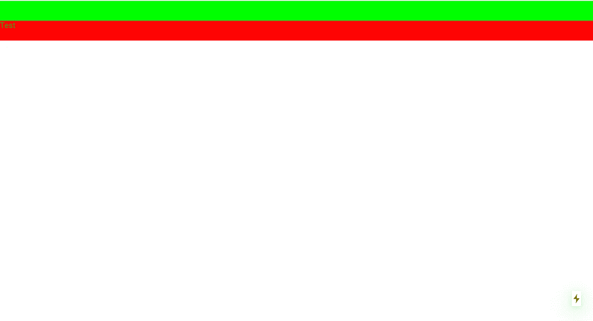

# 在 5 分钟内构建您自己的 React 组件—2020 年更新

> 原文：<https://itnext.io/building-your-own-react-components-in-5-minutes-updated-2020-d3ff4e61f009?source=collection_archive---------4----------------------->

在 5 分钟内构建您自己的组件以用于 React.js 和 Next.js


图多尔·巴休在 [Unsplash](https://unsplash.com?utm_source=medium&utm_medium=referral) 上的照片

几年前，当我第一次尝试 React.js 环境时，我提出了不同的概念和不同的命名。其中一个概念是高阶组件(或 HOC)，这无疑是我最喜欢(和使用)的特性之一。

正如 React 官方文件所说:

> 高阶组件(HOC)是 React 中重用组件逻辑的一种高级技术。本质上，hoc 不是 React API 的一部分。它们是从 React 的组合性质中出现的一种模式。
> 具体来说，**高阶分量是取一个分量，返回一个新分量的函数。**

React 使用 HTML 来构建我们的应用程序的 UI。有了 HOC，我们可以扩展功能，不仅可以使用

、

和

# ，还可以使用我们创建的定制组件，如

<menu>、<navigationbar>、<carousel>。高阶组件还允许我们向这些组件发送参数，即我们将定义的自定义参数。一个基本的例子是<navigationbar islogged="{}/">。</navigationbar></carousel></navigationbar></menu>

# 让我们创建我们的第一个组件。

作为最简单的例子，我们将构建一个接受颜色参数的容器。我们将能够重用这个可着色的容器，并为它们设置不同的颜色。

我更喜欢将我的组件保存在单独的**组件**文件夹中。我将转到我的组件文件夹，然后我们将创建一个名为 **ColorableContainer.js** 的新文件。

```
import React from 'react';export default class ColorableContainer extends React.Component {

    render() {
        return (
            <div className='colorableContainer' style={{ backgroundColor: this.props.backgroundColor}} >
                {this.props.children}
            <style jsx>{`
                .colorableContainer {
                    width: 100%;
                    height: 40px;
                }
            `}</style>
            </div>
        )
    }
}
```

## 现在，我们在这里做什么？

我们正在创建一个扩展 React 的类( **ColorableContainer** )。组件(因为我们想使用我们的类作为组件)。
在我们的渲染函数中，我们返回一个具有两种不同样式的 div:
—**style jsx**:定义静态变量 width 和 height。
— **内嵌样式**:动态检测我们的道具值来设置背景颜色。我们使用 **this.props** 来访问我们将要发送的参数(<Component prop 1 = { prop value } prop 2 = { prop value 2 }/>)。

最后，我们将所有这些包装到 this.props.children 中。这个值指的是我们将用组件包装的组件

```
<Component>
  ...(children)...
</Component>
```

我们的组件现在可以使用了。我们可以导入它并使用它来定义背景颜色，并添加添加内部元素的功能。由于这只是一个基本的方法，我们定义了一个固定的高度，但正如我们所看到的是高度可定制的。

现在我们可以导入它:

```
import ColorableContainer from '../components/ColorableContainer';
```

新的可以用它作为新的组件。

*请注意，以下代码来自 Next.js 项目，因此可能与 react.js 项目有所不同。*

```
import ColorableContainer from '../components/ColorableContainer';export default function Home() {
  return (
    <div>
      <ColorableContainer backgroundColor={'rgb(0,255,0)'}/>
      <ColorableContainer backgroundColor={'red'}>
          <p>Test</p>
        </ColorableContainer>
        <style jsx>{`
            p {
              margin: 0;
            }
        `}</style>
    </div>
  )
}
```

编译时，我们将找到我们的 2 个容器。一个具有绿色背景颜色(用 RGB 定义)而没有内部内容，下一个具有红色背景，仅用“红色”和内部段落定义。



我们的 HOC 可着色容器的结果

# 结论

这只是处理高阶元件的一种基本而快速的方法。这本身就是一个热门话题，React 团队正在不断更新和添加新功能。我会写更多关于 hoc 的内容，以及用它能实现什么(组成、增强、参考)