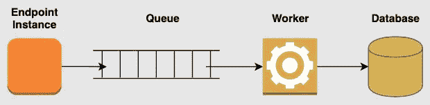
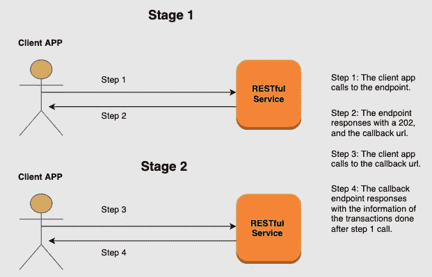
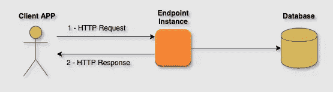

# 批量使用 RESTful APIs

> 原文：<https://itnext.io/bulk-with-restfull-apis-7c5e6be84ed3?source=collection_archive---------1----------------------->

丹尼尔·蒙泰罗在 [Unsplash](https://unsplash.com?utm_source=medium&utm_medium=referral) 上拍摄的照片

*当我们使用 RESTful APIs 时如何处理批量操作。
处理不同的 HTTP 响应&后面流程的注意事项。
选择正确的解决方案，避免减速和错误配置。
由* [*曼努埃尔拉亚*](https://medium.com/u/a4d26b34962?source=post_page-----7c5e6be84ed3--------------------------------)*&*[*佩德罗埃斯库德罗*](https://medium.com/u/a36f378c5095?source=post_page-----7c5e6be84ed3--------------------------------) *。*

## 散装 RESTful，谢谢

在 RESTful API 中处理批量请求是这种架构中最常考虑的情况之一。当您的系统需要面对相当大的流量时，这一点尤其明显。

在进行更深入的分析之前，我们想澄清一下，当要完成的操作是同一类型、在同一集合上时，我们认为我们正在执行批量操作。在其他情况下，我们将讨论批处理动作(我们留给下一篇文章的另一个问题是批处理动作是否是 REsTful 的)。如果您想要更多关于这方面的文档，我们邀请您访问由 John Apostolidis 撰写的关于[批量操作的文档。](http://apostolidis.me/bulk-operations/)

此外，作为免责声明，我们知道 SSE、WS、SFTP 加载和其他推送数据的方法，但是在本文中，我们将针对这一挑战分析 RESTful 选项。正如我们在结论中提到的，最终的解决方案将取决于一系列因素，其中包括您以前的基础设施、监控系统、员工的知识、产品要求、确切的流量等。

## 问题

假设您想用一个常规的 RESTful 请求创建(或更新，或删除)一个项目。您可以对适当的端点进行 POST HTTP 调用，类似于**POST**[**HTTP://your domain/collection**，](http://yourdomain/collection,)所需的数据。然后，如果一切顺利，您会得到 201 响应，如果失败，您会得到 4xx / 5xx 回复。初级工作。别紧张，皮斯。

现在，假设您想用一个 HTTP 调用创建两个项目。这种动作绝对有道理。您节省了传输层的时间，并且客户端应用程序避免了发出多个请求。

嗯，如果一切顺利，您的 API 将会以 201 作为响应。但是，当创造失败时会发生什么呢？或者当请求需要创建 1000 个项目而不是 2 个，并且服务器应用程序需要 10 秒以上的时间来处理时呢？是啊，这才是重点。

这里你有一些方法来处理这个问题:

## 1.用 202 回答，稍后处理数据

一般输入工作流程

在这种情况下，端点接受一个带有一堆要处理的元素的请求，并将它们存储在一个队列系统中。然后，一个工人将使用和处理队列中的消息。

考虑因素:

*   除了请求的格式之外，在端点级别验证收到的数据不是一个好的做法。把支票留给工人。
*   您需要为每个请求创建一个回调端点。这是显示过程结果的地方(访问将使用长轮询方法来完成，如果需要的话，使用速率限制来强制执行)。

客户端 API 工作流

*   您可以选择更适合您的需求、知识或当前基础设施的队列系统(例如， [RabbitMQ 是一个很好的选择](https://www.rabbitmq.com/))。我们已经看到了用于存储 NoSQL 数据库的实现。在这些情况下，程序的速度应该无关紧要。一个简单的后端任务，没有硬性的时间表。

## 2.用 200(或 201)响应，处理当前数据

一般工作流程

使用这种方法，客户端发送完整的批量请求，整个批量被处理，然后处理请求的实例发送响应。该解决方案有一些优点，但也有一些缺点:

*   数据正在快速处理中。提供了同步响应，并且没有可能降低工作流速度的附加层。
*   开发成本不高。它非常类似于任何其他 RESTfull 端点。
*   维护成本很低。不需要更多的基础设施。
*   如果处理请求的实例失败(意外关闭)，客户机不知道数据是全部处理了，还是部分处理了，或者根本没有处理。
*   为了正确处理响应，需要为发送的每个元素添加一些逻辑。

## 3.回复 206

虽然我们还没有看到这个选项最终实现，但是我们已经在一些会议上看到一些开发人员提出了这个选项。在不止一个国家。在不同的公司。不仅仅是大三。所有这些加在一起，似乎是对何时使用 206 响应，或者更具体地说是什么的误解。

HTTP 206 响应旨在用于成功的范围请求。我猜混乱来自于指南*“206 部分内容”*中对这段代码的描述。范围请求被认为是处理请求，允许只从服务器向客户机发送 HTTP 消息的一部分。这主要用于下载 jpg、mp4、pdf 等大文件。你可以在[这个 Mozilla 页面上找到关于范围请求](https://developer.mozilla.org/en-US/docs/Web/HTTP/Range_requests)的更深入的解释。

## 4.回复一个 200，就跳，信任(完全不要这样！！！)

照片由[莱昂·塞伯特](https://unsplash.com/@yapics?utm_source=medium&utm_medium=referral)在 [Unsplash](https://unsplash.com?utm_source=medium&utm_medium=referral) 上拍摄

这是最懒的解决方法。也是最弱的一个。当接收到请求时，发送一个 200 HTTP 响应，而不关心请求的操作是否成功。这种行为带来了关键问题，比如客户端缺乏可跟踪性(更不用说它是如何违背 RESTful 原则的)。

也许，您认为这种替代方法对于*发送并忘记方法*来说很好，有时在日志记录中使用。但是如果你退后一步，重新思考它，你会意识到如果你不关心一些数据，很可能你不需要它。无论如何，这个糟糕的选择在一段时间内是可行的。直到你需要在危机中挖掘日志，而那些日志并不在那里。

多年来，我们已经看到了这种实现的几种变体。这些都不值得开发时间:

*   将消息排队并在以后处理。类似于选项一，但做得很差，没有任何回调端点(同样，202 比 200 更准确)。
*   在响应前验证每个元素。如果有错误，发送 400。但是，如果在验证之后，还有另一个问题(例如，在持久性方面)没有充分地传达给客户端。
*   要求客户端调用资源端点来检查对象是否存在(或者当请求的操作是 PUT 或 PATCH 时，检查它是否以正确的值出现)。如果他们没有预期的答案，那么操作失败了。这种选择完全没有效率。端点将以一种非常奇怪的方式被调用。日志记录和调试将成为一场噩梦。仅仅检查请求就会使应该提供内容的端点过载。此外，当您偏离标准时，与您的系统的集成将会是痛苦的和容易出错的。

## 那么，我们该怎么办呢？

埃文·丹尼斯在 [Unsplash](https://unsplash.com?utm_source=medium&utm_medium=referral) 上的照片

没有非黑即白的情况，但也没有灰色的情况。您需要了解您的下划线架构，并分析您的客户和业务需求。在任何情况下，除非您自己探索或者做一个快速的概念验证，否则我们强烈建议您避免选择 3 和 4。

关于备选方案 1 和 2，备选方案 1 似乎更有力。响应 a 202 并在稍后处理数据，您可以确保在出现意外问题时提供保护，并确保数据完整性。然而，根据您的应用程序的需求和您可以假设的权衡，此时处理数据仍然是一个有效的解决方案。

请记住，您对如何在 API 级别组织通信的决定将决定您的应用程序的速度。您自己的相关微服务、合作伙伴应用以及 web 和移动开发的集成将取决于此。

*记住，代码是诗，但前提是你要小心。*

由[马库斯·斯皮斯克](https://unsplash.com/@markusspiske?utm_source=medium&utm_medium=referral)在 [Unsplash](https://unsplash.com?utm_source=medium&utm_medium=referral) 上拍摄