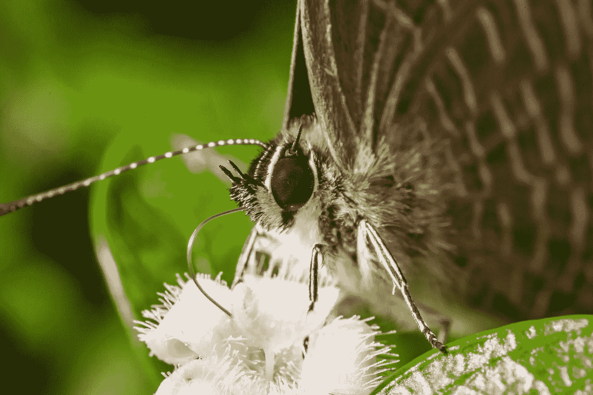

# 视频:构建蝴蝶标识符

> 原文：<https://itnext.io/butterflix-349a27ab3733?source=collection_archive---------3----------------------->

上次，我分享了我如何着手创建一个由 Tensorflow 和 Mobilenet 支持的基本图像分类器。

今天，我将这个概念延伸了一点，构建了 Butterflix:一个可以识别 200 种蝴蝶的 KNN 分类器。

如果您喜欢冒险，您可以直接进入源代码，开始构建自己的源代码。

 [## timtamimi/butterflix

### 蝴蝶识别 app。在 GitHub 上创建一个帐户，为 timtamimi/butterflix 开发做出贡献。

github.com](https://github.com/timtamimi/butterflix) 

已经拍了一些蝴蝶照片，你想看看它的实际效果吗？

[**我在这里贴了一个演示**](http://34.67.116.81/) *(可能破也可能不破…)*

下次见。