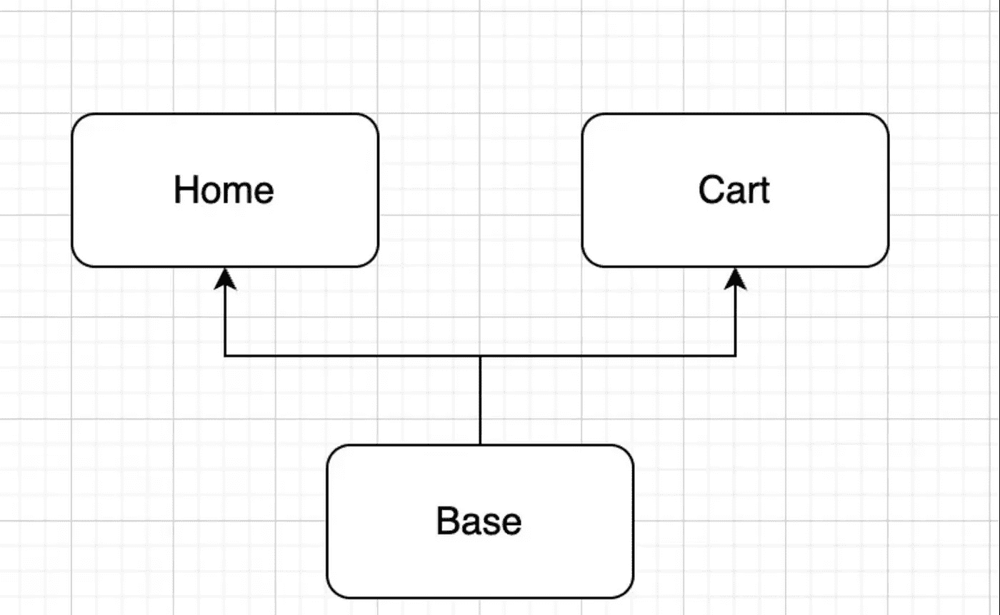

# butterfly——支持活动、片段、对话片段和组合 UI 的全功能导航框架

> 原文：<https://itnext.io/butterfly-a-full-featured-navigation-framework-that-supports-activity-fragment-and-compose-664882bb125f?source=collection_archive---------3----------------------->


**GitHub:**[蝴蝶 ](https://github.com/ssseasonnn/Butterfly)

经过漫长的等待，Butterfly 终于发布了新版本。此次更新为大家带来了一个全功能的导航框架，不仅支持 Activity、Fragment 和 DialogFragment，还在 Compose UI 中加入了路由支持。至此，一个统一的路由框架诞生了。它不仅小巧灵活，而且功能强大。Butterfly 提供了统一的 API。你不需要关心目的地，在哪里。只要提供一个方案，Butterfly 就会导航到正确的地方。

不用多说，看看 Butterfly 支持的特性列表。

# 特征表

✅ **支持导航活动**

✅ **支持导航片段**

✅ **支持导航对话片段**

**✅支持导航撰写 UI**

**✅支持导航行动**

**✅支持导航参数传递和解析**

**✅支持获取导航返回结果**

**✅支援导航拦截器**

**✅支持片段和构造 UI backstack**

**✅支持片段和组合 UI 组管理**

**✅支持分片和组合 UI 启动模式，如 SingleTop 和 ClearTop**

**✅支持组件化通信**

# 导航和参数传递

眼见为实，耳听为虚。如此强大的功能，很少有它如何工作的例子。让我们来看看基本的导航功能:

```
@Agile("test/activity")
class AgileTestActivity : AppCompatActivity()

@Agile("test/fragment")
class TestFragment : Fragment()

@Agile("test/dialog")
class TestDialogFragment : DialogFragment()

//Navigation
Butterfly.agile("test/xxx").carry()

//Or navigate and get the returned data
Butterfly.agile("test/xxx")
    .carry {
        val result = it.getStringExtra("result")
        binding.tvResult.text = result
    }
```

如上图，导航就是这么简单。无论目的地是什么，在哪里，只需要一个方案就可以完成路由跳转。方案没有限制。它可以是任何字符串或标准方案，如 **butterfly://home/path** 等。

在导航的过程中，参数传递也是必不可少的一部分。蝴蝶提供了两种方式供你选择。一种是拼接方案，比如**测试/活动？paramA=123 & paramB=abc** ，即 **paramA** 和 **paramB** 可以传送到目的地。另一种是通过调用 **params** 方法来传递所需数据，比如:

```
//Splicing scheme
Butterfly.agile("test/scheme?a=1&b=2").carry()

//call params
Butterfly.agile("test/scheme?a=1&b=2")
    .params("intValue" to 1)
    .params("booleanValue" to true)
    .params("stringValue" to "test value")
    .carry()
```

如上图，可以同时进行方案拼接和 params 方法调用。传递的所有参数都可以在导航目的地获得，params 方法可以传递 Bundle 支持的任何类型的参数。

在目的地接受参数:

```
//On the navigation destination page, you can obtain the passed parameter value through the key field of the parameter
@Agile("test/scheme")
class AgileTestActivity : AppCompatActivity() {
    val a by lazy { intent?.getStringExtra("a") ?: "" }
    val b by lazy { intent?.getStringExtra("b") ?: "" }
    val intValue by lazy { intent?.getIntExtra("intValue", 0) ?: 0 }
}

//In addition to manual parameter analysis, Bracer can also be equipped to realize fully automatic parameter analysis
@Agile("test/scheme")
class AgileTestActivity : AppCompatActivity() {
    val a by params<String>()
    val b by params<String>()
    val intValue by params<Int>()
}
```

关于护腕的使用细节，请参见 Github: [护腕](https://github.com/ssseasonnn/Bracer)

# 撰写导航

Compose 作为 Android 新的 UI 框架异军突起。越来越多的项目正在大量使用 Compose，因此迫切需要支持 Compose 导航。

```
@Agile("test/compose")
@Composable
fun HomeScreen() {
    Box {
        ...
    }
}

//Navigate to the HomeScreen page
Butterfly.agile("test/compose").carry()
```

如上所示，Compose 的导航与 Activity 或 Fragment 的导航完全一致。统一的 API 使它更容易使用。

组合导航中的参数传递和获取与活动或片段中的参数传递和获取几乎相同。传输参数还支持拼接方案和调用参数。要获得参数，只需要向 Compose 组件添加一个 bundle 参数，然后就可以通过 Bundle 参数获得导航中传递的参数。

```
@Agile("test/compose")
@Composable
fun HomeScreen(bundle: Bundle) {
    val a by bundle.params<Int>()
    val b by bundle.params<Int>()
    val booleanValue by bundle.params<Boolean>()

    Box {
        Text(text = a)
    }
}

//Splicing scheme
Butterfly.agile("test/compose?a=1&b=2").carry()

//or call params
Butterfly.agile("test/compose?a=1&b=2")
    .params("intValue" to 1)
    .params("booleanValue" to true)
    .params("stringValue" to "test value")
    .carry()
```

# 路线拦截器

拦截器是一个非常实用的功能，可以提供强大的路由控制功能，如登录检测、AB 测试等。Butterfly 提供了两种类型的拦截器:全局拦截器和一次性拦截器，可以针对不同的使用场景灵活选择。

首先，定义拦截器函数:

```
//Custom interceptor
class TestInterceptor : ButterflyInterceptor {
    override fun shouldIntercept(agileRequest: AgileRequest): Boolean {
        //Detect whether interception is required
        return true
    }

    override suspend fun intercept(agileRequest: AgileRequest) {
        //Processing interception logic
        println("intercepting")
        delay(5000)
        println("intercept finish")
    }
}
```

配置全局拦截器:

```
//Add a global interceptor
ButterflyCore.addInterceptor(TestInterceptor())

//Skip all global interceptors
Butterfly.agile("test/scheme").skipGlobalInterceptor().carry()
```

配置一次性拦截器:

```
//Only the current navigation uses this interceptor
Butterfly.agile("test/scheme")
    .addInterceptor(TestInterceptor())
    .carry()
```

拦截器提供了 **suspend** 拦截方法，这个方法足够聪明，一看就知道它的长处。👻

# SingleTop 和 ClearTop 启动模式和 backstack

众所周知，Activity 支持多种启动模式，其中 SingleTop 和 ClearTop 尤为常见。Butterfly 将这两种启动模式进行了分片和组合，并提供了统一的 API。你只需要调用 **singleTop** 或者 **clearTop** 就可以了。

```
//for Activity
@Agile("test/activity")
class AgileTestActivity : AppCompatActivity()

Butterfly.agile("test/activity")
    .clearTop()              
    // or .singleTop() 
    .carry()

//for Fragment
@Agile("test/fragment")
class TestFragment : Fragment()

Butterfly.agile("test/fragment")
    .clearTop()                 
    // or .singleTop()   
    .carry()

//for Compose
@Agile("test/compose")
@Composable
fun HomeScreen() {}

Butterfly.agile("test/compose")
    .clearTop()                 
     // or .singleTop()  
    .carry()
```

有了启动模式，后备栈自然是必须的。默认情况下，Butterfly 使用回退堆栈来管理活动、片段、对话片段和合成。每次导航到一个目标时，该目标将被添加到回退堆栈中。通过使用**缩回**方法，Butterfly 可以回到上一页。

```
//Close the top page and go back to the previous page
Butterfly.retreat()

//Close the top page of the stack, go back to the previous page and return data
Butterfly.retreat("result" to "123")
```

由于 Compose 的性质，它不支持 **Back 和返回数据**，Compose 可以通过重新导航来传递新数据，从而直接刷新页面

# 片段和组合的分组管理

除了以栈的形式管理片段和复合，Butterfly 还支持以组的形式管理它们。比如 APP 首页多个标签页对应多个碎片和复合屏时，可以用群组管理来处理这种场景。

```
// group fragments
Butterfly.agile("test/fragment1")
    .group("groupName")          
    .carry()

Butterfly.agile("test/fragment2")
    .group("groupName")          
    .carry()

Butterfly.agile("test/fragment3")
    .group("groupName")          
    .carry()

// group composes
Butterfly.agile("test/compose_screen1")
    .group("groupName")          
    .carry()

Butterfly.agile("test/compose_screen2")
    .group("groupName")          
    .carry()

Butterfly.agile("test/compose_screen3")
    .group("groupName")          
    .carry()
```

通过使用相同的组名，可以在相同的组中管理这些片段或组成屏幕。在同一组中重复导航不会创建实例。

# 组件化通信

作为基于组件的路由框架，组件之间的通信也是必不可少的功能。Butterfly 不仅支持常规的接口接收，还支持组件之间不相互依赖的直接通信。

使用接口 sink 的形式，首先有一个公共依赖组件，通常是 Base 或 Common，需要通信的两个组件，比如 Home 和 Cart，都依赖于 Base 或 Common，形成如下依赖图:



如果 Home 需要调用 Cart 中的 addToCart 方法，首先在 Base 中定义通信接口:

模块基座:

```
@Evade
interface CartApi {
    fun addToCart(product: String)
}
```

然后在 Cart 中创建 CartApi 的实现:

模块推车:

```
@EvadeImpl
class CartApiImpl : CartApi {
    override fun addToCart(product: String) {
        // do something
    }
}
```

然后可以在 Home 中调用 CartApi 提供的方法:

模块主页:

```
val cartApi = Butterfly.evade<CartApi>()
cartApi.addToCart("test")
```

接口接收器是一种很好的交流方式，但是也有一些问题。如果你要通信的组件越来越多，那么就会有越来越多的接口下沉，最终导致 Base 或者 Common 的爆炸。因此，除了使用接口接收器形式，Butterfly 还提供了组件之间直接通信的能力，而组件之间完全没有任何依赖关系。

和前面的结构类似，Home 和 Cart 也需要通信。Home 需要调用 Cart 中的 addToCart 方法，但这次不需要将接口下沉到 Base 或 Common，只需要在 Home 中定义通信接口即可:

模块主页:

```
@Evade
interface CartApi {
    fun addToCart(product: String)
}
```

然后在 Cart 中创建 CartApi 的实现。由于 Home 和 Cart 不直接依赖，Cart 的实现类不需要实现 Home 中的接口，只需要使用与 Home 中的接口相同的方法名和方法参数即可:

模块推车:

```
// No need to implement CartApi
@EvadeImpl
class CartApiImpl {
    fun addToCart(product: String) {
        // do something
    }
}
```

然后你可以在家里调用卡塔皮的方法:

模块主页:

```
val cartApi = Butterfly.evade<CartApi>()
cartApi.addToCart("test")
```

# 路由表注册和 Gradle 插件

Butterfly 将为每个带注释的模块生成一个路由表。命名规则是:Butterfly[模块名]模块

手动注册:

```
class DemoApplication : Application() {
    override fun onCreate() {
        super.onCreate()
        //regist
        ButterflyCore.addModule(ButterflyHomeModule())
        ButterflyCore.addModule(ButterflyFooModule())
        ButterflyCore.addModule(ButterflyBarModule())
    }
}
```

插件自动注册:

1.添加插件依赖关系

```
//use plugins DSL:
plugins {
    id "io.github.ssseasonnn.butterfly" version "1.0.1"
}

//or use legacy plugin application:
buildscript {
    repositories {
        maven {
            url "https://plugins.gradle.org/m2/"
        }
    }
    dependencies {
        classpath "io.github.ssseasonnn:plugin:1.0.1"
    }
}

//add plugin
apply plugin: "io.github.ssseasonnn.butterfly"
```

2.实现您自己的应用程序类

```
class DemoApplication : Application() {
    override fun onCreate() {
        super.onCreate()
    }
}
```

通过插件，Butterfly 会自动发现所有的路由模块，并自动注入代码将路由表添加到应用程序中，从而解放双手

# 结束

更多关于 Butterfly 的细节，请到 GitHub: [Butterfly](https://github.com/ssseasonnn/Butterfly)

欢迎感兴趣的朋友提供反馈和建议，谢谢。