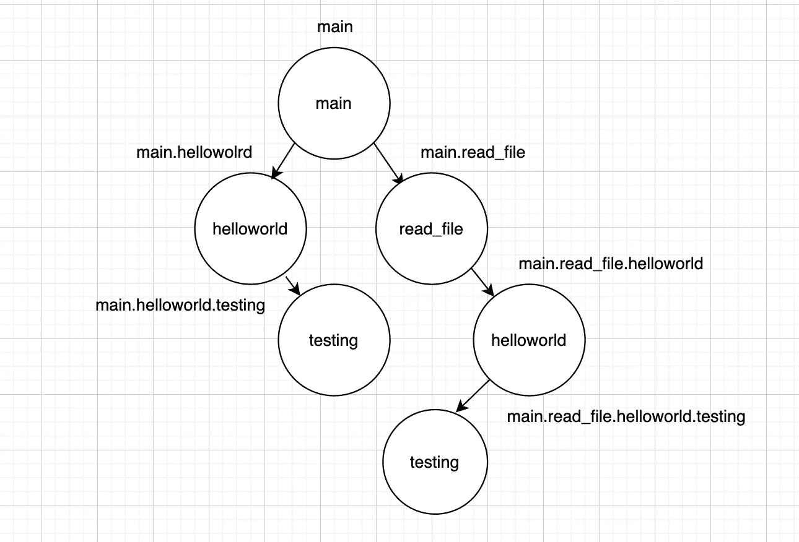
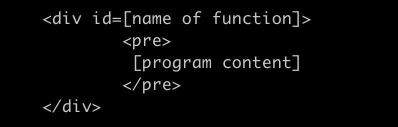

# 开发 1 中的 Byfrost 源代码可视化工具—索引图

> 原文：<https://itnext.io/byfrost-in-development-1-an-indexing-graph-b696282c734d?source=collection_archive---------0----------------------->

这个标题可能更好，但它确实与图表有很大关系，因此它至少不是虚假广告。


但首先，一张彩虹桥状的东西的照片！

这是我第一篇文章的延续，在那篇文章中，我在这里宣布了我的源代码路径可视化器；[介绍 by frost-一个源代码路径可视化工具](/introducing-byfrost-a-source-code-path-visualizer-2d64002d1f9a)。

因此，Byfrost 的开发终于拉开了序幕，并得到了 Reddit 和 Medium 上的大量赞誉。我喜欢围绕这个工具的激动人心的事情，所以我想我应该让大家了解一下从零开始构建一个索引器的痛苦、令人心悸的悲剧。所以，请坐好，放松，凝视窗帘后面，很快，当主题公园开门的时候，你也可能会想到是什么促成了这个美丽的噩梦。

那么，在丢下那颗重磅炸弹后的两周里，我都在忙些什么呢？很多，然后突然什么都没有了，然后所有的事情都发生了！我很高兴地宣布，我们已经有了一个工作的后端！！🎉到目前为止的功能:

进步！！

UI 需要大量的定位工作，但核心已经启动并运行！

在我们进入细节之前，让我们快速回顾一下一些变故:毕竟我不会首先支持 C。我在 Reddit 上的一个我不愿称之为 Q&As 的文章中说过，这个工具将支持 C 作为第一语言，现在我已经决定我确实不会这么做了。🤔。事实证明，C 语言比我最初想象的要难解析得多。这是欺骗性的，因为缺乏结构使我认为这很容易做到，但这是一个谎言。

另一个原因是这将是一个插件。是，也不是。它将是一个网络应用程序，但也是一个插件，但也是一个网络应用程序，因为我有点立即需要这个，我还没有学会插件开发。但是总有一天你会选择你的毒药。

好吧，让我们开始吧！

## 我将在今天的更新中讨论什么

自从最初宣布这个小项目以来，我变得非常富有成效，这个项目已经覆盖了大量的领域。正因为如此，我将尽可能地保持“概述”的形式，以便在不把它变成小说的情况下，让读者理解索引器背后的思想。

我要过去了:

*   索引器的整体架构——算是吧(编辑:回想起来，我搁置了很多细节，因为这篇文章太长了)
*   索引方法以及将功能标签与各自的功能相关联

这个系统是用 Golang 后端和 Angular 前端编写的。为什么要去棱角分明？这是我日常工作中用到的语言，所以这是我唯一能及时找到的一堆语言。我是说，我的职业是围棋工程师，哇，那个棱角分明的家伙确实对我的生存意志造成了影响。虽然我使用了 Angular 前端，但我无意中使我的前端渲染结构与框架无关，主要是因为我无法用 Angular 的许多指令和内置的 Angular“东西”完成大量的 HTML 动态渲染。我将在下面的**方法**部分详细介绍这一点。

# 前端——与 Angular 的战斗


它就像看起来一样史诗

哦，天啊，这个角色多次踢到我的牙齿。我根本不是一个前端工程师，我必须在几周内学会这种技术，并达到一定程度才能完成这个任务，我要说的是:前端比后端难——等等！让我解释一下！把煎锅放下，布莱恩！！(这可能不是你的名字，但我想我会吓坏所有叫“布莱恩”的读者)。

我发现 frontend 类似于告诉一个画家从零开始画蒙娜丽莎，并且完全按照你在喝醉和遭受新的心碎时在昏暗的报纸上写的糟糕的指示。我对大多数看起来简单的东西最后的困难感到困惑。对于动态大规模 HTML 呈现，你需要一些技巧来避免代码被遗忘。

# 方法


…嗯嗯…

在这里，我将回顾我采用的三种方法，为什么它们失败了，为什么最后一种方法成功了。这将涵盖很多我与 Angular 的斗争。

**方法 1:运行时组件生成**

对我来说，第一个直观方法是制作一个表示单个代码显示面板的角形组件。类似这样的东西；

```
export class ByFrost implements whatever {
  ...
}
```

这将容纳一切。它会有一些变量来组成一个单独的程序面板。

类似于:

```
let filePath: string = "<a (click)="openFile()">main.c</a>"let sourceCode: string = "int main(int argc char **argv)\n{\n\t<a (click)=\"newComponent()\">printf</a>(\"hello world\");\n\treturn (0);...
```

`filePath`是…嗯…文件路径和`sourceCode` …你明白了。

这种方法的唯一问题是，这些指令(`(click)="openFile"`)和另一个指令不能在运行时呈现，它们是编译时专有的细节。看到了；那些就是我之前提到的有棱角的“东西”(指令什么的)。他们所做的是将那些`a`标签绑定到那些被点击时会在后台触发的目标函数上。`openFile`会触发一个名为`openFile`的函数，当你点击它时会触发这个函数。与`printf`同样的故事。对于`printf`,包含其源代码的新组件将被生成并附加到原始 ByFrost 组件上。这就是我们的想法。单击路径时打开文件；并在单击一个函数时创建一个新的函数组件。

超级简单。这能有多难，真的？

哦，这预示着…

我的朋友们，事实证明这是一个非常非常困难的主意，而且是一个非常糟糕的主意。

事实证明你不能这样做。在为此哭泣了无数个小时之后，我发现运行时编译那些角度标签/指令/等等真的是不可能的。不完全是。我全身心投入到这个方法中。部分原因是它让我觉得自己像一个真正的编译器工程师，我可以证明我花了这么多年努力成为一名编译器工程师是正确的。我甚至在研究 Angular 的即时编译器，看看我是否可以强迫它在运行时编译这些。我也会进入 Angular 源代码来强制修复(并使我的整个 Angular 设置成为垃圾，因为它会破坏 CLI 和使 Angular 不可怕的一切)，但我停下来，决定用下午剩下的时间在电影院看壮志凌云：独行侠。伟大的电影。

**方法 2:使用 innerHTML 进行渲染**

这接近我最终决定的，但我的第一次尝试也有类似的问题。这次我没有生成新的组件。不，这一次，我只是有一个巨大的 HTML 字符串列表，表示代码显示面板，它将在一个 Angular ngFor 循环中输出。

这是一种进步；事情是渲染，但我仍然有我的渲染没有编译角函数和标签的问题。

我完全不知所措了。在所有的大张旗鼓之后；这些年来我一直在努力构建我的索引工具。这条路终于结束了吗？

**方法 3:在后端准备所有前端功能**

这种新的思考方式是在与另一位后端工程师同事交谈时产生的。我遇到了一些小问题，这里我就不多说了，因为这篇文章会很长。这里的方法包括在 HTML 中完全去除角组件的使用；这是永远不会工作，因为动态 HTML 渲染是绝对必须的，这些从来没有编译。去除有棱角的“东西”实际上效果很好。这种方法的最后一个问题是，将 HTML 源代码呈现为一个超长字符串，然后管理函数和那些父函数调用的函数之间的动态关系很快就会变得混乱。我找不到任何一个函数调用来记住它们的父函数是什么以及它们与谁相关。

举个简单的例子:

```
void first() {
   toRepeat();
}void second() {
   toRepeat();
}
```

一旦`toRepeat`被点击展开，在 HTML 中没有层次结构的情况下，就没有办法看到`toReturn`的调用来自哪个函数。它没有父母。一个迷失的，没有目标的孩子，在黑暗中徘徊…

然而，绞尽脑汁思考这最后一个问题时，我灵机一动…

# 后端——文件系统，我的至爱


啊…这勾起了我的回忆。

守旧派读者可能还记得我大约一年前的旧的虚拟文件系统项目。这教会了我很多关于在 Go 中很好地处理树形数据结构中的层次关系的知识。

这正是那种问题。函数体是目录，这些函数体调用的函数是子目录。

我会这么做。这就是我如何在函数和它们的子函数调用之间建立关系。

有了这个新的范例，这个项目:

```
int  main() {
  helloworld("test");
  read_file("test2");
}char  helloworld(char i) {
  testing(42);
  return 'c';
}int read_file(char *filename) {
 helloworld(filename[0]);
 return (0);
}int testing(int i) {
 return (0);
}
```

将被转换为以下树形结构:



每个函数都有一个唯一的路径，表示该函数的层次结构。`read_file`的唯一路径将是`main.read_file`，它对`helloworld`的调用将把`main.read_file.helloworld`作为路径，依此类推。

支持此功能的 Go 结构如下所示:

```
type Display struct {
 name    string    //  read_file
 path    string    //  main.read_file active    bool    //  when function expands, this is true.
 rawTokens []*Token // Display{
  //   name:"hellowworld", 
  //   path: "main.read_file.hellowworld"
  // ...  }
  childDisplays map[string]*Display
}
```

`name`是当前函数的名称，像`main`一样，`childDisplays`为函数`main`调用持有自己的显示；在我们的例子中，`read_file`和`helloworld`的显示。`active`用于折叠逻辑。当一个函数被点击时，这个值将决定它是被展开还是被折叠。最后，我们还有`rawTokens`。它们在一个数组中保存了所有的标记，这些标记在视觉上构成了当前的函数，并保存了 Angular 将解释的 UI 配置信息，以使其更加美观。

`rawTokens`是从 lexer 和解析阶段构建的，但是有一个额外的目的，即确定哪些标签在前端是可点击的，并且在将来，将为我必须手工构建的语法突出显示保存样式信息(稍后您将看到为什么)。因此，我们将在以后的文章中讨论这个问题。

这样，由上面的`path`值保存的每个函数链接将在前端为每个函数标签调用附加一个唯一的 ID，当点击时，将立即准确地识别哪个路径被扩展。这也使得精确的函数路径折叠成为可能。因此，当你点击一个已经扩展的函数时，再次点击它会将`active`设置为 false，当这种情况发生时，当前函数的所有子函数的递归循环将被解析，并全部设置为 false，从而触发 Angular 在 UI 中删除它们。

随着最后的调整，这也允许每个面板是他们自己的干净，独立的自我，并采取以下形状；



我喜欢每个功能面板的这种设计，因为从 UI 的角度来看，这意味着每个单独的块都可以被设计成不同的样式，而不会相互重叠。它还使得添加和删除代码块变得非常容易，因为 HTML DIV 主体彼此不相关(没有嵌套子元素或类似的东西)。

这也在很大程度上使得前端框架不可知。由于没有使用特定于角度的结构，这很容易被移植到 React 甚至 JQuery(但愿不会如此)。当我最初出发时，我不知道会发生这种事，但这是一个令人高兴的意外。这也会让造型变得更加容易。

至此这条路就到此为止了。接下来我会提到一些我在文章中找不到合适位置的荣誉。

# 一些可敬的提及

这是我认为我做过的最难的事情。前端变成了一个相当大的怪物，我遇到了相当多的障碍。

对于一些可敬的提及，我想涵盖其中一些；我遇到的问题和我试图克服它们的策略。我还将回顾集成新语言支持的未来，并将所有这些从 web 应用程序转变为插件。

*   **画线**——这是目前为止分割前端 HTML 显示获益匪浅的一件事。最初我打算用一些粗糙的方法手工绘制它们——也许计算出每个面板实时出现的位置，然后画出一些起伏的线条。但是使用传统的 JavaScript 和 Angular 来发号施令，这是我一直在纠结的事情。做一些简单的事情，比如用`getElementById`引用 HTML 元素，从 StackOverflow 中复制代码(因为我确实这么做了)来定位行的目的地，从来没有成功过。我怀疑这是传统的 JS 步骤。谢天谢地，有一个为 Angular 设计的叫做`linear-line`的很棒的库，它做到了。使用没有关系的问题捆绑 HTML DIVs 给父母节省了我很多痛苦。然后就是把库导入 Angular…现在杀了我吧…💀。
*   **语法突出显示—** 好吧，我真的被这个冒犯了，因为这应该是一个容易摘到的果子；去网上下载一些我在虚拟文件系统的文本编辑器中使用的可爱的 Ace 编辑器动作，把它切换到 readonly，然后砰，午餐开始了。不幸的是没有——添加 Ace 会禁用我所有的按钮，所以点击功能不再扩展任何东西。不过不用担心，谷歌有一个名为[pre tify](https://code.google.com/archive/p/google-code-prettify/)*的奇特库，除了它是垃圾！*说真的，突出这一点很难做到！这也不太顺利。尽管平心而论，我确信这个库工作得很好，如果它不是被如此不客气地强迫成 Angular 或什么的。这一次，我不断遇到语法突出问题，我的文本不改变颜色，有时不“打开”这里和那里，所以他妈的。我是这个坏家伙的第一原则。在 C 的情况下如果我们想到 Vim 的高亮；数据类型是绿色的，控制流语句是黄色的，文字是粉红色的，所以我做了自己的语法高亮显示，这将是一个使用的梦想。我有一个工作规范，因为我别无选择，只能在发布日把它做好。这能有多难…
*   语言 API——这也需要很多关注和一些正式的规范。到目前为止，添加语言非常非常困难，因为它们都非常不同。我决定放弃 C，专注于 Go，因为它有自己的原生解析器库。我认为 C 会更容易，因为它缺乏结构，但它看起来很乱，我找不到一个开源解析器来满足我的需要。在阳光下插入所有语言将是一个巨大的任务。从编译器开发人员那里获得这方面的帮助是非常好的。
*   **使它成为一个插件**——现在，我将把它作为第一个版本的网络应用，同时为 VSCode 完善一个插件，因为这很难…

这就是目前的情况。在过去的三周里，我做了大量的工作，涵盖了太多的领域，无法在一篇文章中全部展开，尽管如此，这篇文章无疑是我写过的最长的一篇。

# 路线图

至于在我们得到第一个初始 alpha 版本之前路线图上还剩下什么:

*   **语法突出显示**——现在只有一个主题，因为我充实了库和语法突出显示的方法。
*   **Go 移植** —该工具只有在 Go 掉落时才可用。Go 是我在日常生活中使用的语言，它有解析器支持。这种健康的支持也将有助于确定某种语言 API 或服务的标准。
*   **代码面板的定位和大小** —这有点棘手，因为现在所有的面板看起来都是相同的大小，并沿着页面向下流动。让它们以一种更“可读”的风格向右展开是 Byfrost 要实现的最后一个特性。

这就是我在开发帖子中对第一篇 Byfrost 的全部介绍。

我会发布更多的更新，并准备一个阿尔法发送一些早期测试。如果你想尝试一下，我会在某个地方建立一个你可以注册的地方(看看我在那里做了什么)。

当然，Github 回购仍在进行中。

很快聊天！👋

艾莉森