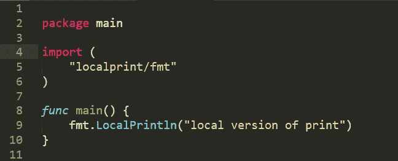
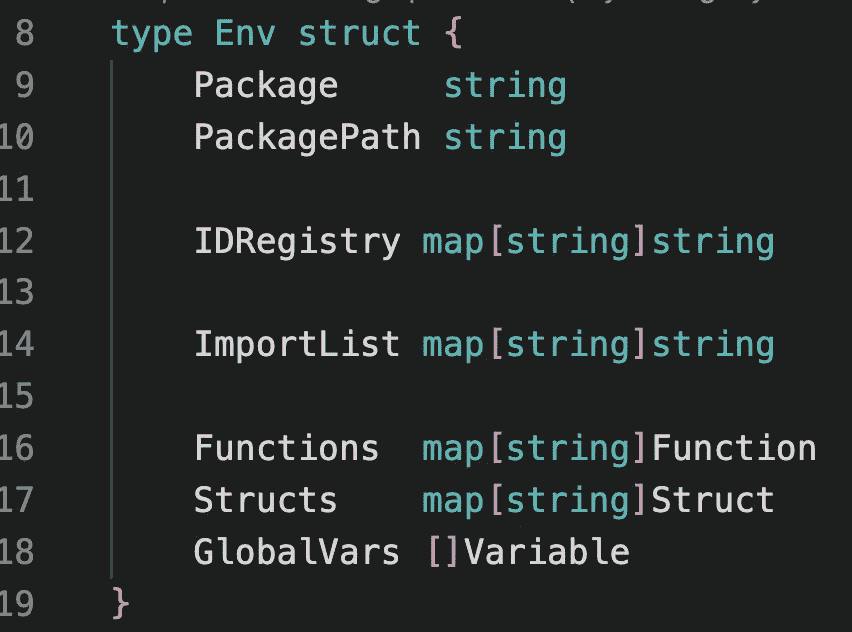
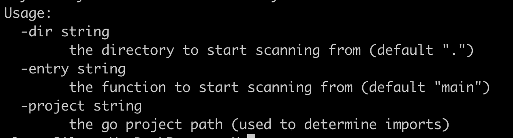
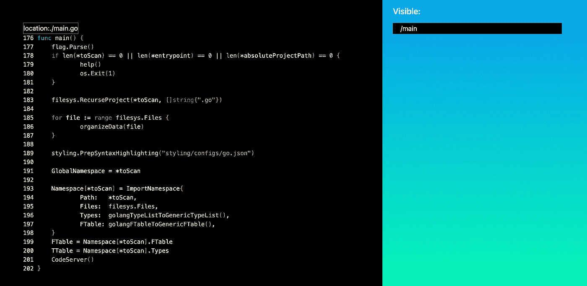

# 开发中的 ByFrost 发布源代码

> 原文：<https://itnext.io/byfrost-in-development-releasing-the-source-code-42508dbaaf6f?source=collection_archive---------3----------------------->

是的，终于到时间了。它工作…有点像。好吧，不完全是。

找到了吗？

你没看错读者！我要公布我和 ByFrost 到目前为止所做的一切。回购会在文末链接，撑住自己，一塌糊涂。

对于这篇文章，我将介绍如何使用已经存在的东西，每一个的学习和缺陷，以及，你猜对了，我将如何在我的第三次尝试(不是第二次，而是第三次)中做得更好。

坦率地说，我严重低估了我要做的事情实际上会有多难。

我决定发布这两个版本中的第一个，因为它比第二个更适合黄金时间，并且是一个很好的“演示”,展示了什么是可能的。至于第三个秘密，我将在接下来的几个月里利用我在这里学到的知识。ByFrost 原本是这个项目的第一个组成部分，实际上我希望它是这样，但我认为事情的发展方式，它永远不会工作。尤其是不要先瞄准戈朗。

本文将分为三个部分；对 V1 和 V2 的描述，以及我第三次尝试要做的事情。我没有费心去释放 V2，因为它现在的状态实在是太悲伤了……事实如此。

那么，让我们开始吧。

# by frost V1——斗志昂扬的失败者

这个版本是第一次迭代，是基于我在介绍 Byfrost 的最初帖子[中制作的发布视频。](https://medium.com/itnext/introducing-byfrost-a-source-code-path-visualizer-2d64002d1f9a)

## **整体架构**

这个版本非常天真，只扩展了函数库，引入了像`struct`成员和方法这样的东西。

事情是这样的:考虑下面的代码。

V1 将扫描`main`并盲目地寻找模式`ID`(在本例中是`fmt`)，然后是`DOT` ( `.`)，然后在它找到的下一个令牌(在本例中是一个名为`LocalPrintln`的 ID)上，它将扫描在这个由`fmt`指向的目录中检测到的所有包。使用我们当前所在项目的绝对路径，可以建立到这个包的路径；如果到当前 Go 项目根的绝对路径是`/Users/alyson/newproject`，那么到`fmt`的路径现在应该是`/Users/alyson/newproject/localprint/fmt`。这个目录将被扫描以寻找`func LocalPrintln`,然后为它创建一个视图。

非常简单，但是这种方法非常愚蠢。

哑但也真的真的快。不需要记住任何结构信息，因此解析就像带有开始和结束索引的读取调用一样简单。我们不需要知道任何事情；不是它的返回类型，不是它的参数，什么都没有。

## **弊端**

对于善于观察的人来说，这可能是显而易见的，但最大的问题是缺乏结构之间的关系知识。这种方法对于像调用方法的数据类型这样的东西并不完全有用，因为那样我们就必须跟踪变量声明和赋值，理解它们是何时被创建和/或销毁的，并理解它们的作用域等等。

确实是一个非常困难的问题。

我想，这个缺点值得一提的事实是，你甚至不能想到扩展…我想…堆叠的方法调用。如果不彻底检修，像`value.Call().To().Me()`这样的东西是不可能被拆包的。不要在意像函数调用作为参数传递给函数这样的事情。

所以这导致了第一次对重写的强烈需求，因为我很快发现许多 Go 程序几乎把方法调用作为他们的面包和黄油。

那么，去 V2 吧

# 弗罗斯特·V2——将这个坏的 Boi 形式化

得出的结论？结构！结构是智能索引的基础。

随着美化了的文本文件和一个成熟的(不是真正的)编译器的出现而消失了！耶！我现在是一名编译器开发人员。！

但是玩笑归玩笑，我实际上不得不挖掘编译和构造令牌和抽象语法树的错综复杂之处，以一种保存关系信息的方式..

让我们看看它是什么样子的，并谈谈我的一些新结构。

## 环境

比我想象的要大得多，但这应该能让我明白我想要的是什么。V2 的每个包都有这样的结构:

*   包是包的名称
*   包路径是它从根目录开始的绝对路径
*   IDRegistry 只是在这个包中快速查找符号，关键字是 ID，值是它的类型，以加快搜索速度。所以举例来说，`main`的值就是`Function`。
*   ImportList 是这个包中所有导入的列表。
*   函数是这个包中的所有函数。
*   Struct 是这个包中的所有 Struct(Struct Struct 有函数成员来支持它们的方法)。
*   GlobalVars 是这个函数中的所有全局变量。

这是 V2 背后的基本思想。

## 缺点是

这是迄今为止最好的尝试，可能是最接近这个工具的“正确”版本。它索引了从函数导入到方法的所有内容。我现在认为，我的大部分问题都源于我对 Go 如何编译缺乏理解。

不像 C 从上到下编译(你不能使用任何东西，除非它被声明为**在**之上，这是它在文件中被物理使用的地方，为了老式的优化原因)，Go 和许多现代语言都有一个“开放季节”政策，在这里，只要它们存在于某个地方，就可以在任何地方声明和使用。所有的事情，所有的地方，所有的时间/我控制不住自己。

这导致了许多循环和源文件读取，首先读取所有的`type`，然后是所有的`functions`，然后是所有的`global variables`，以确保所有需要的东西在需要时总是可用的。

这样做的一个副作用是，在相当小的项目中，ByFrost 可以向您展示一切，但是在大项目中，扫描代码库需要花费很长时间，并且这个工具变得完全不可用，因为它刚刚停止。

现在，对这种方法有明显的优化，我只是在事后才想到的，也许在一个方向扫描，当事物被声明时，缓存它们，直到找到它们的定义，等等，但这只是修补了对 Go 编译的基本误解，我怀疑最终会以某种其他方式或形式将我带回类似的问题。

# 下一步是什么？ByFrost V3 —(重新)引入 By(C？)霜冻

这是前两个版本。代码是一堆垃圾，可能很难理解，但是我想向你们展示我已经做了多少(当然也是为了证明这不是 vapourware)。

有编译说明，所以你可以尝试一下。

那么，我接下来要做什么？我还在研究 ByFrost。我可能会改名字。我决定让它为 C 工作，也可能用 C 写。

我为 ByFrost 追求的真正目标是在可视化 UI 中最终获得“永恒的调试”体验。想法是无缝遍历和检查代码的执行，因为它发生了。虽然类似，但我的目标不是二进制分析工具，这将严格用于开发，因为您必须随时准备好您正在检查的源代码。

## 围棋入门的大问题是

这是我放弃围棋的一个重要原因，因为它是一门非常复杂的语言。对于我要实现的这种类型的分析，可执行机器码到源代码的直接映射必须是准确的，并且能够相对快速地进行推断。

C 处于一个美丽的领域，那里有 C 结构和概念的直接汇编等价构造；简而言之，一个好的 C/Assembly 程序员可以看着 C，并对它的 ASM 输出有一个非常好的想法(尽管有优化)，反之亦然。

# 查看代码库

所以这就是我要做的。在华盛顿重新开始有点糟糕，但我知道我现在需要做什么。

至于如何运行代码；让我们开始吧。

## 如何运行 Frost

你需要两个终端。

## 运行后端

这很简单。如果没有函数参数，您将得到以下输出:

一个执行示例如下所示

将运行当前项目。

## **注意:你的项目在 go.mod 文件中的名字必须和它当前所在的目录名相匹配。我懒得做这个动态，因为我懒。**

然后你会看到一堆我忘记删除的打印输出，我曾经用于调试；忽略这些。

接下来转到`web`目录，在`byfrost-frontend`下，执行以下命令

最后，访问`localhost:4200/indexer`，你应该会看到一个类似这样的屏幕:

ByFrostV1 的源代码

请注意，只有用黄色和水蓝色突出显示的名称才能被点击和展开。原生包导入是不可扩展的，只有本地包。

展开后，点击右侧`Visible`下的标签，看看感觉如何。

你可以在这里旋转一下:[https://github.com/AlysonBee/ByfrostV1](https://github.com/AlysonBee/ByfrostV1)

直到拜弗罗斯特回来！

艾莉森