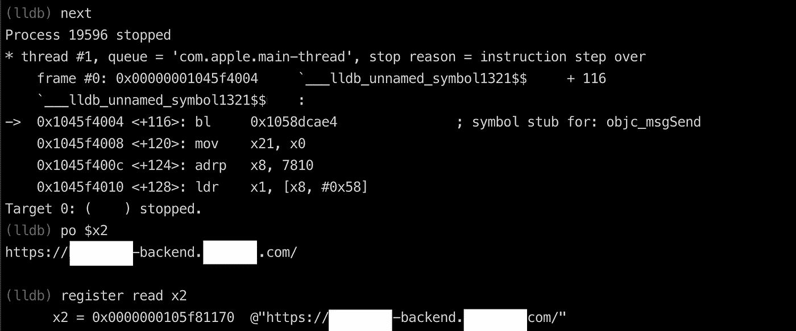
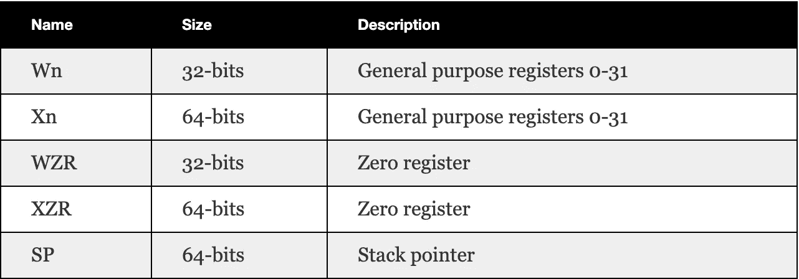
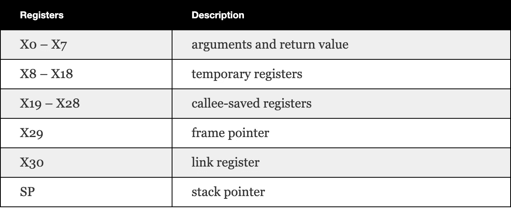
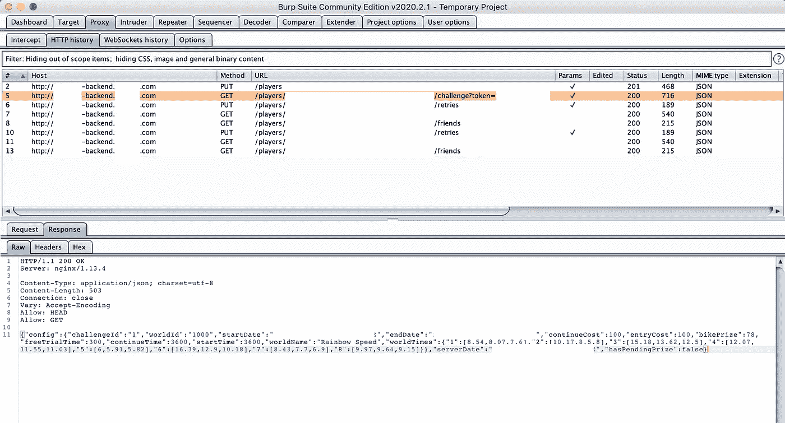

# 在 AppStore iOS 应用上使用 LLDB 绕过 SSL 锁定

> 原文：<https://itnext.io/bypass-ssl-pinning-with-lldb-in-ios-app-b78f9e7cc9cd?source=collection_archive---------2----------------------->



**图:附 LLDB】**

假设您想要检查应用程序，以查看移动应用程序和服务器之间的信息交换，您可以考虑使用简单的代理工具来嗅探请求和响应，或者使用更高级的技术，如反向二进制文件来查看端点、参数和响应有效负载…为了开始 SSL Pinning bypass 系列，这篇文章将介绍如何利用 LLDB 工具来禁用 iOS 应用程序中的 SSL Pinning 和反向工程过程。


照片由[纳赫尔·阿卜杜勒·哈迪](https://unsplash.com/@nahelabdlhadi?utm_source=medium&utm_medium=referral)在 [Unsplash](https://unsplash.com?utm_source=medium&utm_medium=referral) 上拍摄

# 放弃

本帖仅用于教育目的，请自行使用，如果发现问题，请联系应用程序的作者。我们将检查一个应用程序名称编辑。帖子中的数字只是为了演示，可能与编辑的应用程序无关。

# 先决条件

本次开机自检期间使用了以下工具:

*   越狱装置。
*   [在 iOS 设备中安装 Burp 的 CA 证书](https://support.portswigger.net/customer/portal/articles/1841109-Mobile%20Set-up_iOS%20Device%20-%20Installing%20CA%20Certificate.html)
*   [配置 iOS 设备使用打嗝功能](https://support.portswigger.net/customer/portal/articles/1841108-configuring-an-ios-device-to-work-with-burp)
*   [料斗拆卸器](https://www.hopperapp.com/download.html)
*   [设置 LLDB 环境](https://kov4l3nko.github.io/blog/2016-04-27-debugging-ios-binaries-with-lldb/)

# 概观

我们想知道编校的应用程序如何与服务器交换信息，所以让我们选择 Burp Suite 作为代理工具来嗅探请求。启动 Burp 套件，并做一些必要的设置作为先决条件一节。启动应用程序时，观察 Burp Suite 中的 *HTTP history* 选项卡，我们没有看到任何交换玩家信息或配置的请求，这里看起来有问题。正常情况下，当我们启动应用程序时，我们应该会看到一些获取应用程序配置或发送玩家状态(游戏应用程序)的请求……我们想到这可能是由于应用程序中采用的 SSL pin。

如果你不知道什么是 SSL pin，我建议参考这篇关于[SSL pin 如何工作的详细解释文章](https://appinventiv.com/blog/ssl-pinning-in-ios-app/)。简而言之，SSL pin 是客户端验证应用程序是否只与指定的服务器本身通信的一种方式。当应用程序实现 SSL 锁定时，通过代理服务器连接将不起作用，因为客户端会认为代理服务器是服务器，而不是真正的服务器，它不会建立到代理服务器的连接(由于代理服务器的证书/公钥与应用程序中捆绑的证书/公钥不匹配)，因此不会发出请求，也不会在 *HTTP 历史*选项卡中显示任何记录。要让 app 请求出现在这个标签页上，我们需要想办法把 **https** 请求降级为 **http** 。当应用程序通过 HTTP 协议进行通信时，不需要 SSL pin 评估，我们的 Burp Suite 代理将轻松捕获所有信息。为了再次确认这一点，我们来做一些分析。^_^

# 静态分析

## 检查。ipa 资源

在 [Frida iOS Dump](https://github.com/AloneMonkey/frida-ios-dump) 或 [CrackerXI](https://forum.iphonecake.com/index.php?/topic/363020-crackerxi-gui-app-decryption-tool-for-ios-11-12-13/) 的帮助下，我们可以轻松拔出**。越狱设备上的编校应用的 ipa** 文件，解压**。ipa** 并导航至 Payload/redated . app 文件夹。所有的应用程序资源和二进制文件都在这个文件夹中。

我们知道有两种方法可以进行 SSL 锁定:**锁定证书**或**锁定公钥**。Pin 证书是实现 SSL pin 的更简单的方法，因为开发人员只需下载服务器的证书并将其捆绑在应用程序中，在运行时，应用程序会将服务器端证书与捆绑的证书进行比较。

通常 iOS 应用程序中的证书文件会有**。cer** 或**。der** 扩展。这是`DER`编码，你可以参考这篇[文章](https://www.ssls.com/knowledgebase/what-are-certificate-formats-and-what-is-the-difference-between-them/)了解更多细节。打开“终端”并导航到 REDACTED.app 内部，然后运行此命令来搜索证书文件:`find . -name "*.cer"`

```
MBP# find . -name "*.cer"
./redacted_test_ca.cer
./redacted.cer
./certificate.cer
./redacted_certificate.cer
./server_ranking.cer
./mqttServer.cer
```

**图 1:查找证书文件**

正如我们所见，证书文件捆绑在应用程序中，因此我们可以说这个应用程序主要实现了 SSL Pinning 证书。如果您检查应用程序，并没有发现任何证书文件与此命令，它可能是开发人员固定的公钥。相反，您需要检查二进制文件。我将在另一个帖子中分享它。

现在好了。让我们寻找应用程序正在使用的 URL，因为这是网络框架将用于发出 NSURLSession、AlamoFire、AFNetworking 等请求的参数，仅举几例。

## 搜寻基本 URL (https)

我们确信编校的应用程序正在使用安全的 https 端点与服务器通信，因为如果只是 HTTP，那么它将显示在 *HTTP 历史*选项卡中。大多数开发人员喜欢将应用程序的基本 URL 放在一些地方，以便在整个应用程序中重用:

*   主机应用程序中的 info . plist(REDACTED.app/Info.plist)
*   主机应用程序中的 Mach-O 二进制文件(REDACTED.app/REDACTED)
*   框架中的 Info.plist 或 Mach-O 文件(该应用程序有专门的网络框架，例如 REDACTED.app/Frameworks/NetworkXYZ.framework/Info.plist, REDACTED.app/Frameworks/NetworkXYZ.framework/NetworkXYZ…)

通过使用`strings`命令- *字符串开始搜索 **https** 字符串，在二进制文件或标准输入中查找 ASCII 字符串。字符串对于识别随机目标文件和许多其他东西很有用*，我们可以在修订的 Mach-O 文件中找到一些结果。

```
MBP# strings -a REDACTED | grep https
https://redacted-backend.redacted.com/
https://www.redacted.com/games/redacted/privacy
https://graph.facebook.com/
https://private-redacted-api.redacted.com/
```

**图 2:找到基础 HTTPS 端点**

看起来`https://redacted-backend.redacted.com`和`[https://private-redacted](https://private-redacted)-api.redacted.com`才是可疑的人。这些可能是应用程序将使用的基本 URL，并附加其他 URL 的路径来发出请求。是时候追踪这些 URL 字符串在应用程序中的使用位置了。我们可能需要 Hopper 反汇编程序的帮助。

## 基本 URL 的跟踪引用— Hopper 反汇编程序

现在，让我们用 Hopper 反汇编工具来提升我们的静态分析技能——这是一个逆向工程工具，可以让你反汇编、反编译我们的应用程序。在这种情况下，我们使用 Hopper 将 Mach-O 文件反汇编成汇编指令(本例为 arm64)并找到 https 字符串的引用。

启动 Hopper 反汇编应用程序，然后将我们的 REDACTED.app/REDACTED 拖放到 Hopper 中，等待一段时间让它反汇编。完成后，切换到左侧面板上的 **Str** 选项卡，搜索`https://`字符串，它将显示与我们使用`strings`命令完全相同的结果。让我们点击左边面板上的`https://redacted-backend.redacted.com/`，它将导航到右边的这个地址:

```
0000000101522d9d  db  "https://redacted-backend.redacted.com/", 0  ; DATA XREF=cfstring_https___redacted_backend_redacted_com_
```

**图 3:在 Hopper 反汇编程序中找到基本 HTTPS 端点**

双击`DATA XREF=cfstring_https___redacted_backend_redacted_com_`查找它何时被引用，它将导航到新的位置并显示引用该字符串的方法。

```
cfstring_https___redacted_backend_redacted_com_:
00000001019c5170  dq  0x00000000000007c8 ; "https://redacted-backend.redacted.com/", DATA XREF=-[BackendController init]+112
```

**图 4:料斗拆卸器中的 HTTPS 字符串引用**

我们可以看到，有一个方法使用这个字符串:`-[BackendController init]`。如果您以前曾经开发过 Objective-C 应用程序，您应该熟悉这个语法。对于没有回答的人，让我长话短说。这是 objective-C 类初始化器(也称为构造函数)。所以用 Swift 语言来说应该是这样的`BackendController.init()`。让我们双击这个`-[BackendController init]`来导航到它的确切使用位置。

```
 -[BackendController init]:
...
100037fdc  adrp       x8, #0x101f09000
100037fe0  ldr        x0, [x8, #0x3c8]            ; objc_cls_ref_BackendHttpClient,__objc_class_BackendHttpClient_class
100037fe4  adrp       x8, #0x101eb7000
100037fe8  ldr        x20, [x8, #0xb88]           ; "alloc",[@selector](http://twitter.com/selector)(alloc)
100037fec  mov        x1, x20
100037ff0  bl         imp___stubs__objc_msgSend   ; objc_msgSend
100037ff4  adrp       x8, #0x101eba000                        
100037ff8  ldr        x1, [x8, #0x50]             ; "initWithBaseURL:",[@selector](http://twitter.com/selector)(initWithBaseURL:)
100037ffc  adrp       x2, #0x1019c5000                            
100038000  add        x2, x2, #0x170              ; @"[https://redacted-backend.redacted.com/](https://redacted-backend.redacted.com/)"
100038004  bl         imp___stubs__objc_msgSend   ; objc_msgSend
100038008  mov        x21, x0
10003800c  adrp       x8, #0x101eba000            
100038010  ldr        x1, [x8, #0x58]             ; "setHttpClient:",[@selector](http://twitter.com/selector)(setHttpClient:)
100038014  mov        x0, x19
100038018  mov        x2, x21
10003801c  bl         imp___stubs__objc_msgSend   ; objc_msgSend
100038020  mov        x0, x21
...
```

**图 5: -【后端控制器初始化】**

请不要因为这些汇编指令而惊慌失措并放弃，我保证我会马上解释它们是什么。再仔细看看，你会发现这个字符串在地址`100038000`被汇编指令`add x2, x2, #0x170`和生成的注释`; @"https://redacted-backend.redacted.com/"`引用。请记下这个地址`100038000`，我们将在接下来的章节中调试应用程序时使用它。

## 什么是 ARM64 指令？

我不会在这里解释 ARM64 指令的所有内容，但为了这篇文章，我会尝试解释一些基本的指令，以便您可以继续跟进(老实说，即使现在我仍然需要学习这种强大的语言，我最近迷上了它，并发现它就像一个益智游戏)。

一、什么是汇编语言？让我引用来自 [Wiki](https://en.wikipedia.org/wiki/Assembly_language) : *的这个简短解释在计算机编程中，汇编语言(或汇编语言)，通常缩写为 asm，是任何一种低级编程语言，其中语言中的指令和架构的机器代码指令之间有非常强的对应关系。因为汇编依赖于* **机器码指令** *，所以每一个汇编程序都有自己的汇编语言，专门为一个特定的* **计算机架构** *而设计。让我来分解一下这些术语:*

*   **机器码指令** : Objective-C 或者 Swift 都是高级语言。你的 Objective-C 或者 Swift 代码编译成汇编语言，是低级的。然后，汇编程序将这个程序集汇编成机器代码，以便 CPU 能够读取(0 和 1)。你可以在任何文本编辑器中打开密文文件，你会看到机器码指令:

```
cffa edfe 0c00 0001 0000 0000 0200 0000
5c00 0000 2026 0000 8580 2100 0000 0000
1900 0000 4800 0000 5f5f 5041 4745 5a45
524f 0000 0000 0000 0000 0000 0000 0000
0000 0000 0100 0000 0000 0000 0000 0000
0000 0000 0000 0000 0000 0000 0000 0000
0000 0000 0000 0000 1900 0000 0804 0000
5f5f 5445 5854 0000 0000 0000 0000 0000
0000 0000 0100 0000 00c0 9201 0000 0000
0000 0000 0000 0000 00c0 9201 0000 0000
0500 0000 0500 0000 0c00 0000 0000 0000
5f5f 7465 7874 0000 0000 0000 0000 0000
5f5f 5445 5854 0000 0000 0000 0000 0000
b455 0000 0100 0000 c484 3101 0000 0000
b455 0000 0200 0000 0000 0000 0000 0000
0004 0080 0000 0000 0000 0000 0000 0000
5f5f 7374 7562 7300 0000 0000 0000 0000
5f5f 5445 5854 0000 0000 0000 0000 0000
78da 3101 0100 0000 983a 0000 0000 0000
78da 3101 0200 0000 0000 0000 0000 0000
0804 0080 0000 0000 0c00 0000 0000 0000
...
```

**图 6:十六进制形式的机器代码**

*   **计算机架构**:是 CPU 架构，比如。`arm64`(是目前的 64 位 ARM CPU 架构，自 iPhone 5S 和更高版本以来一直使用)`armv7s`(用于 iPhone 5、iPhone 5C 和 iPad 4 上的苹果 A6 和 A6X 芯片)`armv7` (32 位 ARM CPU，用于 A5 和更早版本)`x86_64` (64 位英特尔模拟器)`i386` (32 位英特尔模拟器)iOS 设备使用基于 [ARM 架构的 CPU](http://en.wikipedia.org/wiki/ARM_architecture)。在我看来，这比 [x86_64](https://en.wikipedia.org/wiki/X86_assembly_language) 指令集更容易阅读。
*   **寄存器**:内存有一系列级别。靠近 CPU 的速度最快。在现代计算机中，这些通常类似于:CPU 寄存器> L1 缓存> L2 缓存> L3 缓存>主内存>硬盘。处理器将使用一些内存存储位置，也称为寄存器。对于 ARM64，有 32 个通用寄存器和一些特殊寄存器，请查看下面的详细信息以及何时可以使用。



**图 7:寄存器**



**图 8:寄存器用途**

*   **汇编指令**:有很多命令(操作码— opcode)，是 CPU 可以执行的单个指令。一般格式可以认为是**指令**，后跟**操作数** : `Instruction Rd, Rn, Operand2`，其中**指令**是命令(MOV、SUB、ADD…)， **Rd** 是目的寄存器， **Rn** 是被操作的寄存器， **Operand2** 可能是寄存器或立即值(例如。#0xff)。

我认为这就足够了，现在，当我们在下一节使用 LLDB 调试应用程序时，我会解释更多。

# 动态分析

从 XCode 5 开始，LLDB 与 XCode 完全集成，所以如果你是一名 iOS 开发人员，你应该已经熟悉了它的日常工作。我们可以从 XCode 或终端连接到正在运行的进程，在这篇文章中，我将从终端运行 LLDB，并连接到越狱设备上正在运行的 app。假设您已经在**先决条件**部分的越狱设备上安装了 debugserver。

## 启动调试服务器

让 SSH 连接到越狱设备，对我来说，应该是这样的:`ssh ipse_home`，对你来说应该是`ssh root@your_device_ip_address`。当出现密码提示时，您可能需要键入密码(默认密码是`alpine`)。如果你想经常在越狱设备上调试，你可以像这样在你的`~/.ssh/config`文件中创建一个 SSH 快捷方式(更多细节你可以参考这个[帖子](https://scotch.io/tutorials/how-to-create-an-ssh-shortcut)了解如何设置)，然后你可以通过快捷方式进行 SSH。如果你经常使用 SSH，你也可以使用 SSH Keygen 进行无密码登录。

```
Host ipse_home
	HostName 192.168.1.113
	User root
```

**图 9: SSH 快捷方式**

SSH 进入越狱设备后，我们将使用`debugserver`连接到应用程序并监听来自其他机器的连接，然后从我们的笔记本电脑启动`LLDB`连接到`debugserver`进行远程调试。让我们一步一步来。

从终端 SSH 进入设备，然后运行这个命令:`debugserver 0.0.0.0:1234 -w "Executable file"`

*   **可执行文件**是我们要附加的进程名(这个值你需要从`Info.plist`文件中获取)。
*   `0.0.0.0`是允许其他连接进行连接的 IP 范围(如果你知道远程调试机器的 IP 地址，那么为了安全请指定)。
*   `1234`是端口号(如果您愿意，可以定义任意一个)。
*   `-w`参数是`--waitfor`的缩写，它将等待进程启动(如果尚未启动)或立即附加(如果已经启动)。

```
iPhone-SE:~ root# debugserver 0.0.0.0:1234 -w REDACTED
debugserver-@(#)PROGRAM:LLDB  PROJECT:lldb-900.3.57..2
 for arm64.
Waiting to attach to process REDACTED...
```

**图 10:启动调试服务器**

假设你已经使用 Burp Suite 代理配置了越狱设备，这个应用程序还没有启动，然后在上面的`debugserver`命令中启动。每当你看到输出`Waiting to attach to process`，是时候从越狱设备启动我们的应用程序了，你可以从终端看到它会打印出新的消息`Listening to port 1234 for a connection from 0.0.0.0...`，这意味着它成功连接并等待连接调试。

```
iPhone-SE:~ root# debugserver 0.0.0.0:1234 -w REDACTED
debugserver-@(#)PROGRAM:LLDB  PROJECT:lldb-900.3.57..2
 for arm64.
Waiting to attach to process REDACTED...
Listening to port 1234 for a connection from 0.0.0.0...
```

**图 11:调试服务器附加流程**

## 启动 LLDB

在这篇文章中，我们将使用 LLDB 作为独立的调试器，而不是通过 XCode 调试功能(XCode 控制台窗格)使用 LLDB 调试器。因此，让 LLDB 命令行给我们带来一些乐趣，为什么不呢？

现在让乐趣开始吧。打开终端的另一个标签，运行`lldb`命令。

```
MBP# lldb
(lldb)
```

**图 12:启动 LLDB 独立版**

在`lldb`提示符下，键入`platform select remote-ios`然后`process connect connect://192.168.1.113:1234`通过`debugserver`连接到我们的 app(进程)中(记住`192.168.1.113`是越狱设备的 IP 地址)。如果我们可以成功地附加到该进程，您将在终端中看到该日志:

```
(lldb) platform select remote-ios
  Platform: remote-ios
 Connected: no
  SDK Path: "/Users/xyz/Library/Developer/Xcode/iOS DeviceSupport/13.3.1 (17D50) arm64e"
 SDK Roots: [ 0] "/Users/xyz/Library/Developer/Xcode/iOS DeviceSupport/13.3.1 (17D50) arm64e"
 SDK Roots: [ 1] "/Users/xyz/Library/Developer/Xcode/iOS DeviceSupport/11.3.1 (15E302)"
 SDK Roots: [ 2] "/Users/xyz/Library/Developer/Xcode/iOS DeviceSupport/11.0 (15A372)"
 SDK Roots: [ 3] "/Users/xyz/Library/Developer/Xcode/iOS DeviceSupport/12.4 (16G77)"
Process 19596 stopped
* thread #1, queue = 'com.apple.main-thread', stop reason = signal SIGSTOP
    frame #0: 0x000000018104e3b0 libsystem_c.dylib`strlen  + 48
libsystem_c.dylib`strlen:
->  0x18104e3b0 <+48>: ldr         	q0, [x1, #0x10]!
    0x18104e3b4 <+52>: uminv.16b 	b1, v0
    0x18104e3b8 <+56>: fmov 		w2, s1
    0x18104e3bc <+60>: cbnz 		w2, 0x18104e3b0 	; <+48>
Target 0: (REDACTED) stopped.
```

**图 13:附加到进程的 LLDB**

如果`lldb`显示 SDK 路径错误或其他情况，您可以仔细检查您的设备 iOS 版本是否存在于 XCode iOS DeviceSupport 中。你可以参考这篇很棒的[帖子](https://kov4l3nko.github.io/blog/2016-04-27-debugging-ios-binaries-with-lldb/#problems-and-solutions)来解决问题。

每次您想在`lldb`提示符下调试应用程序时，您都需要键入上述两个命令，为了节省时间，LLDB allow to config 命令可以在`lldb`启动时加载。你只需要复制这两个命令并输入`~/.lldbinit`就可以了。这是我的样本`~/.lldbinit`文件:

```
## .lldbinit start ###
command alias rr register read
command alias rw register write
command alias mr memory read
command alias mw memory write
command alias il image list -o -f
command alias eoc expression -l objc -O --

platform select remote-ios
process connect connect://192.168.1.113:1234
```

**图 14: ~/。lldbinit**

您也可以在这里定义`lldb`命令别名，它会在`lldb`提示符下生效。但是如果你是一个 iOS 开发人员，这里会有一个问题，因为这个文件也会应用于 XCode 中的 LLDB，这意味着当你在 XCode 中调试一个应用程序时，它也会加载这个 init 文件，并且会花费你更多的时间来启动这个应用程序。要分离 LLDB standalone 和 XCode 的 LLDB 之间的配置，您可以创建一个新的`~/.lldbinit-Xcode`文件，并将您的命令放在那里，只供 XCode 使用。每当你通过 XCode 调试应用程序时，它会检查`~/.lldbinit-Xcode`文件是否存在，然后 XCode 会加载这个文件而不是`~/.lldbinit`。

## 设置断点

现在，`lldb`附加在 app 进程上等待我们调试，你可能会注意到，由于进程正在被中断，app 挂在了越狱的设备上。调试过程和我们在 XCode 中调试的过程是一样的，除了在 XCode 中你调试每一行代码，这里你调试每一行汇编指令，你检查寄存器而不是变量。在检查寄存器之前，让我们先设置一个断点。回到 Hopper 反汇编程序，转到`-[BackendController init]`方法的地址`0x100038000`，我们需要在这个地址设置断点，看看应用程序是否会调用这个方法，并检查传递给寄存器的 URL 字符串的值(在 Hopper 反汇编程序中，按下`G`，然后输入要导航到的地址值)。在 LLDB 中，要在某个地址设置断点，我们可以键入:`breakpoint set --address 0x100038000`，或者简称为`br s -a 0x100038000`，然后输入。

```
(lldb) breakpoint set --address 0x100038000
warning: failed to set breakpoint site at 0x100038000 for breakpoint 1.1: error: 0 sending the breakpoint request
Breakpoint 1: address: 0x100038000
```

**图 15: LLDB 设置断点失败**

但是看那个警告，在`0x100038000`设置断点失败。为什么？？？失败的原因是因为 **ASLR(地址空间布局随机化)**。 [ASLR 是一种针对操作系统(OS)的内存保护进程，它通过随机化系统可执行文件加载到内存的位置来防范缓冲区溢出攻击。](https://searchsecurity.techtarget.com/definition/address-space-layout-randomization-ASLR)。我们需要在进程运行时计算真实地址来设置断点(每次启动 app 都需要重新计算真实地址)。`Real Address = ASLR shift + Hopper Address`，找出缺失的部分`ASLR Shift`。

在`lldb`提示符下，键入`image list -o processName`然后回车，控制台中的结果是`ASLR shift`(请注意，该值可能与您的不同，因为它是一个随机数)。

```
(lldb) image list -o REDACTED
[ 0] 0x00000000045bc000
(lldb)
```

**图十六:ASLR 换挡**

我的案子`ASLR Shift = 0x00000000045bc000`，所以`Real Address = ASLR shift + Hopper Address = 0x00000000045bc000+0x100038000 = 0x1045F4000`。让我们重新设置断点:`br s -a 0x00000000045bc000+0x100038000`或`br s -a 0x1045F4000`然后回车。

```
(lldb) br s -a 0x00000000045bc000+0x100038000
Breakpoint 2: where = REDACTED`___lldb_unnamed_symbol1321$$REDACTED + 112, address: 0x00000001045F4000
```

**图 17:断点设置成功**

我们刚刚成功设置了断点，现在通过键入:`continue`或`c`让进程继续运行，然后回车。它将运行应用程序一秒钟，然后你会看到它将再次停止在控制台中，它命中断点！！！！

```
(lldb) c
Process 19596 resuming
Process 19596 stpped
* thread #1, queue = 'com.apple.main-thread', stop reason = breakpoint 2.1
	frame #0: 0x00000001045f4000 REDACTED`___lldb_unnamed_symbol1321$$REDACTED + 112
REDACTED`___lldb_unnamed_symbol1321$$REDACTED
->  0x1045f4000 <+112>: add   x2, x2, #0x170 ; =0x170
    0x1045f4004 <+116>: bl    0x1058dcae4    ; symbol stub for: objc_msgSend
    0x1045f4008 <+120>: mov   x21, x0
    0x1045f400c <+124>: adrp  x8, 7810
Target 0: (REDACTED) stopped.
(lldb)
```

**图 18: LLDB 命中断点**

## 检查寄存器

您可以看到进程在指令`add x2, x2, #0x170`处的断点(地址`0x1045F4000`处)停止。让我们在 Hopper 反汇编程序中再次查看这些说明:

```
 -[BackendController init]:
...
100037fdc  adrp       x8, #0x101f09000
100037fe0  ldr        x0, [x8, #0x3c8]            ; objc_cls_ref_BackendHttpClient,__objc_class_BackendHttpClient_class
100037fe4  adrp       x8, #0x101eb7000
100037fe8  ldr        x20, [x8, #0xb88]           ; "alloc",[@selector](http://twitter.com/selector)(alloc)
100037fec  mov        x1, x20
100037ff0  bl         imp___stubs__objc_msgSend   ; objc_msgSend
100037ff4  adrp       x8, #0x101eba000                        
100037ff8  ldr        x1, [x8, #0x50]             ; "initWithBaseURL:",[@selector](http://twitter.com/selector)(initWithBaseURL:)
100037ffc  adrp       x2, #0x1019c5000                            
100038000  add        x2, x2, #0x170              ; @"[https://redacted-backend.redacted.com/](https://redacted-backend.redacted.com/)"
100038004  bl         imp___stubs__objc_msgSend   ; objc_msgSend
100038008  mov        x21, x0
10003800c  adrp       x8, #0x101eba000            
100038010  ldr        x1, [x8, #0x58]             ; "setHttpClient:",[@selector](http://twitter.com/selector)(setHttpClient:)
100038014  mov        x0, x19
100038018  mov        x2, x21
10003801c  bl         imp___stubs__objc_msgSend   ; objc_msgSend
100038020  mov        x0, x21
...
```

**图 19:说明解释**

我为那些指令添加了注释，`add x2, x2, #0x170`可以翻译成`x2 = x2 + #0x170 = #0x1019c5000 + #0x170 = 0x1019c5170`，这是`https://redacted-backend.redacted.com/`的地址(你可以回头看上面的**图 4**), Hopper 反汇编器足够聪明，可以找出注释并将其放在这条指令的末尾。所以在执行这条指令后，我们期望 x2 的值是`https://redacted-backend.redacted.com/`。让 type `next`或`n`然后回车执行该指令。

现在要检查寄存器`x2`的值，您可以键入`po $x2` (po 是打印对象)或`register read x2`，您将看到寄存器`x2`现在保存着包含字符串`[https://redacted-backend.redacted.com/](https://redacted-backend.redacted.com)`的地址

```
(lldb) next
Process 19596 stopped
* thread #1, queue = 'com.apple.main-thread', stop reason = breakpoint 2.1
 frame #0: 0x00000001045f4004 REDACTED`___lldb_unnamed_symbol1321$$REDACTED + 116
REDACTED`___lldb_unnamed_symbol1321$$REDACTED
->  0x1045f4004 <+116>: bl    0x1058dcae4    ; symbol stub for: objc_msgSend
    0x1045f4008 <+120>: mov   x21, x0
    0x1045f400c <+124>: adrp  x8, 7810
    0x1045f4010 <+128>: ldr   x1, [x8, #0x58]
Target 0: (REDACTED) stopped.
(lldb) po $x2
[https://redacted-backend.redacted.com](https://redacted-backend.redacted.com)/(lldb) register read x2
 x2 = 0x0000000105f81170   @"[https://redacted-backend.redacted.com](https://redacted-backend.redacted.com)/"
```

**图 20:检查寄存器 x2**

## 更改寄存器值

由于我们处于调试模式，改变寄存器的值是微不足道的。我们想将`https`降级为`http`协议，因此我们需要将寄存器`x2`的值从`https://redacted-backend.redacted.com/`更改为`http://redacted-backend.redacted.com/`，让我们这样做:

*   首先，让我们通过:`expression @"http://redacted-backend.redacted.com/"`或`e @"http://redacted-backend.redacted.com/"`创建新的`http://redacted-backend.redacted.com/`字符串，它将吐出用该字符串在内存中的地址创建的新字符串。如下，`0x00000001c0c63740`是我的案例的新字符串的地址:

```
(lldb) expression @"http://redacted-backend.redacted.com/"
(__NSCFString *) $5 = 0x00000001c0c63740 @"http://redacted-backend.redacted.com/"
(lldb)
```

**图 21:创建一个新的字符串**

*   接下来，我们需要通过`register write x2 0x00000001c0c63740`设置寄存器`x2`来保存新值，并再次检查其值，我们可以看到`x2`现在反映了新值。

```
(lldb) register write x2 0x00000001c0c63740
(lldb) po $x2
http://redacted-backend.redacted.com/

(lldb)
```

**图 22:将寄存器 x2 更改为新值**

*   最后，只需键入`c`即可恢复应用程序，因此它将继续使用新的 URL 端点运行，流程不再遇到断点，查看 Hopper 反汇编器，我们可以看到所有的`http://redacted-backend.redacted.com/`端点都显示在 *HTTP History* 选项卡中，包含请求和响应的详细信息，任务完成！！！



**图 23:料斗拆装器可以看到应用请求&响应**


我看到了光——照片由[埃利亚斯·毛雷尔](https://unsplash.com/@snowidesignz?utm_source=medium&utm_medium=referral)在 [Unsplash](https://unsplash.com?utm_source=medium&utm_medium=referral) 上拍摄

# 最终想法

*   SSL Pinning 只适用于`https`协议，所以要降级到`http`请求，我们可以很容易地绕过它
*   编校服务器支持`http`和`https`协议，所以当降级到`http`时应用程序可以正常工作
*   对于不支持`http`协议的服务器，这种 SSL 锁定旁路将不起作用，但是我们可以让代理将`http`重定向到`https`，这样它就可以工作了(客户端将`http`请求发送到代理- >代理将`http`重写为`https`请求并发送到服务器)
*   LLDB 很厉害！！玩寄存器是我们可以学习的高级技能。你可以做任何事情，只要你能在运行的应用程序中附加一个调试器。
*   这个 app 没有越狱和反调试检测，所以我们可以不受限制的为所欲为。如果你想保护应用程序，你需要考虑在你的代码中使用这种检测。

# 进一步阅读

*   [在调试器中跳舞——和 LLDB 跳华尔兹](https://www.objc.io/issues/19-debugging/lldb-debugging/)
*   [iOS 应用中的 SSL 锁定](https://appinventiv.com/blog/ssl-pinning-in-ios-app/)
*   [汇编语言维基](https://en.wikipedia.org/wiki/Assembly_language)
*   [ARM 架构](http://en.wikipedia.org/wiki/ARM_architecture)

## 我希望这篇文章对你有所帮助。请在 Twitter([@ reverse thatap](https://twitter.com/ReverseThatApp))上关注并联系我，以获得我即将在^_^发布的帖子的通知