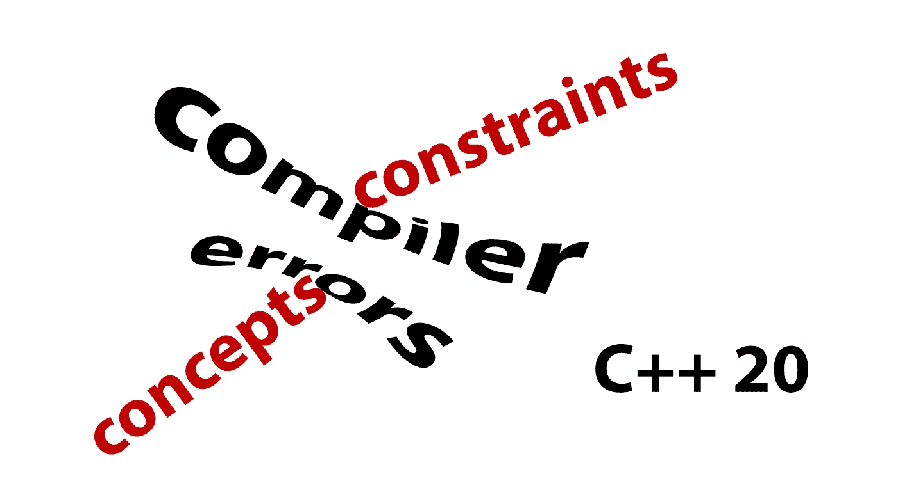

# C++20 概念—完整指南

> 原文：<https://itnext.io/c-20-concepts-complete-guide-42c9e009c6bf?source=collection_archive---------0----------------------->

关于 C++的一个当之无愧的常见抱怨是编译器错误的低质量。在过去的十年里，GCC 和 Clang 都取得了很大的进步来改善这种情况，但是模板化代码是它们不能真正帮助的一个领域。



# 不喜欢 int 的函数。

模板化代码的困难在于编译错误实际上发生在实现代码内部。这可能会导致混淆的错误消息。

举一个简单的例子:

```
#include <string>void function_without_concept(const auto& x) {
    std::string v = x;
}int main() {
    function_without_concept(1);
}
```

该错误是在函数内部报告的，因为这里的无效操作是将`int`赋值给`string`。

```
function_that_doesnt_like_int.cc:4:14: error: no viable conversion from 'const int' to 'std::string' (aka 'basic_string<char>')
        std::string v = x;
                    ^   ~
function_that_doesnt_like_int.cc:8:2: note: in instantiation of function template specialization 'function_without_concept<int>' requested here
        function_without_concept(1);- shortened - 
```

对于这样一个浅层次的错误，我们不必深究太多，但我们仍然需要看看实现，以充分理解这个函数只接受可以赋给字符串的类型。

# 使用概念

因此，让我们来看看如何通过使用概念来改善这种情况。我们将依赖标准库中定义的概念。

有关标准库中预定义概念的完整概述，请查看:

*   en.cppreference.com/w/cpp/concepts[T2](https://en.cppreference.com/w/cpp/concepts)
*   `<iterator>`
    [en . CP preference . com/w/CPP/iterator # c . 2b . 2b 20 _ iterator _ concepts](https://en.cppreference.com/w/cpp/iterator#C.2B.2B20_iterator_concepts)
    [en . CP preference . com/w/CPP/iterator # Algorithm _ concepts _ and _ utilities](https://en.cppreference.com/w/cpp/iterator#Algorithm_concepts_and_utilities)
*   en.cppreference.com/w/cpp/ranges#Range_concepts[T4](https://en.cppreference.com/w/cpp/ranges#Range_concepts)

让我们从这个简单的函数开始，它需要一个可转换为字符串的参数。

```
#include <string>
#include <concepts>void func_with_auto_inline(const std::convertible_to<std::string> auto& x) {
    std::string v = x;
}int main() {
    func_with_auto_inline(1);
}
```

这一次，我们得到了一个更长但也更具描述性的错误。

```
function_with_concept.cc:9:5: error: no matching function for call to 'func_with_auto_inline'
    func_with_auto_inline(1);
    ^~~~~~~~~~~~~~~~~~~~~function_with_concept.cc:4:6: note: candidate template ignored: constraints not satisfied [with x:auto = int]
void func_with_auto_inline(const std::convertible_to<std::string> auto& x) {
     ^
function_with_concept.cc:4:39: note: because 'std::convertible_to<int, std::string>' evaluated to false
void func_with_auto_inline(const std::convertible_to<std::string> auto& x) {- shortened -
```

最重要的是，我们看到了一个`no matching function for call`错误，它解释了为什么重载决策没有考虑我们的函数。

您可能会注意到在输出中,`std::convertible_to`实际上有两个参数。使用内联语法，第一个参数是从上下文中自动填充的。当考虑所有其他语法变体时，我们可以更清楚地看到这一点:

```
void func_with_auto_inline(const std::convertible_to<std::string> auto& x) {
    std::string v = x;
}void func_with_auto_postfix(const auto& x)
    requires std::convertible_to<decltype(x), std::string> {
    std::string v = x;
}template <std::convertible_to<std::string> T>
void func_with_template_inline(const T& x) {
    std::string v = x;
}template <typename T>
    requires std::convertible_to<T, std::string>
void func_with_template_postfix(const T& x) {
    std::string v = x;
}
```

当使用 inline 语法时，我们可以省略第一个参数(使用 auto 或 template)。当使用基于后缀 requires 的语法时，我们需要通过`decltype`或者传入模板参数来提供它。

也可以使用逻辑运算符来组合概念。这是一个复杂的函数模板的例子，它接受积分或返回积分的 invocable。注意，我们还在一个`constexpr`条件语句中使用了一个概念。

```
#include <string>
#include <concepts>
#include <iostream>template <typename T>
    requires std::integral<T> ||
    (std::invocable<T> &&
     std::integral<typename std::invoke_result<T>::type>)
void function(const T& x) {
    if constexpr (std::invocable<T>) {
        std::cout << "Result of call is " << x() << "\n";
    } else {
        std::cout << "Value is " << x << "\n";
    }
}int main() {
    function(1); // OK, integral
    function([]() { return 2; }); // OK, invocable, returns integral
    function(2.0); // Fails
}
```

我们开始用像这样的复杂公式来牺牲可读性，所以让我们看看如何编写我们自己的概念。

# 写作概念

编写新概念遵循以下语法:

```
template <typename T>
concept Name = constraint_expression;
```

约束表达式可以包含`constexpr`布尔表达式、其他概念的合取/析取和`requires`块。因此，对于我们之前的例子，我们可以使用 C++11 类型特征构造一个布尔表达式，或者从 C++20 标准库概念构造一个复合概念。

```
template <typename T>
concept maybe_invokable_integral_v1 = std::is_integral<T>::value ||
    (std::is_invocable<T>::value &&
     std::is_integral<typename std::invoke_result<T>::type>::value);template <typename T>
concept maybe_invokable_integral_v2 = std::integral<T> ||
    (std::invocable<T> &&
     std::integral<typename std::invoke_result<T>::type>);
```

## 需要表达

让我们更深入地研究一下在一个`requires`表达式中使用的不同元素。

我们能做的最简单的测试是测试一个表达式的有效性。在下面的例子中，我们也使用可选的参数列表来生成参数。然后我们可以在表达式中使用这些参数。这里我们测试该类型是否支持二进制加号运算符。

```
template <typename T>
concept addable = requires (T a, T b) {
    a+b;
};void function(addable auto x) {}
struct X {};int main() {
    function(1); // OK
    function(X{}); // Fails
}
```

我们还可以测试类型有效性。引用的类型可以是模板，因此用于检查替换失败。

```
#include <concepts>template <typename T>
concept type_test = requires {
    typename T::ElementType; // ElementType member type must exist
};template <std::integral T>
struct S;template <typename T>
concept template_test = requires {
    typename S<T>; // checks whether S<T> 
                   // is a valid template substitution
};void function1(type_test auto x) {}
void function2(template_test auto x) {}struct X { using ElementType = int; };int main() { function1(X{}); // OK
    function1(1); // Fails    function2(1); // OK
    function2(X{}); // Fails
}
```

复合表达式允许我们约束表达式的结果。

```
#include <concepts>template <typename T>
concept invoke_integral = requires (T a) {
    { a() } -> std::integral;
};template <invoke_integral T>
void function(const T& f) {};int main() {
    function([](){ return 1; }); // OK
    function([](){ return 1.0; }); // Fail: doesn't return integral
    function(1); // Fail: 1() is not a valid expression
}
```

对于复合表达式，我们也可以要求表达式是非抛出的。

```
template <typename T>
concept assignment_cant_throw = requires (T a, T b) {
    { a = b } noexcept;
};struct X {
    X& operator = (const X& lhs) noexcept { return *this; }
};struct Y {
    Y& operator = (const Y& lhs) { return *this; }
};template <assignment_cant_throw T> struct Test {};int main() {
    Test<X> a; // OK
    Test<Y> b; // Fails
}
```

最后，我们可以嵌套`requires`表达式。这对于引用其他概念或构建嵌套的`constexpr`布尔表达式非常有用。

注意，如果您在一个`requires`块中列出一个概念，而没有在它前面加上前缀`requires`，它将被视为一个表达式，只检查有效性(GCC 已经警告过这一点)。

```
template <typename T>
concept x = requires (T a) {
    requires sizeof(a) >= 4;
    requires std::integral<T>;
    std::integral<T>; // probably not what you meant
};
```

# 如何选择专业

在前面所有的例子中，我们总是有一个单一的专门化，要么匹配，要么不匹配。概念允许我们提供一组专门化。编译器将首先确定可行的专门化，然后确定具有最具体约束的专门化。

为了确定哪个约束是最具体的，每个约束都将被展开，直到它成为合取/析取公式中的原子列表。请注意，在这里,`requires`表达式被认为是一个原子，无论它有多复杂，如果你想利用这种行为，这意味着组织和编写你的概念。

在下面的例子中，虽然`has_x`概念可能看起来是`coord`概念的子集，但是，基于扩展规则，这两个约束都是单个原子，并且因为这些原子不相同，所以这两个概念是无序的。

```
template <typename T>
concept has_x = requires (T v) {
    v.x;
};template <typename T>
concept coord = requires (T v) {
    v.x;
    v.y;
};void function(has_x auto x) {}
void function(coord auto x) {}struct X {
    int x;
};struct Y {
    int x;
    int y;
};int main() {
    function(X{}); // OK, only one viable candidate
    function(Y{}); // Fails, ambiguous
}
```

但是，可以重写这些概念，使它们具有可比性，并且`coord`概念包含`has_x`概念。

```
template <typename T>
concept has_x = requires (T v) {
    v.x;
};template <typename T>
concept coord = has_x<T> && requires (T v) {
    v.y;
};void function(has_x auto x) {}
void function(coord auto x) {}struct X {
    int x;
};struct Y {
    int x;
    int y;
};int main() {
    function(X{}); // OK, only one viable candidate
    function(Y{}); // OK, coord is more specific
}
```

因此，如果你正在设计一个需要利用这种行为的库，在设计你的概念时要小心。

两个概念 A 和 B 的经验法则是:

*   `A = (X1 ... XN); B = Y && (X1 ... XN);` B 被认为比 A 更具体
*   `A = (X1 ... XN); B = Y || (X1 ... XN);` A 被认为比 B 更具体

# 链接和技术说明

所有的例子都使用 GCC 和 Clang(2021 年 9 月)的主干版本进行了演示。

所有代码示例和脚本都可以在:[https://github.com/HappyCerberus/article-cpp20-concepts](https://github.com/HappyCerberus/article-cpp20-concepts)获得。

# 感谢您的阅读

感谢您阅读这篇文章。你喜欢吗？

我还在 YouTube[youtube.com/c/simontoth](https://youtube.com/c/simontoth)上发布视频，如果你想聊天，可以在 Twitter [@SimonToth83](https://twitter.com/SimonToth83) 或 LinkedIn[linkedin.com/in/simontoth](https://www.linkedin.com/in/simontoth)上联系我。