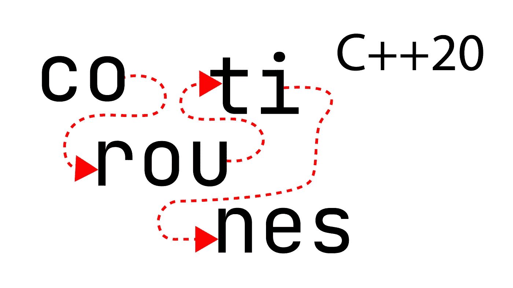
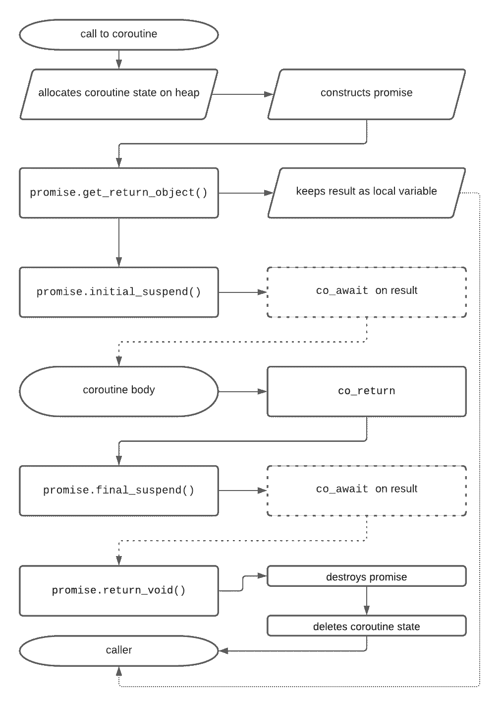
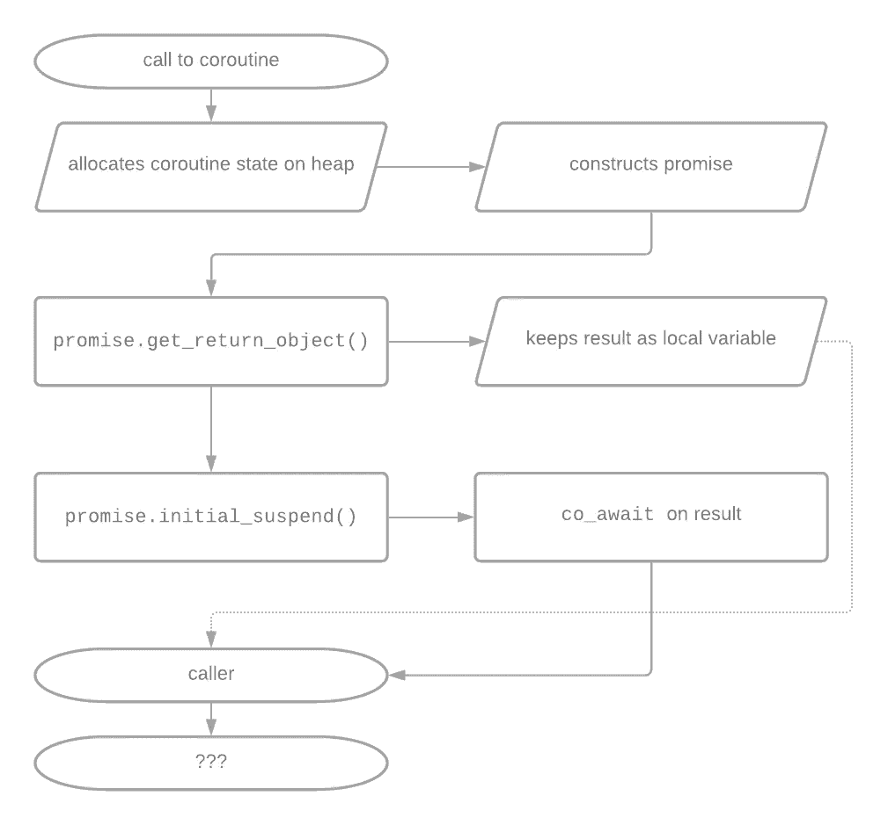
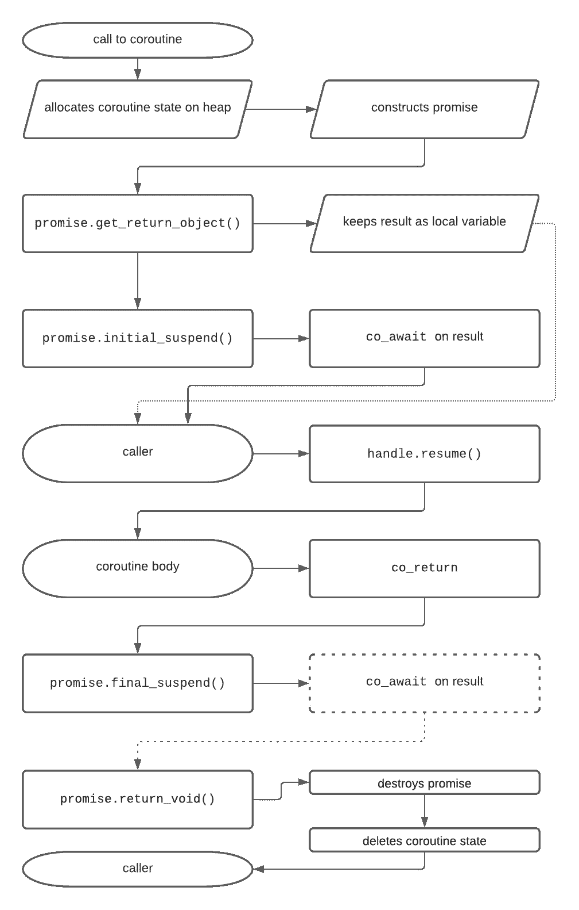
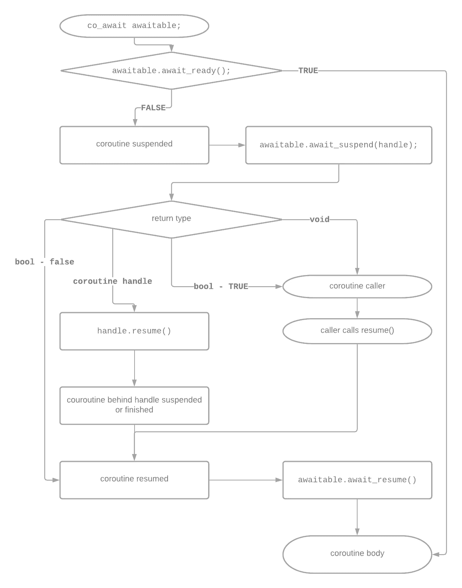

# C++20 协同程序—完整*指南

> 原文：<https://itnext.io/c-20-coroutines-complete-guide-7c3fc08db89d?source=collection_archive---------0----------------------->

C++20 给我们带来了对协程的最初支持。在本文中，我们将查看几个相互构建的协程示例。不过，警告一下，C++20 中的支持主要是针对库实现者的。C++23 应该带来额外的支持，至少应该覆盖最常见的用例。



那么，什么是协程呢？协程是任何包含`co_return`、`co_yield`或`co_await`的函数。

从根本上说，C++20 协同程序是位于函数对象之上的语法糖。编译器将围绕你的协程生成一个代码框架。该代码依赖于用户定义的退货和承诺类型。在我们用 C++23 得到一些标准类型之前，你需要自己写这些。

# 无所事事的协程程序

让我们看看您目前可以编写的最简单的协程:

```
#include <coroutine>// The caller-level type
struct Task {
    // The coroutine level type
    struct promise_type {
        Task get_return_object() { return {}; }
        std::suspend_never initial_suspend() { return {}; }
        std::suspend_never final_suspend() noexcept { return {}; }
        void return_void() {}
        void unhandled_exception() {}
    };
};Task myCoroutine() {
    co_return; // make it a coroutine
}int main() {
    Task x = myCoroutine();
}
```

好了，这看起来像是一堆样板文件，只调用一个协程，它立即返回，什么也不做。但是这是一个很好的地方，可以开始研究编译器生成的框架代码。



展示编译器围绕协程生成的代码框架的图表。

我们稍后将讨论`co_await`，但是我在这个图中特意将它们标记为虚线，因为在`std::suspend_never`的实例上调用`co_await`将立即返回。如果您运行将在链接库(在本文末尾)中找到的示例的测试版本，就可以看到这种情况。

在我们继续之前，让我们更深入地研究一下这个例子。如果我们将`initial_suspend()`返回类型改为`std::suspend_always`会发生什么？

```
//...
std::suspend_always initial_suspend() { return {}; }
//...
```



演示使用 suspend_always 时会发生什么的图表。

这种变化给我们带来了一个问题。协程现在搁浅(泄露)。

在`std::suspend_always{}`的实例上调用`co_await`会导致协程挂起。这又将控制返回给调用者。然而，调用者(函数 main)没有办法恢复协程。所以让我们解决这个问题。

```
#include <coroutine>// The caller-level type
struct Task {
    // The coroutine level type
    struct promise_type {
 **using Handle = std::coroutine_handle<promise_type>;** **Task get_return_object() {
            return Task{Handle::from_promise(*this)};
        }**
        std::suspend_always initial_suspend() { return {}; }
        std::suspend_never final_suspend() noexcept { return {}; }
        void return_void() { }
        void unhandled_exception() { }
    }; **explicit Task(promise_type::Handle coro) : coro_(coro) {}** **void destroy() { coro_.destroy(); }
    void resume() { coro_.resume(); }****private:
    promise_type::Handle coro_;**
};Task myCoroutine() {
    co_return; // make it a coroutine
}int main() {
    auto c = myCoroutine();
    c.resume();
    // c.destroy();
}
```

我们需要让呼叫者可以使用`coroutine_handle`。为此，我们通过从 promise 实例创建它的`get_return_object()`调用来传递它。然后调用者可以在挂起的协程上调用`resume()`或`destroy()`。注意，在没有挂起的协程上调用这些方法是未定义的行为。让调用方级别的类型移动也是有意义的——只是为了避免对句柄所有权的混淆。

```
// Making Task move-only:
Task(const Task&) = delete;
Task& operator=(const Task&) = delete;Task(Task&& t) noexcept : coro_(t.coro_) { t.coro_ = {} }
Task& operator=(Task&& t) noexcept {
    if (this == &t) return *this;
    if (coro_) coro_.destroy();
    coro_ = t.coro_;
    t.coro_ = {};
    return *this;
}
```



演示带有 resume()调用的普通协程的图表。

挂起的协程作为纯数据存在。因此，我们可以这样处理它，例如，在线程之间传递它。我们将在以后使用`co_await`时依赖这个属性。

到目前为止，我们的演示协程没有做任何事情。让我们继续看第一个有用的例子，它是一个发电机。

# 一个生成器协程

生成器依赖于关键字`co_yield`。`co_yield expr;`这个表达是`co_await promise.yield_value(expr);`的简写。promise 类型控制产生一个值意味着什么，以及协程是否/如何挂起。这里我们使用了`std::suspend_always`，因为我们想要停止协程，直到下一个`get_next()`调用。

```
#include <coroutine>
#include <iostream>// The caller-level type
struct Generator {
    // The coroutine level type
    struct promise_type {
        using Handle = std::coroutine_handle<promise_type>; Generator get_return_object() {
            return Generator{Handle::from_promise(*this)};
        }
        std::suspend_always initial_suspend() { return {}; }
        std::suspend_always final_suspend() noexcept { return {}; }
 **std::suspend_always yield_value(int value) {
            current_value = value;
            return {};
        }**
        void unhandled_exception() { }
 **int current_value;**
    }; explicit Generator(promise_type::Handle coro) : coro_(coro) {}
 **~Generator() {
        if (coro_) coro_.destroy();
    }**
    // Make move-only
    Generator(const Generator&) = delete;
    Generator& operator=(const Generator&) = delete;
    Generator(Generator&& t) noexcept : coro_(t.coro_) { 
        t.coro_ = {};
    }
    Generator& operator=(Generator&& t) noexcept {
        if (this == &t) return *this;
        if (coro_) coro_.destroy();
        coro_ = t.coro_;
        t.coro_ = {};
        return *this;
    } **int get_next() {
        coro_.resume();
        return coro_.promise().current_value;
    }**private:
    promise_type::Handle coro_;
};**Generator myCoroutine() {
    int x = 0;
    while (true) {
        co_yield x++;
    }
}**int main() {
    auto c = myCoroutine();
    int x = 0;
    while ((x = c.get_next()) < 10) {
        std::cout << x << "\n";
    }
}
```

因为这个协程包含一个死循环，所以永远不会被自然清理。然而，由于协程只在`get_next()`调用中运行，我们可以安全地调用`destroy()`在生成器析构函数中清理它。

现在，由于`get_next()`函数，这个协程的可用性有点尴尬。但是我们可以很容易地添加更多的样板文件，并将其转换成一个范围，就像 cppreference 上的这个例子:[https://en . CP preference . com/w/CPP/coroutine/coroutine _ handle # Example](https://en.cppreference.com/w/cpp/coroutine/coroutine_handle#Example)

# 值得称赞的

我们已经使用了两个 awaitables，`std::suspend_never`和`std::suspend_always`。让我们看看 awaitables 是如何工作的，以及如何编写自己的程序来与异步库接口。

与 promise 类型类似，编译器将围绕 awaitable 类型生成代码。如果承诺类型提供了一个`await_transform(expr);`方法，那么`co_await expr;`调用将被转换为`co_await promise.await_transform(expr);`。因此，promise 类型可以控制允许哪些 away able 类型出现在协程主体中，并可能根据表达式返回不同的 away able(注意这里的`expr`不一定是 away able)。

```
struct promise_type {
    // only allow std::suspend_always inside of the coroutine
    std::suspend_always await_transform(std::suspend_always s) {
        return std::suspend_always{};
    }
};
```

可调整类型需要提供三种方法:

```
struct awaitable {
    bool await_ready(); // one of:
    void await_suspend(std::coroutine_handle<>) {}
    bool await_suspend(std::coroutine_handle<>) {}
    std::coroutine_handle<>
        await_suspend(std::coroutine_handle<>) {} void await_resume() {}
};
```



描述由于 co_await 调用而生成的代码框架的图表。

让我们来看一个简单(尽管毫无意义)的例子。

```
struct Sleeper {
    constexpr bool await_ready() const noexcept { return false; } void await_suspend(std::coroutine_handle<> h) const {
        auto t = std::jthread([h,l = length] {
            std::this_thread::sleep_for(l);
            h.resume();
        });
    } constexpr void await_resume() const noexcept {}
    const std::chrono::duration<int, std::milli> length;
};
```

协程在进入`await_suspend`方法之前挂起。因为我们在这个方法中创建了一个新线程(在暂停点之后)，所以没有数据竞争。还要注意，虽然我们遵循上图中的“控制返回给调用者”分支，但是我们在新产生的线程中(而不是在调用者中)恢复协程。

然后我们可以在协程中使用它:

```
Task myCoroutine() {
    using namespace std::chrono_literals;
    auto before = std::chrono::steady_clock::now();
    co_await Sleeper{200ms};
    auto after = std::chrono::steady_clock::now();
    std::cout << "Slept for " << (after-before) / 1ms << " ms\n";
}
```

# 何时(不)使用协程

最后，我想谈一谈什么时候可能需要使用协程，以及它们的优缺点。首先，生成器是有用的，即使你有好的用例，你现在也应该使用它们。

## 单线程环境

如果您受限于单个线程，那么协程是一种异步处理的解决方案，否则您将无法使用它。使用当前的协程支持应该可以实现 Javascript 风格的事件循环。

## 极度线程化的环境

另一个用例位于光谱的另一端。如果您的产品需要大量的轻量级线程，协程可能会节省内存和文件描述符。

## 使用具有适当支持的异步库

这个有点明显。如果您编写用户代码，并且您的库为您提供了预构建的 awaitables 和协程支持类型，那么编写协程可能是更干净的方法。你将避免互斥体使你的代码混乱，因为所有与协程的同步都发生在`co_await`调用之后。

## 容量受控的环境

那么剩下的呢？我发现协程问题的一个例子是容量控制的环境。使用同步处理，您可以通过控制线程的数量来控制服务的容量。当达到重载时，您可以在请求到达时拒绝它们。不幸的是，使用协程防止过载变得更加复杂，在处理请求的过程中很快就会出现过载的情况。

## 超时设定

另一个我还没有弄清楚如何使用协程的棘手特性是处理超时。例如，下面的代码片段出现在我过去工作过的大多数系统中:

```
Throttler tr;
// mu is absl::Mutex (std::mutex+std:condition_variable combination)
auto has_slot = [&tr]() { return !tr.Full(); }
if (mu.LockWhenWithTimeout(Condition(&has_slot), 200 /*ms*/)) {
  // sucesfull slot grab
  do_work();
} else { 
  // timeout branch
  bail_out();
}
mu.Unlock();
```

我很难找到一个等价的协程，特别是安全地实现超时分支。

# 链接和技术说明

所有示例都使用 GCC 的主干版本(2021 年 9 月)进行了演示。

所有代码示例和脚本都可以在 https://github.com/HappyCerberus/article-cpp20-coroutines[获得](https://github.com/HappyCerberus/article-cpp20-coroutines)

# 感谢您的阅读

感谢您阅读这篇文章。你喜欢吗？

我也在 YouTube 上发布视频。你有问题吗？在[推特](https://twitter.com/SimonToth83)或 [LinkedIn](https://www.linkedin.com/in/simontoth) 上联系我。