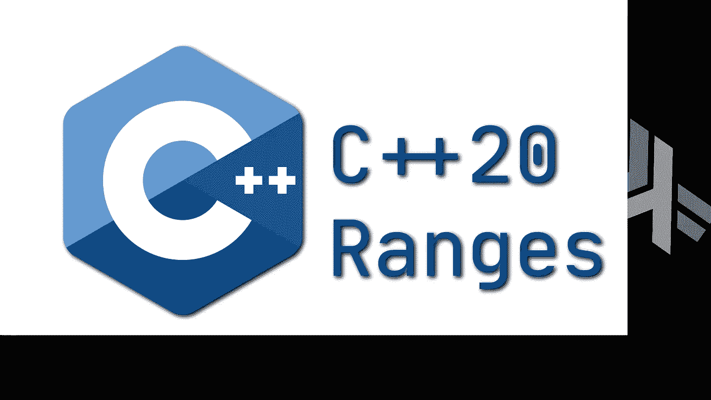

# C++20 系列—完整指南

> 原文：<https://itnext.io/c-20-ranges-complete-guide-4d26e3511db0?source=collection_archive---------0----------------------->

C++20 Ranges，也称为 STL v2，有效地取代了现有的 STL 算法和工具。在本文中，我将引导您了解范围引入的变化，讨论视图，这是一种新的可组合算法方法，并展示使用三种不同方法的 FizzBuzz 示例，所有方法都利用了范围的某些方面。



但是，请注意，范围是 C++20 中尚未成熟的特性之一。C++23 应该让我们更接近全面的支持。因此，一些示例将使用 [range v3 库](https://github.com/ericniebler/range-v3)。

# 范围与旧 STL

如前所述，范围是 STL 的替代物。然而，它们引入了内部和面向用户的变化，总体上提高了它们的有用性。

## 概念

范围依赖于概念来指定什么类型的参数可以参与每个重载。因此，在使用范围时出错会导致更短、更切题的错误消息。

一个典型的例子是尝试对 std::list 进行排序。不幸的是，如果你是 C++新手，这是一个容易犯的错误。

```
#include <iostream>
#include <ranges>
#include <list>
#include <algorithm>int main() {
    std::list<int> dt = {1, 4, 2, 3};
    std::ranges::sort(dt.begin(), dt.end());
    std::ranges::copy(dt.begin(), dt.end(), 
        std::ostream_iterator<int>(std::cout, ","));
}
```

我们现在得到的是第一个错误，而不是关于减号运算符的令人困惑的错误:

```
include/c++/12.0.0/bits/ranges_algo.h:1810:14: **note: because 'std::_List_iterator<int>' does not satisfy 'random_access_iterator'**
```

我们可以检查范围库定义的概念，因为这些是标准的一部分。例如，范围的[概念非常简单，它仅仅要求表达式`std::ranges::begin(rng)`和`std::ranges::end(rng)`有效。如果你想了解概念，请查看我的概念指南。](https://en.cppreference.com/w/cpp/ranges/range)

这里的根本变化是`end()`不再需要返回与`begin()`相同的类型。返回的 sentinel 只需要和`begin()`返回的迭代器类型相当即可。

除了简化某些用例，它还允许无限的范围和潜在的性能改进。

```
std::vector<int> dt = { 1, 2, 3, 4, 5, 6, 7, 8, 9};
std::ranges::shuffle(dt, std::mt19937(std::random_device()()));
auto pos = std::ranges::find(dt.begin(), 
                             std::unreachable_sentinel,
                             7);
std::ranges::copy(dt.begin(), ++pos, 
                  std::ostream_iterator<int>(std::cout, ","));
```

与迭代器相比，`std::unreachable_sentinel`总是返回 false。编译器因此将优化掉边界检查`it != end`,因为该表达式始终为真。

只有当我们有上下文保证算法将终止而不越界时，我们才能使用这种技巧，但它使算法与手写代码不相上下。

最后，随着范围概念的引入，我们也可以节省编写和使用接受算法变体的范围。

```
std::vector<int> dt = {1, 4, 2, 3};
std::ranges::sort(dt);
```

## 预测

一个表面上看起来微不足道的巨大新特性是对投影的支持。投影是应用于每个元素的一元可调用对象。

这通常完全消除了编写复杂的 lambdas 的需要，如果不这样做，就会大大简化它们。invocable 是 callable 的扩展，也接受成员指针。

```
struct Account {
    std::string owner;
    double value();
    double base();
};std::vector<Account> acc = get_accounts();
// member
std::ranges::sort(acc,{},&Account::owner);
// member function
std::ranges::sort(acc,{},&Account::value);
// lambda
std::ranges::sort(acc,{},[](const auto& a) { 
    return a.value()+a.base(); 
});
```

如果没有投影，我们将不得不把这个逻辑作为定制比较器的一部分。

```
std::vector<int> dt = { 1, 2, 3, 4, 5, 6, 7, 8, 9};
std::vector<int> result;std::ranges::transform(dt, 
                       dt | std::views::reverse,
                       std::back_inserter(result),
                       std::minus<void>(),
                       [](int v) { return v*v; },
                       [](int v) { return v*v; });std::ranges::copy(result, 
                  std::ostream_iterator<int>(std::cout, ","));
```

这对于视图来说是一个小小的铺垫，但是我想包含另一个使用两个范围作为输入的例子。在这种情况下，我们得到两个独立的投影。注意，这些投影也可以返回不同的返回类型，只要它们与操作匹配(这里是`std::minus`)。

## 小事情

我想在这里提到的最后一个“小”特性是防止悬空迭代器。主要是因为即使你不在乎，你也可能在你的代码库中找到这种特殊模式的用例。

```
auto good = "1234567890";
auto sep1 = std::ranges::find(std::string_view(good), '0');
std::cout << *sep1 << "\n";auto bad = 1234567890;
auto sep2 = std::ranges::find(std::to_string(bad), '0');
std::cout << *sep2 << "\n";
```

您可能会意识到这里的问题。如果我们不使用算法的范围变体,“坏的”变体会在运行时崩溃。但是，对于范围，此代码将无法编译。当使用拥有其元素的临时范围调用基于范围的算法时，该算法将返回一个特殊的迭代器`std::ranges::dangling`。

请注意，带有`std::string_view`的第一个变体仍然可以正常工作。String view 是一种不拥有其元素的范围，它的迭代器是独立的(它们不依赖于`string_view`的实例)，所以将这样的临时变量传递给基于范围的算法是完全有效的。

要选择你的范围作为临时变量，你需要专门化`enable_borrowed_range`常量:

```
template<typename T>
inline constexpr bool 
    std::ranges::enable_borrowed_range<MyView<T>> = true;
```

# 可组合视图

旧的 STL 算法的一个核心问题是它们不容易组合。因此，使用算法的代码通常非常冗长，并且在处理不可变数据时，需要额外的副本。

Views 正试图解决这个问题，使依赖于标准算法的代码不那么冗长，更加明确。

## 视图

视图仅仅是复制和移动(在恒定时间内)成本低廉的范围。因此，视图不能拥有它正在查看的元素。一个例外是`std::views::single`，它拥有正在查看的单个元素。

视图在编译时组成，期望编译器将内联代码。

例如，下面的代码将打印出该范围的最后三个元素。我们首先反转范围，然后取前三个元素，最后再次反转范围(注意有`std::views::drop`直接做这个)。

```
namespace rv = std::ranges::views;
std::vector<int> dt = {1, 2, 3, 4, 5, 6, 7};
for (int v : rv::reverse(rv::take(rv::reverse(dt),3))) {
    std::cout << v << ", ";
}
std::cout << "\n";
```

## 查看闭包对象

由于嵌套通常很深，编写和阅读组合视图的函数语法可能会很麻烦。

幸运的是，范围给我们带来了另一种合成视图的方法。名称空间中的视图实际上是视图闭包对象。这些是内联 constexpr 常量，每个`std::ranges::xxx_view`映射到一个`std::views::xxx`对象。这些对象重载了函数语法的`operator()`，重载了管道风格合成的`operator|`。

```
namespace rv = std::ranges::views;
std::vector<int> dt = {1, 2, 3, 4, 5, 6, 7};for (int v : dt | rv::reverse | rv::take(3) | rv::reverse) {
    std::cout << v << ", ";
}
std::cout << "\n";
```

注意，虽然视图不拥有它们的元素，但是它们不会改变底层数据的可变性。在这里，我们迭代数组的奇数元素，并将它们乘以 2。

```
namespace rv = std::ranges::views;
std::vector<int> dt = {1, 2, 3, 4, 5, 6, 7};auto odd = [](std::integral auto v) { return v % 2 == 1; };
for (auto& v : dt | rv::filter(odd)) {
    v *= 2;
}
```

# FizzBuzz 三种方式

让我们来看一些具体的例子。我们将编写 FizzBuzz 的三个版本:

*   一种范围化协同程序生成器
*   使用算法的生成方法
*   使用视图的合成方法

正如文章开头提到的，目前 C++20 中的支持有点欠缺。所以我会依赖 [range v3 库](https://github.com/ericniebler/range-v3)。

## 协同程序生成器

编写一个协程 FizzBuzz 生成器与典型的实现几乎相同:

```
ranges::experimental::generator<std::string> fizzbuzz() {
    for (int i = 1; ; i++) {
        std::string result;
        if (i % 3 == 0) result += "Fizz";
        if (i % 5 == 0) result += "Buzz";
        if (result.empty()) co_yield std::to_string(i);
        else co_yield result;
    }
}
```

但是，如果我们使用来自 range v3 库的`generator<>`，我们也可以使用调用的协程作为范围。

```
for (auto s : fizzbuzz() | ranges::views::take(20)) {
    std::cout << s << "\n";
}
```

这里的主要魔力在于迭代器类型的实现(注意[这段代码](https://en.cppreference.com/w/cpp/coroutine/coroutine_handle#Example)不是来自 range v3 库)。

```
// Resume coroutine to generate new value.
void operator++() { 
    coro_.resume(); 
}// Grab current value from coroutine.
const T& operator*() const {
    return *coro_.promise().current_value;
}// We are at the end if the coroutine is finished.
bool operator==(std::default_sentinel_t) const { 
    return !coro_ || coro_.done(); 
}
```

`std::default_sentinel_t`是标准提供的一种便利类型，旨在用于区别与`end()`的比较。这样，我们只需要从`generator<>`返回类型中返回这个迭代器:

```
Iter begin() {
    if (coro_) {
        coro_.resume();
    } 
    return Iter{cor_};
}std::default_sentinel_t end() { 
    return {}; 
}
```

## 使用算法生成

对于生成方法，我们有相当多的选择，最明显的是`generate_n`，它将允许我们直接生成输出。

```
ranges::generate_n(
    std::ostream_iterator<std::string>(std::cout, "\n"), 
    20,
    [i = 0]() mutable {
        i++;
        std::string result;
        if (i % 3 == 0) result += "Fizz";
        if (i % 5 == 0) result += "Buzz";
        if (result.empty()) return std::to_string(i);
        return result;
});
```

## 使用视图合成

前面的两种方法非常相似。他们都在程序上实现了 FizzBuzz。然而，我们也可以用完全不同的方式实现 FizzBuzz。

FizzBuzz 包括两个周期。周期为 3 的嘶嘶声和周期为 5 的嗡嗡声。

```
std::array<std::string, 3> fizz{"", "", "Fizz"};
std::array<std::string, 5> buzz{"", "", "", "", "Buzz"};
```

首先，我们需要将这些循环转化为无限的范围。

```
const auto inf_fizz = fizz | ranges::views::cycle;
const auto inf_buzz = buzz | ranges::views::cycle;
```

然后我们可以使用`zip_with`将它们组合起来:

```
const auto inf_fizzbuzz = ranges::views::zip_with(
    std::plus<>(), 
    inf_fizz, 
    inf_buzz);
```

现在我们有了一个无限的范围，其中每个第三元素是“Fizz”，每个第五元素是“Buzz”，每个第十五元素是“FizzBuzz”，其余的是空字符串。

我们错过了既不是嗡嗡作响的元素的简单数字。因此，让我们构建一个无限范围的指数(从 1 开始):

```
const auto indices = ranges::views::indices
    | ranges::views::drop(1);
```

最后，我们需要将这两个范围放在一起并输出最终结果。

```
const auto final_range = ranges::views::zip_with(
    [](auto i, auto s) { 
        if (s.empty()) return std::to_string(i); 
        return s;
    },
    indices,
    inf_fizzbuzz
);ranges::copy_n(ranges::begin(final_range), 20,
    std::ostream_iterator<std::string>(std::cout, "\n"));
```

# 链接和技术说明

所有代码示例和脚本都可以在:[https://github.com/HappyCerberus/article-cpp20-ranges](https://github.com/HappyCerberus/article-cpp20-ranges)获得。

用于 FizzBuzz 示例的 range v3 库可从 https://github.com/ericniebler/range-v3[的](https://github.com/ericniebler/range-v3)获得。

# 感谢您的阅读

感谢您阅读这篇文章。你喜欢吗？

我还在 T4 的 YouTube 上发布视频。你有问题吗？在 Twitter 或 LinkedIn 上联系我。