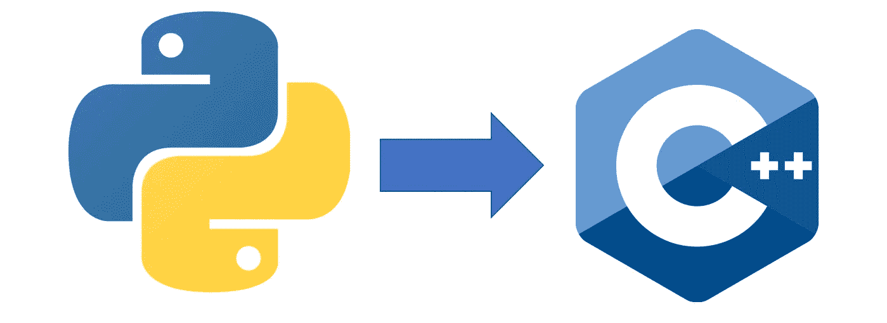
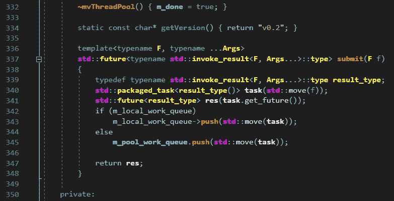
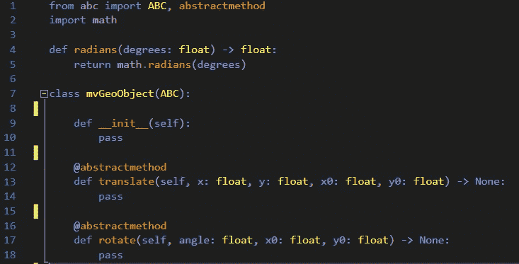
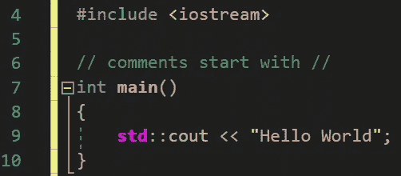

# Python 开发人员的 C/C++:简介

> 原文：<https://itnext.io/c-c-for-the-python-developer-introduction-8b12ae77d079?source=collection_archive---------1----------------------->



将 Python 开发人员带入 C/C++世界的系列文章的第一篇。

作为一名同时使用 python 和 C/C++的开发人员，我有信心说，当这些语言一起使用时，它们可以放大各自的优势，同时避免各自固有的弱点。Python 提供了看似无穷无尽的强大库、社区支持和相对较浅的学习曲线。另一方面，C/C++提供了高性能、完全的控制，以及与大多数其他语言和库接口的能力。虽然这对于使用这两种语言的其他开发人员来说似乎是显而易见的，但是快速的在线搜索将揭示 python 和 C/C++开发人员之间的裂痕，特别是对于初学者。

**从 Python 的角度看 C/c++**



对于许多 python 开发人员来说，C/C++可能看起来极其令人畏惧和陌生。他们习惯于听他们的程序员同事谈论它的难度、复杂性，甚至它的年龄。即使 python 程序员同意 C/C++的速度将 python 打得落花流水，他们也很快淡化了这一点，声称与 python 相比，开发时间要长得多。更不用说声称这种语言已经过时而且不“现代”了。

**从 C/C++的角度看 Python**



对于许多 C/C++开发人员来说，python 就像一个玩具。他们习惯于听到其他程序员谈论它的速度(或速度不足)、简单性和奇怪的语法。即使当 C/C++程序员同意 python 可以做不可思议的事情时，它也会被诸如“这不是真正的编程”、“这只是因为 xyz 库才有可能”和“它太慢了”之类的说法淡化。

**另一种观点**

虽然我不是专家，但我相信双方都有道理。然而，这些语言可以统一使用，克服它们的弱点，突出它们的优点。这就是这个系列的内容。

本系列的目标读者是希望深入研究 C/C++世界的 python 开发人员。我假设读者已经牢牢掌握了 python 的基础知识，比如:变量、函数、类、模块导入系统等等。从这些基础开始，我计划使用 python 作为参考框架来教授 C++。该系列的第一个里程碑将是 C++的工作知识；第二个里程碑将是扩展、嵌入和可能对 python 本身做出贡献的能力。

**第一个里程碑:C++的工作知识**

我们的第一个里程碑是最难的。与 python 相比，C++无疑更复杂，有更多的规则、特性和更少的保护。用 python 写作就像骑着自行车，带着头盔、护膝、辅助轮，一个忧心忡忡的家长在引导你，而你在草丛中。用 C++写就像在你骑自行车之前必须先造好它。

那么，C++的实用知识会是什么样的呢？或者更好的是，这个系列将涵盖什么呢？从 C++链接器和编译器的工作方式到可变模板、指针、线程、移动语义，以及它们之间的一切。到这个里程碑结束时，你不仅能够创建 C++程序和库，还能理解 C++是如何“在幕后”工作的。

**第二个里程碑:扩展/嵌入 Python 解释器**

假设你达到了第一个里程碑，第二个将是轻而易举的。通过这个里程碑，您将对 python 及其工作原理有更深入的了解。您将学习如何添加新的内置类型、添加 C 扩展，甚至将 python 解释器嵌入到更大的 C/C++程序中。通过这些技巧，你将能够真正利用每种语言的长处，同时避免它们的短处。

**入门**

在本系列的这一点上，我们将偏离 ide 和特定于平台的细节。在本系列的后面，我们将切换到实际的 IDE。在我们讲述了一些基础知识之后，我们将开始讨论 C++链接器和编译器是如何工作的，以及它们与 python 解释器有什么不同，然后再深入讨论 C++语言。

对于前几篇文章，我建议对 python 和 C++代码都使用 https://www.onlinegdb.com/的 T4。该网站是免费的，你可以在各种语言之间切换。我们将使用 Python3 和 C++17。

**打死马:你好世界**

根据传统，我将从 hello world 示例开始:



输出:

```
Hello World
```

此时只有 3 件事需要注意:

1.  语句以分号结束，而不是换行。
2.  要在 C++中打印到控制台，您必须在文件的顶部有*# include<iostream>*，并且通过调用 *std::cout < < x* 来打印到控制台，其中 x 是您想要打印的项目。
3.  与 python 不同，每个 C++程序都必须有一个入口点，这是一个名为 *main* 的函数，它返回一个 **int** 。我们将在下一篇文章中讨论函数和类型。

虽然这个例子很简单，但是实际上还有更多我们将在后面讨论的内容。比如什么是 *std::cout* ？还有 *< <* 的语法是怎么回事？什么是*# include<iostream>*和导入 python 模块一样吗？这些问题将在接下来的文章中得到解答。

**总结**

既然介绍性的东西已经过时了。我们可以开始有趣的事情...在下一篇文章中。在下一篇文章中，我们将开始分解类型系统和函数。如果你对这个系列及其方向感兴趣，那就伸出手吧！

感谢阅读。