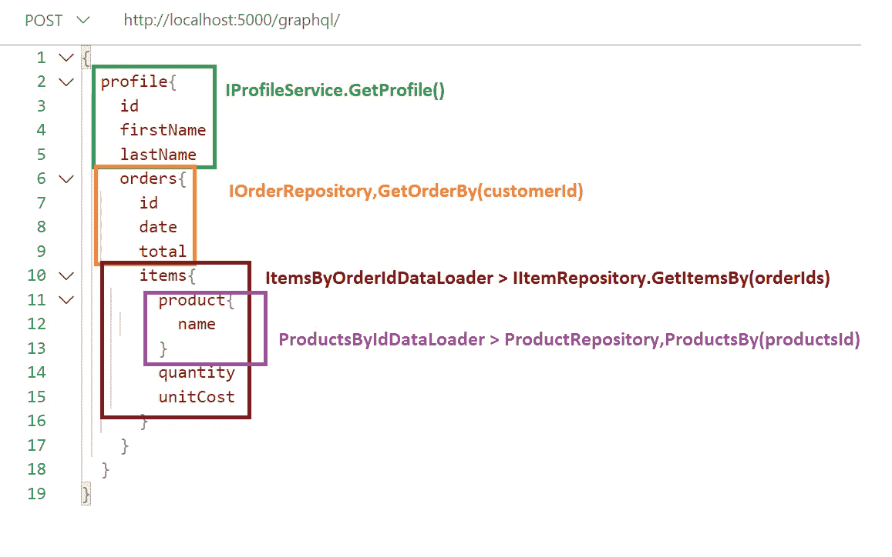
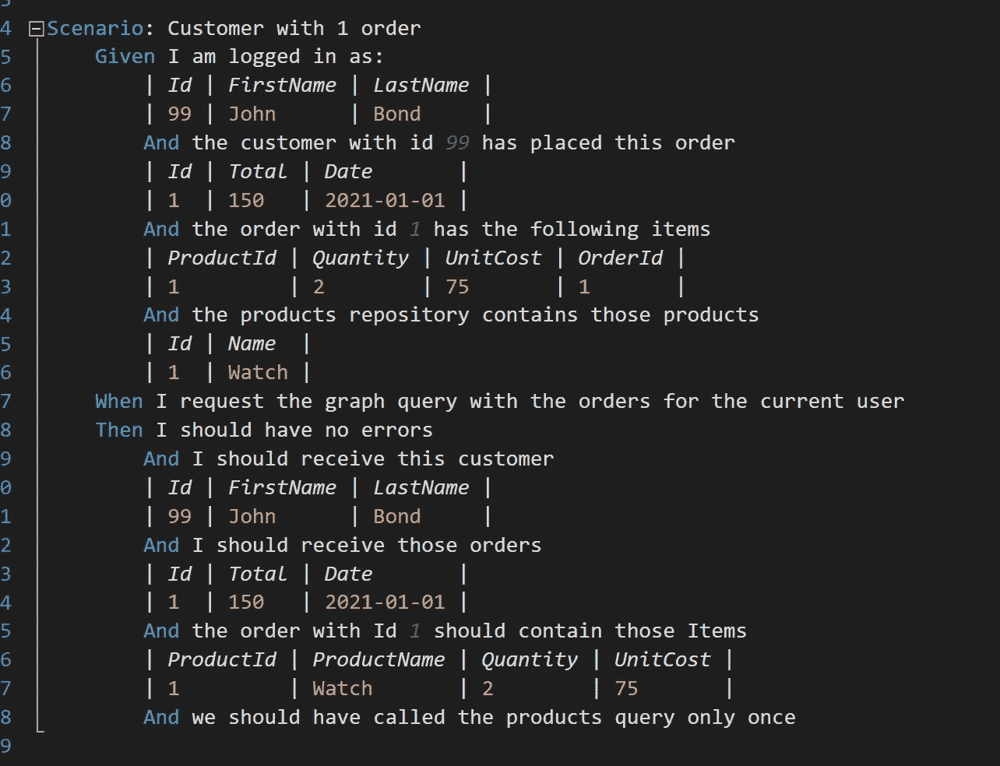
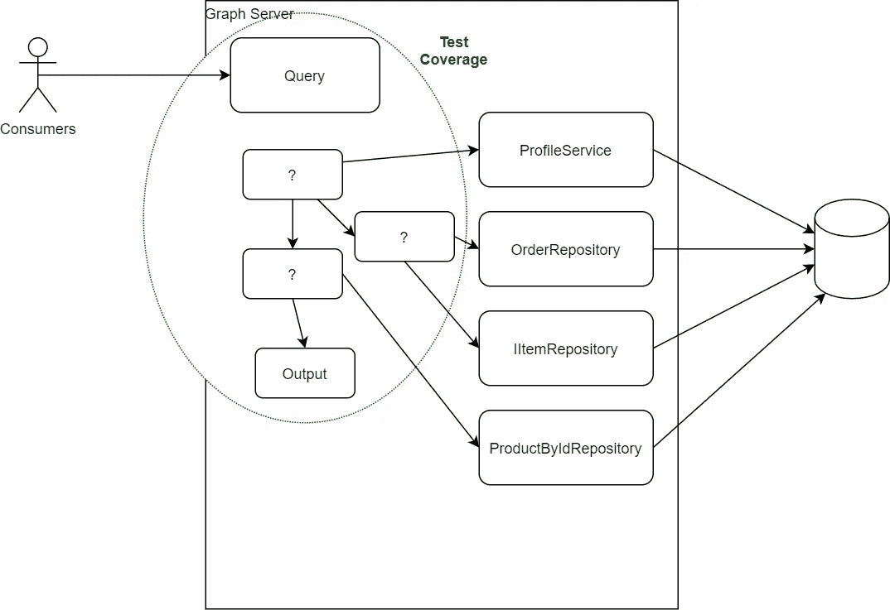

# C# GraphQL Hotchocolate + Specflow 验收测试

> 原文：<https://itnext.io/c-graphql-hotchocolate-specflow-acceptance-tests-b976af39ddf0?source=collection_archive---------1----------------------->

小女孩与安全眼镜和发网做科学实验

在我之前的[帖子](/no-more-rest-long-live-graphql-apis-with-c-55962ba8f942)中，我已经展示了 GraphQL 如何通过创建灵活/高效的 API 并适应微服务架构[来加速开发。但是到目前为止，我是在没有任何测试的情况下开发的，因为它们只是示例代码，但是如果我们想做生产质量的代码，我们必须能够测试 API。](/graphql-schema-stitching-c-2ccfd209d3ce)

## 基本的内存测试

热巧克力。net core framework for GraphQL 非常友好，为我们提供了一种简单的方法来执行 GraphQL 查询，因此我们可以运行查询，获得 JSON 响应，然后根据需要断言响应属性。

在管道中运行基本的 HotChocolate 测试，以 JSON 的形式获取响应，反序列化，然后断言响应属性。

我们完全可以只用上面的例子 XUnit 做测试覆盖。但是在我看来，测试范围将变得足够大和复杂，我们需要一种更好的方式来表达需求。

# 一个稍微现实一点的场景:

带有配置文件、订单、订单项目和产品的图表模式。

每种颜色代表数据来自哪个接口；这些可能是简单的 SQL 查询或 NoSql 实现。在合同方面，我们有:

你可以在 ItemRepository 和 Product Repository 中注意到；我们不会在单独的调用中为每个产品询问存储库，因为我们想要批量调用这些数据库。这就是使用 GraphQL 数据加载器的全部意义。

我们的数据流读作:

*   有一个获取当前登录用户的查询。
*   然后有一个查询来获取该用户的订单。
*   然后有一个数据加载器把所有的订单 id 批量化，然后一气呵成的得到商品。
*   然后是同样的产品配料概念。

我们如何编写一个测试来覆盖这个图形查询的全部呢？

# 验收测试驱动的测试— Specflow

我们将尝试实现一个验收测试，这种测试几乎是端到端的，也称为双环 TDD。我们也将使用 Specflow，所以如果你开始需要更多关于测试策略或者如何做的上下文，你可以参考我的 [Specflow。网芯帖](/acceptance-test-driven-development-in-net-core-with-specflow-dcb17fb7a893)。

完整的代码可以在这里的 [Github 中找到。](https://github.com/RaphaelYoshiga/HotChocolateDemo)

查询的覆盖范围可以是这样的:

涵盖整个订单查询的 Specflow

我们定义我们的用户查询，以及我们的存储库将提供给我们的外部数据，然后相应地断言响应。

在这种类型的 TDD 上，您正在清除像数据库和外部 API 这样的外部依赖，这样做的好处是测试运行速度快，并且不会因为网络或数据变化而出现误报。

图中我们的 4 个适配器不在测试范围内。

## 热巧克力内存服务器。

记住，我们可以加速 GraphQL 执行管道来执行我们的查询。

然后我们需要存根我们的**外部依赖关系**，所以我们将使用 GraphQL 服务器的服务集合来注入存根，而不是真正的实现。

# 存根还是不存根？

达芬奇的雕像在意大利米兰晴朗的蓝天上。

我已经和多个团队一起使用存根模型进行了有效的开发，效果很好，测试套件给了我们很多信心。然后，我们在隔离测试中测试外部依赖性，我们称之为适配器测试。stubbing 的缺点是您只测试了应用程序的一部分。一旦注入真正的实现，什么能保证一切都很好地协作呢？

## **永不存根！(讥讽)**

有理由不清除外部依赖，因为这给了你更好的测试覆盖率，这对于更复杂和更慢的测试来说是有好处的。

你需要问的是:

*   更好的覆盖率值得设置测试数据的额外工作和复杂性吗？
*   测试会慢一点。是否慢到足以减缓发展？
*   其他团队 API 呢？你应该存根吗？

我通常倾向于存根，但我会留给你这个:

> 答案没有对错，只有取舍。

如果您没有 stubbing 东西，您可以编写一个冒烟测试套件，直接测试部署的 API，作为黑盒测试，而不是像我们以前那样在内存中运行查询。

# 这对我们有什么好处？

这允许我们从测试优先的角度来思考如何编写 GraphQL 端点。根据经验，GraphQL 端点会很快变得复杂，您可能希望有一种方法来描述从 GraphQL 到数据库调用的转换。此外，它还为您提供了一种快速检查一切是否如预期那样连接的方法。

正如 Kent Beck 所说，“开发人员有权知道他们的代码是否有效”。

祝你愉快。

资源:

*   [完整代码示例](https://github.com/RaphaelYoshiga/HotChocolateDemo)
*   [graph QL 相对于 Rest 的优势](/no-more-rest-long-live-graphql-apis-with-c-55962ba8f942)
*   [如何用 GraphQL 和 C#创建微服务架构？](/graphql-schema-stitching-c-2ccfd209d3ce)
*   [使用 Specflow 和验收测试驱动开发。网芯。](/acceptance-test-driven-development-in-net-core-with-specflow-dcb17fb7a893)