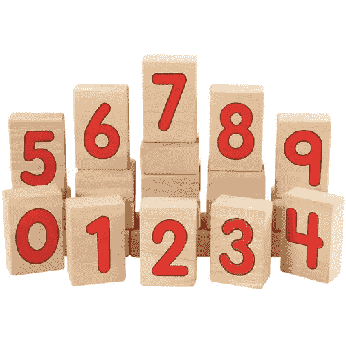

# C++只使用 if 语句对 5 个数进行排序

> 原文：<https://itnext.io/c-sort-5-numbers-using-only-if-statements-21d183751f72?source=collection_archive---------1----------------------->

在编程中对数字进行排序并不有趣，尤其是当你不得不在不使用任何内置函数的情况下从头开始排序的时候。当你理解道格拉斯·亚当斯的这句话时:

> 当我花一整天的时间给我的电脑编程，让它自动执行一项原本需要我用十秒钟才能完成的任务时，我很少比这更开心了。

在本文中，我们将只使用 c++ if 语句编写代码来对 5 个数字进行排序。我们将讨论以下主题:

*   对 3 个数字进行排序的算法
*   仅使用 c++ if 语句为 5 个数字编写算法代码
*   结论

## 对 3 个数字进行排序的算法

我将从解释仅使用 *if 语句*对数字进行排序的算法开始。我们将首先考虑对 3 个数字进行排序，使其不那么复杂和易于理解。

考虑未排序数字的数组 *arr= [3，1，0]。*我们可以按以下步骤进行排序:
**第一步**:比较索引 1 和 0。*If(arr[1]<arr[0])*
如果这个条件成立，那么就交换数字。我们可以看到 1 < 3 是真的。所以我们交换，数组变成[1，3，0]

**步骤 2** :比较下一个索引 2 和 1。*If(arr[2]<arr[1])*
如果这个条件成立，那么就交换数字。我们可以看到 0 < 3 是真的。所以我们交换，数组变成了[1，0，3]

**步骤 2.1** :如果步骤 2 的条件为真，则重复步骤 1。*If(arr[1]<arr[0])*
如果这个条件成立，那么交换数字。我们可以看到 0 < 1 为真。所以我们交换，数组变成[0，1，3]。

我们现在有了排序后的数组[0，1，3]。我们看到，排序 3 个数字最多需要 3 个 if 语句。我们将扩展我们在这里学到的知识，对更多(5)个数字进行排序。

> 数字越多，对数字进行排序所需的 if 语句就越多。

## 仅使用 c++ if 语句为 5 个数字编写算法代码

在这里，我将扩展上面解释的算法，对 5 个数字进行排序；不过，我直接从代码来解释。

仅使用 if 语句对 5 个数字进行排序

从上面的代码中，我们可以识别 3 个函数；swap()、sort()和 main()。

**main()** :

这是我们的主要功能。这里，我们测试排序函数。我们的排序函数接受一个数字数组，并返回一个指向数组第一个元素的指针

> 在 C++中，我们不能返回整个数组

**互换()**:

这是一个简单的函数，它通过引用接受两个变量，并使用一个临时变量来交换这两个变量。在这里，我决定从头开始编写代码，但是我们仍然可以使用函数 std::swap()，这是 C++标准模板库(STL)中的一个内置函数

**Sort():**

为了更好地理解这几行代码，让我们考虑一下数组
**a =【4，5，7，9，6】**。你会注意到第一部分(**a 部分**)是我们上面描述的排序 3 个数字的相同算法。因此，a 部分将对数组的前三个数字进行排序，我们将得到 **a = [4，5，7，9，6]**

**a 部分**以指数 2 和 1 结束。现在**部分 b** 从那里继续。考虑在 if 语句的每个阶段，我们递增索引。因此，我们有指数 3 和 2，然后我们遵循以下步骤:

*   **步骤 b1** :比较指标 3 和指标 2。if(a[3] < a[2])
    如果这个条件成立，那么就交换数字。我们可以看到 9 < 7 是假的。所以，这里没有交换。
*   **步骤 b2** :如果步骤 a 为真，则应用**a 部分** ( **步骤 1** 、**步骤 2** 和或**步骤 2.1)** )。我们在这里意识到的是，每次我们在一个特定的位置排序时，我们需要确保我们再次排序该位置后面的所有内容。因此，**a 部分**将确保所有内容都在索引位置 3 以下排序。

**c 部分**从**b 部分**离开的地方继续。我们现在首先要排序的是索引 4 和 3。如果遵循以下步骤:

*   **步骤 c1** :比较指标 4 和 3。if(a[4] < a[3])
    如果这个条件成立，那么就交换数字。我们可以看到 6 < 9 为真，所以我们互换得到 **a = [4，5，7，6，9]。**
*   **步骤 c2:** 如果步骤 c1 为真，则应用**部分 b(步骤 b1，步骤 b2** )。我们在这里会注意到，**乙部**也会适用于**甲部**。最后，我们将得到排序后的数组
    **a =【4，5，6，7，9】**

## 结论

我必须承认，这里的解决方案并不简单，我可能没有解释清楚；然而，我尽了最大努力使它尽可能简单。我仍在寻找降低代码复杂性的方法。一种方法是我们可以减少冗余代码。此外，可以使用更好的算法，该算法产生更少的代码行，并且还降低了其复杂性。我乐于接受建议，所以请随意批评、欣赏和分享。