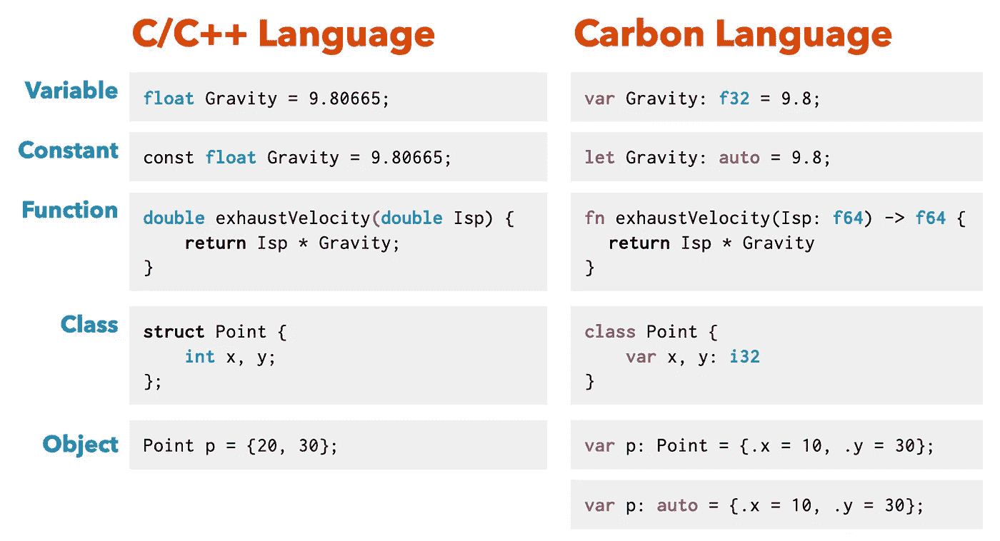
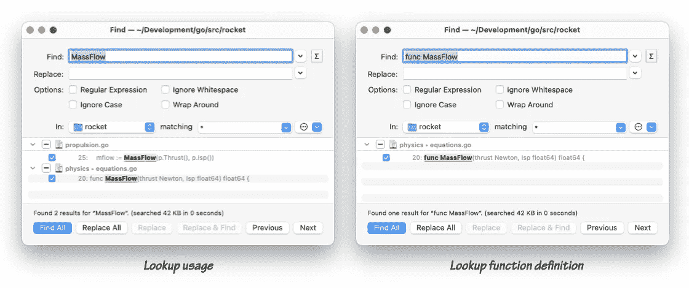

# C++语法很糟糕，Carbon 解决了它

> 原文：<https://itnext.io/c-syntax-sucks-and-carbon-fixes-it-744efe5cae71?source=collection_archive---------0----------------------->

## C++语法不是非常好吗？为什么碳公司的人需要改变它？


从我读过的许多关于 Carbon 的 twitter 评论来看，有相当多的 C++开发人员对 Carbon 编程语言的语法非常不满。我见过的一个反复被问到的问题是:

> 如果他们正在为 C++开发人员开发一种新的语言，那么他们为什么要让它看起来完全不同呢？C++语法非常好，而且众所周知。

实际上，不，C++语法一点也不好，但是一旦你在 C++领域呆了足够长的时间，就很容易将这一事实内在化并对此视而不见。当 Chandler Carruth 提出 Carbon 时，他可能没有很好地解释*为什么* C++语法如此有问题。我不能保证我也会成功，但是我会尝试去挖掘为什么 C++语法有问题，为什么我们需要升级的细节。让我们从一个简单的比较开始:



你会注意到 Carbon 中的大多数语句都有一个*介绍者*关键字，比如`fn`、`var`、`let`和`class`。这些关键字允许您通过查看一个关键字来确定您正在处理哪种陈述。那是 Carbon 刻意设计的。让我引用碳的第一次[展示:](https://youtu.be/omrY53kbVoA?t=745)

> 我不知道是否有人做过 C++解析器，它不能成为一个完整的编译器。这非常困难。我们可以做得更好。
> 
> —钱德勒·卡鲁斯

作为一个经常使用各种工具来帮助我进行 C++开发的开发人员，我完全可以同意这个观点。编写解析 C++的代码非常困难。自从我在 1998 年开始写 C++代码以来，这是我亲眼所见的事情。虽然 Java 和 C#社区被令人惊叹的 ide 和工具宠坏了，但我们 C++开发人员多年来一直使用非常糟糕的工具。命令完成经常会中断，尤其是在较大的项目中。尤其是重构工具，与 Java 和 C#开发人员所拥有的相比，将会非常有限。

VS 代码的 C++ highlighter 的维护者解释了为什么为 C++制作工具如此困难:

> 19，000 行的 C++语法荧光笔不仅是所有语言中最大的，而且几乎是第二大语法(5000 行的打字稿)的四倍。
> 
> 印象深刻？不能，因为它甚至还不能在变量声明中突出自定义类型！Rust highlighter 可以不费吹灰之力做到这一点，因为它与碳非常相似。
> 
> —杰弗里·海金

然而，即使是 Java 和 C#在解析方面也不理想，因为它们借鉴了 C/C++的很多语法。我第一次在 Go 上使用*介绍者关键字*时注意到了语言的好处。Go 引入了带有关键字`func`的函数。这使得搜索代码毫不费力。我可以更容易地区分用法和定义。这里我正在查找对`MassFlow`函数的调用和`MassFlow`函数的定义。



C/C++语法的问题在于，只有在解析了几个标记之后，才能确定一个语句是什么。虽然对人类读者来说可能没那么重要，但对我们的工具来说却很重要。仅仅编写一个正则表达式来搜索某些东西变得更加困难。

## 最令人烦恼的解析

解析 C++代码的困难的一个具体例子被称为[“最麻烦的解析”](https://en.wikipedia.org/wiki/Most_vexing_parse)。这个奇特的术语是由斯科特·梅耶斯在他 2001 年的著作《有效短期债券》中首次提出的。下面的例子将说明这个问题:

```
// C++ most vexing parse
void foo(double x) {
  int bar(int(x));
}
```

第二行代码不明确。它可以解释为如下编写的函数声明:

```
// A function named bar takes an integer and returns an integer.
int bar(int x);
```

C++允许在函数声明中用圆括号将参数`x`括起来。因此，C++解析器不容易区分声明一个函数`bar`和声明一个用转换成整数的值`x`初始化的变量`bar`。

下面是一个更详细的例子:

```
// C++ Unnamed temporary
struct Timer {};

struct TimeKeeper {
  explicit TimeKeeper(Timer t);
  int getTime();
};

int main() {
  TimeKeeper time_keeper(Timer());
  return time_keeper.getTime();
}
```

`main`函数中的第一行不明确:

```
TimeKeeper time_keeper(Timer());
```

对于 C++来说，这一行可能看起来像函数`time_keeper`的定义，返回 `TimeKeeper`对象并接受一个函数对象作为参数。在声明 C++函数时，不需要指定参数的名称。`int foo(int);`是有效的函数签名。

这个问题在 Carbon 中无法重现，原因如下:

*   Carbon 类没有构造函数
*   对象用赋值来初始化

下面的代码试图用 Carbon 复制早期的 C++代码。我必须发明一些类函数`Create`和`Make`来代替 C++例子中使用的构造函数。

```
// Carbon 
class Timer {
    fn Create() -> Self;
};

class TimeKeeper {
    fn Make(t: Timer) -> Self;  
    fn getTime[me: Self]() -> int;
};

fn Main() -> i32 {
  let time_keeper: auto = TimeKeeper.Make(Timer.Create());
  return time_keeper.get_time();
}
```

我们可以注意到 Carbon 语法中的一些事情，这些事情可能并不完全明显。`Self`表示封闭类的类型。方括号内的东西，比如`[me: Self]`指的是没有显式传递的任何东西。它是被诱导的东西。在这种情况下，它就是 C++开发人员熟知的`this`指针。Go 也有非常相似的方法。Go 中的`getTime`方法如下所示:

```
// Go method example
func (me TimeKeeper) getTime() int
```

方括号也用于其他隐式数据，如类型参数。其中一个碳代码示例如下:

```
// Carbon code showing function parameters
fn QuickSort[T:! Comparable & Movable](s: Slice(T)) {
  if (s.Size() <= 1) {
    return;
  }
  let p: i64 = Partition(s);
  QuickSort(s[:p - 1]);
  QuickSort(s[p + 1:]);
}
```

这里我们没有指定`this` (me)对象，而是指定了一个类型参数`T`，它必须同时满足`Comparable`和`Movable`接口。Carbon 使用一个冒号`:`来指定对象的类型，而`:!`用来表示我们正在指定类型参数必须遵循的接口。

## 解析 C++中的函数指针

当您定义以函数为参数的高阶函数时，将返回类型放在前面而不是最后的问题变得很明显。快速看一下这段代码，告诉我函数指针参数叫什么名字？

```
// C++
int FindFirst(int xs[], int n, bool (*condition)(int x)) {
    for(int i = 0; i < n; ++i) {
        if (condition(xs[i])) {
            return i;
        }
    }
    return -1;
}
```

函数指针参数的名字是`conditon`。我想大多数人都会同意这不是你可以快速阅读的东西。它显示了 C++语法的一个问题。

我本打算大张旗鼓地展示这在 Carbon 中会有多好，但不幸的是，我在 Carbon 语言规范中找不到任何关于函数指针的内容。相反，我将展示这在 Go 中会是什么样子，并推测如何在 Carbon 中实现它。

```
// Go
func FindFirst(xs []int, condition func(int) bool) int {
	for i, x := range xs {
		if condition(x) {
			return i
		}
	}
	return -1
}
```

Go 代码更容易阅读的原因是参数名在前，类型在后。是一致的。对于 Carbon，我认为他们可以使这一点更清楚，因为他们使用冒号来分隔类型和参数名:

```
// Carbon - Assumption (similar to Rust)
fn FindFirst(xs: Slice(int), condition: fn(int) -> bool) -> i32
```

实际上，这段代码几乎就是你在 Rust 中编写`FindFirst`函数签名的方式。

## 摆脱常量引用的混乱

写 C++代码时最烦人的事情之一就是处理常量正确性和引用。考虑下面的几何示例代码。

```
// C++ class
class Circle {     
public:
    const Point& center() const;
    float radius() const;    
    void  setCenter(const Point& pos);
    void  setRadius(float radius);

    bool inside(const Point& p) const;
    bool intersect(const Circle& c) const;

private:
    Point center;
    float radius;
};
```

偶尔，你想传递一个参数，比如一个圆的中心，作为一个常量引用，`const Point& pos`，但是其他时候你不想。我将半径作为一个`float`的副本传递。这在机器码级别更有效，因为单个浮点值可以通过微处理器寄存器传递。相反，引用是作为指针实现的，这意味着到达实际所需的值会导致额外的间接引用。

Carbon 完全解决了这个问题，让编译器来决定什么是最好的。在 Carbon 中，我们将前面的类实现为:

```
// Carbon class
class Circle {     
    fn center[me: Self]() -> Point;
    fn radius[me: Self]() -> f32;    
    fn setCenter[addr me: Self*](pos: Point);
    fn setRadius[addr me: Self*](radius: f32);

    fn inside[me: Self](p: Point);
    fn intersect[me: Self](c: Circle);

    var center: Point;
    var radius: float;
}
```

你会注意到`setCenter`和`setRadius`看起来很相似。Carbon 将会找出最佳方式将参数`pos`和`radius`传递给它们各自的功能。无需担心引用和常量。在 Carbon 中，参数默认为`let`类型，所以它们本质上类似于 const。

有时，您需要能够修改调用者中的值。Carbon 没有引用，所以用指针代替。`Self*`表示`me`参数是一个指针，允许我们修改`me`。使用指针而不是引用的一个问题是，你必须接受一个对象的地址。

```
// Carbon - Calling setRadius if it was defined as 
// fn setRadius[me: Self*](radius: f32)

var circle: Circle = MakeRandomCircle();
var ptr: Circle* = &circle;
ptr.setRadius(5);
```

每次都获取地址来改变一个圆形对象是很麻烦的。出于这个原因，我们在`me`前面添加了`addr`关键字，指示 Carbon 为我们获取地址。这就是为什么我们可以调用`setRadius`而不用获取地址:

```
// Carbon 
var circle: Circle = MakeRandomCircle();
circle.setRadius(5);
```

## 为代码可读性而设计

大多数开发人员从不研究或关心可用性和用户界面设计。他们应该这样做，因为适用于用户界面布局的原则与编写清晰易读的代码有很多共同之处。

需要注意的一个重要细节是人类阅读文本的方式。你唯一一次阅读单词中的单个字母是在你还是个孩子学习读写的时候。成年人通过*形状*来阅读单词。我们通过观察单词的形状来识别它们。

这个事实意味着，为了快速识别不同的选择，单词和句子的形状应该是不同的。让我们举一个例子来说明这个问题。考虑一个带有选项列表的网页:

```
I want to customize tools...
I want to have custom shows...
I want to do custom animations...
```

这是一个糟糕的设计，因为句子的形状太相似了，使得视觉扫描选项更加困难。我们可以通过剔除重复的内容来改进设计:

```
I want to:
  Customize tools...
  Custom shows...
  Custom animations...
```

虽然有所改进，但我们仍然存在每个选项中的第一个单词看起来非常相似的问题。通过对每个选项进行重新措辞，我们可以使选项更容易阅读:

```
I want to do:
  Tool Customizing...
  Reset Shows...
  Custom Animations...
```

这些原则如何应用于 Carbon 编程语言？Carbon 使用简短的*介绍者*关键字，例如`fn`，这更侧重于个别方法或功能的名称:

```
// Carbon function names line up
fn center[me: Self]() -> Point;
fn radius[me: Self]() -> f32;    
fn setCenter[addr me: Self*](pos: Point);
fn setRadius[addr me: Self*](radius: f32);          
fn inside[me: Self](p: Point);
fn intersect[me: Self](c: Circle);
```

这使得在 Carbon 中扫描函数或方法列表的速度更快。尤其是语言，比如 Java，在这方面很可怕。你读`public static void`，然后你终于到了重要的部分，也就是方法名。C++更好，但是仍然会将注意力从方法名上转移开，因为在方法名之前有返回值的信息:

```
// C++ function names don't line up
const Point& center() const;
float radius() const;
```

当方法名处于不同的偏移量时，扫描方法名列表变得更加困难，因为返回类型的名称可能不同。这也适用于列出变量。通过使用像 *var* 这样的*介绍者*关键字，我们可以在每一行的相同位置获得变量名的开始，从而允许代码读者更快地浏览。

```
// Carbon variable names line up
var center: Point;
var radius: float;
```

# 结论

Carbon 语法不仅对解析器更容易，对开发人员阅读代码和使用工具也更容易。开发人员可以更容易地搜索 Carbon 代码，也可以更容易地扫描 Carbon 代码，因为标识符等有效位存在于相同的字符偏移量处。