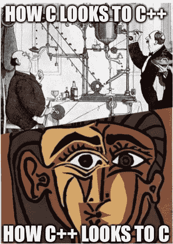

# C 对 C++:战斗！

> 原文：<https://itnext.io/c-versus-c-fight-201b3f07a94f?source=collection_archive---------1----------------------->



# 我非常喜欢 C 语言

用 C 写代码是我从编程中获得的最解放的体验。我不会浪费几个小时浏览文档，或者阅读解释为什么深奥的概念是完全必要和酷的博客。我不会盯着别人的代码，试图找出在一堆乱七八糟的符号后面隐藏着什么功能(如果有的话)，以及他们为什么这样做。我只是想一些东西，然后在几分钟内编码。

我认为这种态度并非出于无知或偏见:我写过 Java 和 JavaScript，我在工作中同时使用 Python 和 C++，但我仍然更喜欢 C。用《星球大战》的话来说，我认为 C++是“技术恐怖”，其核心有一个缺陷，而 C 是“更文明时代的更文明武器”。十有八九，C 对你和对我来说并不代表同样的东西:自由、掌握和 K&R(第二版)。)那是我十几岁的时候姐姐给我的。

C 的发明者在《C 编程语言》(1978 年)的序言中正确地指出了它的优势:它令人愉快、富于表现力、用途广泛，但不太大、不太专业、也不太受限制。在我看来，人们对 C 的许多抱怨都可以通过使用更好的编码技术或创建库来解决其可察觉的缺陷来解决。

c 正如我所需要的那样是类型安全的，不会强迫我去经历毫无意义的束缚。它在我需要的程度上支持面向对象编程，不需要强迫所有东西都是一个类，也不需要我写几百行样板代码。总之，C 就像一件肘部打了补丁的旧夹克一样适合我。我越来越意识到这让我成了少数派:尽管 C 语言标准的新版本仍在发布(例如 C23)，但世界的大部分地区都已经向前迈进了。

我最近很惊讶地听到吉多·范·罗苏姆说他最喜欢的语言(除了 Python)是 C。当然，Python 是用 C 写的，并且借鉴了 C 的思想，但是我仍然很惊讶，因为现在很少听到关于 C 的任何正面的东西。许多开发人员自豪地站出来宣称“C 是一种糟糕的语言”，尽管它在创造他们周围的现代世界中起着至关重要的作用。同一批开发人员坐下来，不假思索地继续使用 C 语言编写的软件(git、Python、Linux 等)。)做好自己的本职工作！

在 C 编程上投入了我生命中的这么多，这种不屑一顾的态度让我感到悲伤和有点生气，就好像有人侮辱了我的家庭成员一样。比雅尼·斯特劳斯特鲁普曾经说过“世界上只有两种语言:人们抱怨的语言和没人使用的语言”。或许这意味着我不应该对人们抱怨我最喜欢的语言过于敏感。我正在努力提高自己的这方面。

# 可怕的语法呢？

批评 C 的语法很容易；甚至有一个网站可以在“C 胡言乱语”和英语之间进行翻译，这很有趣。此外，我们不要忘记国际模糊 C 代码竞赛，它从 1984 年开始“庆祝 C 语言的语法不透明性”。

我发现对 C 语法最有效(但相对罕见)的批评是它的冗长。当结合没有类型推断和方法定义中没有隐式的`this`或`self`指针的事实时，结果通常是大量重复和冗长的声明。

下面是一个常量指针的声明，它指向一个常量无符号整数，必须至少 64 位宽(即`x`必须始终指向`y`，而`y`不能通过解引用`x`来改变):

```
unsigned long long int const *const x = &y;
```

实际上，这可能是使用类型别名编写的:

```
uint64_t const *const x = &y;
```

我曾经开玩笑说，我们正在接近一个“常数奇点”:一个假设的时刻，每个 C 程序中的每个符号都是类型限定符`const`。默认情况下，对象是可变的，但是大多数对象都可以在声明时初始化，之后就不应该修改了。如果一个程序是以现代风格编写的，其中声明可以与其他语句混合，这一点尤其正确。

声明不能从左到右(或从右到左)直接读取，因为`*`具有右结合性(对于它的操作数，一个指针)，而`[`和`(`具有左结合性。我承认，当我看到程序员新手面对声明被从里到外、从后到前解析的可怕现实时，我有一种反常的快乐。

Kernighan & Ritchie 在《C 编程语言》(1988)中解释了这种语法背后的推理:

> *指针的声明*`*ip*`
> 
> *`*int *ip;*`*
> 
> **意为助记符；上面说* `**ip*` *这个表达式是一个* `*int*` *。变量声明的语法模拟了变量可能出现的表达式的语法。**

*下面是一个指向函数的指针(名为`roundf`)的声明，该函数将浮点数作为其参数，并返回一个至少 16 位宽的整数:*

```
*int (*roundf)(float);*
```

*K&R(第二版)附录 A 中使用的语法。)指定一个*声明符*是一个形式为*指针(opt)直接声明符*的表达式，其中*指针*是`*`，而*直接声明符*要么是一个*标识符*，一个带括号的*声明符*，要么是另一个*直接声明符*，后跟一个带括号的*常量表达式(opt)* 或*后两种选择分别代表一个数组和一个函数。**

*解析上面的声明时，*指针(opt)* 不能匹配任何东西，直到*直接声明符*的递归规则将`"(*roundf)(float)"`分解为*参数类型列表*、`"float"`和另一个*声明符*、`"*roundf"`:*

1.  *声明:`"int (*roundf)(float)"` `;`*
2.  *声明说明符:`"int"`，
    初始化声明符列表:`"(*roundf)(float)"`*
3.  *类型说明符:`int`，
    初始化声明符:`"(*roundf)(float)"`*
4.  ***声明符**:`""`*
5.  *直接宣告者:`"(*roundf)"` `(` `"float"` `)`*
6.  *直接声明符:`(` `"*roundf"` `)`，
    参数类型列表:`"float"`*
7.  ***声明符** : `"*"` `"roundf"`，
    参数表:`"float"`*
8.  *指针(opt): `*`，
    直接声明:`"roundf"`，
    参数声明:`"float"`*
9.  *标识符:`"roundf"`，
    声明-说明符:`"float"`*
10.  *类型说明符:`float`*

*换句话说，顶层的*声明符* `(*roundf)(float)`的类型是`int`，嵌套的*声明符* `*roundf`的类型是`int ()(float)`。*

*没有方括号来覆盖`*`的贪婪性，下面的语句声明了一个函数(名为`roundf`)，它返回一个指向整数的指针:*

```
*int *roundf(float);*
```

*这是因为*声明符*规则的*指针(opt)* 部分直接匹配，不像前面的例子:*

1.  *声明:`"int *roundf(float)"` `;`*
2.  *声明说明符:`"int"`，
    初始化声明符列表:`"*roundf(float)"`*
3.  *类型说明符:`int`，
    初始化声明符:`"*roundf(float)"`*
4.  ***声明者**:`"*"`*
5.  *指针(opt): `*`，
    直接声明:`"roundf"` `(` `"float"` `)`*
6.  *直接声明符:`"roundf"`，
    参数类型列表:`"float"`*
7.  *等等。*

*换句话说，*声明符* `*roundf(float)`的类型是`int`。*

*下面是一个函数(名为`get_roundf`)的声明，它接受一个布尔参数，并返回一个指向返回整数的函数的指针:*

```
*int (*get_roundf(_Bool to_nearest))(float);*
```

*顶层*声明符* `(*get_roundf(_Bool to_nearest))(float)`的类型为`int`，嵌套*声明符* `*get_roundf(_Bool to_nearest)`的类型为`int ()(float)`。*

*实际上，大多数程序员使用`typedef`来定义类型的别名，然后从这些别名组成更复杂的声明。上述声明可以简化如下:*

```
*typedef int roundf_t(float);
roundf_t *get_roundf(_Bool to_nearest);*
```

# *如果呢？*

*您可能想知道如果取值操作符是左关联的，上面的声明会是什么样子:*

```
*int roundf*(float); // pointer to a function returning int
int roundf(float)*; // function returning a pointer to int
int get_roundf(_Bool to_nearest)*(float); // function returning a pointer to a function returning int*
```

*Stroustrup 在《c++(1994)的设计和发展》中提出了类似的后缀声明语法，但是使用了`->`而不是`*`。*

*这个讨论中的改变并没有增加他写`int*`而不是`int *`的习惯的份量:*指针(opt)* 仍然不是*声明说明符*之一，因为它只是用来描述*声明符*的各个部分之间的关系。*

*除了将整个类型规范(除了标识符*之外的所有内容)移到左边，他的风格是不连贯的。**

# *但是 C 不支持现代范例*

*很容易批评 C 缺乏对面向对象编程(类)、[泛型编程](https://medium.com/itnext/tutorial-generics-in-c-b3362b3376a3)(模板)、函数式编程(lambdas、闭包、懒求值)的语言级支持。然而，这预先假定语言*应该*明确支持每一个已经出现或可能出现的编程范例。*

# *面向对象编程*

*我知道面向对象编程有四个支柱:*

*   *抽象*
*   *包装*
*   *遗产*
*   *多态性*

*这些其实不是很新颖。在 Smalltalk、Java 和 C++之前，封装和抽象并不是不存在的。我猜想所有的意识形态都适合(或者合并，不那么贬义)自己的共同利益。这很好，但它确实会产生逻辑谬误，如“如果上帝不存在，我们就不会有道德”，“没有人民代表的苏维埃，我们就不会有分享”或“没有阶级，我们就无法隐藏实施细节”。*

*OOP 的核心思想是将数据和代码捆绑到对象中。c 的类型系统确保函数只能在参数列表指定的自定义类型(`struct`或`union`)上运行。程序员可以通过把在给定类型上操作的函数的定义放在与该类型的定义相同的位置来增加额外的组织层。我敢肯定，在宣传 OOP 特性的语言发明之前，程序员们早就这么做了。*

*c 当然支持抽象(函数、输入/输出流)和封装(不完整的`struct`或`union`类型)。不完整类型可用于任何不需要对象大小且不直接访问其成员的上下文中:*

```
*struct encapsulated;
struct encapsulated *get_encapsulated(void);
struct encapsulated *e = get_encapsulated(); // Okay
e->x = 0; // error: incomplete definition of type 'struct encapsulated'*
```

*即使没有这个安全网，当你破坏封装时，通常也是显而易见的，例如，直接访问一个没有实现该数据类型的方法的函数中的`struct`成员。*

*对继承的支持是 C 最弱的地方(有些人可能会说不存在)。无论如何，继承似乎已经不流行了，取而代之的是组合(“有 a”而不是“是 a”关系)。*

*通过将包含超类成员变量的`struct`嵌套在代表子类的`struct`中，可以在 C 中实现类似继承的东西，尽管子类的对象(显然)不能与超类的对象互换使用:*

```
*struct superclass {
  int (*getc)(struct superclass *);
  size_t count;
};

struct subclass {
  struct superclass super;
  FILE *f;
};*
```

*要么两种类型都必须是完整的，以便可以直接访问子类的`struct`的相关(超类)成员，要么程序员必须提供一个子类方法(即函数)来返回嵌入超类对象的地址:*

```
*struct superclass *subclass_get_superclass(struct subclass *s)
{
  return &s->super;
}*
```

*在 OOP 术语中，多态性通常意味着虚方法。虚方法允许类覆盖它们的超类的某些功能的实现。这可以使用函数指针在 C 中实现(比如上面的`struct superclass`定义的`getc`成员)。*

*我通常将这种指针的解引用隐藏在传递了超类实例地址的普通函数后面，以避免暴露机制并要求调用者拥有包含函数指针的完整类型的`struct`:*

```
*int superclass_getc(struct superclass *s)
{
  return s->getc(s);
}*
```

*使用函数指针实现[多态性的主要缺点是缺乏类型安全性。虚方法的替代实现不能使用指向相应子类实例的类型化指针来访问成员变量；相反，它们接收超类对象的地址，和/或一个指向子类特定数据的`void *`指针(取决于机制)。](https://medium.com/itnext/polymorphism-in-c-tutorial-bd95197ddbf9)*

*子类对象的地址通常是使用事实上的标准宏`container_of()`从超类对象的地址计算出来的:*

```
*static int subclass_getc(struct superclass *s)
{
  struct subclass *sub =
    container_of(s, struct subclass, super);

  int c = fgetc(sub->f);

  if (c != EOF) {
    s->count++;
  }

  return c;
}*
```

*我很少注意到这种类型安全的缺乏，因为 C 无缝地将`void *`转换成指向子类类型的指针(赋值时)，或者`container_of()`隐藏了所需的类型转换。这个问题至少局限于虚方法实现。*

# *通用编程*

*c 一直通过其预处理器对[泛型编程](https://medium.com/itnext/tutorial-generics-in-c-b3362b3376a3)提供一些支持，该预处理器可用于`#define`命名标记和类似函数的宏，连接宏参数以创建新标记，以及`#include`使用宏和/或`typedef`泛型化的代码块。C11 通过`_Generic()`关键字增加了对特殊多态性(根据参数类型选择表达式)的支持。*

*我倾向于使用一种类型来实现算法，而不是尝试泛型编程，这种类型可能能够表示任何值(例如，`long`而不是`int`)，将用户数据地址存储在`void *`指针中(gasp！)，将一个泛型`struct`(例如一个链表节点)包装在一个特定类型的中，或者简单地复制并修改同一算法的一个现有实现(boo！).如果结果代码是可读的、安全的和正确的，那么代码复制并不总是最糟糕的解决方案。*

# *函数式编程*

*Lambdas 是匿名嵌套函数定义，它可以访问在其父范围内声明的对象。这使得“回调函数”的常见模式是类型安全和方便的。在 C 语言中，这样的函数必须被命名，用文件范围声明，并且只能通过一个`void *`指针访问其父范围内的对象。回调要访问的多个对象必须捆绑在一个`struct`中。*

*最近我更喜欢迭代器，而不是回调函数。通过不离开父函数，这些方法避开了在父函数范围内访问对象的问题:控制迭代的`for`语句(或等效语句)是父函数的一部分，循环体包含了原本在回调函数中的代码。*

# *为什么不直接用 C++？*

*阅读 C++代码让我产生一种既陌生又熟悉的不安感觉，就像恐怖谷效应一样。也许这就像看到一个被毁容的老朋友的脸——幸运的是我从未有过这种经历。有时我认为 C 与 C++过于相似的事实会煽动对立阵营的支持者之间的敌意，就像同一宗教的不同教派之间的分裂。当然，C 和 Java 程序员之间没有兼容性之争。*

*我强烈推荐 Stroustrup 的书《C++的设计和进化》(1994)。它对他的思想提供了有价值的见解，也证实了我长期以来的怀疑。这本书的大部分内容都是关于他想改变却不能改变的事情，以及他对 C 语言及其用户的感受。*

*   *他声称发明 C++的原因是将 BCPL 的可移植性和效率与“Simula 对程序组织的支持”结合起来——而不是改进 C*
*   *他的目标是“在运行时间、代码紧凑性和数据紧凑性方面与 C 语言相匹配。”他明确表示为了生存需要与 C 竞争。*
*   *当他开始用类创建 C 时，他“不是 C 专家”。*
*   *他当时并不了解他的设计选择的所有后果。*
*   *他不喜欢 C 语言的语法和语义，形容它们是“有缺陷的”和“已知的混乱”,它们的“反常”给他带来了“痛苦”。*
*   *他发现与“顽固的老 C 用户”和“准 C 专家”(比如我？)“艰难又沮丧”。*
*   *他缺乏 C 和 UNIX 专业知识，这导致他意外地对语法进行了不兼容的修改。*

*我发现令人吃惊的是，当 Stroustrup 第一次在他的书中引入一个`class`定义时，他没有努力解释为什么这种表示优于等价的`struct`和函数声明。*

*c 与类的例子(来自 Stroustrup，1994):*

```
*class stack {
  char  s[SIZE]; /* array of characters */
  char* min;    /* pointer to bottom of stack */
  char* top;    /* pointer to top of stack */
  char* max;    /* pointer to top of allocated space */
  void  new();  /* initialize function (constructor) */
public:
  void  push(char);
  char  pop();
};*
```

*C 语言中的等效代码:*

```
*struct stack {
  char  s[SIZE]; /* array of characters */
  char *min;    /* pointer to bottom of stack */
  char *top;    /* pointer to top of stack */
  char *max;    /* pointer to top of allocated space */
};

void stack_new(struct stack *); /* initialize function (constructor) */
void stack_push(struct stack *, char);
char stack_pop(struct stack *);*
```

*当然，`class`的定义更简洁，但是我认为如果方法定义可以用简单的工具(或肉眼)搜索到，我对 C++的厌恶至少会减少 80%。试图在定义了数百个同名方法的代码库中找到正确的定义是非常糟糕的——尤其是在涉及继承的情况下。*

*Stroustrup 给出的在 C 上构建的理由与欣赏 C 无关，而是与利用 C 的成功有关:他宣称 C++“必须像 C 一样杂草化”，并列举了 C 的优点，如“灵活”、“高效”、“可用”和“可移植”。其中最后两个只是反映了 C 语言在当时越来越受欢迎。“高效”(正如 Stroustrup 所描述的)隐含在 K&R 对“低级”语言的描述中，“灵活”与 K&R 对 C 语言一般性的描述一致。*

*那么，我们剩下的就是声称与 C 接近兼容的意图，以便取代它作为通用低级语言的选择。但是他不喜欢 C，也不喜欢那些不接受他的想法的用户。值得注意的是，Stroustrup 没有*而*认为令人愉快、富于表现力或者不太大是 C 的优势。这可能在一定程度上解释了 C++。*

*c 已经和平相处很久了。当《K&R》的第一版在 1978 年出版时，它的作者安慰地写道，C“随着一个人经验的增长而经久不衰”*

*相比之下，C++似乎在与自己进行永恒的战争，因为它讨厌它的始祖。从 Stroustrup 在指针声明的左边写星号的方式来看，这一点对我来说很明显。他想把他的语言从 K&R 的句法中分离出来，但是他做不到，所以他在一种否认的状态中运作。现在他有了一大群追随者，不仅仅是抄袭他，还会提出一些奇怪的理由，比如“类型在 C++中非常重要”(但在 C？)，或者指称“C 程序员的思维方式不同”(他们没有)。*

*在《C++的设计和进化》(1994)中，Stroustrup 写道:*

> *让一个名字的声明模仿它的使用的 C 技巧导致声明难以阅读和书写，并且最大化了混淆声明和表达式的机会。*

*你是否同意 Stroustrup 或 K&R 的观点几乎无关紧要。后者根据自己的原则创造了一种他们喜欢的语言，而前者抨击他自己语言的语法，他复制了这种语法，而且无法改变。你觉得哪种姿势更有吸引力？*

*阅读 Herb Sutter 的文章，很难不得出他也讨厌 C 的结论，因为他对 C 语法基础(例如左边的返回类型、显式类型、多词类型说明符)和他喜欢的编写 C++的方式(右边的返回类型、类型推理、多词类型的不兼容语法)之间的不兼容性不屑一顾。我经常在想，在 C 语言崩溃之前，你能把它的语法变化堆到多高；直到最近我才意识到这已经发生了。*

*不幸的是，C 程序员无法忽视 C++的存在，就像 C++程序员无法忽视 C 一样。有一段时间，我几乎每天都要键入“new”作为标识符(通常与“old”成对)，然后回去删除我键入的内容，然后试图想出一个愚蠢的同义词，如“fresh”或“replacement”。*

*我不能忽视 C++的另一个原因是，我专业从事混合代码库的工作，而 C++未能实现其与 C 兼容的声明。C99 的一些最强大和令人愉快的功能(即复合文字和指定初始值设定项)不被 C++支持，尽管 C++20 最终采用了与 C 微妙不兼容的不完整形式的指定初始值设定项。更糟糕的是，数组声明中的指定初始值设定项不可能在 C++中得到正确支持，因为 C++11 标准化了 lambdas 的冲突语法。*

# *哦…推荐信*

*在我和一些同事上了一个 C++培训课程后，主要的效果不是我们开始写 C++，而是我们开始在指针声明中更多地使用`const`。C++有一个独立的“引用”概念，它类似于指针，但有三个主要区别:*

*   *初始化后，引用不能引用不同的对象。*
*   *引用不能是空指针。*
*   *引用与表达式中的真实对象具有相同的语法。*

*使用`const`限定符，第一个属性可以很容易地在 C 中实现:*

```
*int *const x = &y; // x can only point to y*
```

*C 的类型系统不能强制第二个(非空)属性。向 C 添加可空性信息而不破坏其语法或语义的逻辑方法是一个新的指针*目标*类型限定符:*

```
*_Optional int *z = malloc(10); // z can be null*
```

*你可能想知道为什么我写了`_Optional`而不是`nonnull`或类似的。那是另外一天的一个[长故事](/why-c-needs-a-new-type-qualifier-61ad553cbe71)！*

*在表达式中，一元运算符`&`获取对象的地址；它与解引用操作符`*`相反，后者从地址获取对象。如果在 C 声明中允许使用`&`,那么你可能会合理地期望它以同样的方式取消`*`。*

*在 C++声明中，`&`改为声明一个引用，并且与它在表达式中的用法相比，具有与相反的*含义。这是荒谬的:**

```
*int a, // 'a' has type 'int'
    *b, // dereferencing pointer 'b' yields 'int'
    c[3], // elements of array 'c' have type 'int'
    d(float), // value returned by function 'd' has type 'int'
    *e(float), // dereferencing return value of 'e' yields 'int'
    &f = a, // address of 'f' has type 'int' ?!
    *&g = b; // 'g' has type 'int' ?!*
```

*`*`作为指针声明的一部分出现的唯一原因是允许声明语法模仿表达式的语法。然而，当 C++引用(使用`&`声明)出现在表达式中时，`&`并不是必需的！*

# *当然也不全是坏事吧？*

*C 和 C++作为竞争对手一起成长，互相借鉴。正如竞争通常所做的那样，这改善了两种语言。以下是我很高兴在 C 中看到的一些 C++特性:*

*   *BCPL 式的评论。*
*   *内嵌函数。*
*   *布尔数据类型。*
*   *`for`语句中的声明。*
*   *使用前强制声明函数。*
*   *函数调用的类型检查。*
*   *声明中没有隐含的`int`。*
*   *能够将声明与其他语句混合使用。*

*谢谢 C++！你让 C 变得更好。*