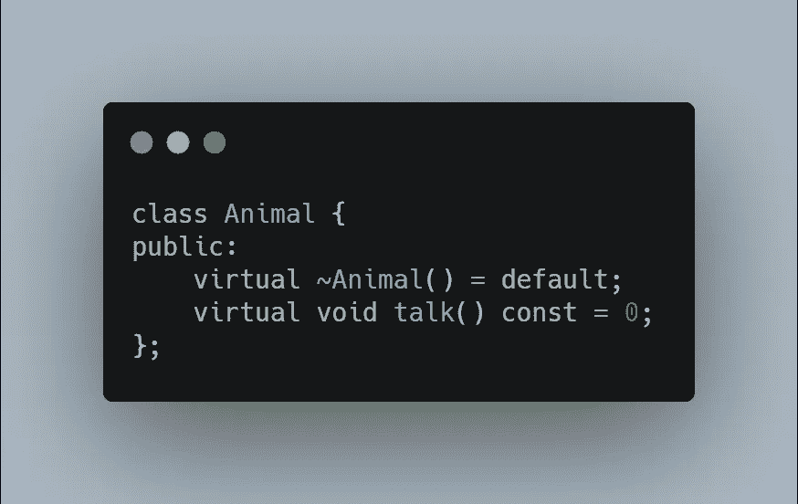
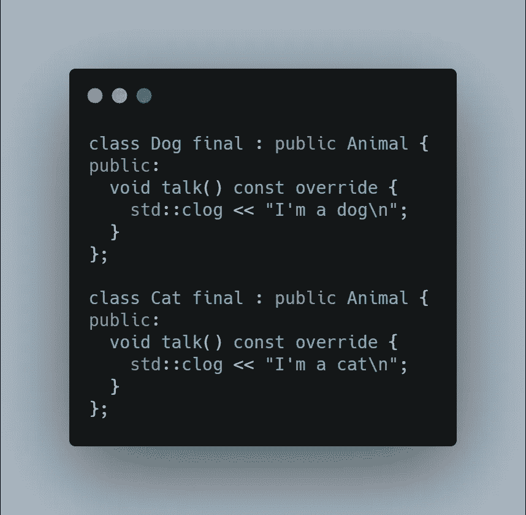
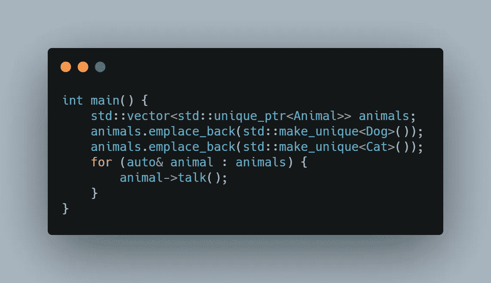
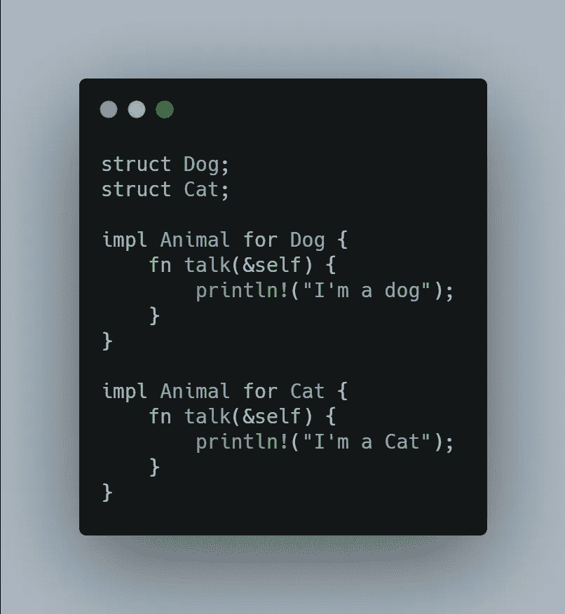
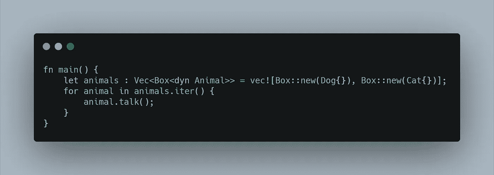

# C++与 Rust——简单的多态性比较

> 原文：<https://itnext.io/c-vs-rust-simple-polymorphism-comparison-e4d16024b57?source=collection_archive---------0----------------------->

这是我的第一个 Medium.com 故事。在阅读、发推特和用书签标记了数百个故事之后，我决定为那些像我一样从 C++学习 Rust 的人创建一个简单的故事。

在这篇短文中，我们将比较 C++和 Rust 处理动态多态性的方式。快速声明，我不是一个 Rust 专家，而是一个更熟悉 C++的人(顺便说一下，你可以参加我们在 https://www.meetup.com/San-Diego-CPP/的圣地亚哥 C++聚会)

让我们从多态性的目的开始:通过动态的运行时多态性，我们能够保存一个指向一个类型的指针或引用，该类型实际上指向一个更具体的派生类型。这是人们在使用面向对象语言时学到的基本知识。对于我们的例子，我们将使用**动物**作为基础，顶级类型，以及更具体的类型，如**猫**和**狗**。



**动物**类类型有一种

1.  虚拟默认析构函数。这是在处理堆分配时释放正确类型所必需的。虽然这超出了本文的范围，但是请在评论部分提问。
2.  虚方法/成员函数 **talk()** 。它是纯虚拟的，没有实现。派生的具体类类型必须实现它才能创建实例。以下是方法:



上面很简单:我们创建两个新的类， **Dog** 和 **Cat** ，使用 **Animal** 的公共继承，实现 **Animal** 基类， **talk()中声明的纯虚函数。**final 关键字定义了这个类将是一个叶子类型。您不能从 **Dog/Cat 子类化。**

下面是我们如何使用“现代 C++”中演示的类层次结构。



为了进行编译，你将需要**#包含**以下头文件: **< iostream >** ， **<内存>** 和<矢量> 。

在上面的主函数中，我们创建了一个指向**动物**类类型的指针向量。我们使用 **unique_ptr < >** 来管理堆的分配和释放。这是 C++11 的一个特性。 **make_unique <**

最后，我们创建循环(C++11 特性—循环的**范围)来迭代**动物**，并在每个实例上调用 **talk()** 。只要每个类型实现了 **talk()** 接口(覆盖 **Animal** 基类的虚函数)，具体实例的类型就无关紧要了。**

以下是输出:

```
I'm a dogI'm a cat
```

让我们对铁锈做同样的事情。

Rust 与 C++不同，因为它实现了类型定义之外的类型接口。

为了让大家理解这一点，让我们再做一个与上一个例子相似的例子。首先，让我们实现一个特征，或者一个接口的定义。


我们定义了一个 **Animal** trait，它有一个不返回任何东西(void)的函数，并使用 **& self** 作为函数的参数。Rust 中的 **& self** 概念类似于 C++中的 **this** 指针。

接下来我们可以定义**狗/猫**并实现这个 trait(或者特性/接口)。

在 Rust 中，我们在开始添加功能之前定义了没有接口的**狗/猫**。相反，C++同时定义了类和它们的特性。因此，在 C++中，独立的 **Dog/Cat** 类类型已经能够进行 **talk()** 。



最后要实现的是 **main()** ，它迭代 **Dog** / **Cat** 实例。



Rust 的 **Box < >** 就像 C++的 **unique_ptr < >** :我们创建一个 **Animal** s 的向量，并在每次迭代中调用 **talk()** ，保持输出与我们的 C++示例中相同。

**盒子< >** 里面的**【dyn Animal】**之所以存在，仅仅是因为 Rust 不知道**动物**性状的大小。特征没有“大小”，因为特征只是接口。为了让程序能够编译，我们告诉 Rust,**Animal**trait 是一个动态类型，它将被实例化(堆分配),用一个实现这个 trait 的具体类型。

这就是现在，希望你喜欢阅读我的第一篇文章。我们发现，尽管两种语言的语法截然不同，但在实现多态性语义时有很多相似之处。