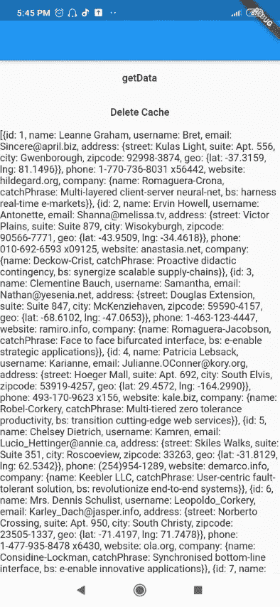
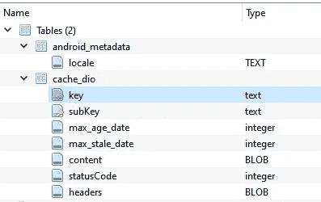
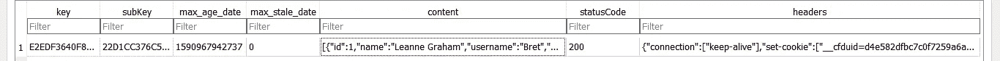

# 使用 Dio-Flutter 缓存 http 响应(HTTP 缓存)

> 原文：<https://itnext.io/cache-your-json-response-with-dio-flutter-http-caching-1fa819776d7d?source=collection_archive---------0----------------------->

首先将 [dio](https://pub.dev/packages/dio) 和 [dio http 缓存](https://github.com/hurshi/dio-http-cache)添加到您的发布中:

> 戴奥:^3.0.9
> 
> dio_http_cache: ^0.2.6

> 你可以在故事的结尾看到一个完整的例子

初始化您的 **DioCacheManager** ，我们稍后将使用它作为我们的拦截器

ps:如果需要，我们需要这个对象的一个实例来管理(删除)我们的缓存

> **DioCacheManager**_ DioCacheManager = DioCacheManager(CacheConfig())；

然后从 **buildCacheOptions** ()构造函数中创建您的 **Options** 对象。

确保添加 maxAge 持续时间，它决定了系统应该保留你的缓存多长时间。

> **选项**_ cache Options = buildCacheOptions(持续时间(天数:7))；

您可以添加 forceRefrsh，它将使 dio 做出如下反应

1.  首先从网络获取数据。
2.  如果从网络获取数据成功，存储或刷新缓存。
3.  如果从网络获取数据失败或没有可用的网络，**尝试**从缓存获取数据，而不是错误。

> **选项**_ cache Options = buildCacheOptions(持续时间(天数:7)，force refresh:true)；

## 默认值为 FALSE，因此 dio 将检查缓存中是否有旧的响应，如果有，则完成，如果没有，则尝试从网络获取数据。

## 如果您想检查后端是否有新的更新数据，这可能是个问题，所以请考虑将 foreceRefresh 改为 true

在`buildCacheOptions`中添加的其他参数:

1.  **primaryKey:** 默认使用`host + path`作为主键，也可以自定义。
2.  **子项:**默认情况下，query ( data 或 queryParameters)用作子项，您可以在必要时指定子项，例如:

*   `buildCacheOptions(Duration(days: 7), subKey: "page=1"`

**3。maxAge:** 设置缓存时间。如果值为 null 或未设置，它将尝试从响应头中获取 maxAge 和 maxStale。

**4。maxStale:** 设置陈旧时间。当 maxStale 之前发生错误(比如 500，404)时，尝试返回缓存。

*   `buildCacheOptions(Duration(days: 7), maxStale: Duration(days: 10))`

是时候对 **Dio** 对象添加**拦截器**了，如下所示:

> Dio _ Dio = Dio()；
> 
> _ dio . interceptors . add(_ diocachemanager . interceptor)；

最后，将 **_cacheOptions** 添加到 get http 请求中。

> **响应**响应= *等待* _dio.get(
> 
> '您的网址'，
> 
> options:_ cache options)；

就这样…

您可以通过一次清除所有缓存来删除缓存:

> _ diocachemanager . clear all()；

或者使用默认的**路径**的`PrimaryKey`的特定缓存，或者您可以在缓存选项中自定义它，如下所示:

> options _ cache options = buildcache options(持续时间(天数:7)，forceRefresh: true，primary key:' myPrimaryKey ')；

现在用这个**主键**删除缓存，我们使用:

> _ diocachemanager . deletebyprimarykey(' myPrimaryKey ')；

请注意，您可以等待结果，因为前面的方法返回一个***Future<bool>***

您可以使用这个完整的工作示例来研究它:

您也可以从这里下载:

 [## obadajasm/dio_cache_example

### 一个新的颤振项目。这个项目是颤振应用的起点。一些帮助您入门的资源…

github.com](https://github.com/obadajasm/dio_cache_example) 

通过点击 **getData** 按钮，我们从这个 URL“https://jsonplaceholder . typicode . com/users”获取 JSON 数据

并在将 dio 请求与 dio 缓存集成后缓存它，如我们所学

现在你可以退出应用程序，关闭互联网，重新获取数据。

您也可以点击**删除缓存**按钮删除缓存数据。

> **奖励提示**:

数据存储过程将由 dio 自动处理

但是如果你想知道发生了什么

数据将存储在 sqlite 数据库中(默认名称为 DioCache.db ),您可以使用 **DioCacheManager** 中 **CacheConfig** 中的 **DatabaseName** 参数对其进行定制。

该数据库由两个表组成:

1.  android _ 元数据
2.  缓存 _dio

这些列基本上是不言自明的，但是我们感兴趣的部分是保存属于特定键的**响应**对象的**内容**表。在我们的示例中，只有一个**响应**，因为 **cache_dio** 表看起来像这样:

