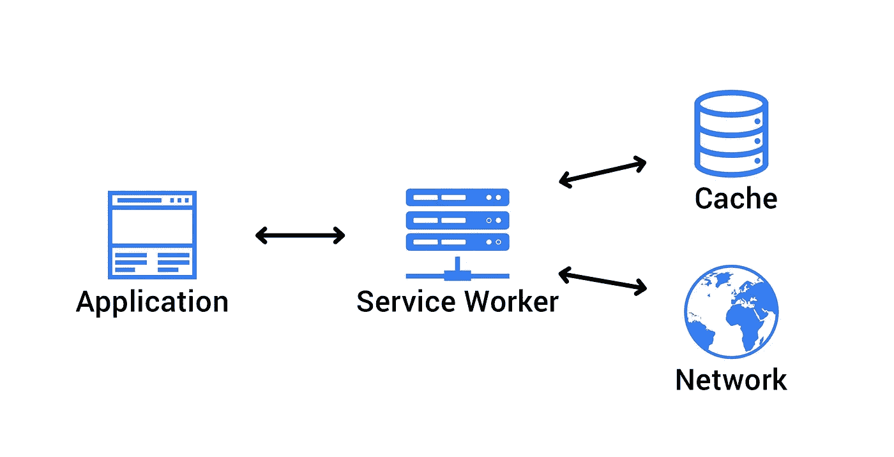

# PWA 中的缓存:何时使用乐观还是悲观

> 原文：<https://itnext.io/caching-in-a-pwa-when-to-use-optimistic-vs-pessimistic-d627a5943990?source=collection_archive---------4----------------------->



让任何应用程序成为渐进式 Web 应用程序的第一步是通过 ServiceWorkers 引入一个离线页面。服务人员带来了许多附加功能，其中很大一部分与缓存有关。无论是在页面级、资产级甚至是字体级，所有类型和场景的缓存都有自己的策略。今天我们将只讨论其中的两个。它们是乐观缓存和悲观缓存。我们将在后续的文章中讨论实现细节，所以这里只关注策略本身。

# 乐观缓存

你可以认为“网络”是战略的重点。因此，乐观的缓存是当您最初检查网络，然后回退到任何缓存存储时，所以这是一种*网络优先*的方法。

所以这个过程应该是:

1.  *用户是否拥有有效的网络连接*
2.  *如果是- >从网络请求数据*
3.  *如果否- >从缓存中请求数据*

当您的数据经常变化，并且向用户显示陈旧的数据会带来负面的用户体验(甚至可能更糟)时，这是非常有用的。

这可能有用的一些例子是:

*   用户资料页面:如果用户更新了内容，而此时内容显示不正确，这会令人非常沮丧和担忧
*   库存水平:给出一个不正确的可用数量可能会导致非常混乱的情况，浪费客户和卖家的时间和金钱。

关于“乐观缓存”要提到的最后一点是，它显然依赖于一种可靠的方法来确定您的用户是否有网络连接，理想情况下不会让他们等待请求失败。现在可以从服务人员内部使用[网络信息 API](https://developer.mozilla.org/en-US/docs/Web/API/Network_Information_API) 。这样支票就变成了 1 号线:

```
if (navigator.onLine) { 
   // user is online
   // ...
```

不幸的是支持不是很好(目前在 FireFox 和 iPhone Safari 上缺失)。因此，在运行这个逻辑之前，您可能必须先做一个特性检查。

# 悲观缓存

因此，如果乐观使用网络，悲观不使用网络，是一种*缓存优先*方法。这种类型的缓存的思想是检查数据的缓存，然后退回到网络。如果网络仍然失败，则显示一个错误。

所以这个过程应该是:

1.  *缓存是否有所需的数据*
2.  *如果是- >从缓存中返回该数据*
3.  *如果否- >从网络请求数据*

当您的数据根本不经常更改，并且每次都发出网络请求是浪费资源的时候，这是非常有用的。

这可能有用的一些例子是:

*   产品页面:如果一个产品的详细信息不经常改变，你可以确信相同的产品 ID/SKU 内容将在一段时间内保持不变
*   产品系列页面:如果一个系列中的产品不经常变化，那么每次都请求详细信息是没有意义的。
*   博客内容:如果写的文章不太可能经常改变，那么使用缓存似乎是安全的

我们看到类似悲观缓存行为的一个真实例子是“乐观 UI”的概念。我们在假设远程操作成功的情况下进行本地更改(例如，用户单击保存，会显示一条提示保存完成的消息，即使网络请求尚未回复)。阿波罗文档有很大一部分是关于它的。这类似于悲观缓存，因为它是缓存优先的。

# 综上

你可以在上面看到，这两种策略在不同的情况下都是有用的，所以这都是关于对给定的页面/资产/资源等做出正确的调用。我觉得我们有这么多可用的选项真是太好了，因为它真的帮助我们在应用程序上获得尽可能好的体验💪

如果你觉得这很有用，请鼓掌，谢谢😁