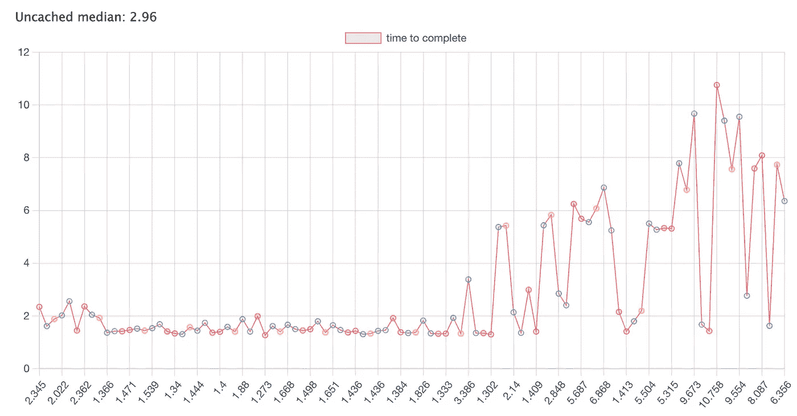
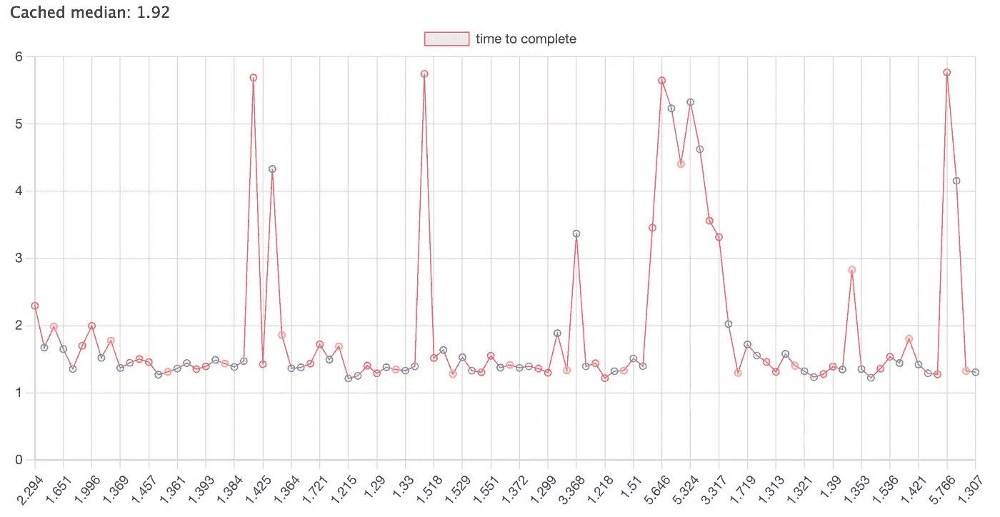
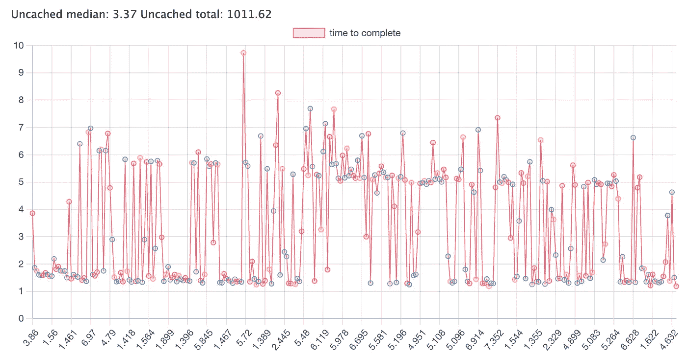
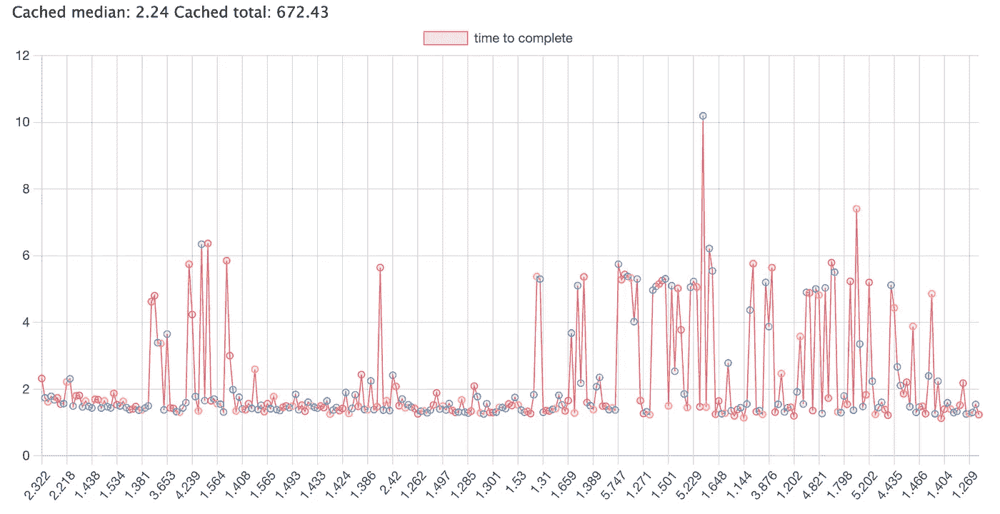

# 缓存轮询端点的结果

> 原文：<https://itnext.io/caching-the-results-of-polled-endpoints-f3670b41c4e6?source=collection_archive---------6----------------------->

## 通过以下方式获得更好性能的指南

## 轮询是检查服务器结果的一种简单方法。但是由于服务器使用的增加，每隔几秒钟运行一次功能可能要花钱。

[学分](https://www.google.com/url?sa=i&url=https%3A%2F%2Fwww.majorel.com%2Ffuture-customer%2Fshowcases%2Fmore-than-just-data-storage-informed-decisions-thanks-to-data-warehouse%2F&psig=AOvVaw3MwPhXX75liPjVTecVh4sY&ust=1639685665485000&source=images&cd=vfe&ved=0CAsQjRxqFwoTCLDnuKHP5vQCFQAAAAAdAAAAABAD)

## 介绍

有两种类型的轮询。“长轮询”是指向服务器发出请求，但不关闭请求。当服务器发送回数据时，该函数将完成，然后再次调用自身，以查看服务器是否还有数据。“轮询”是一种更简单的方法，其中函数被包装在一个 **setInterval** 方法中并被调用，直到间隔被清除。当满足某个条件时，例如在工作时间之外，可以清除时间间隔。或者直接从另一个方法调用。

## 场景

这里的场景是一个办公室安装了一个新的电话系统。这个电话系统需要告诉管理员用户何时在通话以及谁在。电话系统的结果可以是一个相当大的对象，每个办公室有部门，每个部门有电话，每个电话有一个配置。

轮询电话端点将为每个响应返回大量数据。取而代之的是获取另一个端点，比如返回不可用电话 id 列表的**"/不可用电话"**，这可能是一个更好的方法。这将返回一个小得多的数据集，可用于更新静态电话条目。

## 轮询方法

下面是获取电话系统和 ID 的轮询方法设置的示例。方法很简单，它调用手机的网址，然后开始间隔。稍后，可以添加一个条件来查看是否应该清除间隔。

一旦电话端点被调用并且不可用的端点已经返回它的时间来更新静态电话数据。下面的代码是如何做到这一点的简化版本。

首先，代码检查从不可用电话的数组中生成的密钥是否以前被见过。如果有，就可以从缓存中返回。如果没有，那么必须运行剩余的代码来更新每个部门的每个电话。

如果一家公司有 10 个人在为它工作，这可能没什么可担心的。但是一个拥有超过 1000 名员工的大型组织将开始出现一些性能问题，并且由于正常运行时间的原因，服务器成本会增加。

通过使用下面的方法，一旦手机被更新，它们可以被存储在缓存中以备后用。这也可以提供更好的大 O 性能，因为它从 O(n)变为 O(1 ),因为我们是通过一个键而不是通过迭代来访问电话。

如果你想自己测试这段代码，这里有一个[code sandbox](https://codesandbox.io/s/long-poll-caching-example-1xbfd)。

## 结论

当每一毫秒都很重要时，缓存可能不会随时间发生太大变化的静态资产是一种节省内存的好方法。下面是一些不同时间和数量的结果图。

运行 100 次最大未缓存时间为 10.75 毫秒，最大缓存时间为 5.76 毫秒

未缓存 100

缓存 100

结果对于运行 300 次的示例，可以看到未缓存的代码每次都以更高的时间间隔运行。未缓存总数的总毫秒数为 1011.62 毫秒，而缓存总数为 672.43 毫秒

未兑现 300

缓存 300

为了进一步展示这些结果如何影响一个组织

每分钟:20.35 秒

每小时:节省 2 分 56 秒

每天:29 分 26 秒

希望这篇文章能帮助你在应用程序上节省一些内存和时间。

如果您想注册访问更多媒体内容，请点击以下[链接](https://thewebuiguy.com/membership)。这将使我能够写更多的故事，通过一个小的委员会从媒体。