# Calibre Web:带有 Nextcloud storage 和 Android 上的 Moon+ Reader 的家庭浏览器在线图书馆

> 原文：<https://itnext.io/calibre-web-home-in-browser-online-library-with-nextcloud-storage-and-moon-reader-on-android-bee6a30c15b9?source=collection_archive---------1----------------------->


我使用 [Calibre](https://calibre-ebook.com/) 来管理我的电子书库已经很多年了，但是直到今天我一直使用它的桌面版本。

几天前，我发现了 [Calibre Web](https://github.com/janeczku/calibre-web) 项目——同一个库，使用同一个数据库，但是可以通过浏览器访问。

这个想法是从在谷歌图书中存储书籍和通过浏览器在移动设备上使用其电子书阅读器，但仍然能够从任何地方访问我的图书馆，并拥有书籍的阅读位置同步功能，就像在谷歌图书移动设备和浏览器阅读器中一样。

因此，现在我的库本身存储在 Nextcloud 中(参见 [Nextcloud:在 Debian 上的 Docker Compose 中运行，让我们加密 SSL post](https://rtfm.co.ua/en/nextcloud-running-in-docker-compose-on-debian-with-lets-encrypt-ssl/) )，我将在我的 Android 设备上使用 [Moon+ Reader](https://play.google.com/store/apps/details?id=com.flyersoft.moonreader&hl=en) 应用程序，因为它可以通过 [WebDAV](https://en.wikipedia.org/wiki/WebDAV) 同步读取位置。

此外，你可以使用 Google Drive 作为 Calibre Web 的存储后端，阅读[文档](https://github.com/janeczku/calibre-web/wiki/Configuration#using-google-drive-integration)。

在本帖中，我们将:

*   在 Docker 中运行一个 Calibre Web 实例——一个库的 Web 接口
*   将用 Calibre 的库从 Nextcloud 挂载一个目录
*   并将使用我们手机上的 WebDAV 连接到使用 Moon+ Reader 的 Nextcloud

## NGINX，我们加密吧

NGINX + Let's Encrypt set up 已经在 [Bitwarden:一个 AWS EC2](https://rtfm.co.ua/en/bitwarden-an-organizations-password-manager-self-hosted-version-installation-on-an-aws-ec2/#The_hosts_set_up) 帖子上描述了一个组织的密码管理器自托管版本安装。

## Calibre Web start

检查我们的 Calibre Web 将使用的 Nextcloud 下的库目录:

```
$ ll /data/nextcloud/app/data/setevoy/files/Books/CALIBRE/ | head
total 1212
drwxr-xr-x 3 www-data www-data 4096 Dec 13 07:53 A. A. Orlov
drwxr-xr-x 7 www-data www-data 4096 Dec 13 07:53 A. Avramienko
drwxr-xr-x 3 www-data www-data 4096 Dec 13 07:55 A. Bielash
drwxr-xr-x 3 www-data www-data 4096 Dec 13 07:53 A. B_iuli
drwxr-xr-x 3 www-data www-data 4096 Dec 13 07:55 Adol_f Gitlier
drwxr-xr-x 3 www-data www-data 4096 Dec 13 07:55 A. Fomienko, G. Nosovskii
drwxr-xr-x 4 www-data www-data 4096 Dec 13 07:55 A. Kamienistyi
drwxr-xr-x 3 www-data www-data 4096 Dec 13 07:55 A. Karr
drwxr-xr-x 3 www-data www-data 4096 Dec 13 07:55 Al_bier Kamiu
…
```

用 Calibre 运行一个 Docker 容器，在里面挂载库的目录为`/books`:

```
$ docker run -ti — name books -p 8083:8083 -v /data/nextcloud/app/data/setevoy/files/Books/CALIBRE/:/books technosoft2000/calibre-web
```

检查`metadata.db`是否存在:

```
 $ docker exec -ti books ls -l /books/metadata.db
-rw-r — r — 1 xfs xfs 752640 Dec 13 07:51 /books/metadata.db
```

在浏览器中打开您的 URL，并设置一个到`/books`目录的路径，该目录必须包含 Calibre 用来存储图书馆中所有书籍信息的`metadata.db`文件:

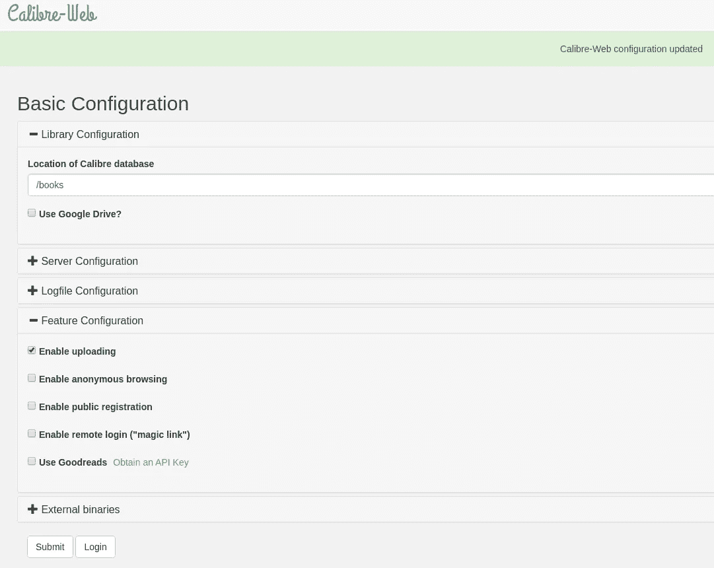

使用默认的 *admin:admin123* 登录:

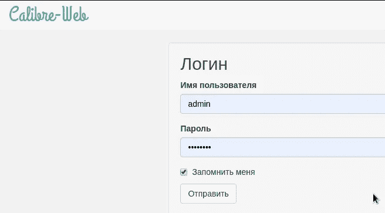

现在你会看到你的图书馆:

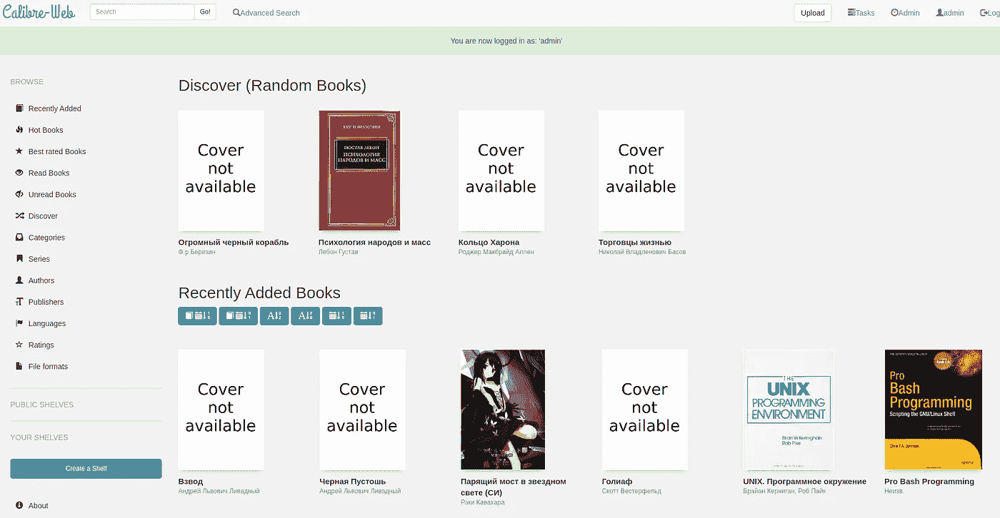

这里的*类别*菜单只是 Calibre 的标签:

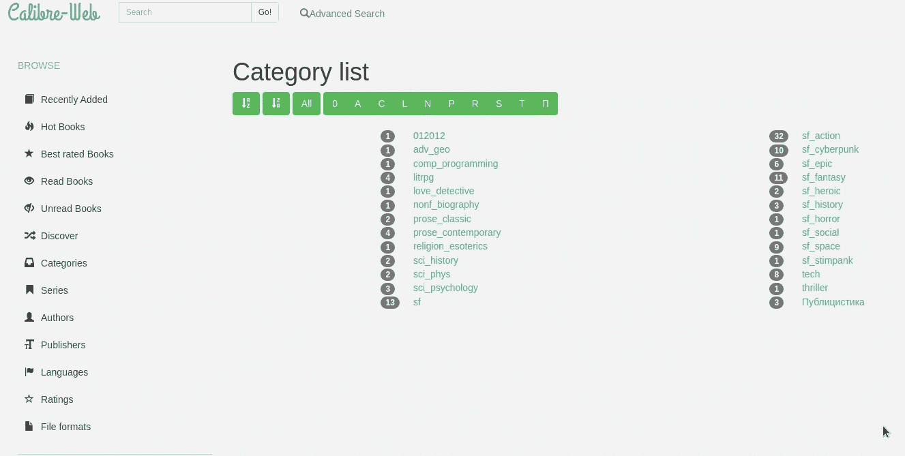

和普通的 Calibre 一样，你可以在浏览器中查看、添加、编辑和阅读书籍:

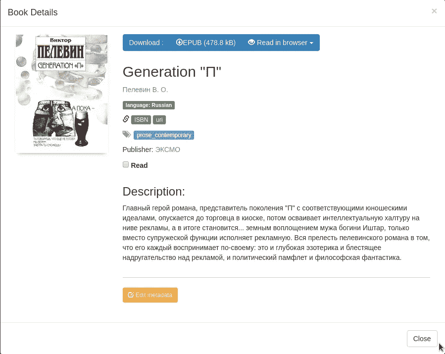

浏览器的阅读器:

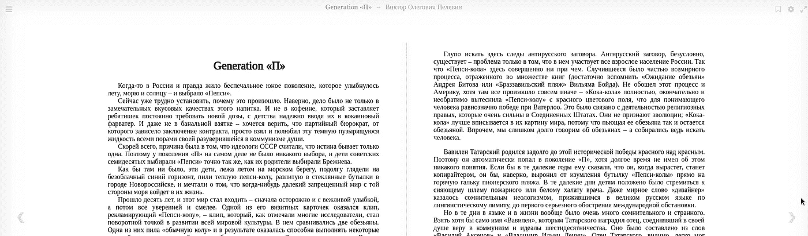

## *“无法创建路径/书籍/(权限被拒绝)”*错误

如果您现在尝试上传文件，可能会遇到以下错误:

> 未能创建路径/books/Mark Menson/Tonkoe iskustvo pofigizma _ Paradoksal ' Nyi sposob zhit ' schastlvo(权限被拒绝)。

对我来说，这是一个预期的错误，因为目录`/data/nextcloud/app/data/setevoy/files/Books/CALIBRE/`现在被 Nextcloud **和** Calibre Web Docker 容器使用。

检查 Calibre 容器中的用户:

```
$ docker exec -ti books ps | grep cali
68 calibre 0:08 /usr/bin/python /calibre-web/app/cps.py
```

和他的 UID:

```
$ docker exec -ti books id calibre
uid=15000(calibre) gid=15000(calibre) groups=15000(calibre),15000(calibre)
```

而主机上的本地目录属于:

```
$ ls -l /data/nextcloud/app/data/setevoy/files/Books/
total 4
drwxr-xr-x 117 www-data www-data 4096 Dec 16 09:32 CALIBRE
```

和`www-data`用户的 UID:

```
$ id www-data
uid=33(www-data) gid=33(www-data) groups=33(www-data)
```

即 Calibre 使用 UID *15000* 的`calibre`用户，但是主机上的 NGINX 和 Nextcloud 容器都在使用 UID *33* 的`www-data`用户。

要解决这个问题—在主机上创建一个 UID 为 15000 的新用户 *calibre* :

```
$ sudo useradd -u 15000 calibre
id calibre
uid=15000(calibre) gid=15000(calibre) groups=15000(calibre)
```

更改目录所有权:

```
$ sudo chown -R calibre:calibre /data/nextcloud/app/data/setevoy/files/Books/CALIBRE/
```

重启口径:

```
$ docker restart calibre-web
```

立即检查上传—必须立即工作:

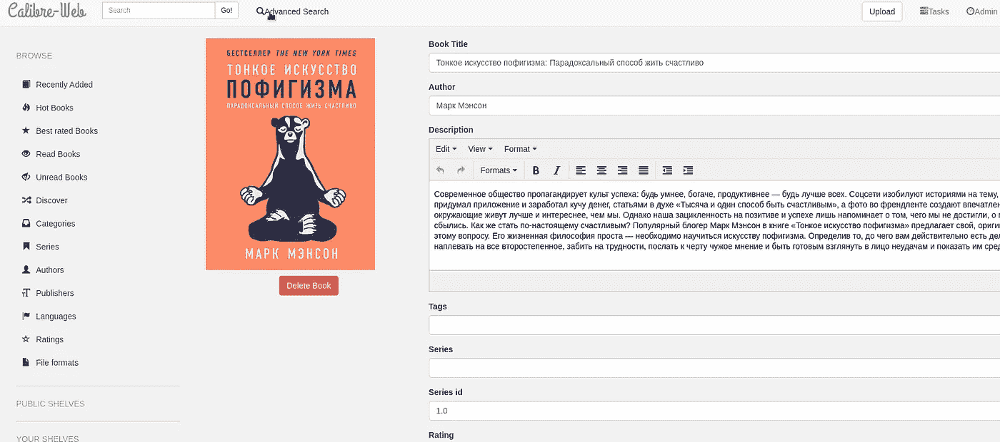

## Nextcloud `PUT` 403

但是现在 Nexcloud 坏了——例如，在一个桌面客户端上，我在同步过程中出现了 403 个错误:

> 172 . 29 . 0 . 2—setevoy[16/Dec/2019:13:22:24+0000]" PUT/remote . PHP/dav/files/setevoy/Books/CALIBRE/Pol ' % 20 diubua/MySQL % 20(68)/cover . jpg HTTP/1.1 " 403 759 "-" Mozilla/5.0(Linux)mirall/2 . 6 . 1 git(next cloud)"

要解决这个问题—将上面创建的新添加的 *calibre* 用户添加到 *www-data* 组:

```
$ usermod -a -G www-data calibre
```

现在检查他的组:

```
$ id calibre
uid=15000(calibre) gid=15000(calibre) groups=15000(calibre),33(www-data)
```

递归地改变所有权——将全部权限授予`www-data`组成员，例如`www-data`和`calibre`用户:

```
$ find /data/nextcloud/app/data/setevoy/files/Books/CALIBRE/ -type d -exec chmod g+rwx {} +
```

并更改所有者:

```
$ chown -R calibre:www-data /data/nextcloud/app/data/setevoy/files/Books/CALIBRE/
```

这已经完成，同步现在也可以工作了。

## Docker 撰写

要实现数据持久性，首先让我们找到数据存储在容器中的位置，例如应用程序的数据库及其所有设置。

可以看一下[文档](https://github.com/janeczku/calibre-web/wiki/Configuration)(推荐方式！)，或者连接到容器:

```
$ docker exec -ti calibre-web bash
```

找到所有的 **。数据库*文件:

```
bash-4.4# find / -name “*.db”
/calibre-web/app/app.db
/calibre-web/app/gdrive.db
…
```

在主机上，为 Docker 合成文件和应用程序数据创建目录:

```
$ mkdir /opt/calibre-web/
$ mkdir -p /data/calibre/app
$ chown -R calibre:calibre /data/calibre/
```

在`/opt/calibre-web/`目录下创建一个`calibre-compose.yml`文件:

```
version: '3'

services:

  calibre-web:
    user: "root:root"
    image: technosoft2000/calibre-web
    container_name: calibre-web
    ports:
      - 8083:8083
    volumes:
      - /data/nextcloud/app/data/setevoy/files/Books/CALIBRE/:/books
      -  /data/calibre/app:/calibre-web/app/ 
      - /var/run/docker.sock:/tmp/docker.sock:ro
    restart: unless-stopped
```

启动服务:

```
$ docker-compose -f calibre-compose.yml up -d
```

在[Linux:systemdсервисдляdocker compose](https://rtfm.co.ua/linux-systemd-servis-dlya-docker-compose/)中描述了单元文件的创建，在本例中，我添加了一个`/etc/systemd/system/calibre.service`文件:

```
[Unit]
Description=Calibre library service
Requires=docker.service
After=docker.service

[Service]
Restart=always
WorkingDirectory=/opt/calibre-web
ExecStart=/usr/local/bin/docker-compose -f calibre-compose.yml up
ExecStop=/usr/local/bin/docker-compose -f calibre-compose.yml down

[Install]
WantedBy=multi-user.target
```

## Calibre Web 主题

开箱即用的 Calibre Web 有两个主题——轻量级主题，默认主题:

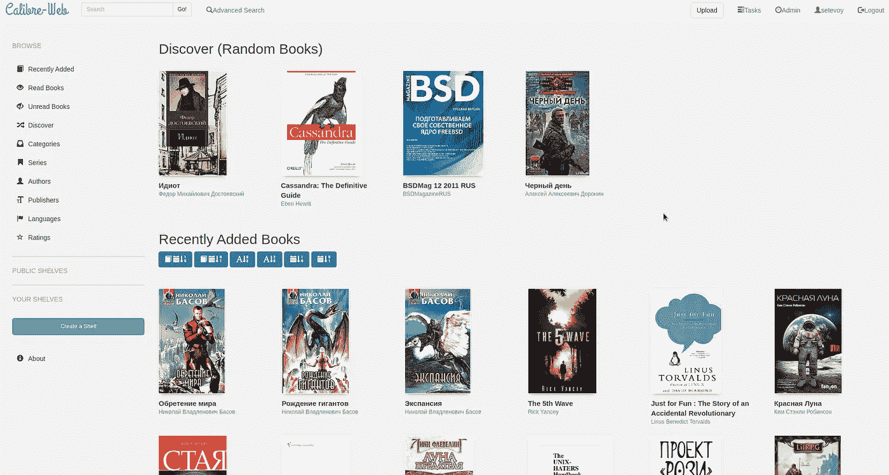

黑暗的一面:

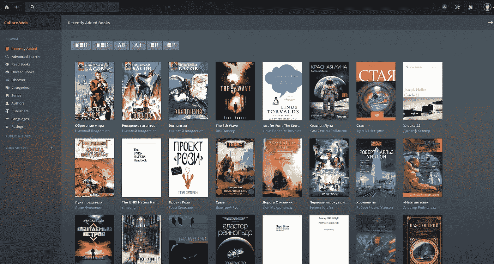

## 陷阱——将`metadata.db`与 Nextcloud 合并

这个问题与当前使用 Nextcloud 作为存储的设置有关，因为它在我自己的服务器上运行，有时会离线，这会导致桌面上的数据不同步。

问题是，当你使用 Calibre Web 从浏览器编辑一本书时，主 Calibre 文件—**metadata . db**—将在主机的文件系统上更新，但这一变化不会触发本地 Nextcloud 实例在它重新在线时将这一变化推送到其客户端，因为它就像服务器一样运行——它不是客户端部分。

然后，如果你的 Calibre Desktop 配置为使用相同的 Nextcloud，并有一个像`[nextcloud-desktop](https://aur.archlinux.org/packages/nextcloud-desktop-git/)`这样的桌面客户端，如果你运行本地 Calibre Desktop 并对其库进行任何更改，这将影响你的`metadata.db`文件，这将触发你的 Nextcloud 客户端将这些更改推送到 Nextcloud 服务器，这将覆盖服务器上的更改。

因此，为了避免这种情况，需要在使用之前手动将桌面的 Caliber 目录内容与 Nextcloud 服务器同步。

为此，只需发出以下命令:

```
$ nextcloudcmd — user setevoy -p PASSWORD /home/setevoy/Nextcloud/Books/CALIBRE/ [https://cloud.example.org.ua/Books/CALIBRE](https://cloud.example.org.ua/Books/CALIBRE)
```

这将从[*https://cloud.example.org.ua/Books/CALIBRE*](https://cloud.example.org.ua/Books/CALIBRE)(即 Nextcloud 主机上的`/data/nextcloud/app/data/setevoy/files/Books/CALIBRE/`)中抓取所有更改到本地`/home/setevoy/Nextcloud/Books/CALIBRE/`目录(由桌面 Calibre 应用程序使用)。

## 月亮+阅读器

月亮+阅读器应用来自我最近的发现。

可以在使用 G DriveDropbox/WebDAV 时同步书籍中的阅读位置，同步评论、笔记、书签等。

将它安装在您的手机上，添加一个 WebDAV 目录:


现在您可以访问您的 Calibre 库了:

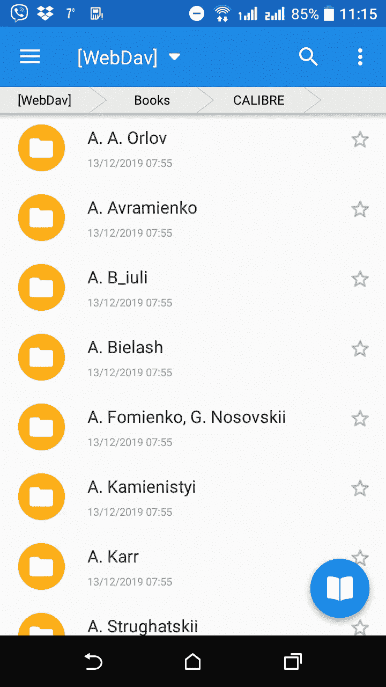

## 同步设置

为了让同步在月球上工作+ —打开一本书，然后右上角三个点>*杂项*，向下滚动并启用*同步阅读位置*:

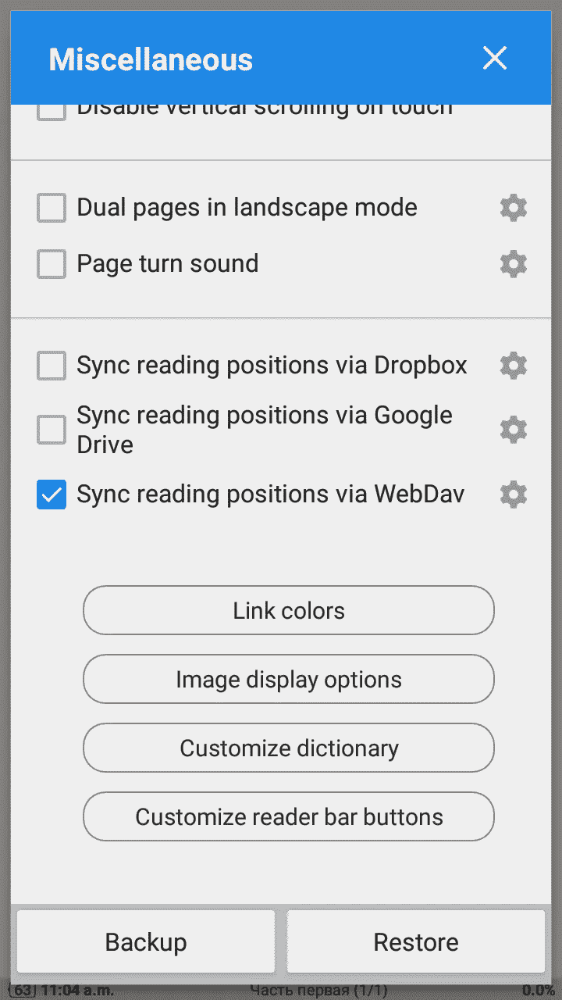

完成了。

*最初发布于* [*RTFM: Linux，devo PSисистемноеадмнииитииовваниование*](https://rtfm.co.ua/en/calibre-web-home-in-browser-online-library-with-nextcloud-storage-and-moon-reader-on-android/)*。*