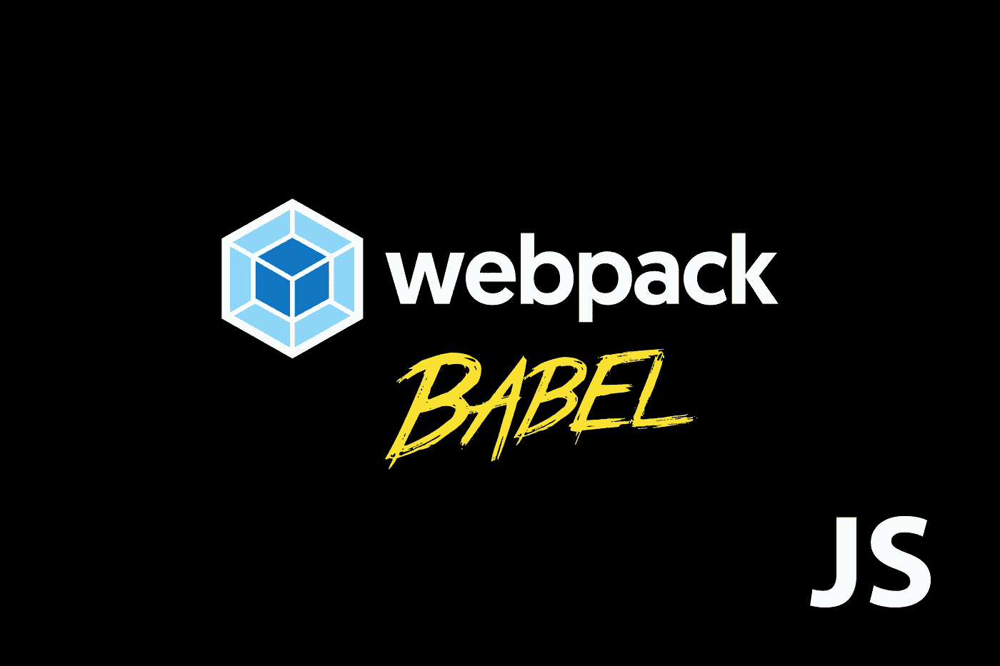

# 从其作用域之外调用 Webpack + babel transpiled 类。

> 原文：<https://itnext.io/calling-a-es6-webpacked-class-from-outside-js-scope-f36dc77ea130?source=collection_archive---------2----------------------->



## 当任务是创建一个加载 JS 应用程序的代码片段时，例如加载一个小部件，就像嵌入 Google Analytics 一样，你需要对 Webpack 配置做一些修改。

将 Webpack 包作为一个库来发布，在一个变量中给出了必要的全局上下文。我们现在可以使用这个变量从 index.html 文件外部调用这个库。

**问题？**

调用 app.bundle.js 内捆绑的类，通过 Babel 6 和 Webpack 2 使用 transpiled 代码在实参参数内传递数据。这将导致 someFunc()未定义的错误。

**为什么这是个问题？**

一旦 ES6 代码被编译成 ES5 捆绑包，就不能在捆绑代码之外访问该类。下面是一个简单的例子

```
<!doctype html>
<html class="no-js" lang="">
    <head>
        <meta charset="utf-8">
        <meta http-equiv="x-ua-compatible" content="ie=edge">
        <title></title>
        <meta name="description" content="">
        <meta name="viewport" content="width=device-width, initial-scale=1, shrink-to-fit=no">
    </head>
    <body>
        <h1>My index file</h1>
        <div id="seat-selection">
        <script src="./dist/js/app.bundle.js"></script>
        <script type="text/javascript">
           window.onload = function(){
                new someFunc(someData)
            };
        </script>
    </body>
</html>
```

**解决方法？**

我们需要通过更改输出设置来不同地配置 Webpack。这告诉我们，我们正在创建向名为 EntryPoint 的 var 公开透明的 ES5 代码。

*webpack.config.js*

```
output: {
    path: path.resolve(__dirname, 'dist/js'),
    filename: 'app.bundle.js',
    libraryTarget: 'var',
    library: 'EntryPoint'
  },
```

*index.js(注意我们使用 var EntryPoint 来调用 lib)。*

```
<script src="./dist/js/app.bundle.js"></script>
   <script type="text/javascript">
       window.onload = function(){
         EntryPoint.run({ name : 'Joe Bloggs' }) 
       };
   </script>
```

*app . js’或您的输出捆绑文件名(记住这是您的 ES6 文件，在它被捆绑之前)。*

```
(function () {
   'use strict';
}());import helloWorld from './helloWorld.js'; // ES6 Modulemodule.exports = {
  run: function (name) {
    new helloWorld(name);
  }
};
```

你可以在我的一个 Github 项目[中看到一个更全面的工作示例。](https://github.com/maxsilvauk/js-aircraft-seats-selection-widget/blob/master/webpack.config.js)