# 从 IDE 中调用 REST API:vs code

> 原文：<https://itnext.io/calling-rest-apis-from-the-ide-vscode-57e59e003133?source=collection_archive---------0----------------------->

> 如果你总是试图用更少的努力和精力找到更快做事情的方法。

## 这是给你的一个解决方案。今天我们要讨论的是，如何从你最喜欢的 IDE，也就是 Visual Studio 代码中进行 API 调用。

开发者使用很多 URL:你的应用程序 URL，消费服务的 URL 等等。这些 URL，有时它们的有效负载可能因环境而异。作为一个开发者，你会不断地打击他们。开发人员依赖 ide 之外的实用程序来跟踪 URL，向 URL 发送测试负载，并检查响应。现在，您可以在自己的 IDE 中完成所有这些工作！

为此，我们将为 [Visual Studio 代码](https://code.visualstudio.com/Download)和[虚拟 Rest API](https://reqres.in) 使用 [REST 客户端](https://marketplace.visualstudio.com/items?itemName=humao.rest-client)扩展。

# 开始

如果你还没有安装 [Visual Studio 代码](https://code.visualstudio.com/Download)，那么请安装。

如果您已经安装了 Visual Studio 代码，那么
为 Visual Studio 代码安装 [REST 客户端](https://marketplace.visualstudio.com/items?itemName=humao.rest-client)扩展。
打开你的 VS 代码，搜索“REST 客户端”。

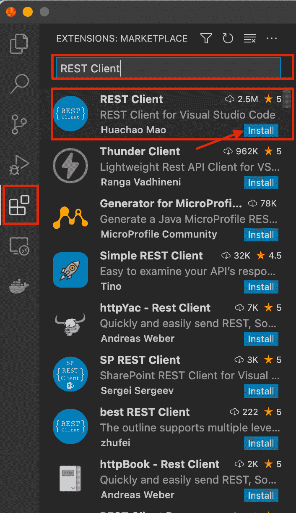

单击此处安装扩展。

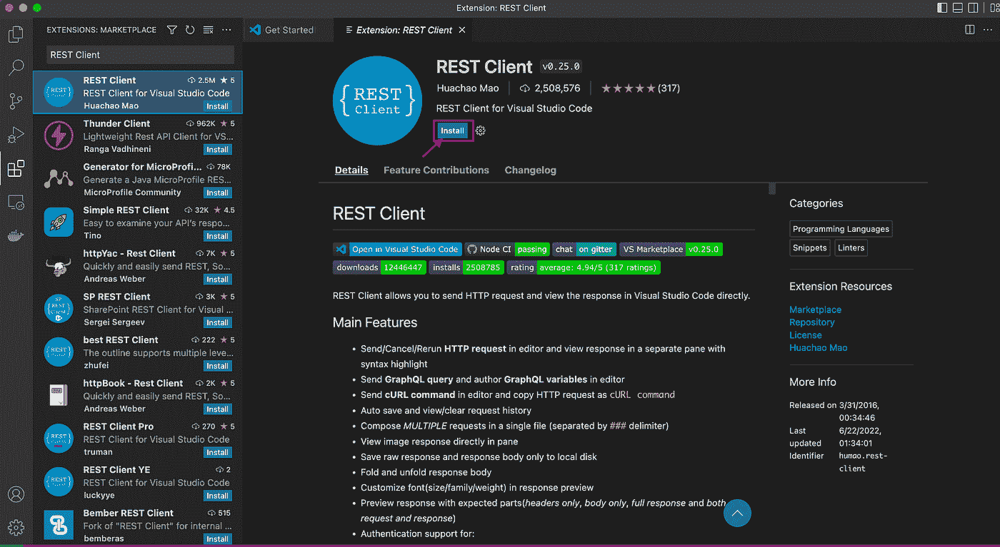

成功安装后，如下图所示。


至此，您已经完成了 ENV 设置。伟大的工作


# 如何使用


首先，我们创建一个扩展名为“”的新文件。http“或”。休息”。这里我用了”。http”。

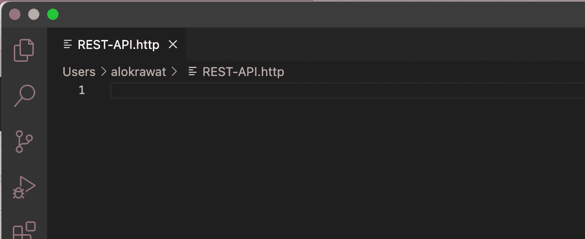

# 得到

让我们打第一个电话。
保存后，您会看到一个发送请求按钮出现在###之后。

**请求:**

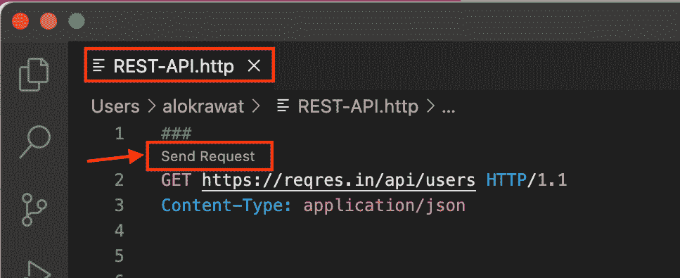

**响应:**

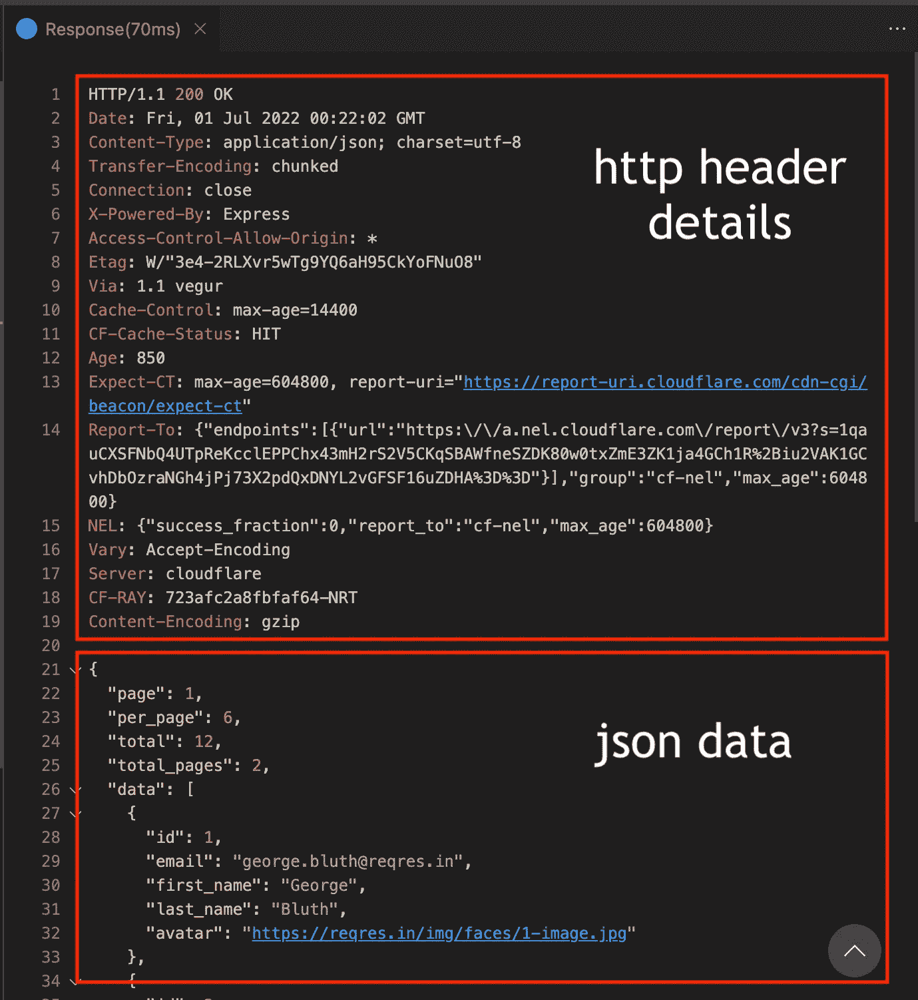

就是这样！


无需打开 web 浏览器、调试工具、联网，然后检查响应——一切都在那里！

**代码:**

```
### 
Send Request 
GET https://reqres.in/api/users/ HTTP/1.1 
Content-Type: application/json
```

发送请求获取[https://reqres.in/api/users/](https://reqres.in/api/users/)HTTP/1.1 内容类型:应用程序/json

什么是 **HTTP 1.1** ？HTTP 1.1 是超文本传输协议(HTTP)的最新版本，它是运行在互联网的 TCP/IP 协议组之上的万维网应用协议。HTTP 1.1 提供了比原来的 HTTP 更快的网页传递，并减少了 Web 流量。

# 邮政

执行 POST 请求遵循相同的模式，但略有不同，因为您需要提供有效负载和可选的内容类型(以及 REST 客户端文档中的许多选项，如身份验证)。

执行 POST 请求遵循相同的模式，但略有不同，因为您需要提供有效负载和可选的内容类型(以及 REST 客户端文档中的许多选项，如身份验证)。

***回应:***

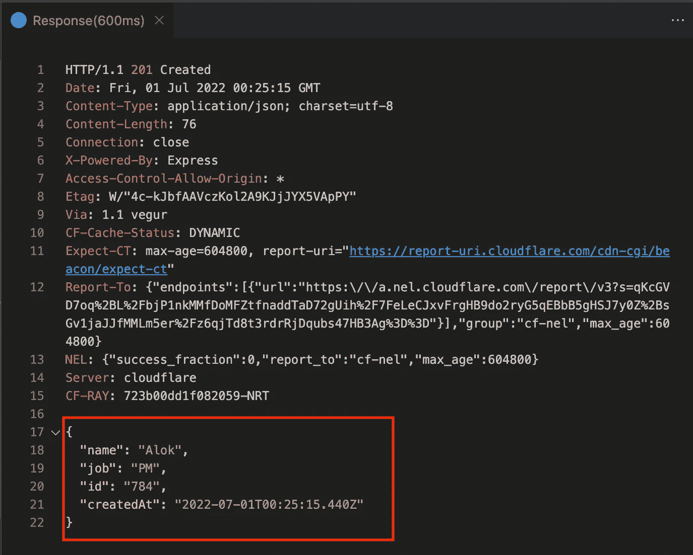

**代号:**

```
### 
Send Request 
POST https://reqres.in/api/users HTTP/1.1 
Content-Type: application/json {
     "name": "Alok",
     "job": "PM" 
}
```

# 放

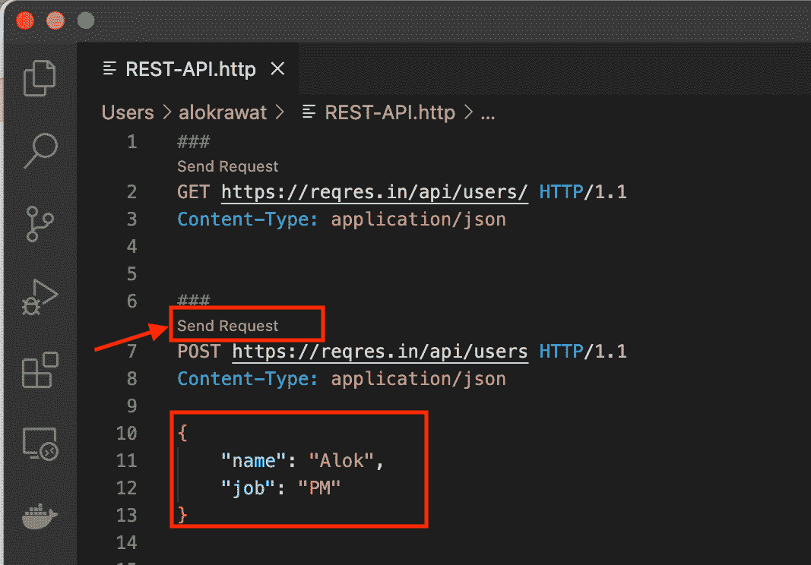

***回应:***

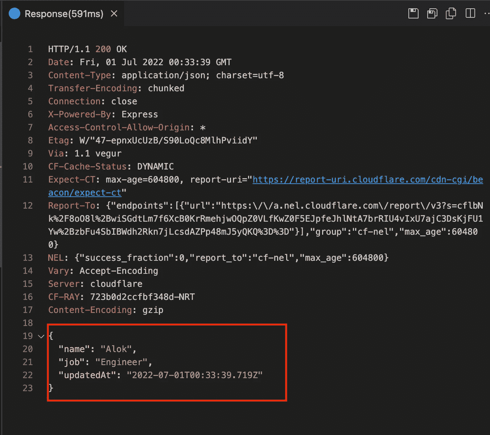

**代码:**

```
### 
Send Request 
PUT https://reqres.in/api/users/2 HTTP/1.1 
Content-Type: application/json {
     "name": "Alok",
     "job": "Engineer" 
}
```

# 修补

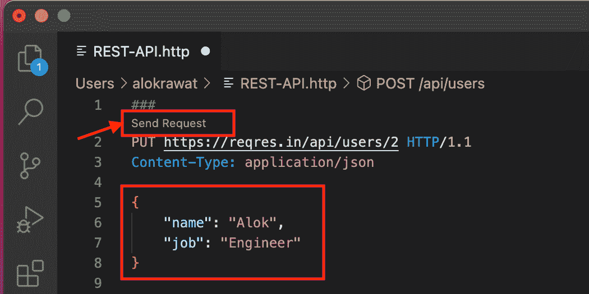

***响应:***

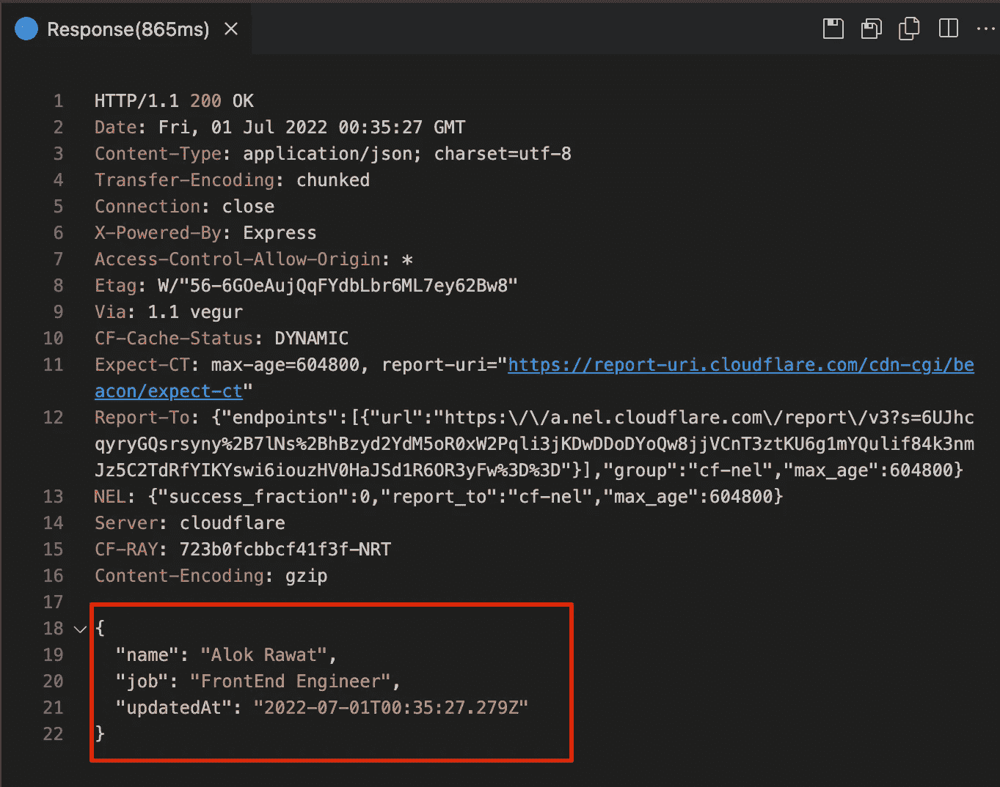

**代码:**

```
### 
Send Request 
PATCH https://reqres.in/api/users/2 HTTP/1.1 
Content-Type: application/json {
     "name": "Alok Rawat",
     "job": "FrontEnd Engineer"
}
```

# 删除

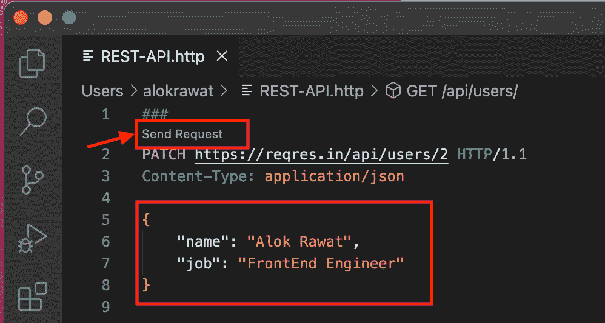

***回应:***


**代码:**

```
### 
Send Request 
DELETE https://reqres.in/api/users/2 HTTP/1.1 
Content-Type: application/json
```

# 最后的

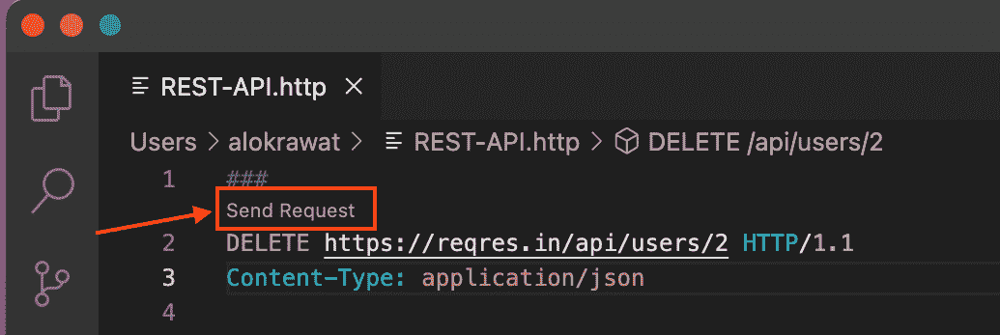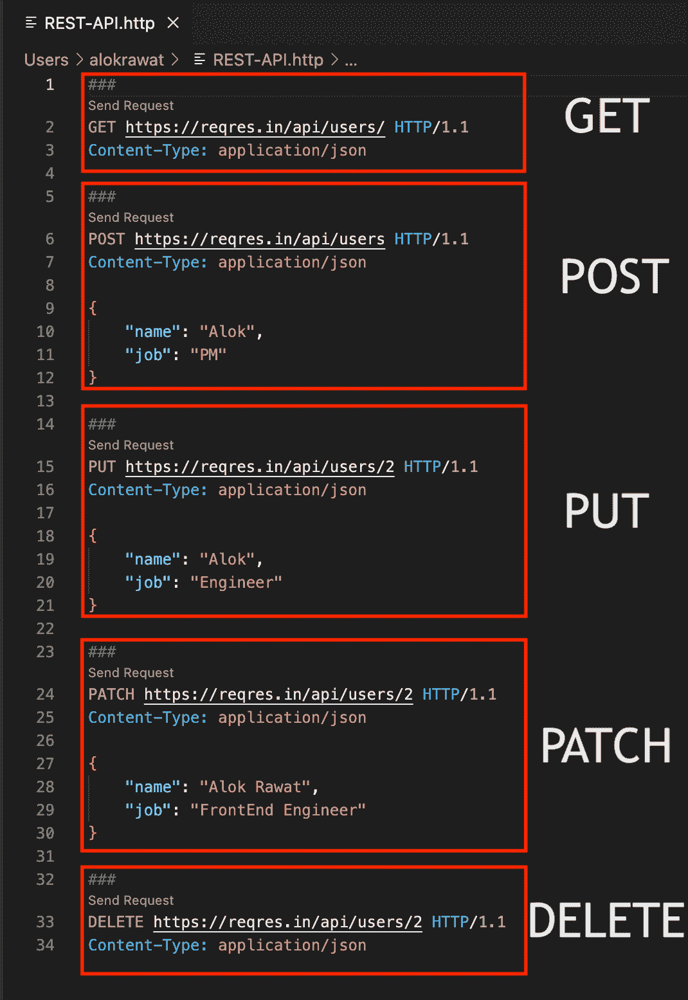

# 为什么应该使用 REST 客户端扩展？

现在，我们需要记住的是速度和轻松。这两个东西都可以在 REST 客户端扩展中找到。此外，如果你使用一个外部工具，你将不得不在你开发的时候用 alt-tab 键切换到它和你喜欢的任何其他方法。但是有了 REST 客户端，你只需要知道如何使用你已经知道并经常使用的 IDE！

*   停留在您最喜欢的 IDE 中—停止上下文切换。
*   记录你的应用程序使用的所有 URLs 代码中不再有书签或注释。
*   将 URL 存储在您的代码旁边——因为所有内容都在简单的纯文本文件中，当您更改和修改您的。http 文件，您将能够很容易地跟踪差异。
*   快速测试 URL——即使过了一年，您也不需要导入/设置 ENV 来发送请求。您可以简单地打开文本文件并“发送请求”。
*   将响应作为文本文件进行检查——使用 VS 代码的所有工具来检查响应:折叠/展开、查找、正则表达式。
*   保存/共享响应——不再有浏览器开发工具的截图——只需将整个响应负载发送给他人。

享受编码，快乐学习。 **参考:**

*原载于 2022 年 7 月 1 日 https://qiita.com*[](https://qiita.com/alokrawat050/items/6e7de9959912ea145091)**。**