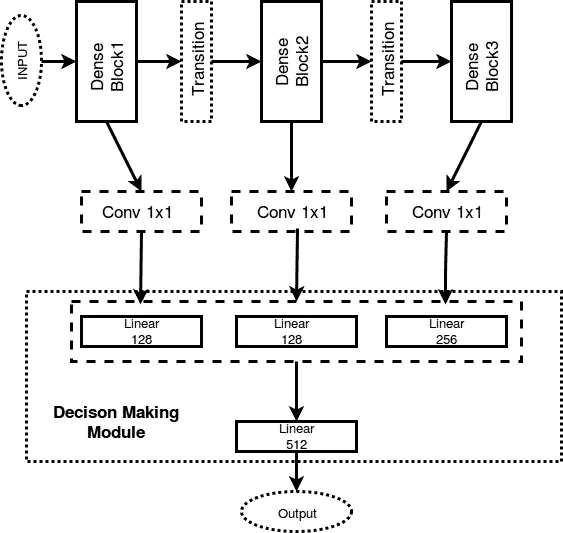
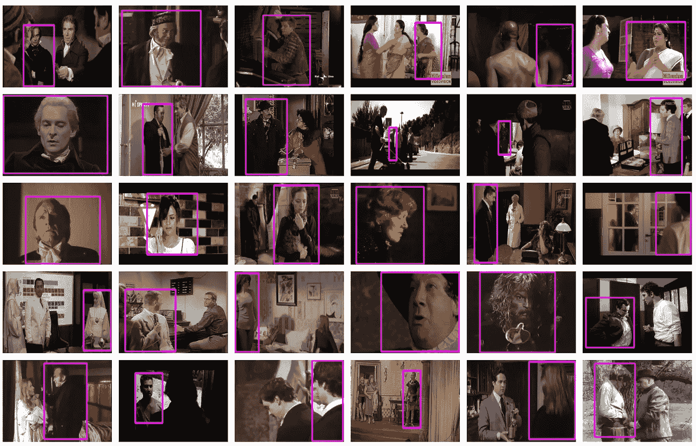
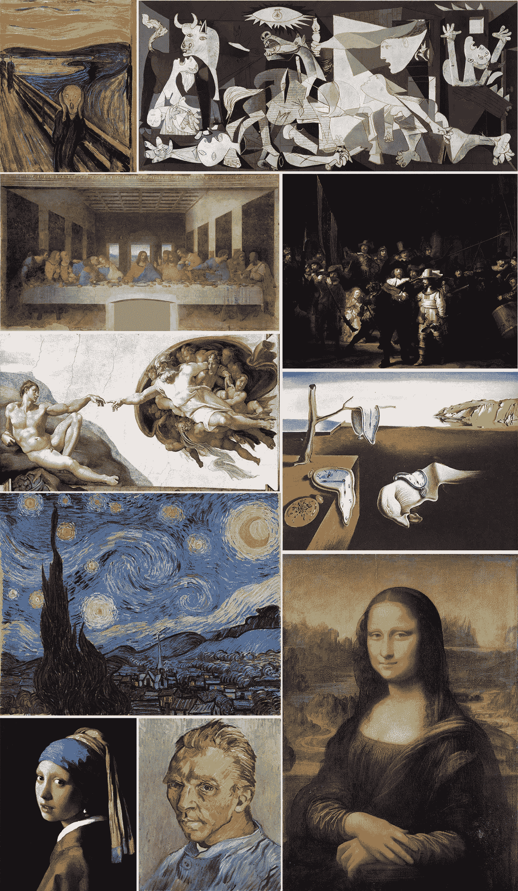
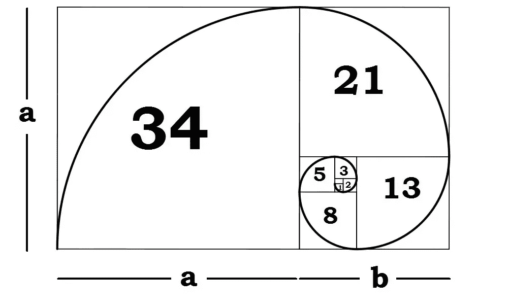
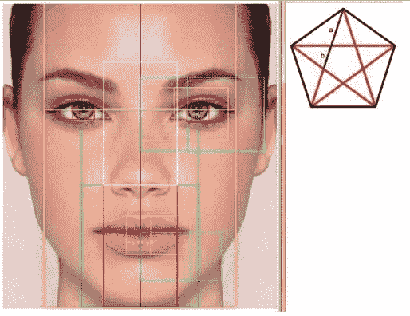
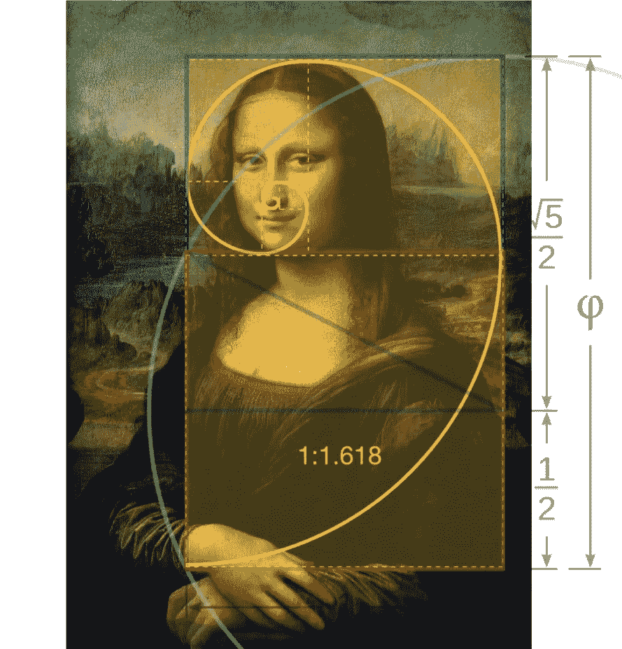
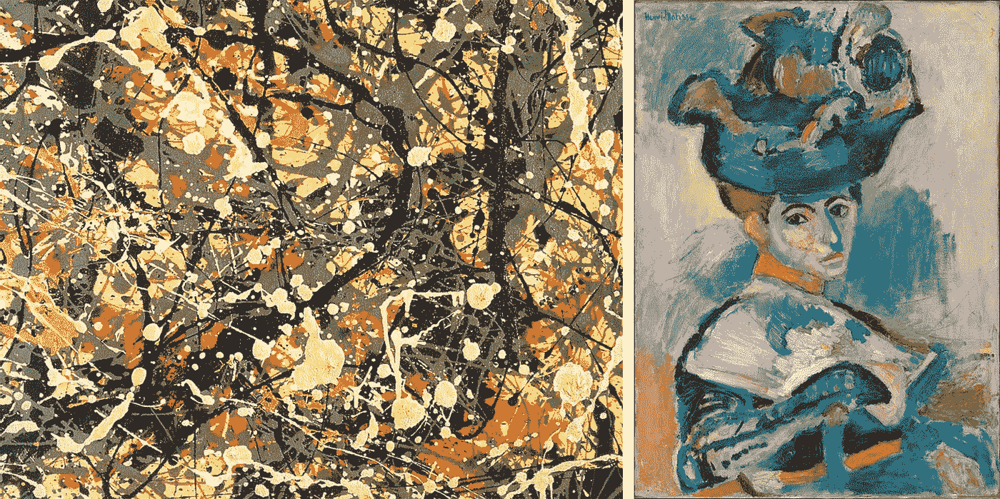

# 人工智能(AI)能告诉我们什么时候“玫瑰闻起来一样香”吗？

> 原文：<https://itnext.io/can-a-rose-by-any-other-word-smell-as-sweet-b37595d3bcb9?source=collection_archive---------0----------------------->

[*点击这里在 LinkedIn* 上分享这篇文章](https://www.linkedin.com/cws/share?url=https%3A%2F%2Fitnext.io%2Fcan-a-rose-by-any-other-word-smell-as-sweet-b37595d3bcb9)

*“一朵玫瑰换个名字闻起来还一样香吗”？一件美丽的东西，用其他的质量来衡量，还能一样美丽吗？随着人工智能(AI)应用程序，如 [**Paralleldots**](https://paralleldots.xyz) Inc .提供的那些应用程序，开始告诉我们什么是美，什么不是美，我们可能会更经常地问自己这个问题。*

Shashank Gupta 和他在 Paralleldots Inc .的同事最近宣布，他们开发了一种深度 [**卷积神经网络**](http://ufldl.stanford.edu/tutorial/supervised/ConvolutionalNeuralNetwork/) (CNN)，可以“训练识别图像的*美学质量*”。他们在这个网站上演示了如何应用 CNN 进行视觉分析:([https://www.paralleldots.com/visual-analytics](https://www.paralleldots.com/visual-analytics))

具有密集块和来自不同级别的特征累积的卷积神经网络体系结构，以模拟美学

Paralleldots 团队从零开始训练一个模型，在 [AVA2 数据集](https://research.google.com/ava/)上获得 78.7%的准确率，接近现有的最佳模型(85.6%)。他们进一步显示，通过将训练集增加到整个 AVA 数据集的 10 个百分点，准确率增加到 81.48%，以证明他们的算法随着数据的增加而变得更好。

根据 Paralleldots 团队的说法，他们的 [**病毒检测应用程序编程接口**](https://www.paralleldots.com/visual-analytics)**【API】**根据图片在互联网上传播的潜力给它们打分。**病毒检测 API** 根据社交媒体上相似的热门照片预测照片的受欢迎程度。虽然这个并不等同于由于任何客观特征而归于图像的美，但它与[伊曼纽尔·康德的](https://en.wikipedia.org/wiki/Immanuel_Kant)条件“*普遍性*”非常相似，后者被他用作美的一种度量。

根据 Paralleldots 的研究人员，“视觉审美分析是将图像分类为人类认为有吸引力或无吸引力的任务。”虽然以前手工制作的图像特征是解决美学分析的常见方法，但随着技术的发展，CNN 最近被用来解决这一问题。它们具有多个优点，例如具有更少的推理时间和部署在移动设备中的能力。在 [**ImageNet 数据集**](http://www.image-net.org) 上预训练的各种标准 CNN 架构都可以作为开源使用。 **ImageNet** 是一个根据 [WordNet](http://wordnet.princeton.edu/) 层级组织的图像数据库，其中层级的每个节点都由成百上千的图像描述。

下面是一个 [**谷歌 AVA 数据集**](https://research.google.com/ava/explore.html) 的样本。Paralleldots 公司的研究人员使用这些对象以及谷歌 AVA 数据集中的数百个其他对象，使他们的 CNN 能够进行“视觉审美分析**”。**

****

****病毒检测 API 是**通过在一个巨大的图像语料库上训练一个超深度神经网络而构建的，它们的分数是从公开的 web 上爬取的。你作为输出得到的分数是输入照片的**病毒分数**，满分为**最高分 100** 。Paralleldots 团队表示，他们的内部实验表明，他们的算法预测**图像病毒率**的准确率高达 85%。以下是全球 [**10 幅最著名画作**](https://10mosttoday.com/10-most-famous-paintings-in-the-world/) 的**病毒率评分**，最高分为 100%。**

****

****绘画&艺术家——病毒检测分数****

1.  **《呐喊》——爱德华·蒙克——95%**

****2。格尔尼卡—巴勃罗·毕加索—** 77%**

****3。《最后的晚餐》——达芬奇—** 72%**

****4。亚当的创造—米开朗基罗—** 71%**

****5。《守夜人》——伦勃朗·范·里恩—** 69%**

****6。戴珍珠耳环的女孩——约翰内斯·维米尔—** 68%**

****7。记忆的持久性—萨尔瓦多·达利—** 49%**

****8。星夜——文森特·梵高——**43%**

****9。没有胡须的自画像——文森特·梵高——**22%**

****10。蒙娜丽莎——达芬奇**。— 9%**

**在 Paralleldots 团队开发他们的 CNN 寻找美几乎三百年前，伟大的德国哲学家 [**伊曼纽尔·康德**](https://en.wikipedia.org/wiki/Immanuel_Kant) 发现艺术作品是美的，因为它引发了一种被称为**反思判断**的智力活动。根据康德，“美从来不是作为确定的东西被体验的。我们不能直接体验美，尽管它总是包含在我们的世界体验中。 ***美是一种由我们的秩序感诱发的感觉，*** *一种重视，在这个世界上起作用，超越任何明确的展示。”***

**其他条件也可能有助于什么是品味的判断，但它们是相应的，或基于两个基本条件。在这方面康德效仿了[**大卫·休谟**](https://en.wikipedia.org/wiki/David_Hume) 和英国感伤主义传统中的其他作家(休谟 1757)。康德孤立了两个基本的必要条件，使一个判断成为 [**一个判断的品味**](http://faculty.salisbury.edu/~jdhatley/KANT.htm) (康德 1790):**

*   ***主观性*和**
*   ***普遍性*(病毒式)**

**味觉判断的第一个必要条件是，它本质上是 ***主观的*** 。这意味着对味觉的判断是基于愉快或不愉快的感觉。正是这一点将品味判断与经验判断区分开来。审美判断的主要例子是对美和丑的判断。它们可以是关于艺术或自然的。**

**对于康德来说，品味的判断也声称“普遍有效性”，他将其描述为要求或需要他人同意，这种方式我们在判断像葡萄酒这样的东西的美好程度时不会这样做，这只是一个个人偏好的问题。在品味和美感方面，我们认为其他人*应该*分享我们的观点。这是因为对品味的判断有一种对普遍有效性的渴望，以至于看起来“*好像*【美】是事物的一种属性。”**

**在许多方面，Paralleldots 团队在他们的 CNN 中采用了康德的普遍性条件。他们只是用现代的概念“**”来代替康德所说的“*普遍性*”。根据 Paralleldots 团队的说法，他们的**病毒检测应用程序编程接口(API)** 根据图片在互联网上传播的潜力给它们打分。病毒检测 API 预测照片的受欢迎程度，并与社交媒体上热门照片的“属性”进行比较。虽然这个与由于客观特征而归于图像的美并不相同，但它与康德的普遍性条件十分相似。****

****在康德和休谟之前 1100 年，希腊人就教导说“ ***美有规则*”**而规则是必须学习的。与美丽有关的最著名的法则是黄金分割比例(1.61803399)或**，可以用下面的图形来表述，(a+b 之于 a，如同 a 之于 b)。黄金分割率是由希腊哲学家兼数学家 [**毕达哥拉斯**](https://en.wikipedia.org/wiki/Pythagoras) 发现的，在许多艺术作品以及自然界中都有发现。******

********

****在黄金比例中，a+b 之于 a 就像 *a* 之于 *b.* 一样****

****黄金数字通常由希腊字母'**φ**'或**φ**表示，源自[**菲迪亚斯**](https://en.wikipedia.org/wiki/Phidias) ，(公元前 480-430 年)希腊雕塑家，他在许多著名的美丽雕塑作品的中使用黄金比例。雅典的帕台农神庙由古希腊人于公元前 447 年至 438 年建造，被许多人视为黄金比例在设计中的应用。黄金数字定义了比例的和谐，根据希腊人的说法，就像菲迪亚斯一样，它激发了观察者对所创造的事物的崇敬和钦佩，以及创造更多美的欲望。****

********

******对称**(来源于[希腊语](https://en.wikipedia.org/wiki/Ancient_Greek)，意为“尺寸、比例、排列上的一致”)在日常语言中是指**一种和谐美丽的比例与平衡感**。在数学中，“对称”有一个更精确的定义，即一个物体对任何不同的变换都是不变的；包括[反射](https://en.wikipedia.org/wiki/Reflection_(mathematics))、[旋转](https://en.wikipedia.org/wiki/Rotation_(mathematics))或[缩放](https://en.wikipedia.org/wiki/Scaling_(geometry))。虽然“对称”的这两种含义可以区分开来，但在和谐与平衡的概念中，它们是密切相关的。蒙娜丽莎、帕台农神庙和鹦鹉螺贝壳都是黄金比例的应用，黄金比例是一个长期以来与美丽联系在一起的数学表达式。****

****艺术史表明，在寻找一种难以捉摸的完美比例的漫长过程中，黄金比例被证明是最持久的，这种比例不知何故会自动赋予所有艺术作品审美愉悦的品质。(马里奥·里维奥，黄金比例)****

****例如，在一张“漂亮”的脸上，距离鼻子中间的距离是眼睛宽度的 1.618 倍。再比如下巴到瞳孔的距离是瞳孔到发际线距离的 1618 分之一。在身体里，脚底到腰部的距离是腰部到头顶距离的 1，618 '分之一。这种模式在被认为“漂亮”的人身上不断重复。****

********

****[*黄金比例脸*](https://carlagodsprincess.files.wordpress.com/2014/12/451-golden-ratio-face-and-pentagon1.jpg)****

******给定的主体越接近比例，一般认为越美。列奥纳多·达·芬奇的《蒙娜丽莎》的** *画中有许多黄金矩形。通过在她的脸上画一个矩形，我们可以看到她确实是金色的。如果我们用一条穿过她的眼睛的线来划分那个矩形，我们得到另一个黄金矩形，这意味着她的头长度与眼睛的比例是黄金的。还有其他的黄金矩形可以画在她身体的其他部位，比如从脖子到手的顶端。*****

********

****在最近的一项研究中，麻省理工学院艺术学院的 Nathan Kondamuri 用在麻省理工学院海登纪念图书馆发现的两个雕塑进行了测量。他还进行了一项调查，要求受试者比较这两座雕塑，并按照 1-10 的标准对它们的美进行评分。在比较了测量值和调查结果后，Kondamuri 得出结论“*黄金分割率和美感之间存在直接关联”*。****

****因此，虽然用黄金比例这样的客观标准来看，蒙娜丽莎可能被认为是美丽的，但令人震惊的是，用 21 世纪的人工智能软件和“普遍性”标准来看，她被认为没有那么美丽。****

****我们可能需要质疑康德的观点，即**需要他人的同意，以及**平行病毒检测分数作为判断美的机制，至少在涉及到代际差异时是如此。****

****在他的一生中，(1912-1956)****杰森·布拉克作为他那一代的主要艺术家享有相当的名望和恶名。下面是他著名的“融合”画，使用**病毒检测应用**得到的分数比世界上十幅最著名的画中的七幅都高。********

****接下来是亨利·马蒂斯的***戴帽子的女人*，使用病毒检测软件获得了惊人的 96%的分数，再次表明更多的当代绘画比早期的绘画看起来更美丽。如果是这样的话，那么也许，由人工智能软件确定的“美”，就像 [**平行**](https://paralleldots.xyz) **一样，**更依赖于用来识别美的特征的数据集的年份，而不是任何客观标准，如黄金比例。******

********

*   ******杰森·布拉克—收敛—病毒检测得分= 65** %****
*   ******亨利·马蒂斯** —戴帽子的女人— **病毒检测得分= 96** %****

****_______________________________________________________________****

******备注:******

1.  ****马里奥·里维奥，*黄金比例，Phi 的故事，世界上最惊人的数字*，百老汇图书，纽约，2002 年****
2.  ****内森·康达莫里，“黄金比例的美学探索”，麻省理工学院艺术学院，2011 年 6 月 23 日****
3.  ****[https://carlagodspringe . WordPress . com/2014/12/15/数学-美-黄金-比率/](https://carlagodsprincess.wordpress.com/2014/12/15/mathematical-beauty-the-golden-ratio/)****
4.  ****[https://plato.stanford.edu/entries/aesthetic-judgment/#1.2](https://plato.stanford.edu/entries/aesthetic-judgment/#1.2)****
5.  ****[https://hacker noon . com/visual-aesthetics-judicing-a-photos-quality-using-ai-techniques-6f 2551 cc 9 b 0 b](https://hackernoon.com/visual-aesthetics-judging-a-photos-quality-using-ai-techniques-6f2551cc9b0b)****
6.  ****[https://10mosttoday.com/10 幅世界名画/](https://10mosttoday.com/10-most-famous-paintings-in-the-world/)****
7.  ****[https://www.pinterest.com/search/pins/?杰森·布拉克画作 q = Pollock % 20 paints % 20 Jackson&RS = guide](https://www.pinterest.com/search/pins/?q=Pollock%20paintings%20jackson&rs=guide)****

******临时演员:******

****([https://www.designbyday.co.uk/golden-ratio-graphic-design/](https://www.designbyday.co.uk/golden-ratio-graphic-design/))****

****([http://wisetoast.com/35-most-famous-paintings-of-all-times/](http://wisetoast.com/35-most-famous-paintings-of-all-times/))****

****([http://numbersoftheuniverse . blogspot . com/2012/05/phi-in-Mona-Lisa . html](http://numbersoftheuniverse.blogspot.com/2012/05/phi-in-mona-lisa.html))****

*****(*[http://www . umich . edu/% 7 erefjudg/reflectivesjudgmentmodel . html](http://www.umich.edu/%7Erefjudg/reflectivejudgmentmodel.html)*)*****

****([https://www.phimatrix.com/face-beauty-golden-ratio/](https://www.phimatrix.com/face-beauty-golden-ratio/))****

****([https://www.goldennumber.net/beauty/](https://www.goldennumber.net/beauty/))****