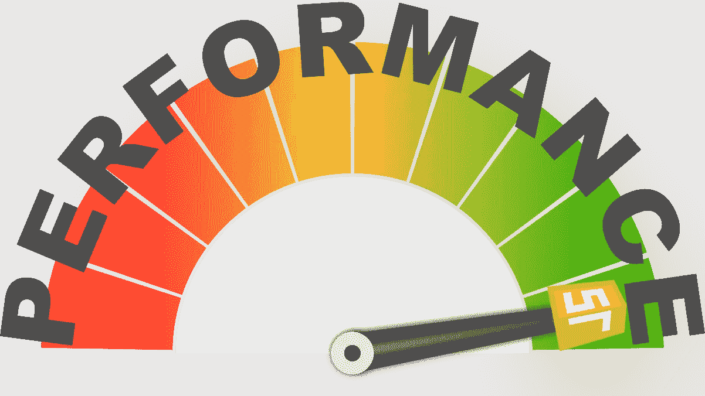
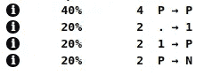

# JSON.parse()性能可以提升吗？

> 原文：<https://itnext.io/can-json-parse-be-performance-improvement-ba1069951839?source=collection_archive---------2----------------------->



## JSON.parse 是一种创建对象副本的缓慢方法。但是它真的能提高我们代码的性能吗？

> 这篇文章需要关于形状和内嵌缓存的基本知识。如果没有看过 [*V8 功能优化*](https://erdem.pl/2019/08/v-8-function-optimization) *，可能很难跟上这一条。*

# 问题

创建对象的副本是 JS 中的常见做法。你可能已经在 **Redux** 或其他地方创建**reducer**的时候做过了。目前，最常用的语法是 spread

```
const objA = { name: 'Jack', surname: 'Sparrow' };
const objB = { ...objA };
```

实践中的用法:

```
function dataReducer(state = { name: '', surname: '' }, action) {
  switch (action.type) {
    case ACTION_TYPES.SET_NAME:
      return {
        ...state,
        name: action.name,
      };
    case ACTION_TYPES.SET_SURNAME:
      return {
        ...state,
        surname: action.surname,
      };
    default:
      return state;
  }
}
```

但是可以用很多方法来实现(不算各种库)

```
const objC = Object.assign({}, objA);
const objD = JSON.parse(JSON.stringify(objA));
```

如果你用这些方法测试复制 1⁰⁹对象需要多长时间，你会得到这样的结果(每次我们复制`objA`):

```
test with spread: 14 ms. 
test with Object.assign: 36 ms. 
test with JSON.parse: 702 ms.
```

显然`JSON.parse`是他们中最慢的，而且差距很大。为什么你甚至应该考虑使用它而不是传播？

# V8 发动机没有如此明显的表现

一切都归结于 V8 如何优化功能。每次执行函数时，V8 都会将传递给它的对象与`IC`(内嵌缓存)进行比较，如果该对象的`Shape`存储在其中一个“缓存”中，那么 V8 可以遵循“快速路径”。

所以如果你有这样一个函数

```
function test(obj) {
  let result = '';
  for (let i = 0; i < N; i += 1) {
    result += obj.a + obj.b;
  }
  return result;
}
```

你可以用多个相同形状的物体来运行它，并且有很好的性能

```
const jack = { name: 'Jack', surname: 'Sparrow' };
const frodo = { name: 'Frodo', surname: 'Baggins' };
const charles = { name: 'Charles', surname: 'Xavier' };
test(jack);
test(frodo);
test(charles);
```

原因是 V8 将把这个函数标记为**单态**并优化它的代码。如你所知，只有当函数被一个且只有一个形状调用时，才会发生这种情况。

让我们检查使用 3 种复制方法中的每一种时会产生哪种形状:

> *运行下面的代码使用* `*d8 --allow-natives-syntax index.js*` *来获取访问 V8 内部的方法类似* `*%HaveSameMap()*`

```
//testSpread.js
const objA = { name: 'Jack', surname: 'Sparrow' };
const objB = { ...objA };
console.log(%HaveSameMap(objA, objB)); // false//testAssign.js
const objA = { name: 'Jack', surname: 'Sparrow' };
const objC = Object.assign({}, objA);
console.log(%HaveSameMap(objA, objC)); // false//testParse.js
const objA = { name: 'Jack', surname: 'Sparrow' };
const objD = JSON.parse(JSON.stringify(objA));
console.log(%HaveSameMap(objA, objD)); // true
```

正如你所看到的，只有`JSON.parse(JSON.stringify(objA))`创建了一个和`objA`形状相同的物体。


# 非单态函数的代价

这是我们的功能

```
function test(obj) {
  let result = '';
  // Any costly operation
  for (let i = 0; i < N; i += 1) {
    result += obj.name + obj.surname;
  }
  return result;
}
```

这里重要的是函数的开销和线程阻塞。这个例子很愚蠢，但是想象一下有一些复杂的数学运算在进行。这就是我们如何以两种不同的方式调用我们的函数

```
const jack = { name: 'Jack', surname: 'Sparrow' };
const frodo = { name: 'Frodo', surname: 'Baggins' };
const charles = { name: 'Charles', surname: 'Xavier' };
const legolas = { name: 'Legolas', surname: 'Thranduilion' };
const indiana = { name: 'Indiana', surname: 'Jones' };for (let i = 0; i < N; i += 1) {
  test(JSON.parse(JSON.stringify(jack)));
  test(JSON.parse(JSON.stringify(frodo)));
  test(JSON.parse(JSON.stringify(charles)));
  test(JSON.parse(JSON.stringify(legolas)));
  test(JSON.parse(JSON.stringify(indiana)));
}for (let i = 0; i < N; i += 1) {
  test({ ...jack });
  test({ ...frodo });
  test({ ...charles });
  test({ ...legolas });
  test({ ...indiana });
}
```

这是一个很常见的场景。我们不想影响现有的对象，所以我们决定创建它的副本。

如果您将`N`设置为 **10000** 并运行此循环，结果可能会让您大吃一惊:

```
test with PARSE: 2522 ms. 
test with spread: 10046 ms.
```

什么？传播比`JSON.parse`慢 4 倍？如果那很奇怪，记得我以前说过的话吗

> *V8 将把那个函数标记为* ***单态*** *并优化它的代码*

因为测试不是一个简单的函数(代码很简单，但是运行起来很昂贵)，调用`JSON.stringify`和`JSON.parse`的初始成本比运行没有优化的函数要低得多。



在第二次测试运行中，该函数变成了**巨型函数**，V8 停止优化它。你可以检查[这个要点](https://gist.github.com/burnpiro/03ebfca377bc037cda840757cddc528d)在你的机器上试试。

# 结论

在 JavaScript 中设计复杂的计算方法时，理解 JS 优化是如何工作的非常重要。有时，即使是一件简单的事情也会导致性能下降，您可能需要花费数天时间来找出发生了什么。

我不是说用`JSON.parse`替换所有的 spread 操作符，那会降低你的应用程序的性能。我的观点是，有时降低一件事情的性能可以极大地提高另一件事情的性能。

我刚刚描述的情况是一个非常特殊的情况，可能只有当一个函数做一些昂贵的事情时才会影响到你，但是知道这一点可以帮助你以不同的方式处理问题。

*最初发布于*[*https://erdem . pl*](https://erdem.pl/2019/08/can-json-parse-be-performance-improvement)*。*