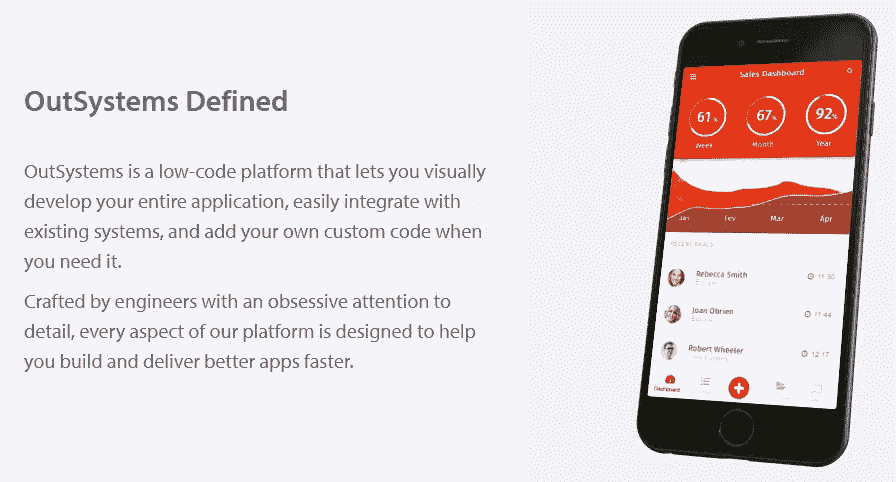

# 你今晚能写一篇关于外部系统的文章吗？

> 原文：<https://itnext.io/can-you-write-an-outsystems-article-tonight-2c498caaec41?source=collection_archive---------0----------------------->

> 编者按:Remco Dekkinga 属于世界上顶尖的外部系统专家。他是少数几个经过认证的 OutSystems 专家开发者之一，是全世界 30 个 OutSystems MVP 之一，并且管理着荷兰三个 OutSystems 官方教育团队之一。

[*点击这里在 LinkedIn* 上分享这篇文章](https://www.linkedin.com/cws/share?url=https%3A%2F%2Fitnext.io%2Fcan-you-write-an-outsystems-article-tonight-2c498caaec41)

今天我的同事问我是否可以写一篇关于外部系统的文章。三段就够了。

我的第一个想法是“我能对外部系统说些什么？”“谁来读这篇文章？”以及“读者已经知道什么是外部系统了吗？”

我将尝试一下，并为任何想知道 OutSystems 是什么以及可以用这个工具做什么的人写一篇介绍性文章。请在下面的评论中告诉我你对这篇文章的看法。

在 [OutSystems](http://www.outsystems.com) 的网站上，我能够找到以下定义:

让我们分析一下他们在网站上用这个定义实际说了些什么。

**#1 低代码平台**

根据 Forrester[(移动低代码开发&通用低代码开发)和 Gartner](https://www.outsystems.com/1/mobile-low-code-development-platforms-wave/) (移动开发平台)，OutSystems 平台被列为领导者。他们的排名高于他们的主要竞争对手。此外，在 PCMag 最近的[比较](https://www.pcmag.com/feature/356514/mendix-vs-outsystems-an-enterprise-low-code-showdown)中，OutSystems 胜出，这意味着“#1 低代码平台”的说法是有效的。

**让您可视化地开发您的整个应用程序**

有了 OutSystems，你可以通过使用 [Service Studio](https://www.outsystems.com/platform/diagrams/service-studio/) 进行可视化构建，但我很难解释这是如何工作的。如果你有几分钟的时间，你可以[亲自尝试一下](https://www.outsystems.com/home/GetStartedForFree.aspx)。安装完成后，您可以按照 Service Studio 的帮助菜单中直接提供的教程进行操作，并且可以构建您的第一个应用程序。或者当你时间有点紧，不能花 15 分钟来安装和构建你的第一个应用程序时，你也可以看看[的简短介绍视频](https://www.youtube.com/watch?v=CY_nav-5iBk)或[的极客开发者视频](https://www.youtube.com/watch?v=-5AbE-2a5Y4)。

**轻松与现有系统集成**

OutSystems 可以用来从头开始构建整个应用程序，但它也经常被用来替换(部分)企业系统，方法是通过 API 或 ESB 将新的 OutSystems 应用程序与遗留系统和数据库直接集成。有了这些集成的可能性，更换整个后台办公室变得更加简单，因为特定的功能是逐渐添加的，而不是大规模更换。

**需要时添加您自己的自定义代码**

低代码解决方案最常见的问题是，您会遇到一些无法解决的问题，这是大多数低代码平台的致命弱点。OutSystems 是一个例外，因为它是由工程师们精心制作的。工程师从开发人员的角度出发开发系统，因此需要简化开发人员的生活，而不是增加难度。当开发人员遇到一个边界时，例如当他需要一个默认情况下在平台中不可用的函数时，他可以启动 [Integration Studio](https://www.outsystems.com/learn/lesson/871/integration-studio-overview/) 并用 C#或 Java 构建该函数，之后他可以使用新函数，就像它是平台的原生函数一样。

我希望您喜欢阅读这篇简短的 OutSystems 介绍，下次我将更深入地介绍该平台的一个或多个功能。你可以在下面的评论中提出你想了解更多的功能。

结束了