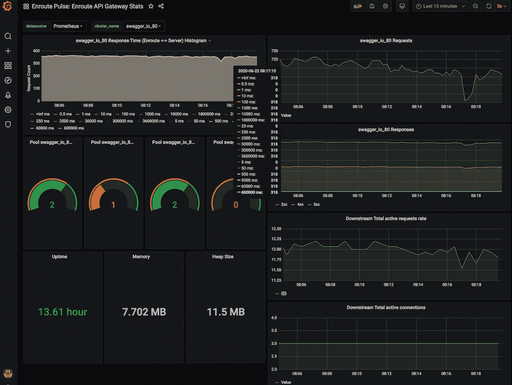
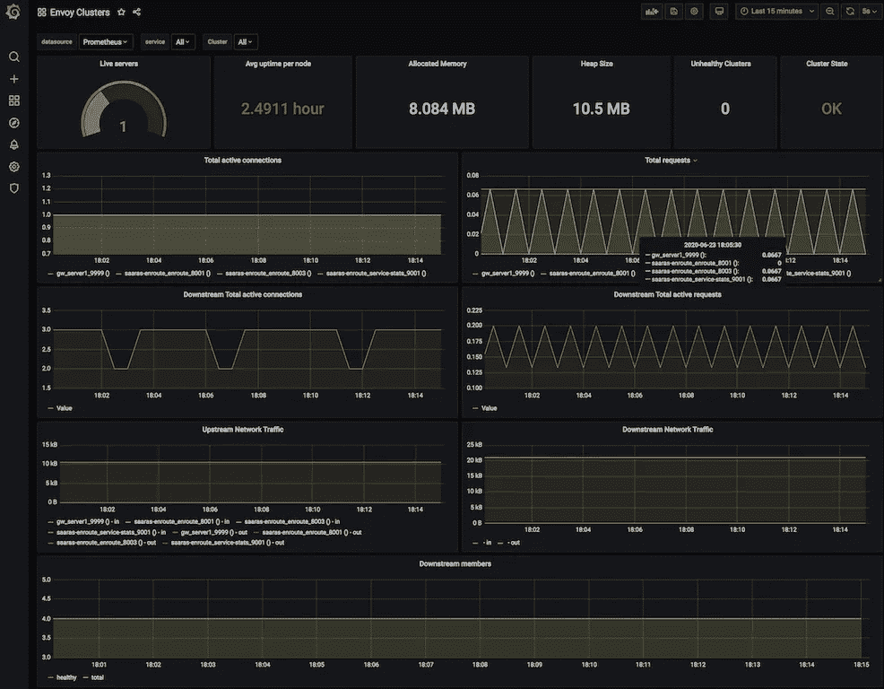

# 你的 API 网关能打开 API 规范吗？

> 原文：<https://itnext.io/can-your-api-gateway-tango-to-open-api-spec-9e97347739f8?source=collection_archive---------3----------------------->


通用 API 网关插入 OpenAPI 规范

# 开放 API 规范——API 优先的方法

当今的企业使用 API 优先的方法来开发应用程序和共享数据。这种基于 API 的方法在多种场景下使用，如将一个整体拆分成微服务、采用云以及采用 Kubernetes。

API 也是采用面向服务的架构方法的流行选择。API 也是支持数据共享和逻辑重用的关键租户。应用程序中的 API 可以比作命令式编程范例中的函数。

开放 API 规范是利益相关者创建和交付 API 的关键机制。通常，规范形成了定义应用程序的蓝图，如何访问它，以及谁可以访问它。开放 API 规范是一种跨 SOA 架构中不同角色(服务提供者、服务代理和服务消费者)共享信息的机制。每个角色都可以从 API 的清晰规范中受益。

# 交付和使用您的 API

以开放 API 规范形式创建的规范也可以用于为客户端和服务器自动生成代码。规范本身是语言不可知的，生成器有助于用选择的实现语言创建客户机/服务器。

但是交付和使用一个 API 也经常涉及一个中间组件——API 网关。很多时候，API 网关提供 API 特性，如速率限制、认证和授权、API 使用的遥测。然而，API 网关必须针对所服务的 API 进行编程。这通常是一个耗时的过程，并且容易出错。

如果您的 API 网关的声明性配置可以用与您的客户机和服务器相同的方式从 Open API spec 生成，那会怎么样？？然后，可以使用这种声明性配置对 API 网关进行编程。更好的是，如果开放 api 规范可以被接受并用于编程 API 网关。更进一步，如果开放 api 规范可用于编程您的 API 网关，使其独立运行或作为 Kubernetes 入口运行，会怎么样？

# 途中通用 API 网关中的开放 API 支持

当在软件开发过程中推动自动化时，网络基础设施可能是最难自动化的部分之一。[使用开放 API 规范](https://getenroute.io/cookbook/openapi-swagger-spec-autoprogram-api-gateway-30-seconds-no-code/)对 API 网关进行编程提供了这种自动化能力，从而在组织中进一步推动自动化。

当一个开放的 API 规范可用时，我们可以自动编程[途中 API 网关](https://getenroute.io/)。这种自动化极大地提高了生产率，并且消除了配置 API 网关的容易出错的手动过程。它还提供了一种保持 API 网关与规范同步的机制。

# 通用 API 网关编程的 CLI 工具

我们快速展示了如何使用`enroutectl`对独立的 API 网关进行编程。对于 Enroute Kubernetes Ingress API 网关，也可以采用类似的方法。

以下是该命令的高级用法-

```
$ ./enroutectlenroutectl can be used to generate declarative configuration **for**- Enroute Standalone Gateway
- Kubernetes Ingress Gatewayenroutectl can also read openapi spec to generate config **for** gatewayUsage:
enroutectl **[**flags**]**
enroutectl **[**command**]**Available Commands:
help Help about any command
init Initialize enroutectl
openapi Automatically program Enroute Universal API Gateway using OpenAPI SpecFlags:
--enroutectl-config string config **for** enroutectl **if** no enroutectl.yaml **(**or enroutectl.json**)** found in current OR home directory
-h, --help help **for** enroutectl
--verbose be verbose when runningUse "enroutectl [command] --help" **for** more information about a command.
```

在本地运行 API 网关-

```
$ sudo docker run --net=host saarasio/enroute-gw:v0.4.1
```

使用 Petstore openapi 规范对本地运行的[途中独立网关](https://getenroute.io/reference/getting-started/getting-started-enroute-standalone-gateway/)实例进行编程-

```
$ ./enroutectl openapi --openapi-spec petstore.json --to-standalone-url [http://localhost:1323/](http://localhost:1323/)
```

本地运行的途中 API 网关的转储配置-

```
curl -s localhost:1323/proxy/dump/gw | jq
```

通过 API 网关访问 Petstore 应用程序-

```
$ curl -s -k http://localhost:8080/v2/pet/findByStatus?status=available | wc 0 2 107446
```

有关`enroutectl`的更详细描述，请参考文章- [如何使用开放 API 规范对独立 Api 网关进行编程](https://getenroute.io/cookbook/openapi-swagger-spec-autoprogram-api-gateway-30-seconds-no-code/)

# API 的遥测技术

[途中独立 API 网关提供遥测](https://getenroute.io/blog/telemetry/)以了解其执行情况。Envoy proxy 提供了丰富的遥测技术。

Enroute 预装了开源的 Grafana 工具，该工具为遥测接口提供了可编程性。

对于我们上面讨论的 petstore 示例，这里有一个 grafana 屏幕。



请注意，这是如何可视化 API 网关正在做什么的一个例子。左上角是请求的延迟直方图。下面显示了 swagger 上游的特使集群的状态。下面是 API 网关的运行状态。

右边是请求统计，包括请求速率、请求响应和到上游的连接数。

Grafana 上的可编程性允许根据你的需要调整这个屏幕，这是另一个例子——(例如:Enovy Grafana 仪表板)



# 表演

Envoy 是用 C++编写的高性能代理，提供运行需要高吞吐量和低延迟的应用程序所需的原始性能。Enroute 的数据路径是从 Envoy 代理构建的，这使得为 API 网关用例部署/配置 Enroute 变得很容易。

# 使用高级速率限制保护您的 API

在途中，网关附带了[高级限速](https://getenroute.io/reference/plugins/advanced-rate-limiting/)。保护 API 资源对于内部和外部使用都至关重要。途中还可以根据用户是通过[认证还是未通过认证的用户](https://getenroute.io/cookbook/getting-started-advanced-rate-limiting)来实施不同的速率限制。关于在通用网关上的高级速率限制的更多信息可以在文章中找到— [为什么每个 API 都需要一个时钟](https://getenroute.io/blog/why-every-api-needs-a-clock/)

# 到处跑

Enroute 的独特架构允许它既作为独立网关运行，也作为 Kubernetes 入口网关运行。所有可以在[独立网关上配置的功能也可以在 Kubernetes 入口上运行。](https://getenroute.io/categories/getting-started/)

这一点至关重要，因为应用程序跨 Kubernetes 等平台部署，部署在云中或本地数据中心。

# 结论

自动化您的网络基础设施有助于提高开发周期的速度，从而节省在配置和管理 API 网关等网络基础设施上花费的宝贵时间。

对 API 网关使用声明性配置、对其进行更改、使 API 网关配置成为版本控制和 CI/CD 过程一部分的能力，允许您像管理代码一样轻松地管理基础设施。

开放 API 规范是构建 API 的蓝图，API 网关应该能够与该规范协同工作，允许操作自动化。

[Enroute 通用 API 网关](https://getenroute.io)为独立 API 网关和 Kubernetes 入口网关提供该功能。

*最初发布于*[*https://geten route . io*](https://getenroute.io/blog/can-your-api-gateway-tango-to-openapi-swagger-spec/)*。*