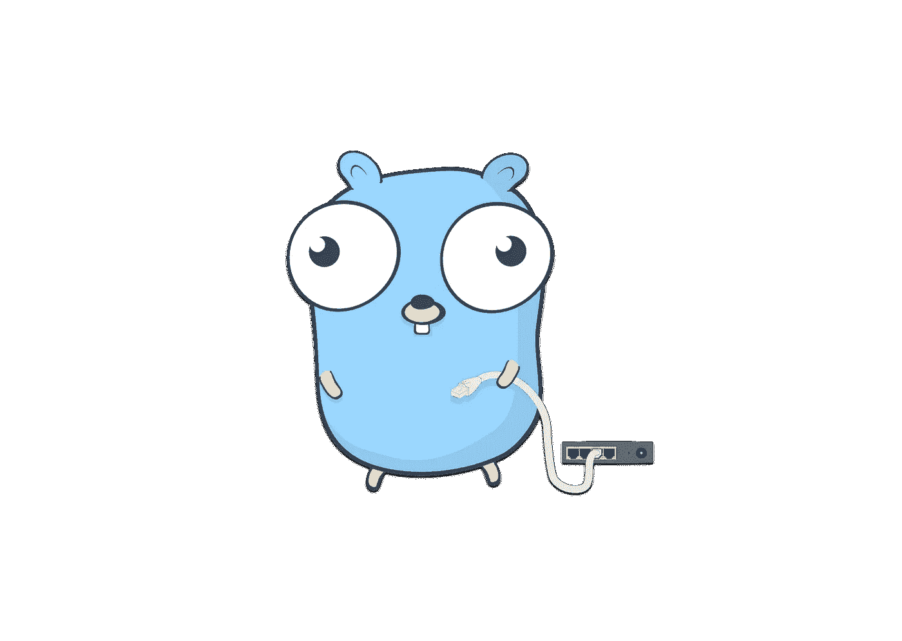
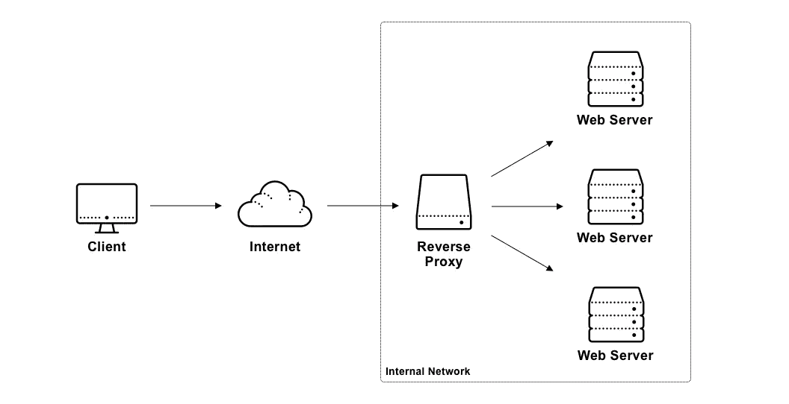

# 用 Go 的反向代理捕捉指标

> 原文：<https://itnext.io/capturing-metrics-with-gos-reverse-proxy-5c36cb20cb20?source=collection_archive---------5----------------------->

我不得不从我无法直接访问的服务中获取指标。go 标准库附带了一个反向代理实现🤯。通过将客户端请求代理到服务，我能够在不修改服务本身的情况下捕获指标。

# 什么是反向代理？

> *“在* [*计算机网络*](https://en.wikipedia.org/wiki/Computer_network) *中，反向代理是一种* [*代理服务器*](https://en.wikipedia.org/wiki/Proxy_server) *，代表客户端从一个或多个服务器检索资源。然后，这些资源被返回给客户端，就好像它们来自代理服务器本身一样。”*
> 
> *来自* [*维基百科*](https://en.wikipedia.org/wiki/Reverse_proxy)

本质上，反向代理将流量从客户端转发到代理后面的一组服务器。反向代理有许多应用。负载平衡、TLS 终止和 A/B 测试只是其中的一部分。反向代理对于在 HTTP 服务周围插入工具也很有用，而不必修改服务本身。

反向代理网络图

如果你想了解更多关于代理的知识，我推荐你去看看马特·克莱恩的[现代网络负载平衡和代理介绍](https://blog.envoyproxy.io/introduction-to-modern-network-load-balancing-and-proxying-a57f6ff80236)。Matt 是 [Envoy Proxy](https://www.envoyproxy.io/) 的创建者，这是一个健壮的代理服务器，支持像 [Istio](https://istio.io/) 这样的服务网格工具。他的文章很好地概括了现代负载平衡器和代理所使用的方法。

# 简单 Go 反向代理

出于很多原因，Go 是我最喜欢的编程语言之一。该语言的设计者关注简单性、实用性和性能。这些考虑使 Go 成为一种乐趣。这种语言闪耀着网络任务的光芒。部分原因是难以置信的全面的标准库，在其他常见的实现中包括一个反向代理。

在 go 中滚动自己的代理就像

对，就是这样。我们在这里挖吧。 [*httputil。newsinglehosterverseproxy*](https://golang.org/pkg/net/http/httputil/#NewSingleHostReverseProxy)方法返回一个包含以下方法的 [*ReverseProxy*](https://golang.org/pkg/net/http/httputil/#ReverseProxy) 结构。

我们需要做的就是配置代理，并将其连接到一个标准的 go HTTP 服务器，以获得一个工作的反向代理，如下所示。

就是这样！该服务器可以代理 HTTP 请求和 web 套接字连接。您会注意到我已经配置了*代理。导演*场。*反向推进。Director* 是一个功能，它在转发传入的请求之前对其进行修改。签名如下:

director 函数的一个常见用例是修改请求头。Go 编程语言的一个原则是，类型应该有合理的默认值，并且可以立即使用。遵循这个原则，默认的 director 实现由 *httputil 返回。newsinglehosterverseproxy*负责设置请求方案、主机和路径。我不想复制代码，所以我包装了这个实现。**注意**:我必须重置*请求。处理 HTTPS 端点的主机*字段。我还包含了一个通过 [*req 设置请求头的例子。设置*](https://golang.org/pkg/net/http/#Header.Set) ，它将使用传递给方法的值覆盖头值。

# 捕获指标

让我们扩展我们的简单代理来读取和报告关于下游服务响应的指标。为此，我们将返回到 *httputil。再次反转 Proxy* 结构。它公开了一个结构字段 *ReverseProxy。ModifyResponse* ,它让我们在 HTTP 响应返回客户端之前访问它。

Go 将 HTTP 主体实现为 *io。读者的，因此，你只能读一遍。如果您希望在转发请求或响应之前对其进行解析，您需要将主体复制到字节缓冲区中，并重置主体。一个明显的缺点是我们在内存中无限制地缓冲整个响应。如果您收到大量响应，这可能会导致生产中的内存问题，但对于我的用例来说，这不是问题。这里有一个解析和重置响应体的快速实现。*

随着请求体问题的解决，获取度量就变得简单了。

就是这样！capture metrics 函数对于我的用例来说非常具体，所以我将把它留给您来实现。我代理了一个通过 HTTP 端点可用的深度学习模型。我最终使用了 [Prometheus 客户端](https://github.com/prometheus/client_golang)库来从模型中导出关于预测类标签的度量。

指标捕获代理的完整代码如下

Go 的标准库完成了所有繁重的工作。从这里开始，您可以将代理扩展到任意数量的用例。

如果你觉得这有用，请在下面留下评论。

*原载于* [*我的博客*](https://www.sidneyw.com/go-reverse-proxy/) *。*