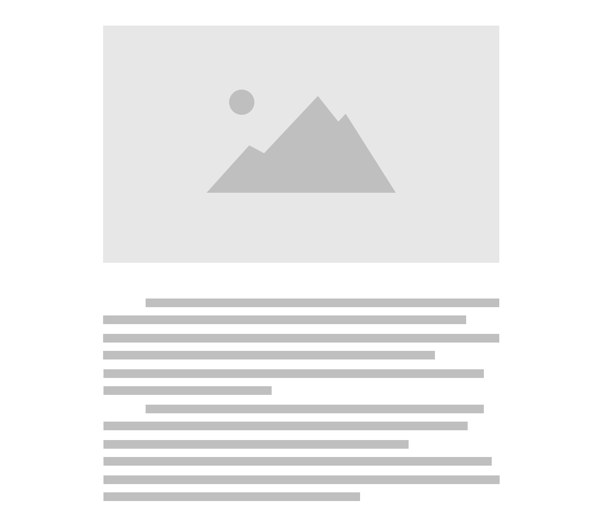
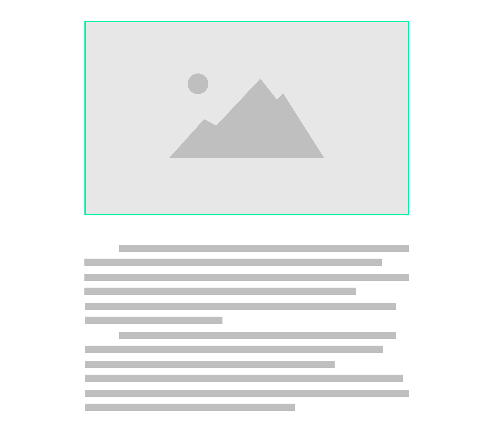

# 案例研究:用 JavaScript 直接在标签上创建视差效果

> 原文：<https://itnext.io/case-study-create-a-parallax-effect-directly-on-img-tags-with-javascript-35b8daf81471?source=collection_archive---------0----------------------->

> web 中的视差效果只与 CSS 背景图像属性一起工作，为什么？**这个不太实用。**

这是我的一个起点。我想有一个很好的视差效果直接应用于图像标签，有几个原因:

*   在网络上使用图片是最自然的方式
*   *背景图片*属性不支持图片标签、 *srcset* 和*size*属性的等效
*   *使用 CMS 的背景图像*不理想

令人惊讶的是，我在任何地方都找不到这种库/插件，所以**我决定创建一个新的**。

# 主要目标

我希望能够在不改变 HTML 或 CSS 的情况下添加视差效果。原因是我已经有了一个几乎完成的网站，我没有看到自己把我所有的 *< img >* 标签改成 *< div >* 带*背景图片*。

这是本库的主线，我想有一个非常简单的方法来应用视差在任何网站上已经生产，没有任何返工。另外，**一种非常流畅自然的动画感觉**——这种效果应该只会加分，不会增加任何其他成本。

# 第 1 期:如何不破布局？



如何不打破布局？

首先要考虑的是在不破坏布局的情况下管理图像的过渡。通常的视差效果位于一个非常特殊的区域，仅仅是为了这个目的而创建的，这种情况的主线是相反的。

视差应该很容易添加到任何有图像的地方，即使它位于两个文本块之间。你不希望图片在网站上的任何地方被转换，并可能与内容重叠。

## 解决办法

因此，我得出的结论是动态添加一个容器作为图像的父对象。该容器将具有与图像相同的尺寸和一个隐藏的溢出。现在，图像可以在不破坏布局的情况下从无限多的像素进行转换。

```

```

会变成:

```
<div style="overflow: hidden">
    
</div>
```

# 第 2 期:如何避免空格？



如何避免空格？

一个新的问题出现了，当图像达到其物理极限时出现空白。

考虑到整个要点是让**页面的初始布局保持不变，这是很成问题的。更不用说最初规划的流畅自然的动画了。**

## 解决办法

我选择了这个解决方案:在图像上添加缩放变换。这意味着图像将有更多的物质需要转换。该范围可以通过下式轻松计算:

```
*(imageHeight * scale - imageHeight) = range*
```

例如，如果图像的高度为 500 像素，我们应用 1.5 的缩放比例，这意味着图像将有 250 像素的范围进行转换。

现在，我们需要使用一种更费力的计算方法来获得图像位置相对于视口的百分比:

```
*((viewportBottom - imageTop) / ((viewportHeight + imageHeight) / 100)) = percentage*
```

最后将这个百分比转录到范围内:

```
*((percentage / 100) ** range - range */ 2) = translation*
```

因此**可以使用*变换:translate(平移)在图像上逐渐应用***；属性。

## 缺点:图像质量

从理论上讲，我们可以理解这样一个事实，如果将比例应用于图像，我们将会失去质量。

实际上，**如果缩放比例设置为 1.3(这是库的默认值)，这几乎不会被注意到。如果你通过添加更大尺寸的图像来满足这一需求，甚至会更少——这意味着如果你的图像是 500 像素，你想应用 1.5 的比例，使用 750 像素宽度的图像来补偿。**

# 最终渲染


最终渲染

# 演出

随着视差动画，出现了**性能警告**。感谢 [Paul Irish](https://www.paulirish.com/) 和 [html5rocks](https://www.html5rocks.com/) ，已经提供并解释了很多答案。尽管如此，这里仍有许多工作要做，例如:

*   滚动事件是性能贪婪的，因此强烈建议使用*请求动画帧*。我不再详述，因为其他人已经在[中提到过这个问题。](https://css-tricks.com/using-requestanimationframe/)
*   *交叉点观察器 API* 非常强大，可以检查哪些元素在视口中可见。不需要考虑不在当前视口中的图像。
*   一个关键点是减少[浏览器的回流](https://gist.github.com/paulirish/5d52fb081b3570c81e3a)。其中一个解决方案是尽可能减少获取视口和元素偏移量。
*   CSS 硬件加速不是很出名，但是很强大。更改*转换:translate x()；*到*转换:translate 3d()；*将利用 GPU 的能力，为[提供更好的性能](https://blog.teamtreehouse.com/increase-your-sites-performance-with-hardware-accelerated-css)。

表演是对已有成就的不断挑战。有一个永久的需求来改进那些可以改进的地方，特别是通过新技术或错误的初始实现。

这个案例研究和这个库**只反映我的观点**。非常欢迎你对我上面说的任何事情提出质疑、辩论或争辩。

最后，你可以在[simpleparallax.com](https://simpleparallax.com/)和 [github](https://github.com/geosigno/simpleParallax) 上查看简单视差库。