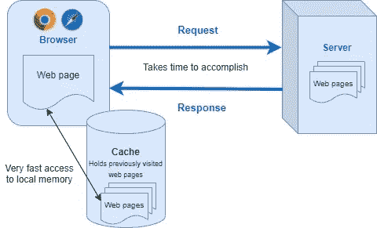
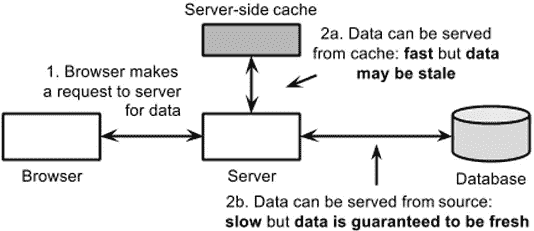
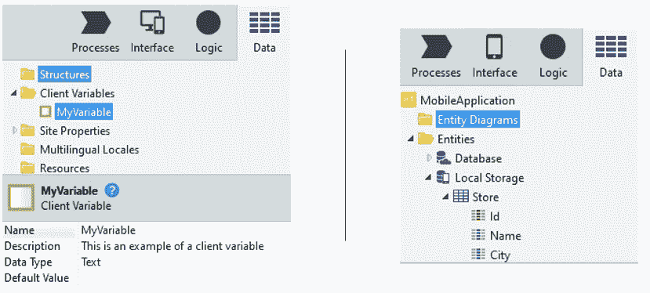
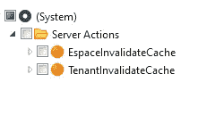
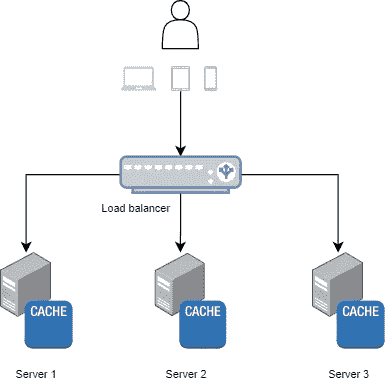
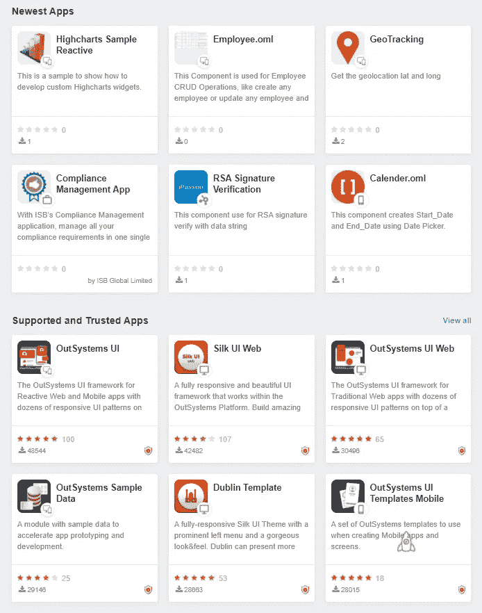
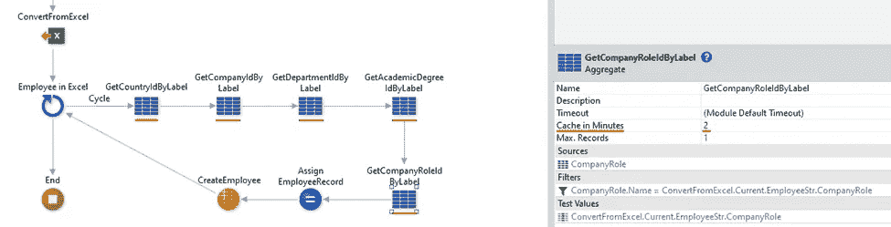

# 缓存兑现

> 原文：<https://itnext.io/cashing-with-caching-b839d8c13d24?source=collection_archive---------3----------------------->

了解如何利用缓存使您的外部系统应用程序比以往性能更好，并保护您的后端免受高流量负载的影响。此外，我们将分享一些您应该避免的陷阱和一些帮助您更有效地使用缓存的技巧。

# 基础知识

## 定义

缓存是将数据存储在临时存储器(*又名*缓存)中的过程。从临时存储而不是原始存储(服务器、数据库、外部方等)获取数据。)将减少执行时间，并且将为网络节省额外流量的负担。

## 例子

这种技术最常见的情况之一是浏览器缓存，CSS 和 JavaScript 文件在第一次获取后被缓存。这就是为什么第二次打开一个网站比第一次快得多的原因，这也是为什么一段时间后你的浏览器存储增长相当大的原因。

浏览器缓存

缓存的另一个例子是服务器端缓存，以避免不必要的数据库或外部存储的往返。

服务器端缓存

## 何时使用

我的信息接近静态吗？装起来重吗？通常这些问题会让您首先想到缓存。
经常需要、加载量大且很少改变的信息是缓存的理想选择。如果数据很少使用，那么缓存实际上并没有优化任何东西，或者如果数据经常更改，存储在缓存中的副本将会不断地过时。在这种情况下，*治*会比*病*更糟糕。

诀窍是识别在高使用率和信息改变所需的时间间隔之间有良好平衡的使用案例，或者对于这些使用案例，信息过时是可以接受的。

# 如何在外部系统中应用它

出于本文的目的，我们将只考虑反应式和移动应用程序，我们将更多地关注服务器端缓存，以及使用它会产生巨大差异的常见场景。

使用 OutSystems 平台，您可以从两个方面充分利用缓存:

**客户端**(这也给了你的应用程序离线的能力)

*   [**客户端变量**](https://success.outsystems.com/Documentation/11/Reference/OutSystems_Language/Data/Handling_Data/Client_Variable)——存储在浏览器中，这些通常用于缓存配置或应用上下文数据。不要用它们来存储敏感或机密信息。
*   [**本地存储**](https://success.outsystems.com/Documentation/Best_Practices/Architecture/Mobile_Data_Layer) -仅适用于移动应用，它允许您将本地信息表存储在设备中，以通过避免服务器端调用来提高性能。

外部系统中的客户端变量和本地存储实体

**服务器端**(持续时间设定为分钟)

*   **服务器动作**
*   **查询**

正确使用时，服务器端缓存将保护您的后端，避免大量不必要的数据库往返，并产生更高性能的应用程序，但也将支持更高的流量峰值。

缓存查询或服务器操作的分钟数不能以编程方式设置，也不能在运行时更改。

在拥有大量数据和大量处理信息的场景中，[多层缓存](https://success.outsystems.com/Documentation/Best_Practices/Performance_and_Monitoring/Optimize_Data_For_Your_Use_Cases_Using_Hot_Cache)是一个很好的选择，但你需要考虑到它会与你的业务需求建立紧密的联系。

# 服务器端缓存——工作原理

理解缓存如何工作以及它是如何失效的，对于定义适当的缓存策略和防止意外行为非常重要。
当您缓存一个动作或查询时，服务器端将首先检查是否缓存了该动作的结果和输入参数值的**。例如，如果您缓存了一个操作以返回给定雇员 id 的雇员详细信息，那么最终您将拥有一个针对每个雇员的缓存条目，并且缓存存储受限于服务器上的可用内存。**

如果发生以下事件之一，元素的缓存结果将变得无效，并且其(原始)流将再次执行:

*   **缓存过期**——基于在缓存的元素上指定的分钟数
*   **不同的输入参数** -如上所述
*   **当缓存元素的生产者模块发布时** -缓存对整个模块无效
*   **当站点属性的值改变时(在与缓存元素相同的模块中)** -缓存随后对整个模块无效。这就是为什么您应该避免以编程方式更新站点属性的原因之一。
*   **当来自*系统*的*espace invalidatecache*/*TenantInvalidateCache*动作运行**时——在这种情况下，模块/租户的缓存将失效。

**无效缓存**在外部系统中以编程方式使用的动作

请务必注意，缓存存储在服务器级别，这意味着当有多个前端服务器时，它的效率会降低。

具有 3 台服务器的基础架构示例，每台服务器都有其本地缓存

在 OutSystems 11 中，缓存失效服务是负责通过发布-订阅机制通知前端服务器缓存的值不是最新的，迫使它们在需要时获取新值的 OutSystems 组件(在这里阅读更多信息)。

# 缓存类型和示例

如前所述，当数据请求量和过时(不可接受)所需的时间之间达到良好平衡时，缓存就有了意义。这样，我们可以定义两种类型的缓存:

## 长缓存

用于提高性能，长缓存适用于很少更改的数据，如配置或查找操作。一个很好的例子是客户关系管理，你可以注册你的公司客户和他们的联系方式。您很可能需要在应用程序的几个地方的下拉列表中显示您的客户名称，我们知道这不会经常改变。在这种情况下，缓存它们并使其无效将是一个很好的选择，例如，每当您有一个新的客户机时。
对于这个例子，假设客户机列表每天被请求 1k 次，每 10 天注册一个新客户机。这意味着，通过在这种情况下应用缓存，您将保护您的数据库免受 10k 次调用- 1 *服务器数(当缓存对每个前端服务器无效时对数据库的第一次调用)。

## **短缓存**

短缓存用于防止高流量峰值，适用于经常被请求的数据，并且从业务角度来看，可以接受在短时间内过时的数据。例如，如果你去 OutSystems Forge 主页，你会看到一个包含 6 个最新 Forge 组件的部分。该部分需要随时更新吗？实时更新是否会增加价值？一个新的 forge 组件要花 5 分钟才能在这里展示出来，这难道不是可以接受的吗？假设 OutSystems Forge 主页每秒被访问 10 次，缓存该查询 5 分钟将避免对数据库的 5 * 60 * 5=1，5k 次调用(- 1 *前端服务器数，当缓存过期时)。顺便说一句，同样的方法可以应用到同一页面的可信和受支持的应用程序部分，性能会进一步提高。

OutSystems Forge 主页包括最新应用和*支持和信任的应用*的部分

另一个经典的例子是上传一个 Excel 表，您需要根据标签查找 id，以便在关系数据库实体中创建带有正确外键的记录。在许多情况下，标签与选项很少的域表相关。缓存查找查询几分钟应该足够了，通过显著减少到数据库的往返次数，可以大大加快这个过程。

导入雇员数据并缓存查找查询以从标签中获取外键的示例

# 提示和陷阱

在使用缓存机制来确保应用程序可伸缩并调整到产生最高性能的几年后，人们注意到了一些常见的缺陷以及制定一些指导原则的重要性:

*   **不要忘记使缓存失效**——在长缓存场景中，您可能希望尽可能长时间地缓存数据，直到发生变化。不要忘记通过使用上面提到的失效缓存操作或者通过改变输入参数(如版本号)来使缓存失效。
*   **小心带缓存的多语言静态实体**——当你查询一个静态实体时，结果会自动翻译成当时定义的语言环境，当然前提是你有翻译。缓存查询时，翻译后结果也会被缓存。这意味着当您用不同的语言请求相同的结果时，您将得到第一次请求的原始语言的结果。这里的方法是用一个查询缓存一个动作，并添加 locale 作为输入参数，以保证不同的 locale 会有不同的结果。
*   **让业务部门参与进来，为您的用例调整正确的缓存刷新率**——对于短缓存场景，作为一名开发人员，您希望尽可能长时间地缓存数据，业务部门将帮助您找到数据可以过期多长时间，以及性能和满足需求之间的正确平衡。
*   **在缓存的动作** **名称上弄清楚它们是被缓存的**——当你在外部系统中读取一个逻辑流时，考虑这一点更容易。这比你想象的更常见，忘记使缓存失效，花几个小时调试你的应用程序，却不知道为什么你会得到一个过时的结果。例如，添加一个像 *_cache* 这样的后缀是使缓存的动作/查询可见的一种方式。
*   **明智地使用高速缓存** -高速缓存占用资源(例如内存)，并且这些资源不是无限的，因此高速缓存一切不是解决方案。毕竟，权力越大，责任越大。

# 结论

缓存通过将常用应用程序数据存储在内存中，为其提供了高吞吐量和低延迟的访问，随着流量的增长，缓存变得越来越重要。在 OutSystems 中，这一原则没有什么不同，缓存理所当然地被认为是[性能最佳实践](https://success.outsystems.com/Documentation/Best_Practices/Performance_and_Monitoring/Performance_Best_Practices_-_User_Interface#Cache.2C_baby.2C_cache!)。

作为一种可以大大提高应用程序性能和可扩展性的技术，知道何时以及如何使用是最大化收益和避免意外行为的关键。
我认为缓存也应该成为架构师/技术负责人/开发人员的思维方式和方法的一部分，以挑战业务需求并确定应该应用缓存的情况，从而正确设计高性能的解决方案和可伸缩的架构。