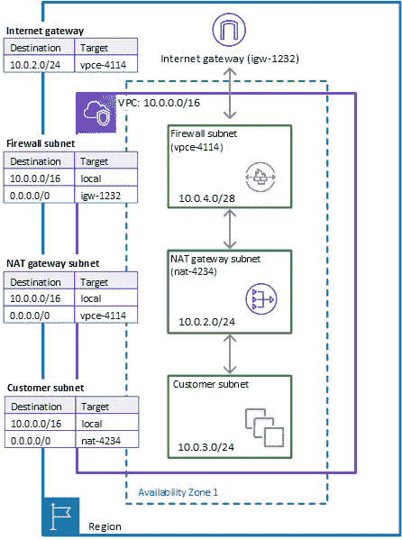

# CDK:再一次突破

> 原文：<https://itnext.io/cdk-once-more-unto-the-breach-f2673cf219a6?source=collection_archive---------2----------------------->

## 符合 NIST 800 系列安全要求的网络安全自动化和基础设施代码。

在过去的几年里，有一个未成年人(主要？？)云工程师之间关于哪种基础设施是最好的代码解决方案的争论。我们中的一些人甚至在《re:Invent》的快乐时光参与其中。有些人更喜欢 Terraform 的模块、不可知论和状态管理。一些人更喜欢 AWS 的 CDK，因为它的抽象，支持“普通”编程概念(有人循环吗？？)以及类似 TypeScript 和 Python 这样的语言。我们中的一些人更喜欢云的形成——因为它有效，我们知道这一点。我当然属于后一类人，我的一部分现在仍然是。“CDK 只是云形成的包装”我们会大喊。抱歉，普鲁米，我在网上读过一些好东西，但从未见过任何人使用它——我们都是自己回音室的受害者。但这并不意味着我们应该呆在自己的舒适区——只有当你不舒服的时候才会成长。

当《CDK》第一次发行时，我记得摆弄过它，想看看爵士乐是怎么回事，留下了相当深刻的印象，但不足以改变。显然这些抽象很棒。你可以写作

```
const vpc = new ec2.Vpc(this, 'TheVPC', {
   cidr: "10.0.0.0/16"
})
```

它会旋转 VPC，将其分割成子网，并配置路由、互联网网关、NAT 网关(抱歉，是 Corey Quinn)等。我非常懒——我努力工作，但只是因为我想放松一下。我最初喜欢子网配置的想法。我可以很容易地用不同的预定义子网规范分割我的 VPC，它将处理引擎盖下的魔法。

```
new ec2.Vpc(this, 'VPC', {
   subnetConfiguration: [
      {
        cidrMask: 24,
        name: 'ingress',
        subnetType: ec2.SubnetType.PUBLIC,
      },
      {
        cidrMask: 24,
        name: 'application',
        subnetType: ec2.SubnetType.PRIVATE_WITH_NAT,
      },
      {
        cidrMask: 28,
        name: 'rds',
        subnetType: ec2.SubnetType.PRIVATE_ISOLATED,
      }
   ]
});
```

这一小段代码可以处理定义 VPC 时的大部分繁重工作。我特别喜欢它处理子网掩码的方式。CloudFormation 确实有一个 CIDR 函数，可以用来动态计算子网，但我发现它并没有被广泛使用(我个人很喜欢它，但我注意到有很多模板——甚至是由不使用它的 AWS 编写的)。此外，CFN·CIDR 函数将子网中的位作为参数，而不是实际的 CIDR 掩码——如果需要/27，可以传递 5。CDK 取的是比较容易处理的掩码值。从 32 中减去很难！(讽刺…有点)。此外，即使使用异构掩码，CDKis 也能够计算连续的子网，如上例所示。如果我在 CloudFormation 中这样做，我只需要特别注意记住每个子网是如何划分的，以及我的 CIDR 的哪一部分还剩下。小的胜利，但是很高兴看到大家的关注。

不过，最终我还是暂时避开了 CDK。我已经可以用云的形式下雨了，但我对打字稿感到不舒服，为什么要改变呢？(是的，我可以用 Python 来写 CDK，但是我的直觉告诉我要坚持使用母语)。搬到 CDK 最大的吸引力是它能让别人为我做工作——我希望能更多地使用别人的抽象概念！

在 re:Invent 2021 输入 ConstructHub。终于有地方让社区分享他们的抽象了！这重新点燃了我对 CDK 的兴趣。

我在联邦云世界工作——在那里我们有很多安全需求——(好像其他人没有安全需求)。一些口味的字母汤是:NIST 800-53，FedRAMP 和国防部 SRG IL-4/5。其中一项要求是边界保护，即出入流量控制。我立即查看了 ConstructHub，看它是否有新的网络防火墙构造，看看是否有人破解了 CDK 的路由配置；遗憾的是，事实并非如此。所以我自己跳进水里。



来自 AWS 文档。AWS NFW 使用一种特殊类型的负载平衡器，网关负载平衡器，它利用 GENEVE 路由封装来路由和检查您的流量。

AWS 网络防火墙利用边缘路由表关联，并在您的互联网网关和您的公共子网之间注入自身。我从前面提到的带有子网配置的 vpc 构造开始—我想我应该相应地更新路由。

```
const vpc = new ec2.Vpc(this, ‘firewall-vpc’, {
  cidr: ‘10.0.0.0/24’,
  maxAzs: 3,
  subnetConfiguration: [
  {
    subnetType: ec2.SubnetType.PRIVATE_ISOLATED,
    name: ‘firewall’,
    cidrMask: 28,
  },
  {
    cidrMask: 28,
    name: ‘public’,
    subnetType: ec2.SubnetType.PUBLIC,
  },
  {
    cidrMask: 28,
    name: ‘tgw-attach’,
    subnetType: ec2.SubnetType.PRIVATE_WITH_NAT
  }
  ],
}
```

使用 Cloudformation，我将不得不盲目地复制代码片段，并在进行过程中更改一些小参数；有了 TypeScript，我可以把它内置进去。

```
for (let i = 0; i < vpc.availabilityZones.length ; i++) {
  //invokes the custom resource to look up the vpc endpoint to use  
  const fw_ep_az = new CustomResource(this, ‘fweplookup_cr_az’+i, {
  serviceToken: fweplookup_lambda.functionArn,
  properties: {
    PubSubnet: pubsubnets.subnets[i].subnetId
    }
  })
//adds the route to the edge route table w proper az mapping 
  new ec2.CfnRoute(this, ‘edge-ingress-route-az’+i, {
    routeTableId: edgeroutetable.attrRouteTableId,
    destinationCidrBlock: pubsubnets.subnets[i].ipv4CidrBlock,
    vpcEndpointId: fw_ep_az.getAtt(‘FWEP’).toString()
  });
```

下面是该循环的一个片段。想出真正的循环需要一些努力——但这比查找和替换并在头脑中保持一个更新内容的运行列表要好！

密切关注 lambda 支持自定义资源。这是将 NFW 的 VPC 端点映射到正确的公共子网所必需的。您将公共子网 id 传递给它，它将返回要使用的 VPC 端点。这对自动化至关重要，因为知道正确的 VPC 端点 ID 的唯一方法是等待它被创建，然后查询它。

另一项要求是更新公共路由表，使其不再有通往 IGW 的默认路由。这需要删除路由，然后重新创建一条到正确的 VPC 端点的路由。删除 VPC 航线需要另一个自定义资源，因为航线删除不是标准的 CFN 资源。幸运的是**，CDK 提供了一个新的抽象，如果你的定制资源是一个单独的 AWS API 调用，CDK 将自动生成 lamba、定制资源和 lambda 角色。以前的自定义资源需要更多的逻辑，因此我选择了传统的路线。

```
const deleteroute = new cr.AwsCustomResource(this, ‘delete-igw-route-az’+i, {
  policy: cr.AwsCustomResourcePolicy.fromSdkCalls({resources:  cr.AwsCustomResourcePolicy.ANY_RESOURCE}),
  onCreate: {
  physicalResourceId:   cr.PhysicalResourceId.fromResponse(‘requestId’),
  service:’EC2',
  action:’DeleteRoute’,
  parameters: {
    DestinationCidrBlock: ‘0.0.0.0/0’,
    RouteTableId: pubsubnets.subnets[i].routeTable.routeTableId,
  }
}
```

*   *这是一个非常方便的想法——它甚至基于 API 调用以编程方式生成 IAM 策略！然而，我最终还是走了传统路线，我希望 CDKs 的作者们有不同的做法。当您部署您的 CDK 应用程序时，它会生成这个 lambda 代码并将其上传到 s3 存储桶中，生成的模板在创建时会引用该存储桶。我更希望代码是一行一行写的。我的许多模板只是交给工程师，他们在 Cloudformation 中运行它们——我不希望打破这种流程。这将要求您运行 cdk deploy 作为唯一的部署方式。我喜欢尽可能避免外部依赖。

网络防火墙提供了 3 种不同的规则组，您可以利用它们进行检查。

1.  无状态—定义标准的五元组标准，用于单独检查数据包，没有额外的上下文。
2.  Stateful —定义在通信流和与数据包相关的其他通信的上下文中检查数据包的标准。
3.  域允许/拒绝列表—定义域名列表并指定要检查的协议类型。

请注意，NFW 只检查第 4 层，它不检查上面的任何内容(无解密、无应用层等)。但是，它会检查 TLS 客户端 Hello 中的 SNI 报头(以及 http 中的 HTTP 主机报头),以确定是否允许某个域。

所有防火墙的最佳做法是只允许所需的流量通过。通过锁定防火墙，我们可以对 VPC 资源与互联网的通信方式增加另一层保护。这将符合“零信任”架构；通过为我们的整个网络(一个或多个 VPC)集中定义流量策略，我们不再需要“信任”安全出口规则是否配置正确(尽管它们仍然应该正确，因为您不能“信任”NFW 是否有正确的规则)。正确的防火墙配置可以保护您免受各种恶意攻击——特别是 Log4Shell 漏洞中使用的回调。恶意请求可能会到达您的服务器，但是正确配置的防火墙可能会阻止对恶意服务器的 LDAP(或其他协议)查询。

我使用了两个规则组:

1.  允许 123/UDP (NTP)、80/TCP (HTTP)、443/TCP (HTTPS)的出站端口。如果您在 EC2 上托管您的递归 DNS 解析器，您将需要添加 53/IP(DNS—UDP 和 TCP)。
2.  一个域允许列表，仅允许我们的 VPC 资源与批准的域进行通信，主要用于软件更新。我也为一些主要的 ca 添加了一些 CRL，因为它也过滤 OCSP 的流量。

我发现编写这些 L1 结构的体验比标准的 CloudFormation 更好。我在 VS 代码中有 cfn-lint 和一些其他的扩展，这很有帮助，但是 VS 代码在使用 CDK 时显示了更多的信息——比如哪些属性是必需的，它们需要是什么类型等等。这导致了比以前稍微少的文档查找。

总之，这次在 CDK 的经历促使我考虑采用它作为我的首选。我的下一站是在 ConstructHub 上发表这篇文章。完成后会更新。

编辑:这已经发布到 ConstructHub！

npm 安装 CDK-NW 防火墙

在推特上关注我[马修·文恩](https://medium.com/u/860633c3a9d2?source=post_page-----f2673cf219a6--------------------------------)